# BAEFRAME 웹 뷰어 개발 계획

<div align="center">

**목적:** 앱 설치 없이 브라우저/모바일에서 영상 리뷰 가능하게 함

`읽기 전용 뷰어` `모바일 지원` `Slack 연동` `Google Drive 기반`

</div>

---

## 목차

| # | 섹션 | 설명 |
|---|------|------|
| 1 | [배경 및 동기](#1-배경-및-동기) | 현재 상황, 요구사항, 제약사항 |
| 2 | [아키텍처](#2-아키텍처) | 현재 → 목표 구조, 데이터 흐름 |
| 3 | [기능 범위](#3-기능-범위) | Desktop vs Web 기능 비교 |
| 4 | [개발 단계](#4-개발-단계) | 1~3단계 상세 계획 |
| 5 | [공유 워크플로우](#5-공유-워크플로우) | Slack 연동 시나리오 |
| 6 | [기술적 고려사항](#6-기술적-고려사항) | CORS, 동시 편집, API |
| 7 | [코드 재사용](#7-코드-재사용-계획) | 기존 코드 활용 전략 |
| 8 | [배포](#8-배포-계획) | Vercel 배포, 도메인 |
| 9 | [체크리스트](#9-체크리스트) | 단계별 완료 기준 |

---

## 1. 배경 및 동기

### 1.1 현재 상황의 문제점

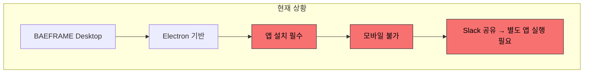

| 문제 | 영향 |
|------|------|
| 앱 설치 필수 | 팀원들이 리뷰하려면 모두 앱 설치 필요 |
| 모바일 미지원 | 이동 중 피드백 확인 불가 |
| Slack 워크플로우 단절 | 링크 공유 후 별도 앱 실행 필요 |

### 1.2 요구사항

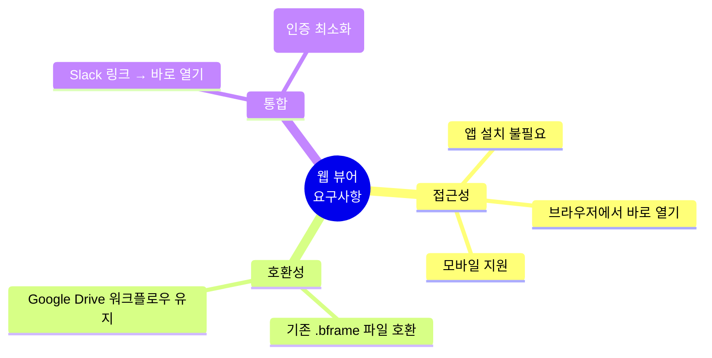

### 1.3 제약사항

| 제약 | 이유 | 대응 |
|------|------|------|
| 별도 서버/DB 최소화 | 비용 및 유지보수 부담 | Google Drive를 "서버"로 활용 |
| 기존 워크플로우 유지 | 팀 학습 비용 최소화 | 동일 파일 구조 사용 |
| 인증 간소화 | 팀 내부 사용 | Google 로그인만 또는 불필요 |

---

## 2. 아키텍처

### 2.1 현재 vs 목표 구조

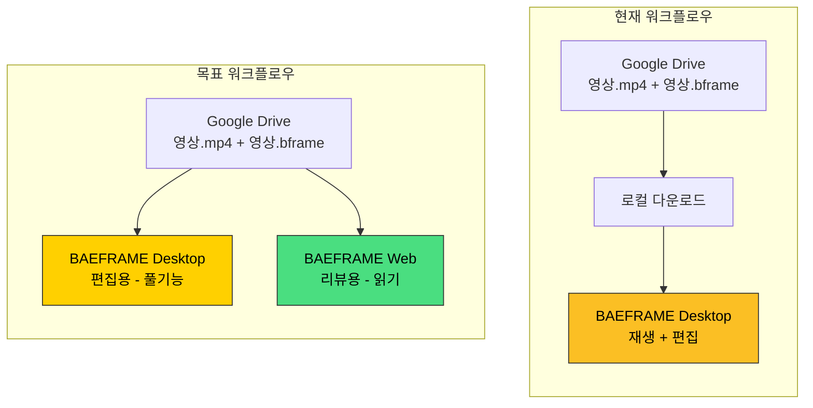

### 2.2 웹 뷰어의 장점

| 구분 | Desktop | Web |
|------|---------|-----|
| 설치 | 필요 | 불필요 |
| 모바일 | 불가 | 지원 |
| 기능 | 풀 에디팅 | 리뷰 집중 |
| 사용 시나리오 | 편집자 | 리뷰어/감독 |

### 2.3 서버리스 아키텍처

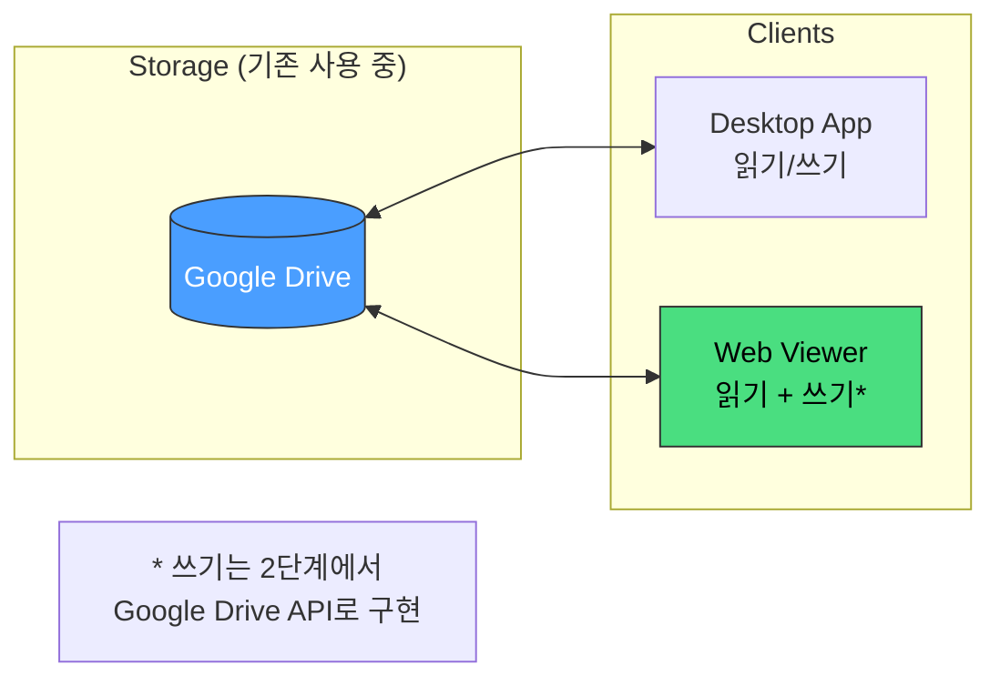

**핵심 아이디어:** Google Drive가 이미 "서버" 역할을 하고 있으므로, 별도 백엔드 없이 동일한 파일을 웹에서도 접근

---

## 3. 기능 범위

### 3.1 Desktop vs Web 기능 비교

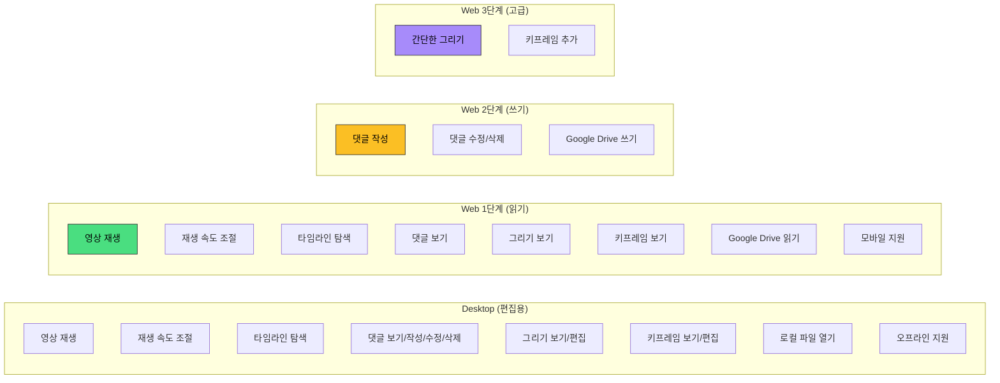

### 3.2 상세 기능 매트릭스

| 기능 | Desktop | Web 1단계 | Web 2단계 | Web 3단계 |
|------|:-------:|:---------:|:---------:|:---------:|
| 영상 재생 | `O` | `O` | `O` | `O` |
| 재생 속도 조절 | `O` | `O` | `O` | `O` |
| 타임라인 탐색 | `O` | `O` | `O` | `O` |
| 댓글 보기 | `O` | `O` | `O` | `O` |
| 댓글 작성 | `O` | `-` | `O` | `O` |
| 댓글 수정/삭제 | `O` | `-` | `O` | `O` |
| 그리기 보기 | `O` | `O` | `O` | `O` |
| 그리기 편집 | `O` | `-` | `-` | `O` |
| 키프레임 보기 | `O` | `O` | `O` | `O` |
| 키프레임 편집 | `O` | `-` | `-` | `O` |
| 로컬 파일 열기 | `O` | `-` | `-` | `-` |
| Google Drive 연동 | `-` | `READ` | `READ/WRITE` | `READ/WRITE` |
| 모바일 지원 | `-` | `O` | `O` | `O` |
| 오프라인 지원 | `O` | `-` | `-` | `-` |

---

## 4. 개발 단계

### 4.1 단계별 개요

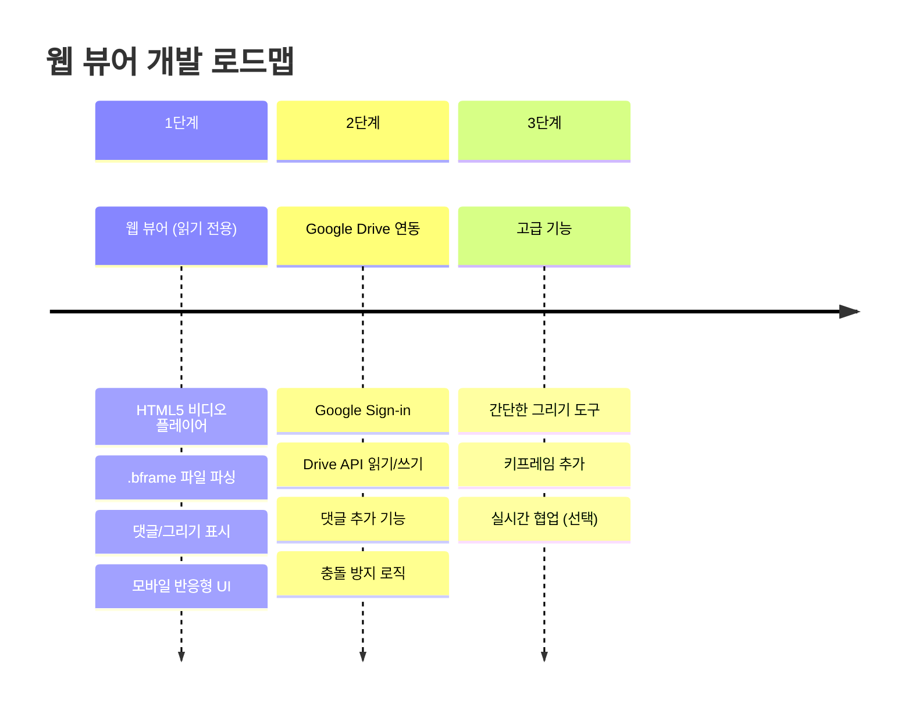

---

### 4.2 1단계: 웹 뷰어 (읽기 전용)

**목표:** 브라우저에서 영상 + .bframe 파일 확인

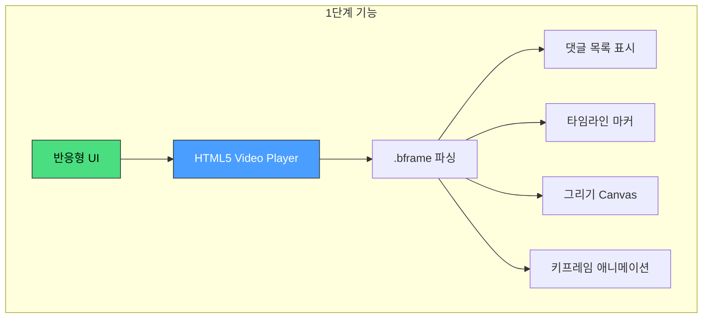

**기술 스택:**

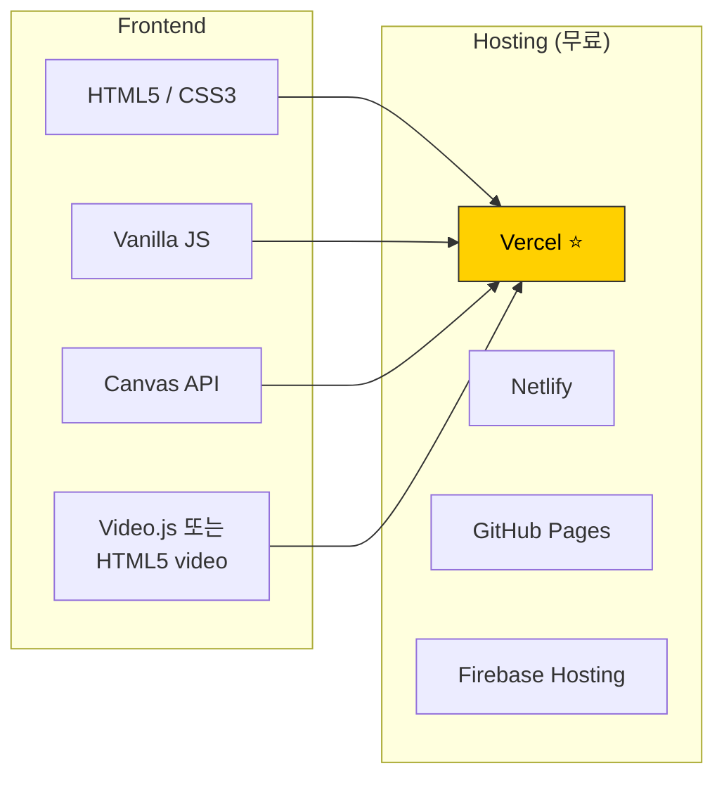

**URL 구조:**

```
https://baeframe.vercel.app/view?
  video=https://drive.google.com/uc?id=VIDEO_FILE_ID
  bframe=https://drive.google.com/uc?id=BFRAME_FILE_ID
```

**구현 체크리스트:**

- [ ] HTML5 비디오 플레이어
- [ ] .bframe 파일 파싱 및 표시
- [ ] 댓글 목록 표시 (타임라인 마커 포함)
- [ ] 그리기 레이어 표시 (Canvas)
- [ ] 키프레임 애니메이션 재현
- [ ] 반응형 UI (모바일 대응)

---

### 4.3 2단계: Google Drive 연동 (댓글 쓰기)

**목표:** 웹에서 댓글 추가 → Google Drive에 저장

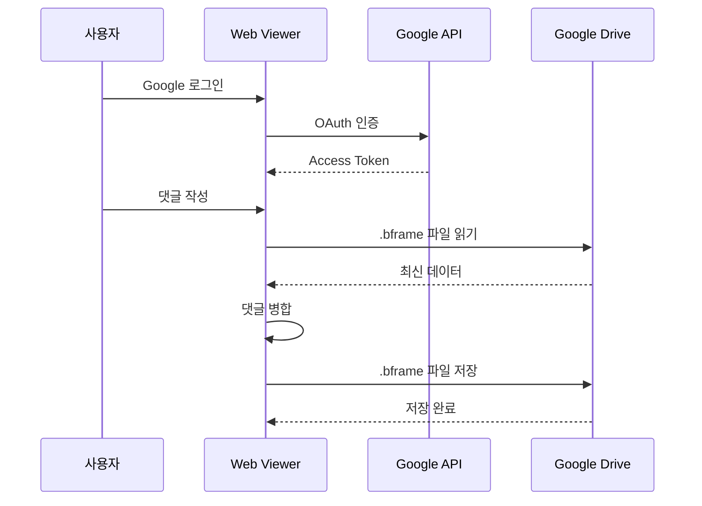

**핵심 코드:**

```javascript
// Google Drive API 사용 예시
async function loadBframe(fileId) {
  const response = await gapi.client.drive.files.get({
    fileId: fileId,
    alt: 'media'
  });
  return JSON.parse(response.body);
}

async function saveBframe(fileId, data) {
  // 저장 전 최신 버전 가져오기 (충돌 방지)
  const latest = await loadBframe(fileId);

  // 새 댓글만 병합 (기존 댓글 유지)
  const merged = mergeComments(latest, data);

  await gapi.client.request({
    path: `/upload/drive/v3/files/${fileId}`,
    method: 'PATCH',
    params: { uploadType: 'media' },
    body: JSON.stringify(merged)
  });
}

function mergeComments(server, local) {
  // ID 기반 병합 - 새 댓글 추가, 기존 댓글 유지
  const serverIds = new Set(server.comments.map(c => c.id));
  const newComments = local.comments.filter(c => !serverIds.has(c.id));

  return {
    ...server,
    comments: [...server.comments, ...newComments]
  };
}
```

**Google Cloud 설정:**

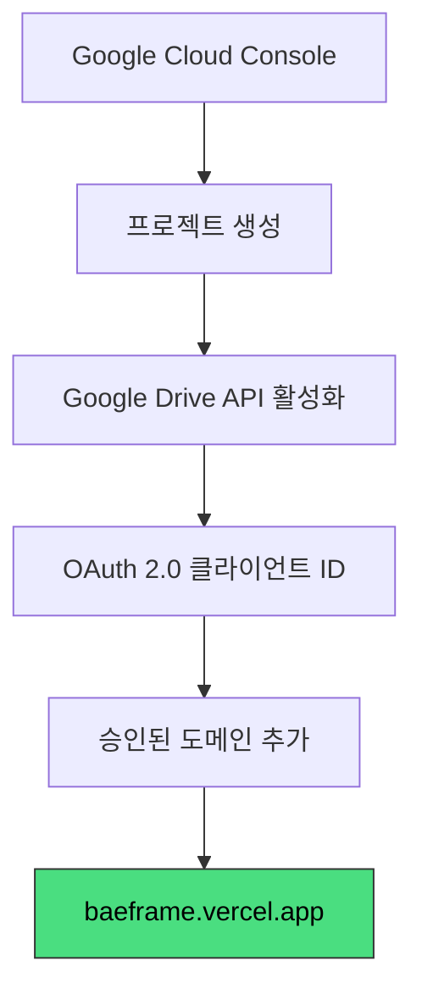

**구현 체크리스트:**

- [ ] Google Sign-in 연동
- [ ] Google Drive API로 .bframe 읽기
- [ ] 댓글 추가 후 .bframe 저장
- [ ] 충돌 방지 (저장 전 최신 버전 병합)

---

### 4.4 3단계: 고급 기능 (선택적)

**목표:** 웹에서도 간단한 편집 가능

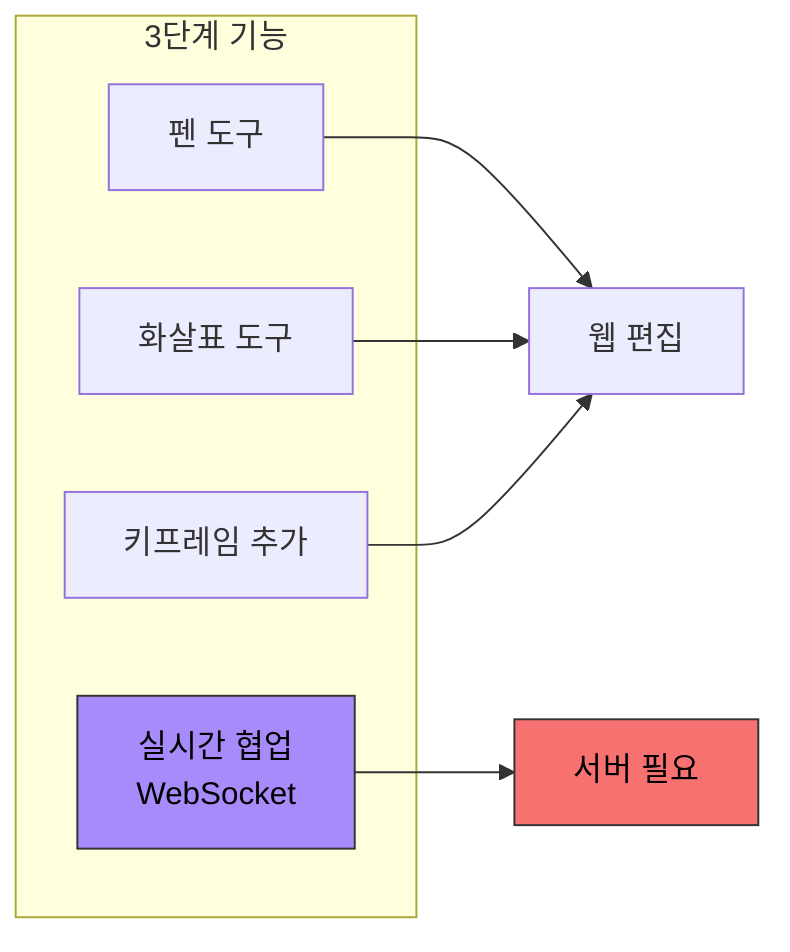

**구현 체크리스트:**

- [ ] 간단한 그리기 도구 (펜, 화살표)
- [ ] 키프레임 추가
- [ ] 실시간 협업 (WebSocket - 서버 필요)

---

## 5. 공유 워크플로우

### 5.1 Slack 연동 시나리오

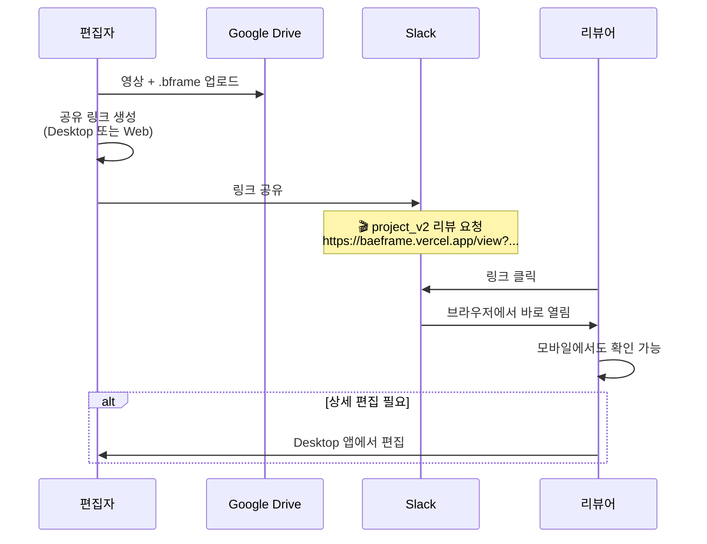

### 5.2 링크 생성 방법

```mermaid
graph TD
    subgraph "옵션 A: 수동 생성"
        A1[Google Drive에서<br/>파일 ID 복사]
        A1 --> A2[URL 조합]
    end

    subgraph "옵션 B: Desktop 앱 ⭐"
        B1[BAEFRAME Desktop]
        B1 --> B2["웹 링크 복사" 버튼]
        B2 --> B3[클립보드에 복사]
    end

    subgraph "옵션 C: Slack Bot"
        C1[/baeframe share project_v2.mp4]
        C1 --> C2[Bot이 자동으로<br/>링크 생성 및 공유]
    end

    style B2 fill:#ffd000,stroke:#333,color:#000
```

---

## 6. 기술적 고려사항

### 6.1 Google Drive 영상 스트리밍

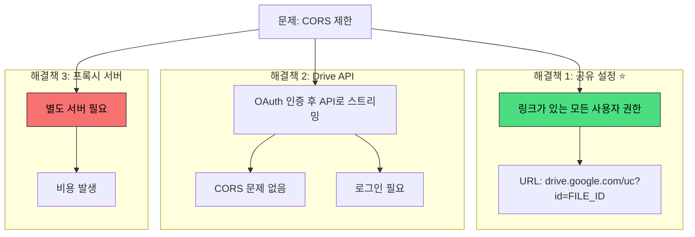

### 6.2 .bframe 파일 접근

```javascript
// 1단계: 공개 링크로 접근
async function loadBframeFromUrl(url) {
  const response = await fetch(url);
  return await response.json();
}

// 2단계: Google Drive API로 접근
async function loadBframeFromDrive(fileId) {
  // Google 로그인 필요
  const response = await gapi.client.drive.files.get({
    fileId: fileId,
    alt: 'media'
  });
  return JSON.parse(response.body);
}
```

### 6.3 동시 편집 충돌 방지

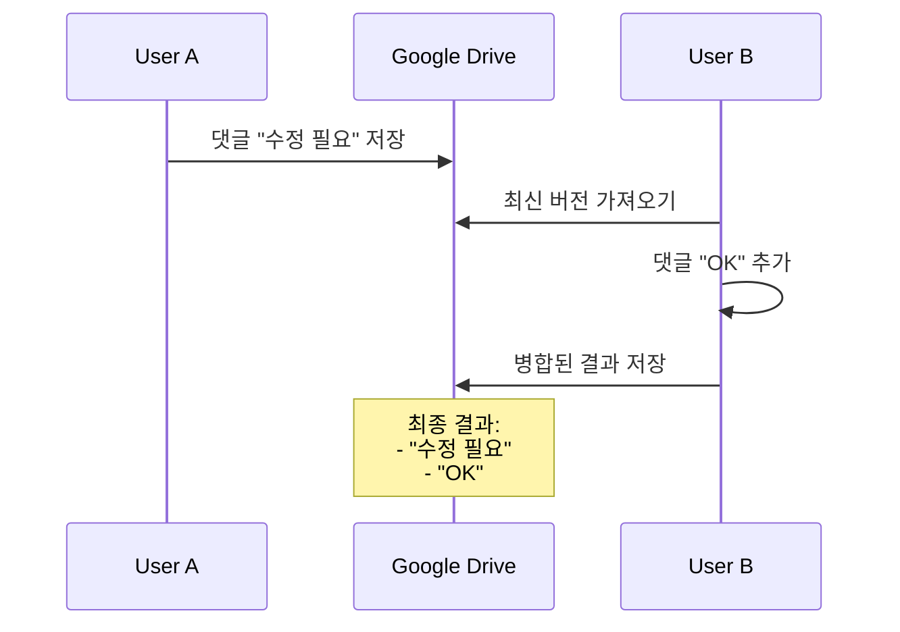

**충돌 방지 전략:**

| 전략 | 설명 |
|------|------|
| Last-Write-Wins | 마지막 저장이 우선 |
| Comment Merge | 댓글은 ID 기반 병합 (추가만, 덮어쓰기 안 함) |
| Drawing Lock | 그리기 레이어는 웹에서 편집 불가 (충돌 원천 차단) |

---

## 7. 코드 재사용 계획

### 7.1 재사용 가능한 기존 코드

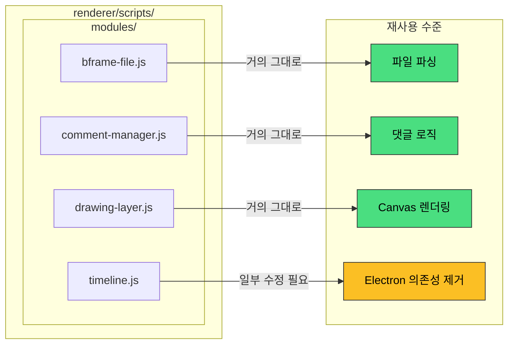

### 7.2 수정 필요한 부분

```javascript
// Before (Electron)
const { ipcRenderer } = require('electron');
ipcRenderer.invoke('open-file', path);

// After (Web)
async function openFile(url) {
  const response = await fetch(url);
  return await response.json();
}
```

### 7.3 스타일 재사용

```
renderer/styles/
└── main.css               ✓ 대부분 재사용 가능
```

---

## 8. 배포 계획

### 8.1 Vercel 배포 (권장)

**프로젝트 구조:**

```
baeframe-web/
├── index.html
├── styles/
│   └── main.css
├── scripts/
│   ├── app.js
│   └── modules/
└── vercel.json
```

**배포 명령:**

```bash
npm i -g vercel
vercel --prod
```

### 8.2 도메인 옵션

| 옵션 | URL | 비용 |
|------|-----|------|
| 무료 | `baeframe.vercel.app` | 무료 |
| 커스텀 | `baeframe.yourdomain.com` | 도메인 비용만 |

---

## 9. 체크리스트

### 9.1 1단계 시작 전 확인사항

- [ ] Google Drive 파일 공유 설정 확인 ("링크가 있는 모든 사용자")
- [ ] 기존 renderer 코드 중 재사용 가능 부분 분리
- [ ] Vercel 계정 생성

### 9.2 1단계 완료 기준

- [ ] URL로 영상 + .bframe 열기 가능
- [ ] 댓글 목록 표시
- [ ] 그리기 레이어 표시
- [ ] 모바일에서 정상 작동
- [ ] Slack에서 링크 공유 → 브라우저에서 열림

### 9.3 2단계 완료 기준

- [ ] Google 로그인 작동
- [ ] 웹에서 댓글 추가 가능
- [ ] 추가된 댓글이 .bframe 파일에 저장됨
- [ ] Desktop에서 저장된 댓글 확인 가능

---

## 관련 문서

| 문서 | 설명 |
|------|------|
| [TODO.md](./TODO.md) | 전체 개발 TODO |
| [baeframe-dev-docs.md](./baeframe-dev-docs.md) | Desktop 앱 개발 문서 |
| [web-viewer/README.md](./web-viewer/README.md) | 웹 뷰어 사용 가이드 |

**외부 참고:**

- [Google Drive API 문서](https://developers.google.com/drive/api/v3/reference)
- [Slack Video Block 문서](https://docs.slack.dev/reference/block-kit/blocks/video-block/)

---

<div align="center">

*최초 작성: 2024-12-30*
*목적: 웹 뷰어 개발 계획 및 컨텍스트 인수인계*

</div>
