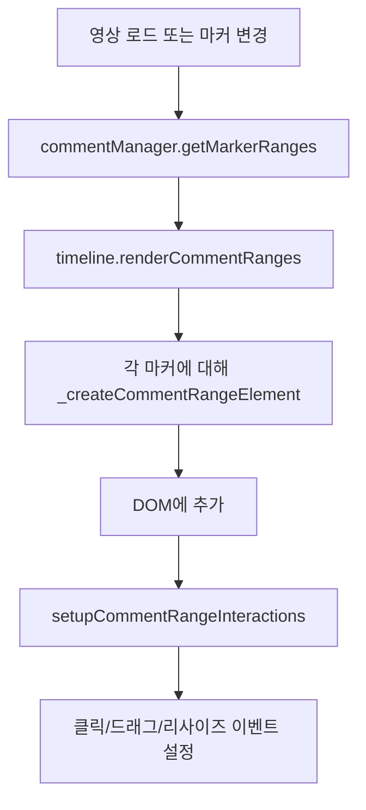
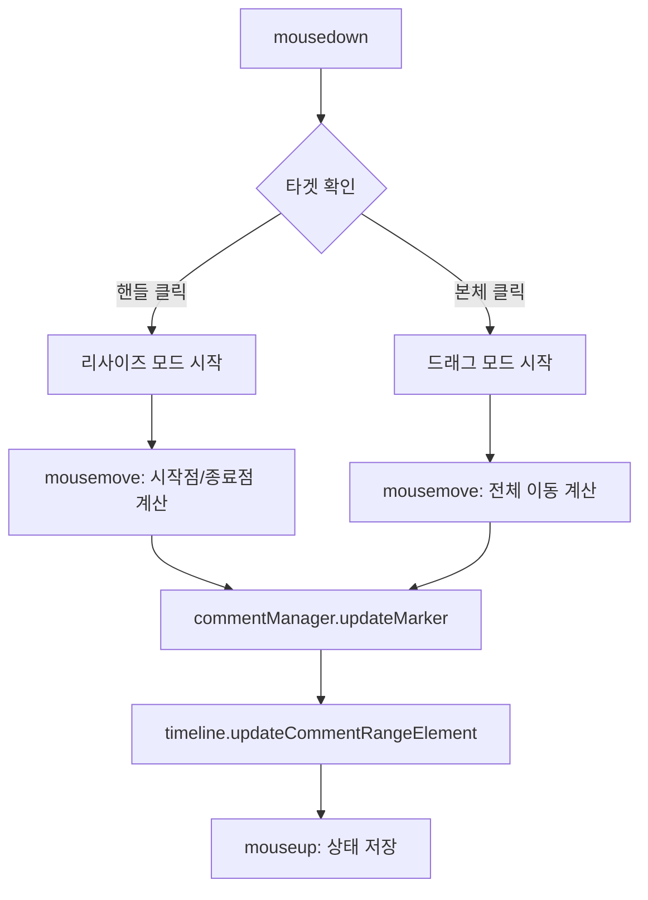

# 댓글 범위 타임라인 표시 기능

> **이슈**: [#66](https://github.com/baehandoridori/BAEFRAME/issues/66)
> **시작일**: 2026-01-12
> **상태**: ✅ 구현 완료
> **최종 수정**: 2026-01-12

---

## 개요

댓글의 노출 범위(startFrame ~ endFrame)를 타임라인에 시각적으로 표시하고,
하이라이트처럼 드래그/리사이즈가 가능하도록 구현.

---

## 요구사항

| 구분 | 요구사항 | 상태 |
|:----:|----------|:----:|
| 1 | 타임라인에 댓글 범위 시각화 | ✅ |
| 2 | 댓글 범위 드래그 (이동) | ✅ |
| 3 | 댓글 범위 리사이즈 (확장/축소) | ✅ |
| 4 | 클릭 시 해당 프레임으로 이동 | ✅ |
| 5 | resolved 상태 시각적 구분 | ✅ |
| 6 | 레이어 색상 반영 | ✅ |

---

## 구현 내용

### 파일 변경 목록

| 파일 | 변경 내용 |
|------|----------|
| `renderer/styles/main.css` | 댓글 범위 CSS 스타일 추가 (~120줄) |
| `renderer/index.html` | 댓글 트랙 HTML 구조 추가 |
| `renderer/scripts/modules/timeline.js` | 댓글 렌더링 메서드 추가 (~160줄) |
| `renderer/scripts/app.js` | 댓글 트랙 초기화 및 이벤트 핸들러 (~180줄) |

### CSS 구조

```css
/* 댓글 트랙 */
.comment-track { ... }
.comment-layer-header { ... }

/* 댓글 범위 아이템 */
.comment-range-item { ... }
.comment-range-item:hover { ... }
.comment-range-item.selected { ... }
.comment-range-item.resolved { ... }  /* 해결됨 상태 */

/* 드래그 핸들 */
.comment-handle { ... }
.comment-handle-left { ... }
.comment-handle-right { ... }

/* 텍스트 표시 */
.comment-range-text { ... }
```

### HTML 구조

```html
<!-- 레이어 헤더 -->
<div class="comment-layer-header" id="commentLayerHeader">
  <span class="comment-label">댓글</span>
</div>

<!-- 트랙 컨테이너 -->
<div class="comment-track" id="commentTrack">
  <!-- 동적 생성되는 댓글 범위 요소들 -->
</div>
```

### JavaScript API

```javascript
// timeline.js
setCommentTrack(trackElement, layerHeaderElement)
renderCommentRanges(comments)
updateCommentRangeElement(comment)
_createCommentRangeElement(comment)
_hexToRgba(hex, alpha)

// app.js
renderCommentRanges()
setupCommentRangeInteractions()
```

---

## 동작 설명

### 렌더링 플로우



### 드래그/리사이즈 플로우



---

## 스타일 가이드

### 색상

| 상태 | 배경색 | 테두리 |
|------|--------|--------|
| 기본 | `rgba(74, 158, 255, 0.25)` | `#4a9eff` (파랑) |
| 호버 | `rgba(74, 158, 255, 0.35)` | 동일 |
| 선택됨 | 동일 + 글로우 | `box-shadow: 0 0 0 2px` |
| 해결됨 | `rgba(74, 222, 128, 0.2)` | `#4ade80` (초록) |

### 레이아웃

- 높이: 20px (하이라이트와 동일)
- 최소 너비: 0.5% (클릭 가능하도록)
- 핸들 너비: 8px
- 핸들 호버 시 반투명 흰색 배경

---

## 이벤트 처리

### 지원되는 상호작용

| 상호작용 | 동작 |
|----------|------|
| 클릭 | 해당 프레임으로 seek + 선택 표시 |
| 드래그 | 전체 범위 이동 (duration 유지) |
| 왼쪽 핸들 드래그 | startFrame 조절 |
| 오른쪽 핸들 드래그 | endFrame 조절 |
| 드래그 종료 | .bframe 파일에 저장 |

### CommentManager 이벤트 연동

```javascript
commentManager.addEventListener('markerAdded', renderCommentRanges);
commentManager.addEventListener('markerUpdated', renderCommentRanges);
commentManager.addEventListener('markerDeleted', renderCommentRanges);
commentManager.addEventListener('loaded', renderCommentRanges);
```

---

## 테스트 체크리스트

- [x] 댓글이 없을 때 트랙 숨김
- [x] 댓글 추가 시 트랙 자동 표시
- [x] 레이어 색상이 범위에 반영됨
- [x] resolved 상태가 시각적으로 구분됨
- [x] 클릭 시 해당 프레임으로 이동
- [x] 드래그로 전체 범위 이동 가능
- [x] 핸들로 시작/종료점 조절 가능
- [x] 드래그 종료 시 .bframe에 저장
- [x] 영상 로드 시 기존 댓글 범위 표시

---

## 향후 개선 사항

- [ ] 댓글 범위 겹침 시 세로로 쌓기 (레이어링)
- [ ] 범위 너비가 매우 좁을 때 툴팁으로 텍스트 표시
- [ ] 댓글 패널과 타임라인 간 선택 동기화

---

## 개발 로그

### 2026-01-12

| 작업 | 상세 |
|------|------|
| 구조 분석 | comment-manager.js, timeline.js 분석 |
| CSS 추가 | 댓글 범위 스타일 (~120줄) |
| HTML 추가 | 댓글 트랙/헤더 구조 |
| timeline.js | setCommentTrack, renderCommentRanges, updateCommentRangeElement 추가 |
| app.js | 댓글 트랙 초기화, 드래그/리사이즈 핸들러 추가 |
| 버그 수정 | getMarker 메서드 시그니처 수정 (layerId 제거) |

---

## 참고

- 하이라이트 구현 참고: `timeline.js:1460-1586`
- 댓글 마커 구조: `comment-manager.js:40-165`
