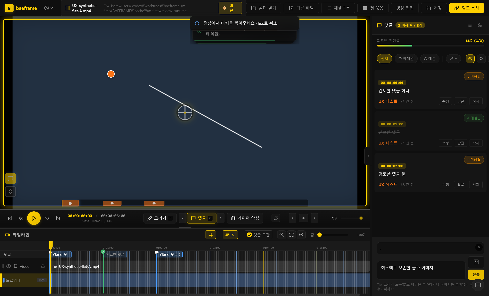
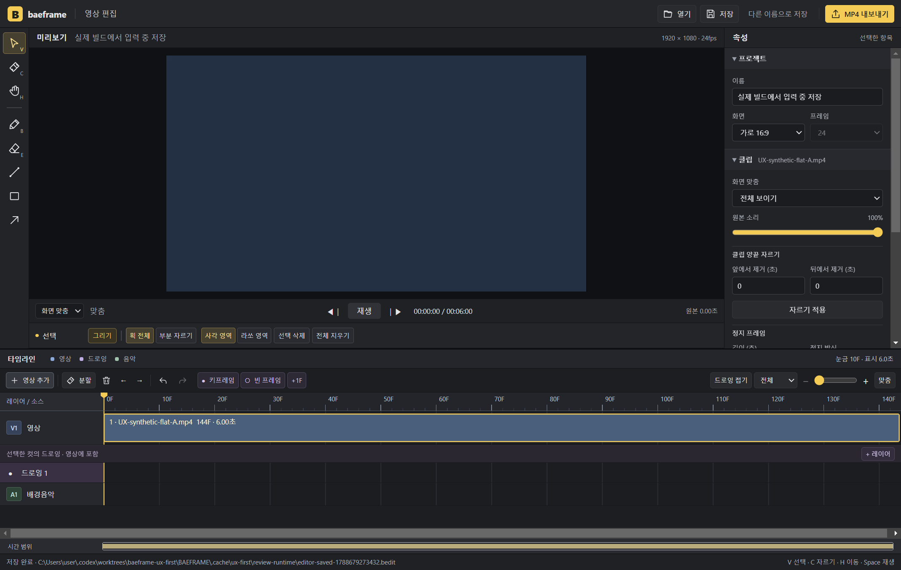

# UX 우선 수정 · 2026-09-06

## 요청과 범위

사용자는 완성형 UI 시안을 보류하고 UX를 먼저 고치도록 요청했다. 재생목록은 항상 열린 고정 패널이 아니다. 기존 기본 닫힘 상태와 사용자의 열기·닫기 조작을 유지한다. 화면 배치·색·패널 디자인을 바꾸지 않는다.

기존 UI/UX 보고서와 BEditer 구현이 들어 있는 `f2ec857d1596811679f90fd3ef072a2fa2ea41dd`에서 `codex/baeframe-ux-first` 작업 트리를 분리했다. 기존 main, 편집기 작업, 보고서 작업은 보존한다.

## 이번 수정 대상

- BAEFRAME I01: 정상적으로 리뷰 파일이 없는 영상에서 불필요한 반복 읽기 지연. 복구·저장 검증의 재시도는 유지한다.
- BAEFRAME I02/I06: 댓글 위치 지정 시 기존 V3 드로잉 표시를 유지하고, 오래된 엔진 준비 작업이 새 영상에 적용되지 않도록 한다.
- BAEFRAME I04/I05: 저장 실패 후 공유 성공 안내를 막고, 댓글 위치 지정 취소 시 글과 이미지 초안을 보존한다.
- BAEFRAME I12: 이전·다음 댓글 이동에 현재 표시 필터를 반영한다.
- BAEFRAME I17: 재생목록 저장 중 다른 목록을 열거나 추가 편집해도 저장 경로와 미저장 상태를 보호한다.
- BAEFRAME I18/I19: 이미지 붙여넣기를 시작한 영상·시점에 연결하고, 합성 이미지의 투명도를 보존한다.
- BEditer U01/U02/U03: 초기 선택 도구의 표시와 실제 입력을 일치시키고, 열기 실패 후 입력을 복구하며, 입력 중 Ctrl+S로 현재 내용을 저장한다.

I16 편집기 닫기 보호는 현재 코드에 이미 반영되어 이번 수정 대상에서 제외한다. 웹 리뷰의 신규 V3 렌더러, 전체 UI 재설계, 새 편집 기능 추가는 이번 변경에 포함하지 않는다.

## 검증 계획 및 진행

- 실제 함수·컨트롤러를 실행하는 회귀 테스트에서 실패를 먼저 확인하고 수정한다.
- 댓글/재생목록/저장 복구/합성/편집기 등 변경 영역의 기존 검증을 함께 실행한다.
- 가능하면 현재 소스의 렌더러를 실제 브라우저 또는 격리 앱에서 조작한다. 모의 IPC 테스트와 실제 운영 파일·공유 상대방 검증을 구분한다.
- 편집기 기준선: 기존 로컬 FFmpeg 경로를 `BAEFRAME_TEST_FFMPEG`로 지정하여 `npm run test:editor` 129 pass / 0 fail / 0 cancelled, exit 0. 새 작업 트리에 FFmpeg가 없어 발생한 최초 실패는 환경 준비 문제였다.

## 구현 결과

위 12개 항목을 수정했다. 앱의 HTML/CSS 배치, 재생목록 기본 닫힘과 열기·닫기 동작은 유지했다.

- 댓글 위치 확정 전에는 입력란·이미지를 지우지 않는다. 확정된 마커에 해당하는 초안만 비우며, 취소·새 입력·오래된 준비 응답이 새 초안을 소비하지 않는다.
- V3 문서는 HTML5 레거시 화면으로 전환하지 않는다. mpv 정지 화면에는 기존 Fabric Path/transform과 레이어 규칙으로 현재 드로잉을 합성한다. 홀드·빈 키프레임·숨김·순서·불투명도와 같은 프레임의 변경을 반영한다. 새 번들은 필요할 때 로드하며 모든 prebuild에 생성 단계를 추가했다.
- 공유 전 저장 실패는 링크 복사와 성공 안내를 중단한다. 저장·링크 준비 중 영상이 달라진 경우에도 오래된 결과를 복사하지 않는다.
- 댓글 이동은 목록과 같은 해결 상태·작성자·검색 필터를 사용한다. 이어보기·컷 묶음은 기존 전체 시간 이동 경로를 따른다.
- 재생목록 저장은 첫 대기 전에 내용과 소유자를 고정하고 순서대로 쓴다. 같은 목록의 후속 일반 저장은 먼저 성공한 Save As 경로를 따른다. 저장 중 새 수정은 미저장 상태로 남기고, 같은 파일 재열기 중 저장됐으면 다시 읽는다.
- 정상 리뷰 부재는 잠금을 확인한 뒤 바로 반환한다. 다른 프로세스가 첫 저장을 준비 중인 경우, sidecar를 올리기 전에도 저장을 기다린다. 복구와 CAS 읽기의 기존 재시도는 유지한다. 로컬 임시 경로 store 호출은 약 812ms에서 2.72ms로 줄었다. 전체 영상 열기나 공유드라이브 속도 측정은 아니다.
- 합성 이미지 붙여넣기는 시작 당시의 영상·로드 세대·시간을 고정한다. 영상이 바뀌면 취소하고, 같은 영상에서 탐색했다면 원래 시점에 추가한다. PNG로 변환해 투명도를 유지하며 댓글용 JPEG 기본값은 그대로다.
- BEditer는 초기 V 표시와 실제 선택 도구를 일치시킨다. 열기 실패 후 현재 영상·드로잉을 다시 준비한 뒤 입력을 복구한다. 이름 등의 입력 중 Ctrl+S는 현재 값을 반영해 한 번 저장하며, 한글 조합 중 저장을 막고 저장 취소 시 미저장 상태를 유지한다.

## 검증 결과

아래 검사는 모두 마지막 수정에 대한 결과다. 묶음에 같은 테스트가 포함될 수 있으므로 합산한 고유 테스트 수로 해석하지 않는다.

| 명령 | pass | fail | cancelled | 종료 코드 |
|---|---:|---:|---:|---:|
| `npm run test:ux` | 69 | 0 | 0 | 0 |
| `npm run test:editor` | 137 | 0 | 0 | 0 |
| `npm run test:composition` | 60 | 0 | 0 | 0 |
| `npm run test:playlist` | 330 | 0 | 0 | 0 |
| `npm run test:mpv` | 353 | 0 | 0 | 0 |
| `npm run test:fabric-drawing-pilot` | 628 | 0 | 0 | 0 |
| `npm run test:fabric-drawing-persistence` | 164 | 0 | 0 | 0 |

변경 파일 ESLint: 오류 0, 기존 경고 22, exit 0. `git diff --check` 통과. `npm run build` exit 0.

### 실제 화면·파일 검사

- 격리된 실제 Electron 패키지에서 재생목록 기본 닫힘·영상 열기 후 유지·열기/닫기, 댓글 글·이미지 초안 취소, 미해결 필터의 다음 댓글 이동을 확인했다. 완료 댓글 24프레임을 건너뛰어 48프레임으로 이동했다.
- 같은 패키지에서 댓글 정지 화면의 저장된 V3 흰 획 590픽셀을 확인했다. 원본은 그림이 없는 어두운 합성 영상이다. 단순히 mpv 상태 클래스만 검사한 결과와 구분한다.
- 패키지의 BEditer에서 실제 영상을 가져오고 이름 입력 중 Ctrl+S로 실제 `.bedit`를 저장했다. 파일에서 이름과 클립 1개를 읽어 확인했다.
- 별도 실제 Chrome에서는 초기 선택·획 이동, 실제 원본 부재 오류 후 입력 복구, 이름 저장, IME 조합, 저장 취소를 검사했다. 영상·Fabric은 실제이며 이 다섯 흐름의 대화상자 IPC는 테스트용이다.
- 실제 Chrome Canvas 픽셀 검사에서 레이어 순서·50% 불투명도·숨김·홀드·빈 키프레임·2배 좌표 변환, PNG 투명 영역 alpha 0을 확인했다. OS 클립보드가 아닌 합성 ClipboardEvent/Blob을 사용했다.
- 네이티브·Chrome 페이지 오류 0. 운영 파일·운영 프로필을 사용하지 않았고 외부 HTTP는 차단했다. 공유 상대방/웹 뷰어/공유드라이브 동기화는 실제로 검사하지 않았다.

근거: [패키지 실행](evidence/2026-09-06-ux-first/review-native-result.json), [편집기 Chrome](evidence/2026-09-06-ux-first/editor-native-result.json), [드로잉 합성 픽셀](evidence/2026-09-06-ux-first/freeze-pixels-result.json), [투명 PNG](evidence/2026-09-06-ux-first/clipboard-pixel-result.json).

### 검증 중 보완한 사항

- 첫 회귀 검사에서 실제 초안 손실, 잘못된 붙여넣기 시점, 저장 대상 경합 등을 재현한 뒤 수정했다.
- 독립 검토가 찾아낸 mpv 복귀 중 댓글 재진입, Save As 직후 일반 저장, 같은 목록 재열기 중 수정, 다른 프로세스의 sidecar 이전 첫 저장을 회귀 테스트로 추가해 보완했다.
- 마지막 검토에서는 정지 화면 캡처 중 그림이 바뀌면 오래된 캡처를 재사용해 갱신이 빠지는 경우도 수정했다. 내용 변경의 세대를 검사해 오래된 캡처를 버리고 최신 상태를 다시 만든다. 단순 중복 새로고침은 기존 캡처를 재사용한다.
- 재생목록 읽기가 끝나기 전에 수동 저장이 이미 완료된 경우도 성공 저장 세대로 감지한다. 경로 자동 복구 쓰기까지 저장 큐를 사용하고, 재읽기는 원래 열기 요청의 우선순위를 유지한다. 추가 4개 실제 동작 회귀에서 실패 후 통과를 확인했다.
- 최종 독립 재검토: 관련 54 pass / 0 fail / 0 cancelled, exit 0. 확인된 경합은 모두 해결됐고 미해결 회귀 발견 없음.
- 전체 편집기 검사 중 한 차례 FFmpeg 홀드 출력이 60초를 초과했다(136 pass / 0 fail / 1 cancelled, exit 1). 해당 테스트가 띄운 프로세스만 경로와 임시 파일을 확인해 종료했다. 출력 검사 7개와 전체 편집기 137개를 다시 통과했고, 새 로컬 FFmpeg 경로에서도 출력 검사 7개를 통과했다. 재현되지 않은 시간 초과의 원인을 확정하지 않는다.
- 기존 소스 검사 세 곳이 이전 prebuild 문자열·저장 호출 금지에 고정되어 실패했다. 새 번들 생성 계약과 스냅샷 저장 보호를 검사하도록 갱신했다.

## 로컬 확인 빌드와 남은 항목

- 작업 브랜치: `codex/baeframe-ux-first`
- 버전: `2.9.0-beta` 유지. 정식 릴리스 버전 변경이 아닌 로컬 UX 확인용이다.
- 실행 파일: `C:\Users\user\.codex\worktrees\baeframe-ux-first\BAEFRAME\dist\win-unpacked\BFRAME_alpha_v2.exe`
- 실행 파일은 `win-unpacked` 폴더의 나머지 리소스와 함께 사용한다.
- [독립 빌드 검사](evidence/2026-09-06-ux-first/build-artifact-verification.json): 애플리케이션 소스 121개와 app.asar SHA-256 일치, 필수 FFmpeg/mpv/CAS 리소스 해시 일치, 불일치 0. 출력 82파일 / 753,706,749바이트 / 빈 파일 0. `fabric-v3-stable` 기능 4개 활성화. app.asar SHA-256 `17989ebbde885d4d187ad879cbc0d6050ad7a33b2e5d27882c3c6d84c043340a`.
- UI 시안은 보류한다. 새 디자인·웹 V3 표시(I03)·단축키 체계 재설계 등 남은 보고서 제안은 이 변경의 완료로 간주하지 않는다.
- PR 생성·머지·공유드라이브 배포·사이트 변경은 수행하지 않았다.
