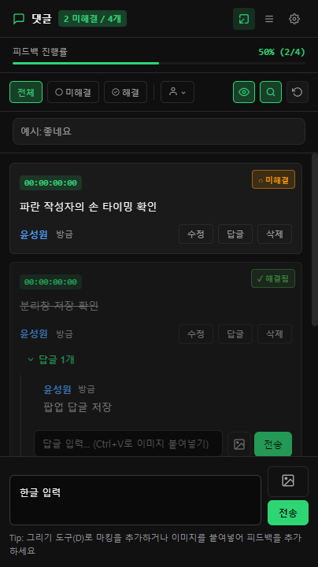
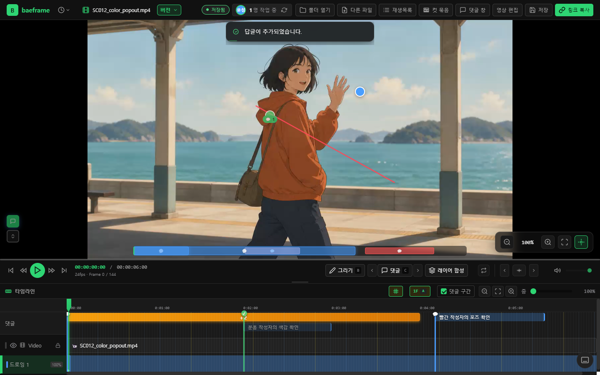

# 댓글 분리창·개인 색상·BEditer 프로토타입 배포 계획

> **For agentic workers:** REQUIRED SUB-SKILL: Use superpowers:subagent-driven-development or superpowers:executing-plans to implement this plan task-by-task.

**Goal:** 기존 이름별 색상과 개인 테마를 일관되게 표시하고, 댓글 패널의 분리/복귀를 추가하며, 승인한 UX/UI와 BEditer 프로토타입을 함께 배포한다.

**Architecture:** 댓글은 두 번째 저장·협업 세션을 만들지 않고 기존 DOM과 리스너를 같은 출처의 전용 창으로 이동한다. 상태·저장·협업은 기존 메인 renderer가 계속 소유한다. 새 창은 노드와 IPC 권한이 없고 지정한 로컬 페이지 외에는 열리지 않는다.

**Tech Stack:** Electron 28, 기존 ES modules/CSS, Node test, Playwright 실기 검사, 기존 FFmpeg 출력 경로.

**Spec:** 이 문서의 사용자 요구와 동작 기준. 사용자가 구현부터 배포까지 승인했으며 PR·리뷰·머지·정확한 merge SHA 빌드·공유 드라이브 검증까지 포함한다. 팀 안내 메시지 게시는 포함하지 않는다.

## 동작과 공통 제약

- 댓글 헤더의 분리 버튼을 누르면 댓글 목록과 입력부가 독립 창으로 이동한다. 기존 패널 자리만 비워 영상 영역이 넓어진다.
- 별도 창의 다시 붙이기 버튼 또는 창 닫기는 같은 패널을 원래 위치로 돌려놓는다. 입력 초안·첨부 이미지·검색·필터·스크롤·작성 중인 답글을 보존한다.
- 메인 화면에는 분리된 댓글 창을 다시 띄우는 버튼을 제공한다. 중복 창을 만들지 않는다. 메인 창 종료/새로고침 및 팝업 로드 실패 시 빈 패널을 남기지 않는다.
- 댓글 작성·수정·답글·해결·클릭 이동은 기존 manager와 저장 경로를 사용한다. 창 사이에 댓글 객체를 복제하거나 `.bframe`를 별도로 쓰지 않는다.
- 입력 포커스·한글 입력·붙여넣기·멘션은 해당 창의 document를 사용한다. 메인 설정/스레드 모달을 열면 해당 메인 창으로 초점을 이동한다.
- 기존 테마 변수를 자식 창에 전달한다. 작성자 색은 등록 테마/기존 이름 지정 색을 우선하고, 지정이 없는 작성자만 기존 ID 해시색을 쓴다. 사용자가 지정한 마커·레이어 색은 덮지 않는다.
- BEditer는 현재 구현된 기능으로 배포하고 프로토타입임을 표시한다. 트랙/자막/전환 등의 추가 기능을 이번에 임의로 확장하지 않는다.
- 기존 배치·재생목록 선택적 표시·저장 형식·외부 협업 프로토콜은 유지한다.
- 작업 브랜치 `codex/comment-popout-editor-release`, 기준 `daba43f`. 기존 미추적 보고서/시안을 보존한다. 기능 추가에 맞춰 `2.10.0-beta`를 릴리스 후보로 사용한다.

## 확인한 원인과 방식

- `NAME_COLORS`는 삭제되지 않았다. 본문/통합 댓글의 ID 해시 경로와 답글의 이름색 경로가 불일치했다. `윤성원`은 지정색 `#4a9eff`이나 본문 해시는 `#ffd000`이었다. 직전 UI 작업이 매핑을 삭제한 것으로 설명하지 않는다.
- 네이티브 팔레트는 별도 창 CSS의 노란 강조색을 사용했다. 기존 테마 미러 전달 경로에 실제 accent를 연결한다.
- `.cache/comment-popout-probe.cjs`에서 실제 Electron의 보호된 자식 창으로 DOM 이동, 기존 클릭 리스너, 초안, 창 닫기 복원을 확인했다. 새 권한 API는 노출되지 않았다.

## 작업 1: 작성자 색과 개인 테마

**Files:** `renderer/scripts/app.js`의 색상 호출, 작성자 색상 모듈, `main/mpv-overlay-host.js`, 테마 미러 모듈과 관련 검사.

- [x] 지정 이름/별칭/등록 테마/알 수 없는 ID의 실제 resolver 회귀 검사 후 수정한다.
- [x] 본문·답글·필터·마커·통합 댓글에 같은 작성자 규칙을 연결한다.
- [x] 실제 테마색의 안전한 전달과 네이티브 팔레트 반영을 검증한다. 원본 변경 뒤 두 생성 번들은 root가 갱신한다.

## 작업 2: 보호된 댓글 창

**Files:** `main/comment-panel-window.js`, `main/window.js`, `preload/comment-panel-preload.js`, `scripts/tests/comment-panel-window.test.js`.

**Interface:** `configureCommentPanelWindow(mainWindow)`는 정확한 `comment-panel.html`/`baeframe-comments` 요청만 허용한다. 자식 창은 420×760, 최소 320×480, Node 비활성·contextIsolation 활성·sandbox 활성·빈 preload다. 새 IPC 채널은 없다.

- [x] URL·프레임명·부모 URL·새 창·탐색·webview 차단의 실패 검사를 먼저 확인한다.
- [x] 부모 종료와 자식 종료 경로를 구현하고 검사한다.

## 작업 3: 패널 이동과 기존 기능 통합

**Files:** `renderer/scripts/modules/comment-panel-popout.js`, `renderer/comment-panel.html`, `renderer/styles/comment-panel-popout.css`, `renderer/index.html`, `renderer/scripts/app.js`, `mention-manager.js`, 관련 동작 검사.

**Interface:** `createCommentPanelPopout({panel, toggleButton, focusButton, windowRef, onChange, onReady, onError})`는 `detach()`, `dock()`, `focus()`, `isDetached()`, `dispose()`를 제공한다. 실제 panel 노드를 이동하고 원래 위치 anchor와 창 수명주기를 보존한다.

- [x] 분리/복귀/중복 클릭/닫기/로드 실패와 초안 보존 검사를 작성·실패 확인 후 컨트롤러를 구현한다.
- [x] 댓글의 document 의존 지점을 해당 패널의 ownerDocument 또는 panel 참조로 바꾼다. 메인 영상 document 경로를 일괄 치환하지 않는다.
- [x] 팝업 이벤트 처리, 멘션, 테마, 메인 모달 초점을 통합한다.
- [x] 실제 앱에서 입력·답글·저장·재열기·클릭 프레임 이동·다시 붙이기·다른 창 크기를 검증한다.

## 작업 4: BEditer와 릴리스

**Files:** `renderer/editor.html`, `renderer/scripts/editor/editor.js`, `main/editor-window.js`, `docs/video-editing.md`, package/lock, 릴리스 기록.

- [x] 화면/창 제목에 BEditer 프로토타입을 표시한다. 메인 버튼은 영상 편집으로 유지한다.
- [x] 실제 Electron에서 영상 둘 추가→C 컷→홀드→드로잉→저장/재열기→MP4 출력과 종료 취소를 확인한다.
- [x] 관련 테스트·lint·독립 리뷰 후 버전과 생성 번들을 포함해 커밋한다.
- [ ] PR 본문은 업데이트 요약/상세 기술 설명/개발 난항/테스트 가이드 순서로 작성한다. 최종 SHA의 명시적 Codex 완료 신호를 확인하고 머지한다.
- [ ] merge SHA의 깨끗한 worktree에서 build, 실행 확인, 기존 공유 드라이브 백업, staging 검증 후 교체한다. 전체 파일의 상대 경로/크기/SHA-256을 대조하고 mismatch 0을 확인한다.

## 결과

실제 실행 결과와 PR·merge SHA·배포 대조를 완료 단계마다 아래에 기록한다.

### PR 전 구현·검증

- 버전 `2.10.0-beta`. 생성 번들 3종을 다시 생성했으며 기존 결과와 같았다.
- 이름/ID가 있는 댓글의 윤성원 파랑·허혜원 분홍·한솔 빨강과 개인 테마 파란 네이티브 팔레트를 실제 Electron에서 확인했다.
- 댓글 창 실제 검사 16개 통과: 초안/이미지/검색/필터 이동, 자식 File 이미지 붙여넣기, 멘션, 댓글/답글/해결, 팝업 설정, 최소 320×480 크기, 버튼 및 native close 복귀, `.bframe` 저장과 새 앱 실행 복원. 페이지 오류 0, 원본 영상 SHA-256 불변.
- BEditer 실제 검사 10개 통과: 두 영상 연결, C 클릭 컷, 12프레임 홀드, 포인터 드로잉과 레이어, Ctrl+S/재열기, MP4 출력, 미저장 종료 취소, 원본 보호. 출력은 1920×1080·24fps·108프레임·4.5초·AAC이며 실제 그림 픽셀을 확인했다.
- 자동 검사: mpv 355, Fabric 628, editor 137, frame-grid 38, UX 70, comment-input 19, comment-popout 51. 각각 exit 0 / fail 0 / cancelled 0. 묶음 간 중복은 합산하지 않는다. lint exit 0 / 오류 0 / 기존 경고 64.
- 독립 리뷰 지적 2건(자식 File realm, 복귀 후 버튼 표시)을 수정하고 재리뷰에서 추가 지적 없음. 별도 실기에서 초기 탐색 가드, 좁은 창의 메인 반응형 CSS, 첫 답글의 펼침 상태 문제도 재현·수정했다.
- 근거: [실제 댓글 결과](evidence/2026-09-07-comment-popout-release/comments-native-result.json), [편집 결과](evidence/2026-09-07-comment-popout-release/editor-native-result.json), [검사 결과](evidence/2026-09-07-comment-popout-release/tests.json).
- 실제 앱 검사는 격리 프로필·합성 영상과 리뷰 자료를 사용했다. 파일 선택은 자동 지정, 이미지 붙여넣기는 자식 창의 실제 File/ClipboardEvent를 입력해 검사했다. 물리 한글 IME·펜 태블릿·다른 GPU/배율·협업 상대 PC는 이번 실기 범위에 포함하지 않았다.

