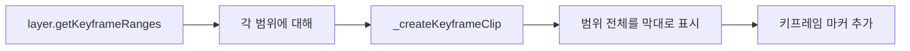

# 그리기 레이어 키프레임 UI 개선

> **이슈**: [#66](https://github.com/baehandoridori/BAEFRAME/issues/66)
> **시작일**: 2026-01-12
> **상태**: 🔄 진행 중
> **최종 수정**: 2026-01-12

---

## 개요

그리기 레이어의 키프레임 UI를 "범위 클립 방식"에서 "프레임별 고정 셀 방식"(애니메이트 스타일)으로 변경.
기존 방식은 키프레임이 겹쳐져 있어 드래그로 잡기 어려운 문제가 있음.

---

## 문제점 (현재 방식)

### 범위 클립 방식의 한계

| 문제 | 상세 |
|------|------|
| 겹침 이슈 | 키프레임 범위가 겹쳐져 클릭/드래그 시 의도치 않은 요소 선택 |
| 시각적 혼란 | 키프레임과 범위가 하나의 요소로 표시되어 구분 어려움 |
| 조작 어려움 | 좁은 영역에서 정밀한 조작이 힘듦 |

### 현재 구조

```
[파일: renderer/scripts/modules/timeline.js]

renderDrawingLayers(layers, activeLayerId)
  └── _createKeyframeClip(layer, range)
        ├── 클립 요소 생성 (범위 전체를 막대로 표시)
        ├── 키프레임 마커 추가 (●/○)
        └── 드래그/클릭 이벤트 설정

[파일: renderer/styles/main.css]

.drawing-clip        - 범위 전체를 표시하는 막대
.keyframe-marker     - 키프레임 점 (●/○)
.clip-label          - 프레임 범위 텍스트
```

### 현재 동작 방식



**예시 (프레임 0~100, 키프레임: 0, 30, 60)**:
```
현재:
[====키프레임0====][====키프레임30====][====키프레임60====]
     (0-29)            (30-59)            (60-100)

문제: 막대가 겹치지 않지만, 드래그 시 막대 전체가 이동 대상
```

---

## 변경 계획 (프레임별 고정 셀 방식)

### 목표 UI

```
변경 후 (애니메이트 스타일):
|●|□|□|□|...|●|□|□|□|...|●|□|□|□|...|
 0  1  2  3     30 31 32    60 61 62

● = 키프레임 (채워진 점)
○ = 빈 키프레임
□ = 일반 프레임 (배경색으로 범위 표시)
```

### 구현 방식

#### 1. 프레임 셀 기반 렌더링

```javascript
// 새로운 방식
renderDrawingLayerFrameCells(layer)
  ├── 현재 뷰포트에 보이는 프레임 범위 계산
  ├── 각 프레임에 대해 셀 생성
  │     ├── 키프레임이면: ● 또는 ○ 마커
  │     └── 일반 프레임: 빈 셀 (범위 표시용 배경색)
  └── 셀 클릭/드래그 이벤트 설정
```

#### 2. 가상 스크롤링 (성능 최적화)

긴 영상(10분+)에서 수만 개의 프레임 셀을 모두 렌더링하면 성능 문제 발생.
→ 현재 뷰포트에 보이는 프레임만 렌더링

```javascript
// 가상 스크롤링
const visibleRange = getVisibleFrameRange();
// visibleRange = { start: 1000, end: 1050 } (현재 화면에 보이는 프레임)

for (let frame = visibleRange.start; frame <= visibleRange.end; frame++) {
  const cell = createFrameCell(layer, frame);
  container.appendChild(cell);
}
```

#### 3. CSS 구조 변경

```css
/* 새로운 스타일 */
.frame-cell-container {
  display: flex;
  height: 28px;
}

.frame-cell {
  flex: 0 0 auto;
  width: var(--frame-cell-width); /* 줌에 따라 동적 계산 */
  height: 100%;
  border-right: 1px solid var(--border-subtle);
  display: flex;
  align-items: center;
  justify-content: center;
}

.frame-cell.keyframe {
  background: var(--layer-color);
}

.frame-cell.in-range {
  background: var(--layer-color-alpha);
}

.keyframe-dot {
  width: 8px;
  height: 8px;
  border-radius: 50%;
  background: white;
  cursor: grab;
}

.keyframe-dot.empty {
  background: transparent;
  border: 2px solid white;
}
```

### 파일 변경 예상

| 파일 | 변경 내용 |
|------|----------|
| `timeline.js` | `renderDrawingLayers` 전면 수정, 가상 스크롤링 추가 |
| `main.css` | `.drawing-clip` 제거, `.frame-cell` 스타일 추가 |
| `app.js` | 키프레임 드래그 핸들러 수정 |

---

## 상호작용 변경

### 현재 vs 변경 후

| 상호작용 | 현재 | 변경 후 |
|----------|------|---------|
| 키프레임 선택 | 마커(●) 클릭 | 셀 클릭 |
| 키프레임 이동 | 마커 드래그 | 셀 드래그 |
| 범위 확인 | 막대 너비로 확인 | 셀 배경색으로 확인 |
| 빈 프레임에 키프레임 추가 | N/A (별도 버튼) | 빈 셀 더블클릭 |

---

## 고려사항

### 성능

- 10분 영상 (24fps) = 14,400 프레임
- 모든 셀 렌더링 시 DOM 노드 과다 → 가상 스크롤링 필수
- 줌 변경 시 셀 너비 재계산 필요

### 호환성

- 기존 `.bframe` 파일 형식 변경 없음 (UI만 변경)
- 키프레임 데이터 구조 유지

### 줌 레벨별 표시

| 줌 | 셀 너비 | 표시 방식 |
|----|---------|----------|
| 10% | 1px 미만 | 범위만 블록으로 표시 |
| 100% | ~5px | 셀 경계선 + 키프레임 점 |
| 400%+ | 20px+ | 셀 + 프레임 번호 표시 |

---

## 개발 로그

### 2026-01-12 (분석)

| 작업 | 상세 |
|------|------|
| 현재 구조 분석 | `_createKeyframeClip` 함수, CSS 스타일 확인 |
| 문제점 정리 | 겹침, 조작 어려움 이슈 문서화 |
| 변경 계획 수립 | 프레임별 고정 셀 방식으로 변경 결정 |

---

## 참고

- Adobe Animate 타임라인 UI
- After Effects 레이어 키프레임 UI
- 현재 키프레임 구현: `timeline.js:828-885`
- 현재 CSS: `main.css:1949-2024`
