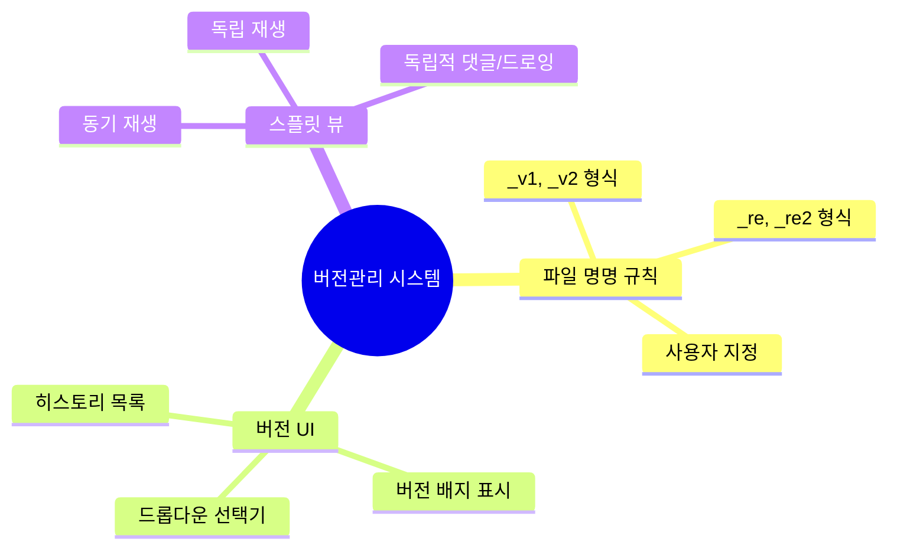
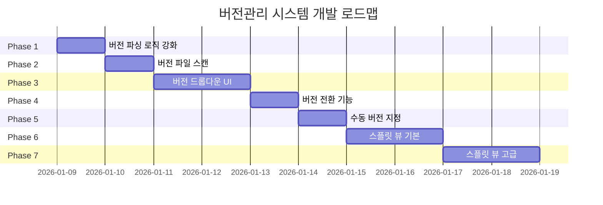
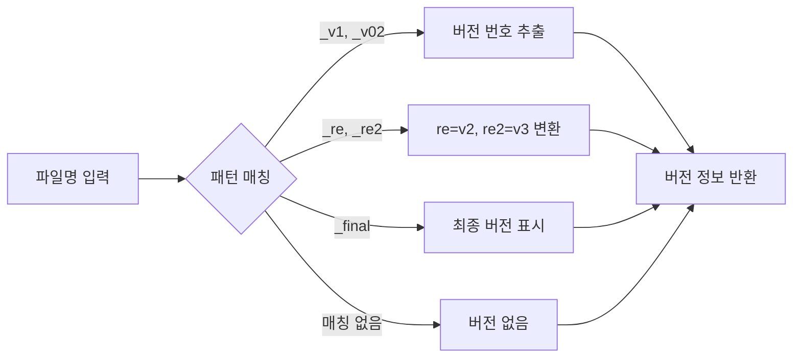
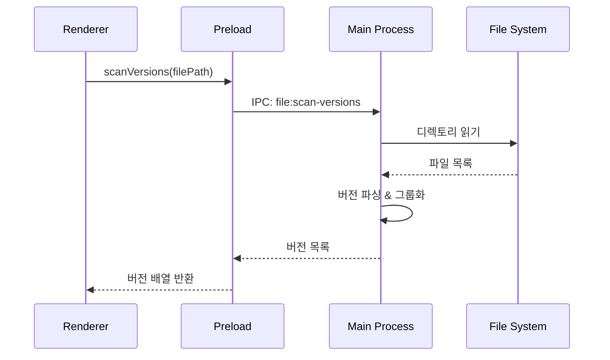
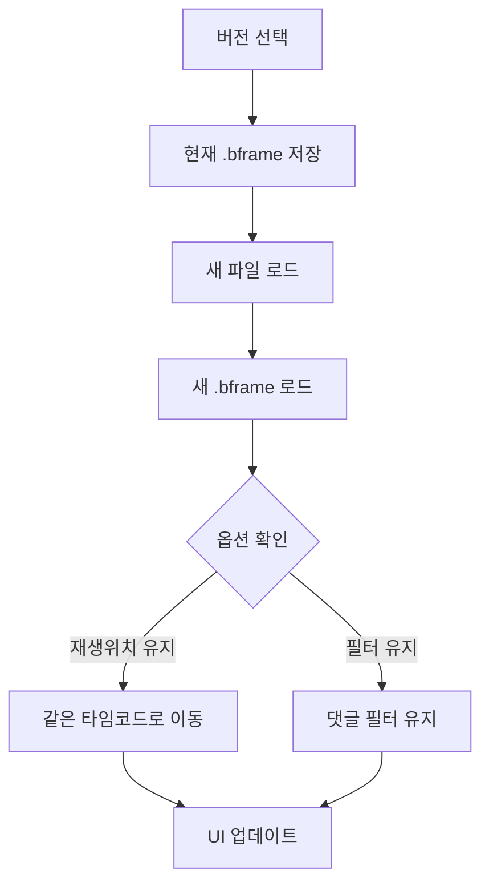
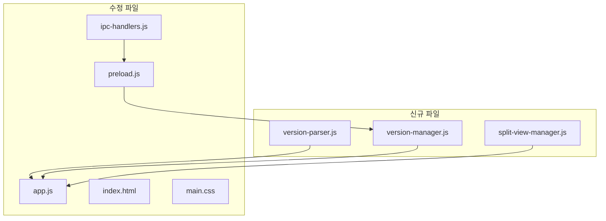

# 버전관리 시스템 개발

> **이슈**: [#62](https://github.com/baehandoridori/BAEFRAME/issues/62)
> **시작일**: 2026-01-09
> **상태**: 🚧 진행 중

---

## 목차

- [요구사항](#요구사항)
- [개발 로드맵](#개발-로드맵)
- [Phase 상세](#phase-상세)
- [파일 구조](#파일-구조)
- [개발 로그](#개발-로그)

---

## 요구사항

### 이슈 #62 핵심 기능



### 상세 요구사항

| 구분 | 요구사항 | 우선순위 |
|:----:|----------|:--------:|
| 1 | `_v1`, `_v2` 또는 `_re`, `_re2` 등 유연한 버전 파싱 | 🔴 높음 |
| 2 | 버전 드롭다운으로 파일명과 버전 표시 | 🔴 높음 |
| 3 | 파일명이 달라도 사용자가 직접 버전 명시 가능 | 🟡 중간 |
| 4 | 스플릿 뷰로 두 버전 동시 비교 | 🟡 중간 |
| 5 | 동기/독립 재생 모드 | 🟢 낮음 |
| 6 | 각 화면에 독립적인 댓글/드로잉 | 🟢 낮음 |

---

## 개발 로드맵



### 진행 상황

| Phase | 내용 | 상태 | 난이도 |
|:-----:|------|:----:|:------:|
| 1 | 버전 파싱 로직 강화 | ⬜ TODO | 🟢 낮음 |
| 2 | 버전 파일 스캔 기능 | ⬜ TODO | 🟡 중간 |
| 3 | 버전 드롭다운 UI | ⬜ TODO | 🟡 중간 |
| 4 | 버전 전환 기능 | ⬜ TODO | 🟢 낮음 |
| 5 | 수동 버전 지정 | ⬜ TODO | 🟡 중간 |
| 6 | 스플릿 뷰 기본 구조 | ⬜ TODO | 🔴 높음 |
| 7 | 스플릿 뷰 고급 기능 | ⬜ TODO | 🔴 높음 |

> **범례**: ⬜ TODO | 🔄 진행중 | ✅ 완료 | ❌ 보류

---

## Phase 상세

### Phase 1: 버전 파싱 로직 강화



**구현 항목:**
- [ ] `version-parser.js` 모듈 생성
- [ ] 다양한 버전 패턴 지원
- [ ] `app.js` 버전 감지 로직 개선

**지원 패턴:**
```javascript
// 예시
'shot_001_v1.mp4'    → { version: 1, baseName: 'shot_001' }
'shot_001_v02.mp4'   → { version: 2, baseName: 'shot_001' }
'shot_001_re.mp4'    → { version: 2, baseName: 'shot_001' }
'shot_001_re2.mp4'   → { version: 3, baseName: 'shot_001' }
'shot_001_final.mp4' → { version: 999, baseName: 'shot_001' }
```

---

### Phase 2: 버전 파일 스캔 기능



**구현 항목:**
- [ ] `main/ipc-handlers.js`에 `file:scan-versions` 핸들러 추가
- [ ] `preload.js`에 `scanVersions` 노출
- [ ] `version-manager.js` 모듈 생성

---

### Phase 3: 버전 드롭다운 UI

```
┌─────────────────────────────────────┐
│  📁 shot_001_v3.mp4      [v3 ▼]    │
└─────────────────────────────────────┘
                            │
                            ▼
                ┌───────────────────────┐
                │  버전 히스토리         │
                ├───────────────────────┤
                │  ● v3  shot_001_v3   │ ← 현재
                │  ○ v2  shot_001_v2   │
                │  ○ v1  shot_001_v1   │
                ├───────────────────────┤
                │  + 다른 파일 추가     │
                │  ⚖ 버전 비교          │
                └───────────────────────┘
```

**구현 항목:**
- [ ] HTML 버전 선택기 구조 추가
- [ ] CSS 드롭다운 스타일
- [ ] 드롭다운 렌더링/토글 로직

---

### Phase 4: 버전 전환 기능



**구현 항목:**
- [ ] 버전 전환 로직 구현
- [ ] 재생 위치/필터 유지 옵션

---

### Phase 5: 수동 버전 지정

**구현 항목:**
- [ ] 수동 버전 추가 모달 UI
- [ ] `.bframe`에 `manualVersions` 저장
- [ ] 파일 선택 다이얼로그 연동

---

### Phase 6-7: 스플릿 뷰

```
┌─────────────────────────────────────────────────────────┐
│  [동기 재생] [독립 재생]              [좌우전환] [닫기] │
├────────────────────────┬────────────────────────────────┤
│                        │                                │
│    ┌──────────────┐    │    ┌──────────────┐           │
│    │   v2 영상    │    │    │   v3 영상    │           │
│    │              │    │    │              │           │
│    └──────────────┘    │    └──────────────┘           │
│                        │                                │
│    💬 v2 댓글 목록     │    💬 v3 댓글 목록            │
│                        │                                │
├────────────────────────┴────────────────────────────────┤
│  ▶ ━━━━━━━━━━━━━━━━━━━○━━━━━━━━━━━━━━━━━━━━  00:05:23  │
└─────────────────────────────────────────────────────────┘
```

**Phase 6 구현 항목:**
- [ ] HTML 스플릿 레이아웃
- [ ] CSS 스플릿 스타일
- [ ] `split-view-manager.js` 모듈

**Phase 7 구현 항목:**
- [ ] 동기/독립 재생 모드
- [ ] 독립적 댓글/드로잉 관리
- [ ] 스플릿 컨트롤 UI

---

## 파일 구조



### 수정 대상 파일

| 파일 | 변경 내용 |
|------|----------|
| `renderer/scripts/modules/version-parser.js` | 🆕 버전 파싱 유틸리티 |
| `renderer/scripts/modules/version-manager.js` | 🆕 버전 관리 매니저 |
| `renderer/scripts/modules/split-view-manager.js` | 🆕 스플릿 뷰 매니저 |
| `renderer/scripts/app.js` | ✏️ 버전 감지, UI 이벤트 |
| `renderer/index.html` | ✏️ 드롭다운, 스플릿 구조 |
| `renderer/styles/main.css` | ✏️ 드롭다운, 스플릿 스타일 |
| `main/ipc-handlers.js` | ✏️ 폴더 스캔 핸들러 |
| `preload/preload.js` | ✏️ scanVersions 노출 |

---

## 개발 로그

### 2026-01-09

| 시간 | 작업 | 커밋 |
|------|------|------|
| - | 개발 계획 수립 | - |

<!--
### 템플릿
| 시간 | 작업 | 커밋 |
|------|------|------|
| HH:MM | 작업 내용 요약 | `abc1234` |

**이슈:** 발생한 문제
**해결:** 해결 방법
-->

---

## 참고 자료

- [baeframe-dev-docs.md](../baeframe-dev-docs.md) - 섹션 5.5 버전 관리 기능 명세
- [TODO.md](../TODO.md) - Phase 7 버전 관리
- 현재 구현: `app.js:2070-2077` 버전 배지 표시 로직
