# 버전관리 시스템 개발

> **이슈**: [#62](https://github.com/baehandoridori/BAEFRAME/issues/62)
> **시작일**: 2026-01-09
> **상태**: 🚧 진행 중
> **최종 수정**: 2026-01-10

---

## 목차

- [요구사항](#요구사항)
- [현재 코드베이스 분석](#현재-코드베이스-분석)
- [설계 결정사항](#설계-결정사항)
- [UI/UX 상세 설계](#uiux-상세-설계)
- [데이터 스키마](#데이터-스키마)
- [개발 로드맵](#개발-로드맵)
- [Phase 상세](#phase-상세)
- [엣지 케이스 처리](#엣지-케이스-처리)
- [위험 요소 및 대응](#위험-요소-및-대응)
- [GPT 5.2 Pro 검토 피드백](#gpt-52-pro-검토-피드백)
- [파일 구조](#파일-구조)
- [개발 로그](#개발-로그)

---

## 요구사항

### 이슈 #62 핵심 기능

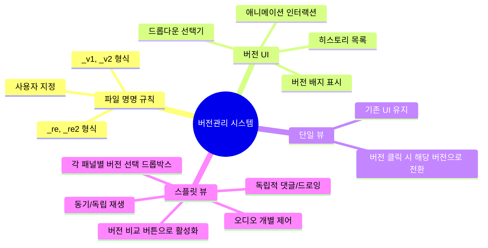

### 상세 요구사항

| 구분 | 요구사항 | 우선순위 | Phase |
|:----:|----------|:--------:|:-----:|
| 1 | `_v1`, `_v2` 또는 `_re`, `_re2` 등 유연한 버전 파싱 | 🔴 높음 | 1 |
| 2 | 버전 드롭다운으로 파일명과 버전 표시 | 🔴 높음 | 3 |
| 3 | **단일 뷰**: 버전 클릭 시 해당 버전으로 전환 | 🔴 높음 | 4 |
| 4 | 파일명이 달라도 사용자가 직접 버전 명시 가능 | 🟡 중간 | 5 |
| 5 | **스플릿 뷰**: "버전 비교" 버튼으로 활성화 | 🟡 중간 | 6 |
| 6 | 스플릿 뷰 각 패널에서 버전 선택 드롭박스 | 🟡 중간 | 6 |
| 7 | 동기/독립 재생 모드 (프레임 기준) | 🟢 낮음 | 7 |
| 8 | 각 화면에 독립적인 댓글/드로잉 (완전 분리) | 🟢 낮음 | 7 |
| 9 | 오디오 개별 제어 (음소거/볼륨) | 🟢 낮음 | 7 |
| 10 | 이쁜 CSS + 자연스러운 애니메이션 | 🟢 낮음 | 3,6 |

---

## 현재 코드베이스 분석

### 기존 구현 상태

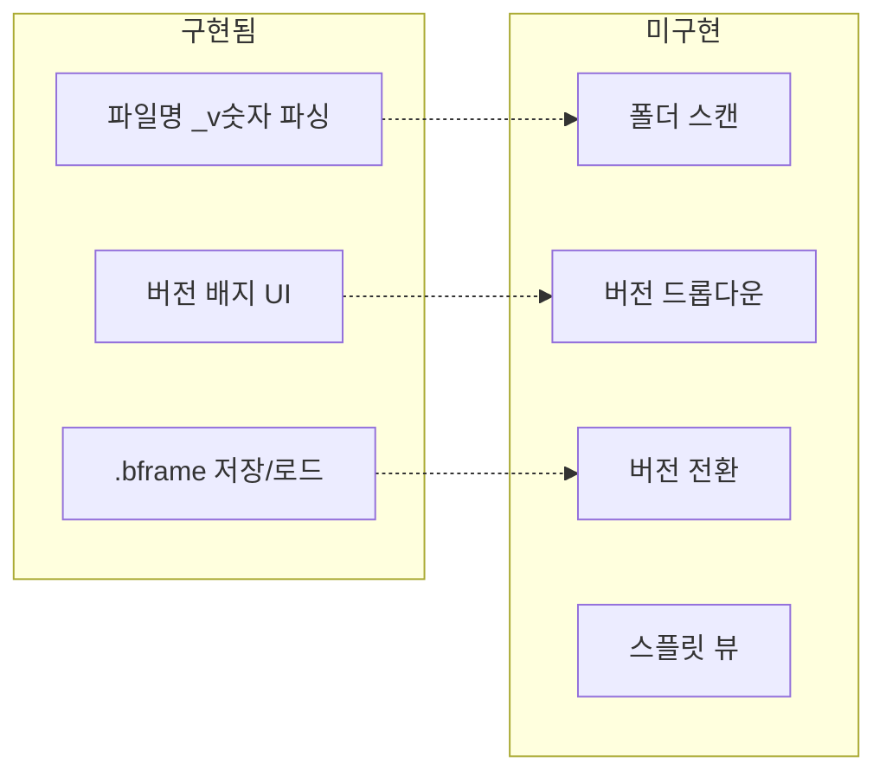

### ⚠️ 스키마 불일치 문제

현재 코드와 문서 간 스키마가 일치하지 않습니다:

| 위치 | 필드명 | 구조 |
|------|--------|------|
| `review-data-manager.js` (실제 저장) | `videoPath`, `videoName` | `comments: { layers: [...] }` |
| `validators.js` (검증기) | `videoFile`, `fps` | `comments: [...]` (배열) |
| `baeframe-dev-docs.md` (문서) | `videoFile` | `versions: [...]` (미사용) |

**현재 실제 저장 구조** (`review-data-manager.js:254-266`):
```javascript
{
  version: '1.0',
  videoPath: '/path/to/video.mp4',
  videoName: 'video',
  createdAt: '2026-01-09T00:00:00Z',
  modifiedAt: '2026-01-09T00:00:00Z',
  comments: {
    layers: [...]  // 객체 형태
  },
  drawings: {
    layers: [...]
  },
  highlights: [...]
}
```

**→ Phase 0에서 스키마 통일 필요**

### 싱글 인스턴스 구조

현재 `app.js`에서 모든 모듈이 단일 인스턴스로 초기화됨:

```javascript
// app.js (현재 구조)
const videoPlayer = new VideoPlayer({ videoElement: elements.videoPlayer });
const timeline = new Timeline({ container: elements.timelineSection });
const drawingManager = new DrawingManager({ canvas: elements.drawingCanvas });
const commentManager = new CommentManager({ ... });
const reviewDataManager = new ReviewDataManager({ ... });
```

**스플릿 뷰 구현 시 필요한 변경:**
- 각 모듈의 다중 인스턴스 지원
- DOM 요소 동적 생성/관리
- 상태 분리 (좌/우 독립)

### IPC 채널 현황

| 파일 | 상태 |
|------|------|
| `shared/ipc-channels.js` | 상수 정의됨 (미사용) |
| `preload.js` | 직접 문자열 사용 |
| `ipc-handlers.js` | 직접 문자열 사용 |

**→ 새로운 `file:scan-versions` 채널 추가 시 기존 패턴 따름**

---

## 설계 결정사항

### 확정된 설계 방향

| 항목 | 결정 | 근거 |
|------|------|------|
| **버전 목록 소스** | 폴더 스캔 기본 + 수동 추가 지원 | 자동화 + 유연성 |
| **기본 동작** | 버전 클릭 → 단일 뷰 전환 | 단순함 |
| **스플릿 뷰 진입** | "버전 비교" 버튼 클릭 | 명시적 선택 |
| **스플릿 뷰 댓글** | 완전 분리 (좌/우 독립 편집) | 버전별 피드백 분리 |
| **동기 재생 기준** | 프레임 기준 | 애니메이션 작업 특성 |
| **버전 라벨 표시** | 숫자 + 원본 (`v2 (_re)`) | 명확성 |
| **오디오 처리** | 보조 영상 자동 음소거 + 개별 토글 | 혼란 방지 |
| **구현 순서** | Phase 0 먼저 (스키마 정리) | 안정성 확보 |

### 단일 뷰 vs 스플릿 뷰

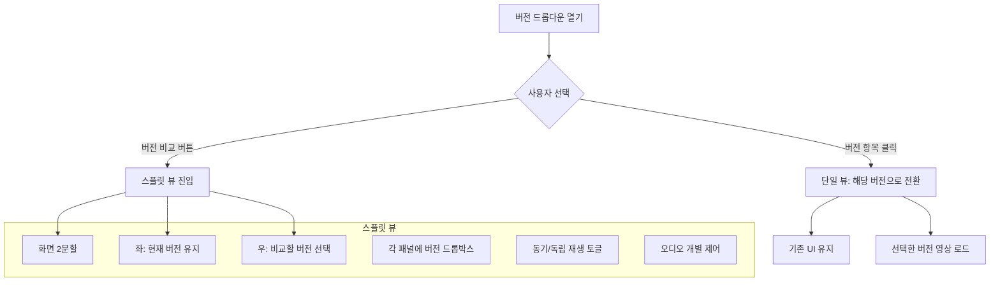

### 버전 소스 우선순위

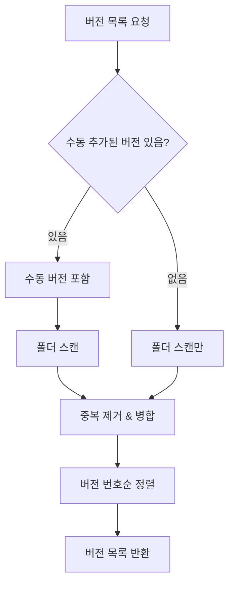

### 버전 라벨 표시 규칙

| 파일명 | 버전 번호 | UI 표시 |
|--------|----------|---------|
| `shot_001_v1.mp4` | 1 | `v1` |
| `shot_001_v02.mp4` | 2 | `v2` |
| `shot_001_re.mp4` | 2 | `v2 (_re)` |
| `shot_001_re2.mp4` | 3 | `v3 (_re2)` |
| `shot_001_final.mp4` | 999 | `FINAL` |
| `shot_001.mp4` (버전 없음) | null | `-` |

---

## UI/UX 상세 설계

### 버전 드롭다운 (단일 뷰)

```
┌──────────────────────────────────────────────────┐
│  📁 shot_001_v3.mp4                   [v3 ▼]    │
└──────────────────────────────────────────────────┘
                                         │
                                         ▼ (fade + slide 애니메이션)
                           ┌─────────────────────────┐
                           │  📋 버전 히스토리        │
                           ├─────────────────────────┤
                           │  ● v3  shot_001_v3     │ ← 현재 (hover: 하이라이트)
                           │  ○ v2 (_re) shot_001_re│   (클릭: 해당 버전으로 전환)
                           │  ○ v1  shot_001_v1     │
                           ├─────────────────────────┤
                           │  + 다른 파일 추가       │
                           │  ⚖ 버전 비교           │ ← 스플릿 뷰 진입
                           └─────────────────────────┘
```

### 스플릿 뷰 레이아웃

```
┌─────────────────────────────────────────────────────────────────┐
│  [🔗 동기 재생] [📌 독립 재생]          [↔ 좌우전환] [✕ 닫기]  │
├───────────────────────────────┬─────────────────────────────────┤
│                               │                                 │
│  ┌─ 버전 선택 ─────────────┐  │  ┌─ 버전 선택 ─────────────┐   │
│  │ v2 (_re)            ▼ │  │  │ v3                    ▼ │   │
│  └─────────────────────────┘  │  └─────────────────────────┘   │
│                               │                                 │
│   ┌───────────────────────┐   │   ┌───────────────────────┐    │
│   │                       │   │   │                       │    │
│   │      v2 영상          │   │   │      v3 영상          │    │
│   │                       │   │   │                       │    │
│   └───────────────────────┘   │   └───────────────────────┘    │
│                               │                                 │
│   🔇 음소거  🎨 그리기        │   🔊 음량   🎨 그리기          │
│                               │                                 │
│   💬 v2 댓글 패널             │   💬 v3 댓글 패널              │
│                               │                                 │
├───────────────────────────────┴─────────────────────────────────┤
│  ▶ ━━━━━━━━━━━━━━━━━○━━━━━━━━━━━━━━━━━━  00:05:23 F120         │
└─────────────────────────────────────────────────────────────────┘
```

### 스플릿 뷰 내 버전 드롭박스

각 패널 상단에 버전 선택 드롭박스:

```
┌─ 버전 선택 ─────────────────────┐
│ v2 (_re)                    ▼ │
└─────────────────────────────────┘
              │
              ▼ (부드러운 slide-down)
┌─────────────────────────────────┐
│  ● v3        shot_001_v3.mp4   │ ← 다른 패널에서 사용 중 (비활성)
│  ○ v2 (_re)  shot_001_re.mp4   │ ← 현재 선택
│  ○ v1        shot_001_v1.mp4   │
└─────────────────────────────────┘
```

### CSS 애니메이션 요구사항

| 요소 | 애니메이션 | 지속시간 | 이징 |
|------|-----------|---------|------|
| 드롭다운 열기 | fade-in + slide-down | 200ms | ease-out |
| 드롭다운 닫기 | fade-out + slide-up | 150ms | ease-in |
| 항목 hover | 배경색 전환 | 150ms | ease |
| 스플릿 뷰 진입 | 화면 분할 슬라이드 | 300ms | ease-in-out |
| 스플릿 뷰 종료 | 화면 병합 | 250ms | ease-in |
| 버전 전환 | 크로스페이드 | 200ms | ease |

**CSS 변수 (main.css에 추가):**
```css
:root {
  --version-dropdown-bg: var(--bg-elevated);
  --version-dropdown-border: var(--border-default);
  --version-dropdown-shadow: 0 4px 12px rgba(0, 0, 0, 0.3);
  --version-item-hover: var(--accent-glow);
  --version-item-current: var(--accent-primary);
  --transition-fast: 150ms ease;
  --transition-normal: 200ms ease-out;
  --transition-slow: 300ms ease-in-out;
}
```

### 독립 재생 모드 UX

```mermaid
flowchart TD
    A[독립 재생 모드] --> B{사용자 조작}
    B -->|패널 클릭| C[해당 패널 활성화]
    C --> D[활성 패널 테두리 하이라이트]
    C --> E[키보드 제어가 활성 패널에 적용]

    B -->|패널 내 재생버튼| F[해당 패널만 재생/정지]
    B -->|패널 내 시크바| G[해당 패널만 이동]

    subgraph 활성 패널 표시
        D
        H[상단에 "활성" 뱃지]
    end
```

### 오디오 제어 UI

| 모드 | 기본 상태 | 제어 |
|------|----------|------|
| 단일 뷰 | 오디오 활성화 | 기존 볼륨 컨트롤 |
| 스플릿 뷰 - 주 패널 | 오디오 활성화 | 음소거 토글 |
| 스플릿 뷰 - 보조 패널 | **자동 음소거** | 음소거 해제 토글 |

---

## 데이터 스키마

### Phase 0 이후 통일된 .bframe 스키마

```javascript
{
  // 메타데이터
  "bframeVersion": "2.0",           // 스키마 버전 (기존 1.0과 구분)
  "videoFile": "shot_001_v3.mp4",   // 파일명 (경로 아님)
  "videoPath": "/full/path/to/video.mp4",  // 전체 경로
  "fps": 24,
  "createdAt": "2026-01-09T00:00:00Z",
  "modifiedAt": "2026-01-09T00:00:00Z",

  // 버전 관리 (신규)
  "versionInfo": {
    "detectedVersion": 3,           // 파일명에서 감지된 버전
    "originalSuffix": "_v3",        // 원본 접미사
    "baseName": "shot_001"          // 기본 이름 (버전 제외)
  },

  // 수동 추가된 버전 (신규)
  "manualVersions": [
    {
      "version": 1,
      "fileName": "다른이름_초안.mp4",
      "filePath": "/path/to/다른이름_초안.mp4",
      "addedAt": "2026-01-09T00:00:00Z"
    }
  ],

  // 리뷰 데이터 (기존 구조 유지)
  "comments": {
    "layers": [
      {
        "id": "layer_1",
        "name": "기본 레이어",
        "markers": [...]
      }
    ]
  },
  "drawings": {
    "layers": [...]
  },
  "highlights": [...]
}
```

### 마이그레이션 전략

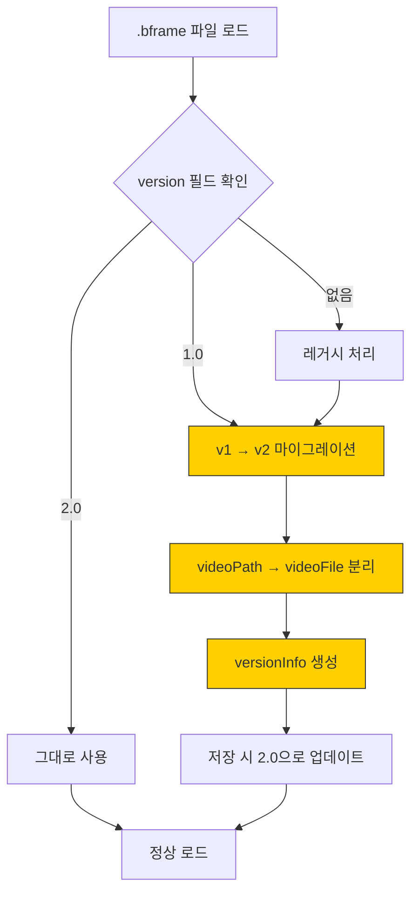

**⚠️ 마이그레이션 안전 절차 (GPT 5.2 Pro 권장):**
1. 로드 전 원본 파일 백업 (`.bframe.bak`)
2. 마이그레이션 실행
3. 검증 실패 시 백업에서 복구
4. 성공 시 백업 삭제 (선택적)

---

## 개발 로드맵

### 수정된 Phase 구조

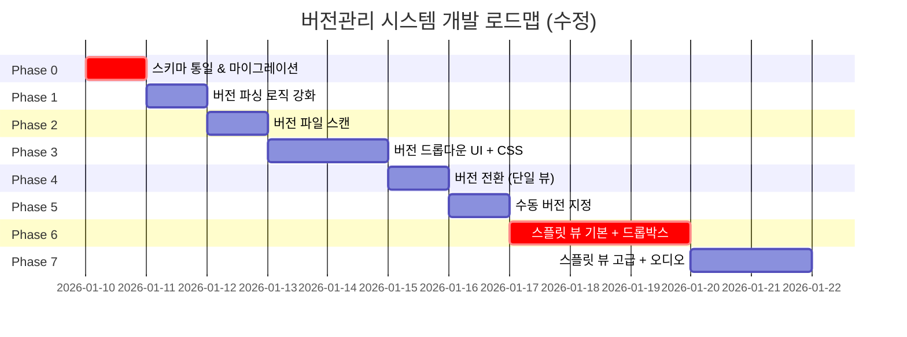

### 진행 상황

| Phase | 내용 | 상태 | 난이도 | 의존성 |
|:-----:|------|:----:|:------:|:------:|
| 0 | 스키마 통일 & 마이그레이션 | ✅ 완료 | 🟡 중간 | - |
| 1 | 버전 파싱 로직 강화 | ✅ 완료 | 🟢 낮음 | Phase 0 |
| 2 | 버전 파일 스캔 기능 | ✅ 완료 | 🟡 중간 | Phase 1 |
| 3 | 버전 드롭다운 UI + CSS 애니메이션 | ⬜ TODO | 🟡 중간 | Phase 2 |
| 4 | 버전 전환 (단일 뷰) | ⬜ TODO | 🟡 중간 | Phase 3 |
| 5 | 수동 버전 지정 | ⬜ TODO | 🟡 중간 | Phase 4 |
| 6 | 스플릿 뷰 기본 + 패널별 드롭박스 | ⬜ TODO | 🔴 높음 | Phase 4 |
| 7 | 스플릿 뷰 고급 (동기재생, 오디오) | ⬜ TODO | 🔴 높음 | Phase 6 |

> **범례**: ⬜ TODO | 🔄 진행중 | ✅ 완료 | ❌ 보류

---

## Phase 상세

### Phase 0: 스키마 통일 & 마이그레이션 🆕

**목표:** 코드/문서/검증기 간 스키마 불일치 해소

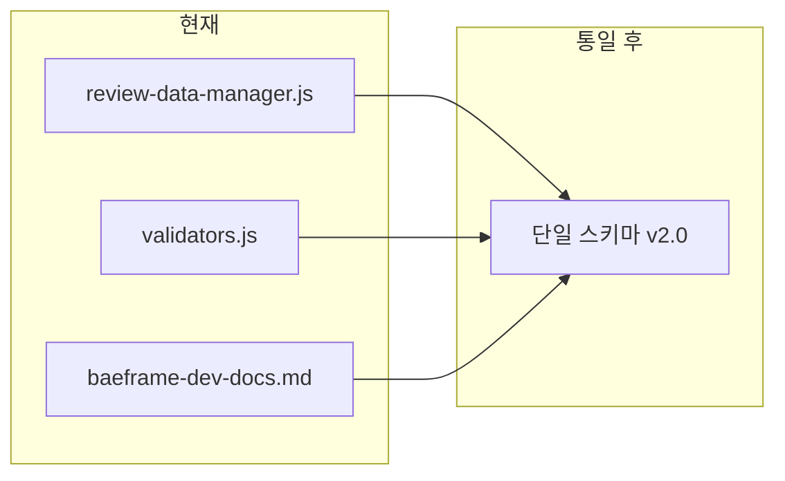

**구현 항목:**
- [x] `shared/schema.js` 생성 - 스키마 정의 단일 소스
- [x] `review-data-manager.js` 수정 - 새 스키마 적용
- [x] `validators.js` 수정 - 새 스키마 기준 검증
- [x] 마이그레이션 함수 구현 (`v1 → v2`)
- [x] **백업/롤백 기능 구현** (GPT 5.2 Pro 권장)
- [x] `baeframe-dev-docs.md` 문서 업데이트

**호환성:**
- 기존 `.bframe` 파일 자동 마이그레이션
- 저장 시 새 스키마로 업데이트
- 웹 뷰어와 호환성 유지

---

### Phase 1: 버전 파싱 로직 강화

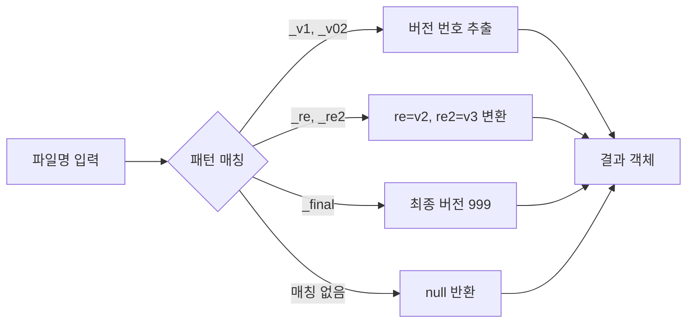

**구현 항목:**
- [x] `renderer/scripts/modules/version-parser.js` 생성
- [x] 정규식 패턴 정의 및 테스트
- [x] `app.js` 버전 감지 로직 교체

**version-parser.js 인터페이스:**
```javascript
/**
 * @param {string} fileName - 파일명 (확장자 포함)
 * @returns {{
 *   version: number | null,
 *   baseName: string,
 *   suffix: string | null,
 *   displayLabel: string
 * }}
 */
export function parseVersion(fileName) { ... }

/**
 * @param {string} fileName
 * @returns {string} - 버전 접미사 제거된 기본 이름
 */
export function extractBaseName(fileName) { ... }
```

**지원 패턴:**
```javascript
const VERSION_PATTERNS = [
  { regex: /_v(\d+)/i,    extract: (m) => parseInt(m[1]),     suffix: m => m[0] },
  { regex: /_re(\d+)$/i,  extract: (m) => parseInt(m[1]) + 1, suffix: m => m[0] },
  { regex: /_re$/i,       extract: () => 2,                   suffix: () => '_re' },
  { regex: /_final$/i,    extract: () => 999,                 suffix: () => '_final' }
];
```

---

### Phase 2: 버전 파일 스캔 기능

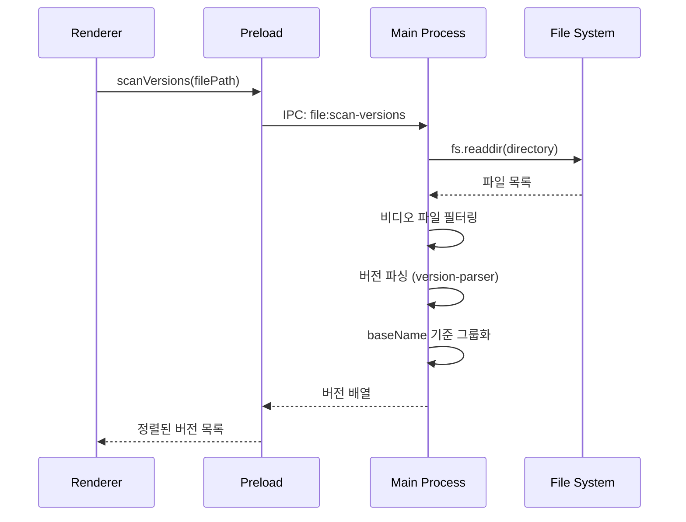

**구현 항목:**
- [x] `main/ipc-handlers.js`에 `file:scan-versions` 핸들러 추가
- [x] `preload.js`에 `scanVersions` API 노출
- [x] `renderer/scripts/modules/version-manager.js` 생성
- [x] **비동기 처리로 UI 블로킹 방지** (GPT 5.2 Pro 권장)

**IPC 핸들러 스펙:**
```javascript
// main/ipc-handlers.js
ipcMain.handle('file:scan-versions', async (event, filePath) => {
  // 반환 형식
  return {
    baseName: 'shot_001',
    currentVersion: 3,
    versions: [
      { version: 1, fileName: 'shot_001_v1.mp4', path: '...', mtime: '...' },
      { version: 2, fileName: 'shot_001_v2.mp4', path: '...', mtime: '...' },
      { version: 3, fileName: 'shot_001_v3.mp4', path: '...', mtime: '...' }
    ]
  };
});
```

---

### Phase 3: 버전 드롭다운 UI + CSS 애니메이션

**구현 항목:**
- [ ] HTML: 버전 선택기 구조 (`index.html`)
- [ ] CSS: 드롭다운 스타일 + 애니메이션 (`main.css`)
- [ ] JS: 드롭다운 렌더링/토글 로직 (`app.js`)

**HTML 구조:**
```html
<div class="version-selector" id="versionSelector">
  <button class="version-btn" id="versionBtn">
    <span class="version-label" id="versionLabel">v3</span>
    <svg class="dropdown-icon">...</svg>
  </button>
  <div class="version-dropdown" id="versionDropdown">
    <div class="version-header">버전 히스토리</div>
    <ul class="version-list" id="versionList">
      <!-- 동적 생성 -->
    </ul>
    <div class="version-actions">
      <button id="btnAddVersion">+ 다른 파일 추가</button>
      <button id="btnCompareVersions">⚖ 버전 비교</button>
    </div>
  </div>
</div>
```

**CSS 애니메이션:**
```css
/* 드롭다운 애니메이션 */
.version-dropdown {
  opacity: 0;
  transform: translateY(-10px);
  transition: opacity var(--transition-normal),
              transform var(--transition-normal);
  pointer-events: none;
}

.version-dropdown.open {
  opacity: 1;
  transform: translateY(0);
  pointer-events: auto;
}

/* 항목 호버 효과 */
.version-item {
  transition: background-color var(--transition-fast);
}

.version-item:hover {
  background-color: var(--version-item-hover);
}

.version-item.current {
  background-color: var(--version-item-current);
}
```

---

### Phase 4: 버전 전환 (단일 뷰)

**핵심:** 버전 항목 클릭 시 해당 버전으로 전환

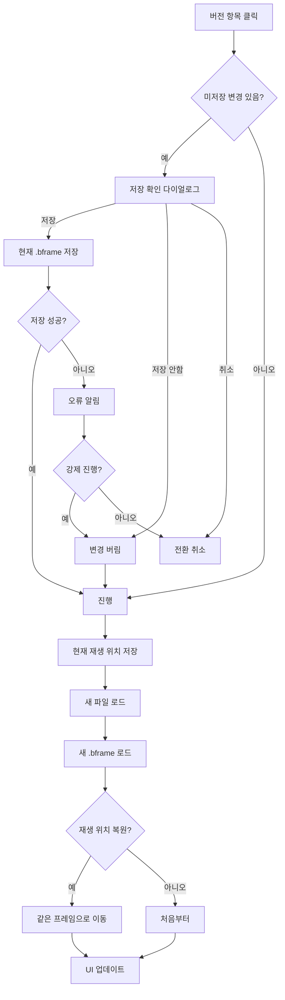

**구현 항목:**
- [ ] 미저장 변경 확인 로직
- [ ] 저장 실패 시 처리 (확인 다이얼로그)
- [ ] 버전 전환 함수
- [ ] 재생 위치 복원 옵션

---

### Phase 5: 수동 버전 지정

**모달 UI:**
```
┌─────────────────────────────────────┐
│  수동 버전 추가              [✕]   │
├─────────────────────────────────────┤
│                                     │
│  파일 선택                          │
│  ┌─────────────────────────┐       │
│  │ 파일을 선택하세요...    │ [찾기] │
│  └─────────────────────────┘       │
│                                     │
│  버전 번호                          │
│  ┌─────────────────────────┐       │
│  │ 1                       │       │
│  └─────────────────────────┘       │
│                                     │
│  [취소]              [추가]        │
└─────────────────────────────────────┘
```

**구현 항목:**
- [ ] 수동 버전 추가 모달 UI
- [ ] `.bframe`에 `manualVersions` 저장
- [ ] 파일 선택 다이얼로그 연동
- [ ] 중복 버전 번호 검증

---

### Phase 6: 스플릿 뷰 기본 + 패널별 드롭박스

**핵심:** "버전 비교" 버튼 클릭 시 스플릿 뷰 진입, 각 패널에서 버전 선택 가능

**구현 항목:**
- [ ] HTML: 스플릿 레이아웃 구조
- [ ] CSS: 스플릿 뷰 스타일 + 진입/종료 애니메이션
- [ ] `split-view-manager.js` 모듈 생성
- [ ] **각 패널에 버전 선택 드롭박스** (동일 스타일)
- [ ] 리사이저 드래그 기능
- [ ] **패널 활성화 표시** (GPT 5.2 Pro 권장)

**아키텍처 변경:**
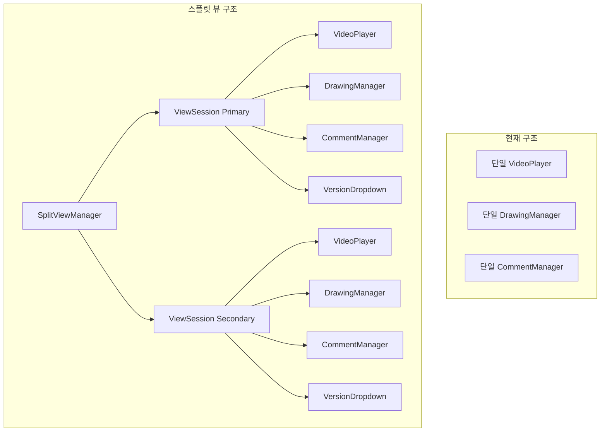

**ViewSession 클래스:**
```javascript
class ViewSession {
  constructor(container, options) {
    this.videoPlayer = new VideoPlayer({ ... });
    this.drawingManager = new DrawingManager({ ... });
    this.commentManager = new CommentManager({ ... });
    this.reviewDataManager = new ReviewDataManager({ ... });
    this.versionDropdown = new VersionDropdown({ ... });  // 패널 내 드롭박스
    this.isMuted = options.isMuted || false;  // 오디오 상태
  }

  async loadVideo(filePath) { ... }
  async switchVersion(versionInfo) { ... }  // 패널 내 버전 전환
  setMuted(muted) { ... }
  destroy() { ... }  // 리소스 정리
}
```

---

### Phase 7: 스플릿 뷰 고급 (동기재생, 오디오)

**동기 재생 (프레임 기준):**
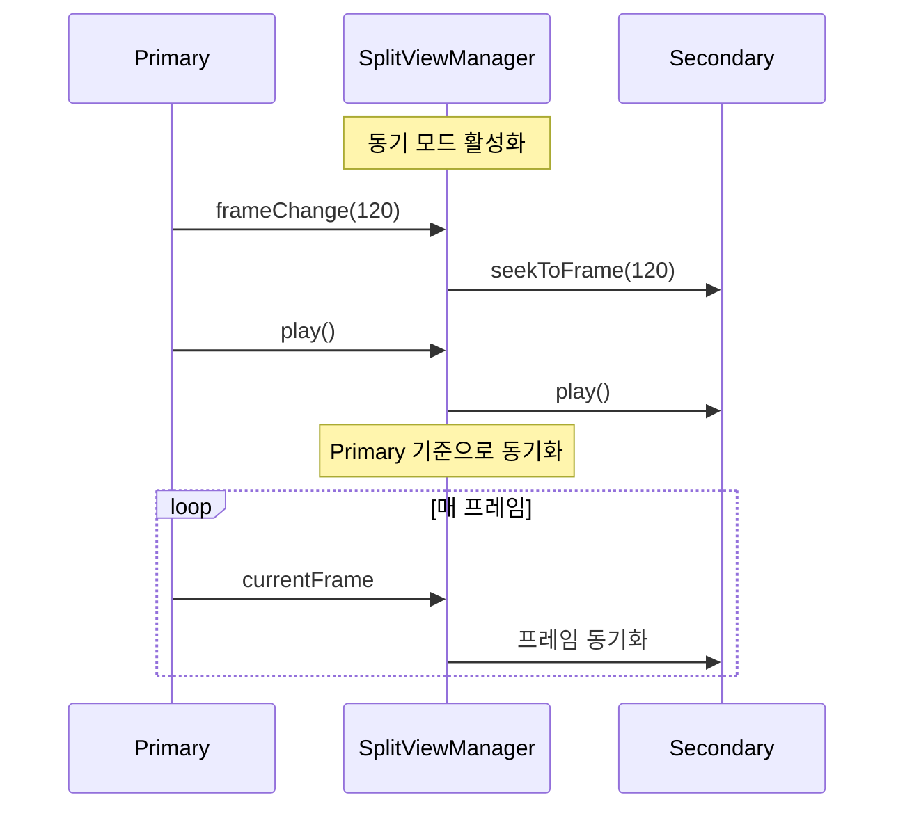

**구현 항목:**
- [ ] 동기 재생 모드 (프레임 기준)
- [ ] 독립 재생 모드 + **패널별 개별 제어 UI**
- [ ] 좌/우 독립 댓글/드로잉
- [ ] 좌우 전환 기능
- [ ] **오디오 개별 제어** (보조 패널 자동 음소거)
- [ ] 스플릿 뷰 종료 시 **양쪽 .bframe 저장** + 리소스 정리

**오디오 제어 구현:**
```javascript
// SplitViewManager
initAudio() {
  // 보조 패널 자동 음소거
  this.secondarySession.setMuted(true);
}

toggleMute(session) {
  session.setMuted(!session.isMuted);
  this.updateAudioUI(session);
}
```

---

## 엣지 케이스 처리

### 버전 파일 관련

| 상황 | 처리 |
|------|------|
| 버전 파일이 하나도 없음 | 드롭다운 비활성화, "버전 없음" 표시 |
| 버전 파일이 삭제됨 | 목록에서 제거, "파일 없음" 표시 |
| 버전 파일이 이동됨 | 스캔 시 감지 안됨, 수동 재추가 필요 |
| 버전 번호 중복 | 수정일(mtime) 기준 최신 우선 |
| 매우 많은 버전 (20+) | 스크롤 가능한 목록, 가상 스크롤 고려 |

### 저장/전환 관련

| 상황 | 처리 |
|------|------|
| 저장 실패 | 오류 토스트 + 재시도/강제 전환 선택 |
| 전환 중 앱 종료 | 자동 저장 트리거 (beforeunload) |
| .bframe 파일 손상 | 백업에서 복구 시도, 실패 시 새로 생성 |

### 스플릿 뷰 관련

| 상황 | 처리 |
|------|------|
| 한쪽 파일 삭제됨 | 해당 패널 비활성화 + "파일 없음" 표시 |
| fps가 다른 경우 | 프레임 번호 기준 동기화 (시간 무시) |
| 영상 길이가 다른 경우 | 짧은 쪽 끝나면 멈춤, 긴 쪽은 계속 |
| 메모리 부족 | 경고 표시, 한쪽 해상도 낮춤 권장 |
| **스플릿 뷰 도중 새 파일 열기** | 스플릿 종료 → 단일 뷰로 새 파일 열기 |
| **스플릿 종료 시 미저장 변경** | 양쪽 .bframe 모두 저장 확인 |
| **같은 버전을 양쪽에 선택** | 드롭박스에서 비활성화 표시 |

### 오디오 관련 🆕

| 상황 | 처리 |
|------|------|
| 두 영상 모두 오디오 있음 | 보조 패널 자동 음소거 |
| 사용자가 보조 패널 음소거 해제 | 주 패널 자동 음소거 (한쪽만 재생) |
| 영상에 오디오 없음 | 음소거 버튼 비활성화 |

---

## 위험 요소 및 대응

### 🔴 높은 위험

| 위험 | 영향 | 대응 |
|------|------|------|
| 스키마 마이그레이션 실패 | 기존 데이터 손실 | **백업 후 마이그레이션, 롤백 기능** |
| 스플릿 뷰 메모리 과다 | 앱 크래시 | 해상도 제한, 메모리 모니터링, **4K 영상 경고** |
| 싱글 인스턴스 리팩토링 | 기존 기능 파손 | **단계적 적용, 회귀 테스트** |

### 🟡 중간 위험

| 위험 | 영향 | 대응 |
|------|------|------|
| 버전 파싱 오인식 | 잘못된 그룹화 | 사용자 수정 가능하게 |
| 대용량 폴더 스캔 지연 | UI 멈춤 | **비동기 처리, 캐싱** |
| 저장 실패 감지 못함 | 데이터 유실 | 저장 결과 검증 강화 |
| **공유 자원 충돌** | 상태 불일치 | HighlightManager/타임라인 분리 검토 |

### 🟢 낮은 위험

| 위험 | 영향 | 대응 |
|------|------|------|
| IPC 채널명 충돌 | 기능 오작동 | 네임스페이스 적용 |
| CSS 스타일 충돌 | UI 깨짐 | BEM 네이밍 적용 |

---

## GPT 5.2 Pro 검토 피드백

### 검토 요약 (2026-01-10)

| 항목 | 평가 | 핵심 피드백 |
|------|------|------------|
| 기술적 안정성 | ⚠️ 주의 | 스키마 마이그레이션 백업/롤백 필수, IPC 에러 처리 강화 |
| 아키텍처 | ✅ 적절 | ViewSession 캡슐화 좋음, 공유 자원 처리 방안 필요 |
| 사용자 경험 | ⚠️ 주의 | 독립 재생 개별 제어 UI 필요, 오디오 처리 누락 |
| 엣지 케이스 | ✅ 적절 | 대부분 정의됨, 일부 시나리오 추가 권장 |
| 개선 제안 | ⚠️ 보완 | 오디오 제어, 성능 옵션 추가 권장 |

### 반영된 항목

- [x] Phase 0에 백업/롤백 기능 추가
- [x] Phase 2에 비동기 처리 강조
- [x] Phase 6에 패널 활성화 표시 추가
- [x] Phase 7에 오디오 개별 제어 추가
- [x] 엣지 케이스에 스플릿 뷰 도중 새 파일 열기 추가
- [x] 엣지 케이스에 스플릿 종료 시 양쪽 저장 추가
- [x] 오디오 관련 엣지 케이스 섹션 추가
- [x] 위험 요소에 공유 자원 충돌 추가

### 향후 검토 대상 (Phase 8+)

- A/B 비교 모드 (깜빡이며 비교)
- 반투명 겹침 비교
- 변경점 자동 마커 표시

---

## 파일 구조

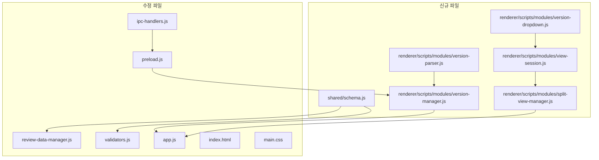

### 수정 대상 파일 상세

| 파일 | Phase | 변경 내용 |
|------|:-----:|----------|
| `shared/schema.js` | 0 | 🆕 스키마 정의 단일 소스 |
| `shared/validators.js` | 0 | ✏️ 새 스키마 기준 검증 |
| `renderer/scripts/modules/review-data-manager.js` | 0 | ✏️ 새 스키마 적용, 마이그레이션, 백업 |
| `renderer/scripts/modules/version-parser.js` | 1 | 🆕 버전 파싱 유틸리티 |
| `renderer/scripts/modules/version-manager.js` | 2 | 🆕 버전 관리 매니저 |
| `renderer/scripts/modules/version-dropdown.js` | 3 | 🆕 드롭다운 컴포넌트 |
| `main/ipc-handlers.js` | 2 | ✏️ `file:scan-versions` 핸들러 |
| `preload/preload.js` | 2 | ✏️ `scanVersions` API 노출 |
| `renderer/index.html` | 3,5,6 | ✏️ 드롭다운, 모달, 스플릿 구조 |
| `renderer/styles/main.css` | 3,5,6 | ✏️ 드롭다운, 모달, 스플릿 스타일, **애니메이션** |
| `renderer/scripts/app.js` | 3,4 | ✏️ 버전 감지, UI 이벤트, 전환 |
| `renderer/scripts/modules/view-session.js` | 6 | 🆕 뷰 세션 클래스 (오디오 포함) |
| `renderer/scripts/modules/split-view-manager.js` | 6,7 | 🆕 스플릿 뷰 매니저 |

---

## 테스트 체크리스트

### Phase 0 완료 조건
- [ ] 기존 .bframe 파일 로드 시 마이그레이션 성공
- [ ] 마이그레이션 실패 시 백업에서 복구
- [ ] 새로 저장된 파일이 v2.0 스키마
- [ ] 웹 뷰어에서 정상 표시

### Phase 1-4 완료 조건
- [ ] 다양한 버전 패턴 파싱 (`_v1`, `_re`, `_final`)
- [ ] 폴더 내 버전 파일 자동 감지
- [ ] 드롭다운에서 버전 목록 표시 + **애니메이션**
- [ ] **버전 클릭 시 단일 뷰로 전환**
- [ ] 미저장 변경 경고

### Phase 5 완료 조건
- [ ] 수동 버전 추가 모달 동작
- [ ] 추가된 버전이 목록에 표시
- [ ] .bframe에 manualVersions 저장

### Phase 6-7 완료 조건
- [ ] **"버전 비교" 버튼으로 스플릿 뷰 진입**
- [ ] **각 패널에 버전 선택 드롭박스**
- [ ] 양쪽 독립 재생 + **개별 제어 UI**
- [ ] 프레임 기준 동기 재생
- [ ] 양쪽 독립 댓글/드로잉
- [ ] **오디오 개별 제어** (보조 패널 자동 음소거)
- [ ] 스플릿 종료 시 **양쪽 저장** + 리소스 정리

---

## 개발 로그

### 2026-01-10

| 시간 | 작업 | 커밋 |
|------|------|------|
| - | GPT 5.2 Pro 검토 피드백 반영 | `31c8655` |
| - | UI/UX 상세 설계 섹션 추가 | `31c8655` |
| - | 단일 뷰 vs 스플릿 뷰 동작 명확화 | `31c8655` |
| - | 스플릿 뷰 내 패널별 드롭박스 추가 | `31c8655` |
| - | CSS 애니메이션 요구사항 추가 | `31c8655` |
| - | 오디오 제어 요구사항 추가 | `31c8655` |
| - | **Phase 0 완료**: 스키마 통일 및 마이그레이션 | `248ea28` |
| - | `shared/schema.js` 생성 (v2.0 스키마 정의) | `248ea28` |
| - | `review-data-manager.js` 마이그레이션 기능 추가 | `248ea28` |
| - | `validators.js` v2.0 스키마 기준 수정 | `248ea28` |
| - | `baeframe-dev-docs.md` 스키마 문서 업데이트 | `248ea28` |
| - | **Phase 1 완료**: 버전 파싱 로직 강화 | `4b854ea` |
| - | `version-parser.js` 모듈 생성 | `4b854ea` |
| - | `app.js` 버전 감지 로직 교체 | `4b854ea` |
| - | **Phase 2 완료**: 버전 파일 스캔 기능 | `5f61dd4` |
| - | `ipc-handlers.js`에 `file:scan-versions` 핸들러 추가 | `5f61dd4` |
| - | `preload.js`에 `scanVersions` API 노출 | `5f61dd4` |
| - | `version-manager.js` 모듈 생성 | `5f61dd4` |
| - | **메인 브랜치 병합**: 보안 패치 포함 | `8cc7a2f` |

### 2026-01-09

| 시간 | 작업 | 커밋 |
|------|------|------|
| - | 개발 계획 수립 | `96fdd49` |
| - | GPT 피드백 분석 및 설계 결정 | - |
| - | 계획 문서 보강 (Phase 0 추가, 스키마 정의) | `e268993` |

---

## 참고 자료

### 내부 문서
- [baeframe-dev-docs.md](../baeframe-dev-docs.md) - 섹션 5.5 버전 관리 기능 명세
- [TODO.md](../TODO.md) - Phase 7 버전 관리
- [shared/validators.js](../shared/validators.js) - 현재 검증 로직

### 현재 구현 위치
- 버전 배지 표시: `app.js:2070-2077`
- 데이터 저장: `review-data-manager.js:254-266`
- 데이터 검증: `validators.js:10-37`

### 관련 이슈
- [#62](https://github.com/baehandoridori/BAEFRAME/issues/62) - 버전관리시스템 개발
