# 버전관리 시스템 개발

> **이슈**: [#62](https://github.com/baehandoridori/BAEFRAME/issues/62)
> **시작일**: 2026-01-09
> **상태**: 🚧 진행 중
> **최종 수정**: 2026-01-09

---

## 목차

- [요구사항](#요구사항)
- [현재 코드베이스 분석](#현재-코드베이스-분석)
- [설계 결정사항](#설계-결정사항)
- [데이터 스키마](#데이터-스키마)
- [개발 로드맵](#개발-로드맵)
- [Phase 상세](#phase-상세)
- [엣지 케이스 처리](#엣지-케이스-처리)
- [위험 요소 및 대응](#위험-요소-및-대응)
- [파일 구조](#파일-구조)
- [개발 로그](#개발-로그)

---

## 요구사항

### 이슈 #62 핵심 기능

```mermaid
mindmap
  root((버전관리 시스템))
    파일 명명 규칙
      _v1, _v2 형식
      _re, _re2 형식
      사용자 지정
    버전 UI
      드롭다운 선택기
      버전 배지 표시
      히스토리 목록
    스플릿 뷰
      동기 재생
      독립 재생
      독립적 댓글/드로잉
```



### 상세 요구사항

| 구분 | 요구사항 | 우선순위 | Phase |
|:----:|----------|:--------:|:-----:|
| 1 | `_v1`, `_v2` 또는 `_re`, `_re2` 등 유연한 버전 파싱 | 🔴 높음 | 1 |
| 2 | 버전 드롭다운으로 파일명과 버전 표시 | 🔴 높음 | 3 |
| 3 | 파일명이 달라도 사용자가 직접 버전 명시 가능 | 🟡 중간 | 5 |
| 4 | 스플릿 뷰로 두 버전 동시 비교 | 🟡 중간 | 6 |
| 5 | 동기/독립 재생 모드 (프레임 기준) | 🟢 낮음 | 7 |
| 6 | 각 화면에 독립적인 댓글/드로잉 (완전 분리) | 🟢 낮음 | 7 |

---

## 현재 코드베이스 분석

### 기존 구현 상태

```mermaid
flowchart LR
    subgraph 구현됨
        A[파일명 _v숫자 파싱]
        B[버전 배지 UI]
        C[.bframe 저장/로드]
    end

    subgraph 미구현
        D[폴더 스캔]
        E[버전 드롭다운]
        F[버전 전환]
        G[스플릿 뷰]
    end

    A -.-> D
    B -.-> E
    C -.-> F
```

### ⚠️ 스키마 불일치 문제

현재 코드와 문서 간 스키마가 일치하지 않습니다:

| 위치 | 필드명 | 구조 |
|------|--------|------|
| `review-data-manager.js` (실제 저장) | `videoPath`, `videoName` | `comments: { layers: [...] }` |
| `validators.js` (검증기) | `videoFile`, `fps` | `comments: [...]` (배열) |
| `baeframe-dev-docs.md` (문서) | `videoFile` | `versions: [...]` (미사용) |

**현재 실제 저장 구조** (`review-data-manager.js:254-266`):
```javascript
{
  version: '1.0',
  videoPath: '/path/to/video.mp4',
  videoName: 'video',
  createdAt: '2026-01-09T00:00:00Z',
  modifiedAt: '2026-01-09T00:00:00Z',
  comments: {
    layers: [...]  // 객체 형태
  },
  drawings: {
    layers: [...]
  },
  highlights: [...]
}
```

**→ Phase 0에서 스키마 통일 필요**

### 싱글 인스턴스 구조

현재 `app.js`에서 모든 모듈이 단일 인스턴스로 초기화됨:

```javascript
// app.js (현재 구조)
const videoPlayer = new VideoPlayer({ videoElement: elements.videoPlayer });
const timeline = new Timeline({ container: elements.timelineSection });
const drawingManager = new DrawingManager({ canvas: elements.drawingCanvas });
const commentManager = new CommentManager({ ... });
const reviewDataManager = new ReviewDataManager({ ... });
```

**스플릿 뷰 구현 시 필요한 변경:**
- 각 모듈의 다중 인스턴스 지원
- DOM 요소 동적 생성/관리
- 상태 분리 (좌/우 독립)

### IPC 채널 현황

| 파일 | 상태 |
|------|------|
| `shared/ipc-channels.js` | 상수 정의됨 (미사용) |
| `preload.js` | 직접 문자열 사용 |
| `ipc-handlers.js` | 직접 문자열 사용 |

**→ 새로운 `file:scan-versions` 채널 추가 시 기존 패턴 따름**

---

## 설계 결정사항

### 확정된 설계 방향

| 항목 | 결정 | 근거 |
|------|------|------|
| **버전 목록 소스** | 폴더 스캔 기본 + 수동 추가 지원 | 자동화 + 유연성 |
| **스플릿 뷰 댓글** | 완전 분리 (좌/우 독립 편집) | 버전별 피드백 분리 |
| **동기 재생 기준** | 프레임 기준 | 애니메이션 작업 특성 |
| **버전 라벨 표시** | 숫자 + 원본 (`v2 (_re)`) | 명확성 |
| **구현 순서** | Phase 0 먼저 (스키마 정리) | 안정성 확보 |

### 버전 소스 우선순위

```mermaid
flowchart TD
    A[버전 목록 요청] --> B{수동 추가된 버전 있음?}
    B -->|있음| C[수동 버전 포함]
    B -->|없음| D[폴더 스캔만]
    C --> E[폴더 스캔]
    E --> F[중복 제거 & 병합]
    D --> F
    F --> G[버전 번호순 정렬]
    G --> H[버전 목록 반환]
```



### 버전 라벨 표시 규칙

| 파일명 | 버전 번호 | UI 표시 |
|--------|----------|---------|
| `shot_001_v1.mp4` | 1 | `v1` |
| `shot_001_v02.mp4` | 2 | `v2` |
| `shot_001_re.mp4` | 2 | `v2 (_re)` |
| `shot_001_re2.mp4` | 3 | `v3 (_re2)` |
| `shot_001_final.mp4` | 999 | `FINAL` |
| `shot_001.mp4` (버전 없음) | null | `-` |

---

## 데이터 스키마

### Phase 0 이후 통일된 .bframe 스키마

```javascript
{
  // 메타데이터
  "bframeVersion": "2.0",           // 스키마 버전 (기존 1.0과 구분)
  "videoFile": "shot_001_v3.mp4",   // 파일명 (경로 아님)
  "videoPath": "/full/path/to/video.mp4",  // 전체 경로
  "fps": 24,
  "createdAt": "2026-01-09T00:00:00Z",
  "modifiedAt": "2026-01-09T00:00:00Z",

  // 버전 관리 (신규)
  "versionInfo": {
    "detectedVersion": 3,           // 파일명에서 감지된 버전
    "originalSuffix": "_v3",        // 원본 접미사
    "baseName": "shot_001"          // 기본 이름 (버전 제외)
  },

  // 수동 추가된 버전 (신규)
  "manualVersions": [
    {
      "version": 1,
      "fileName": "다른이름_초안.mp4",
      "filePath": "/path/to/다른이름_초안.mp4",
      "addedAt": "2026-01-09T00:00:00Z"
    }
  ],

  // 리뷰 데이터 (기존 구조 유지)
  "comments": {
    "layers": [
      {
        "id": "layer_1",
        "name": "기본 레이어",
        "markers": [...]
      }
    ]
  },
  "drawings": {
    "layers": [...]
  },
  "highlights": [...]
}
```

### 마이그레이션 전략

```mermaid
flowchart TD
    A[.bframe 파일 로드] --> B{version 필드 확인}
    B -->|1.0| C[v1 → v2 마이그레이션]
    B -->|2.0| D[그대로 사용]
    B -->|없음| E[레거시 처리]

    C --> F[videoPath → videoFile 분리]
    F --> G[versionInfo 생성]
    G --> H[저장 시 2.0으로 업데이트]

    E --> C
    D --> I[정상 로드]
    H --> I
```



---

## 개발 로드맵

### 수정된 Phase 구조

```mermaid
gantt
    title 버전관리 시스템 개발 로드맵 (수정)
    dateFormat  YYYY-MM-DD

    section Phase 0
    스키마 통일 & 마이그레이션   :crit, p0, 2026-01-09, 1d

    section Phase 1
    버전 파싱 로직 강화          :p1, after p0, 1d

    section Phase 2
    버전 파일 스캔              :p2, after p1, 1d

    section Phase 3
    버전 드롭다운 UI            :p3, after p2, 2d

    section Phase 4
    버전 전환 기능              :p4, after p3, 1d

    section Phase 5
    수동 버전 지정              :p5, after p4, 1d

    section Phase 6
    스플릿 뷰 기본              :crit, p6, after p5, 2d

    section Phase 7
    스플릿 뷰 고급              :p7, after p6, 2d
```



### 진행 상황

| Phase | 내용 | 상태 | 난이도 | 의존성 |
|:-----:|------|:----:|:------:|:------:|
| 0 | 스키마 통일 & 마이그레이션 | ⬜ TODO | 🟡 중간 | - |
| 1 | 버전 파싱 로직 강화 | ⬜ TODO | 🟢 낮음 | Phase 0 |
| 2 | 버전 파일 스캔 기능 | ⬜ TODO | 🟡 중간 | Phase 1 |
| 3 | 버전 드롭다운 UI | ⬜ TODO | 🟡 중간 | Phase 2 |
| 4 | 버전 전환 기능 | ⬜ TODO | 🟡 중간 | Phase 3 |
| 5 | 수동 버전 지정 | ⬜ TODO | 🟡 중간 | Phase 4 |
| 6 | 스플릿 뷰 기본 구조 | ⬜ TODO | 🔴 높음 | Phase 4 |
| 7 | 스플릿 뷰 고급 기능 | ⬜ TODO | 🔴 높음 | Phase 6 |

> **범례**: ⬜ TODO | 🔄 진행중 | ✅ 완료 | ❌ 보류

---

## Phase 상세

### Phase 0: 스키마 통일 & 마이그레이션 🆕

**목표:** 코드/문서/검증기 간 스키마 불일치 해소

```mermaid
flowchart LR
    subgraph 현재
        A1[review-data-manager.js]
        A2[validators.js]
        A3[baeframe-dev-docs.md]
    end

    subgraph 통일 후
        B[단일 스키마 v2.0]
    end

    A1 --> B
    A2 --> B
    A3 --> B
```

**구현 항목:**
- [ ] `shared/schema.js` 생성 - 스키마 정의 단일 소스
- [ ] `review-data-manager.js` 수정 - 새 스키마 적용
- [ ] `validators.js` 수정 - 새 스키마 기준 검증
- [ ] 마이그레이션 함수 구현 (`v1 → v2`)
- [ ] `baeframe-dev-docs.md` 문서 업데이트

**호환성:**
- 기존 `.bframe` 파일 자동 마이그레이션
- 저장 시 새 스키마로 업데이트
- 웹 뷰어와 호환성 유지

---

### Phase 1: 버전 파싱 로직 강화

```mermaid
flowchart LR
    A[파일명 입력] --> B{패턴 매칭}
    B -->|_v1, _v02| C[버전 번호 추출]
    B -->|_re, _re2| D[re=v2, re2=v3 변환]
    B -->|_final| E[최종 버전 999]
    B -->|매칭 없음| F[null 반환]
    C --> G[결과 객체]
    D --> G
    E --> G
    F --> G
```



**구현 항목:**
- [ ] `renderer/scripts/modules/version-parser.js` 생성
- [ ] 정규식 패턴 정의 및 테스트
- [ ] `app.js` 버전 감지 로직 교체

**version-parser.js 인터페이스:**
```javascript
/**
 * @param {string} fileName - 파일명 (확장자 포함)
 * @returns {{
 *   version: number | null,
 *   baseName: string,
 *   suffix: string | null,
 *   displayLabel: string
 * }}
 */
export function parseVersion(fileName) { ... }

/**
 * @param {string} fileName
 * @returns {string} - 버전 접미사 제거된 기본 이름
 */
export function extractBaseName(fileName) { ... }
```

**지원 패턴:**
```javascript
const VERSION_PATTERNS = [
  { regex: /_v(\d+)/i,    extract: (m) => parseInt(m[1]),     suffix: m => m[0] },
  { regex: /_re(\d+)$/i,  extract: (m) => parseInt(m[1]) + 1, suffix: m => m[0] },
  { regex: /_re$/i,       extract: () => 2,                   suffix: () => '_re' },
  { regex: /_final$/i,    extract: () => 999,                 suffix: () => '_final' }
];
```

---

### Phase 2: 버전 파일 스캔 기능

```mermaid
sequenceDiagram
    participant R as Renderer
    participant P as Preload
    participant M as Main Process
    participant F as File System

    R->>P: scanVersions(filePath)
    P->>M: IPC: file:scan-versions
    M->>F: fs.readdir(directory)
    F-->>M: 파일 목록
    M->>M: 비디오 파일 필터링
    M->>M: 버전 파싱 (version-parser)
    M->>M: baseName 기준 그룹화
    M-->>P: 버전 배열
    P-->>R: 정렬된 버전 목록
```



**구현 항목:**
- [ ] `main/ipc-handlers.js`에 `file:scan-versions` 핸들러 추가
- [ ] `preload.js`에 `scanVersions` API 노출
- [ ] `renderer/scripts/modules/version-manager.js` 생성

**IPC 핸들러 스펙:**
```javascript
// main/ipc-handlers.js
ipcMain.handle('file:scan-versions', async (event, filePath) => {
  // 반환 형식
  return {
    baseName: 'shot_001',
    currentVersion: 3,
    versions: [
      { version: 1, fileName: 'shot_001_v1.mp4', path: '...', mtime: '...' },
      { version: 2, fileName: 'shot_001_v2.mp4', path: '...', mtime: '...' },
      { version: 3, fileName: 'shot_001_v3.mp4', path: '...', mtime: '...' }
    ]
  };
});
```

**version-manager.js 인터페이스:**
```javascript
export class VersionManager extends EventTarget {
  constructor(options) { ... }

  async loadVersions(videoPath);        // 폴더 스캔 + 수동 버전 병합
  addManualVersion(filePath, version);  // 수동 버전 추가
  removeManualVersion(filePath);        // 수동 버전 제거
  getVersionList();                     // 현재 버전 목록
  getCurrentVersion();                  // 현재 버전 정보

  // Events: 'versionsLoaded', 'versionAdded', 'versionRemoved'
}
```

---

### Phase 3: 버전 드롭다운 UI

**UI 목업:**
```
┌──────────────────────────────────────────────────┐
│  📁 shot_001_v3.mp4                   [v3 ▼]    │
└──────────────────────────────────────────────────┘
                                         │
                                         ▼
                           ┌─────────────────────────┐
                           │  📋 버전 히스토리        │
                           ├─────────────────────────┤
                           │  ● v3  shot_001_v3     │ ← 현재
                           │  ○ v2 (_re) shot_001_re│
                           │  ○ v1  shot_001_v1     │
                           ├─────────────────────────┤
                           │  + 다른 파일 추가       │
                           │  ⚖ 버전 비교           │
                           └─────────────────────────┘
```

**구현 항목:**
- [ ] HTML: 버전 선택기 구조 (`index.html`)
- [ ] CSS: 드롭다운 스타일 (`main.css`)
- [ ] JS: 드롭다운 렌더링/토글 로직 (`app.js`)

**HTML 구조:**
```html
<div class="version-selector" id="versionSelector">
  <button class="version-btn" id="versionBtn">
    <span class="version-label" id="versionLabel">v3</span>
    <svg class="dropdown-icon">...</svg>
  </button>
  <div class="version-dropdown" id="versionDropdown">
    <div class="version-header">버전 히스토리</div>
    <ul class="version-list" id="versionList">
      <!-- 동적 생성 -->
    </ul>
    <div class="version-actions">
      <button id="btnAddVersion">+ 다른 파일 추가</button>
      <button id="btnCompareVersions">⚖ 버전 비교</button>
    </div>
  </div>
</div>
```

---

### Phase 4: 버전 전환 기능

```mermaid
flowchart TD
    A[버전 선택] --> B{미저장 변경 있음?}
    B -->|예| C[저장 확인 다이얼로그]
    C -->|저장| D[현재 .bframe 저장]
    C -->|저장 안함| E[변경 버림]
    C -->|취소| Z[전환 취소]
    B -->|아니오| F[진행]
    D --> D1{저장 성공?}
    D1 -->|예| F
    D1 -->|아니오| D2[오류 알림]
    D2 --> D3{강제 진행?}
    D3 -->|예| E
    D3 -->|아니오| Z
    E --> F
    F --> G[현재 재생 위치 저장]
    G --> H[새 파일 로드]
    H --> I[새 .bframe 로드]
    I --> J{재생 위치 복원?}
    J -->|예| K[같은 프레임으로 이동]
    J -->|아니오| L[처음부터]
    K --> M[UI 업데이트]
    L --> M
```



**구현 항목:**
- [ ] 미저장 변경 확인 로직
- [ ] 저장 실패 시 처리 (확인 다이얼로그)
- [ ] 버전 전환 함수
- [ ] 재생 위치 복원 옵션

**전환 함수 인터페이스:**
```javascript
async function switchToVersion(versionInfo, options = {}) {
  const {
    preservePlaybackPosition: true,  // 프레임 위치 유지
    forceSwitch: false               // 미저장 무시
  } = options;

  // ...
}
```

---

### Phase 5: 수동 버전 지정

**모달 UI:**
```
┌─────────────────────────────────────┐
│  수동 버전 추가              [✕]   │
├─────────────────────────────────────┤
│                                     │
│  파일 선택                          │
│  ┌─────────────────────────┐       │
│  │ 파일을 선택하세요...    │ [찾기] │
│  └─────────────────────────┘       │
│                                     │
│  버전 번호                          │
│  ┌─────────────────────────┐       │
│  │ 1                       │       │
│  └─────────────────────────┘       │
│                                     │
│  [취소]              [추가]        │
└─────────────────────────────────────┘
```

**구현 항목:**
- [ ] 수동 버전 추가 모달 UI
- [ ] `.bframe`에 `manualVersions` 저장
- [ ] 파일 선택 다이얼로그 연동
- [ ] 중복 버전 번호 검증

---

### Phase 6: 스플릿 뷰 기본 구조

**레이아웃:**
```
┌─────────────────────────────────────────────────────────┐
│  [동기 재생] [독립 재생]              [좌우전환] [닫기] │
├────────────────────────┬────────────────────────────────┤
│                        │                                │
│   ┌──────────────┐     │    ┌──────────────┐           │
│   │   v2 영상    │     │    │   v3 영상    │           │
│   │              │     │    │              │           │
│   └──────────────┘     │    └──────────────┘           │
│                        │                                │
│   📝 v2 그리기 캔버스  │    📝 v3 그리기 캔버스       │
│                        │                                │
│   💬 v2 댓글 패널      │    💬 v3 댓글 패널           │
│                        │                                │
├────────────────────────┴────────────────────────────────┤
│  ▶ ━━━━━━━━━━━━━━━━━○━━━━━━━━━━━━━━━━━━  00:05:23 F120 │
└─────────────────────────────────────────────────────────┘
```

**구현 항목:**
- [ ] HTML: 스플릿 레이아웃 구조
- [ ] CSS: 스플릿 뷰 스타일
- [ ] `split-view-manager.js` 모듈 생성
- [ ] 리사이저 드래그 기능

**아키텍처 변경:**
```mermaid
graph TD
    subgraph 현재 구조
        A[단일 VideoPlayer]
        B[단일 DrawingManager]
        C[단일 CommentManager]
    end

    subgraph 스플릿 뷰 구조
        D[ViewSession Primary]
        E[ViewSession Secondary]
        F[SplitViewManager]

        D --> D1[VideoPlayer]
        D --> D2[DrawingManager]
        D --> D3[CommentManager]

        E --> E1[VideoPlayer]
        E --> E2[DrawingManager]
        E --> E3[CommentManager]

        F --> D
        F --> E
    end
```

**ViewSession 클래스:**
```javascript
class ViewSession {
  constructor(container, options) {
    this.videoPlayer = new VideoPlayer({ ... });
    this.drawingManager = new DrawingManager({ ... });
    this.commentManager = new CommentManager({ ... });
    this.reviewDataManager = new ReviewDataManager({ ... });
  }

  async loadVideo(filePath) { ... }
  destroy() { ... }  // 리소스 정리
}
```

---

### Phase 7: 스플릿 뷰 고급 기능

**동기 재생 (프레임 기준):**

```mermaid
sequenceDiagram
    participant P as Primary
    participant S as SplitViewManager
    participant Q as Secondary

    Note over S: 동기 모드 활성화
    P->>S: frameChange(120)
    S->>Q: seekToFrame(120)

    P->>S: play()
    S->>Q: play()

    Note over S: Primary 기준으로 동기화
    loop 매 프레임
        P->>S: currentFrame
        S->>Q: 프레임 동기화
    end
```


**구현 항목:**
- [ ] 동기 재생 모드 (프레임 기준)
- [ ] 독립 재생 모드
- [ ] 좌/우 독립 댓글/드로잉
- [ ] 좌우 전환 기능
- [ ] 스플릿 뷰 종료 시 리소스 정리

---

## 엣지 케이스 처리

### 버전 파일 관련

| 상황 | 처리 |
|------|------|
| 버전 파일이 하나도 없음 | 드롭다운 비활성화, "버전 없음" 표시 |
| 버전 파일이 삭제됨 | 목록에서 제거, "파일 없음" 표시 |
| 버전 파일이 이동됨 | 스캔 시 감지 안됨, 수동 재추가 필요 |
| 버전 번호 중복 | 수정일(mtime) 기준 최신 우선 |
| 매우 많은 버전 (20+) | 스크롤 가능한 목록, 검색 기능 고려 |

### 저장/전환 관련

| 상황 | 처리 |
|------|------|
| 저장 실패 | 오류 토스트 + 재시도/강제 전환 선택 |
| 전환 중 앱 종료 | 자동 저장 트리거 (beforeunload) |
| .bframe 파일 손상 | 백업에서 복구 시도, 실패 시 새로 생성 |

### 스플릿 뷰 관련

| 상황 | 처리 |
|------|------|
| 한쪽 파일 삭제됨 | 해당 패널 비활성화 + "파일 없음" 표시 |
| fps가 다른 경우 | 프레임 번호 기준 동기화 (시간 무시) |
| 영상 길이가 다른 경우 | 짧은 쪽 끝나면 멈춤, 긴 쪽은 계속 |
| 메모리 부족 | 경고 표시, 한쪽 해상도 낮춤 권장 |

---

## 위험 요소 및 대응

### 🔴 높은 위험

| 위험 | 영향 | 대응 |
|------|------|------|
| 스키마 마이그레이션 실패 | 기존 데이터 손실 | 백업 후 마이그레이션, 롤백 기능 |
| 스플릿 뷰 메모리 과다 | 앱 크래시 | 해상도 제한, 메모리 모니터링 |
| 싱글 인스턴스 리팩토링 | 기존 기능 파손 | 단계적 적용, 회귀 테스트 |

### 🟡 중간 위험

| 위험 | 영향 | 대응 |
|------|------|------|
| 버전 파싱 오인식 | 잘못된 그룹화 | 사용자 수정 가능하게 |
| 대용량 폴더 스캔 지연 | UI 멈춤 | 비동기 처리, 캐싱 |
| 저장 실패 감지 못함 | 데이터 유실 | 저장 결과 검증 강화 |

### 🟢 낮은 위험

| 위험 | 영향 | 대응 |
|------|------|------|
| IPC 채널명 충돌 | 기능 오작동 | 네임스페이스 적용 |
| CSS 스타일 충돌 | UI 깨짐 | BEM 네이밍 적용 |

---

## 파일 구조

```mermaid
graph TD
    subgraph 신규 파일
        SC[shared/schema.js]
        VP[renderer/scripts/modules/version-parser.js]
        VM[renderer/scripts/modules/version-manager.js]
        SV[renderer/scripts/modules/split-view-manager.js]
        VS[renderer/scripts/modules/view-session.js]
    end

    subgraph 수정 파일
        RDM[review-data-manager.js]
        VAL[validators.js]
        APP[app.js]
        HTML[index.html]
        CSS[main.css]
        IPC[ipc-handlers.js]
        PRE[preload.js]
    end

    SC --> RDM
    SC --> VAL
    VP --> VM
    VM --> APP
    VS --> SV
    SV --> APP
    IPC --> PRE
    PRE --> VM
```

### 수정 대상 파일 상세

| 파일 | Phase | 변경 내용 |
|------|:-----:|----------|
| `shared/schema.js` | 0 | 🆕 스키마 정의 단일 소스 |
| `shared/validators.js` | 0 | ✏️ 새 스키마 기준 검증 |
| `renderer/scripts/modules/review-data-manager.js` | 0 | ✏️ 새 스키마 적용, 마이그레이션 |
| `renderer/scripts/modules/version-parser.js` | 1 | 🆕 버전 파싱 유틸리티 |
| `renderer/scripts/modules/version-manager.js` | 2 | 🆕 버전 관리 매니저 |
| `main/ipc-handlers.js` | 2 | ✏️ `file:scan-versions` 핸들러 |
| `preload/preload.js` | 2 | ✏️ `scanVersions` API 노출 |
| `renderer/index.html` | 3,5,6 | ✏️ 드롭다운, 모달, 스플릿 구조 |
| `renderer/styles/main.css` | 3,5,6 | ✏️ 드롭다운, 모달, 스플릿 스타일 |
| `renderer/scripts/app.js` | 3,4 | ✏️ 버전 감지, UI 이벤트, 전환 |
| `renderer/scripts/modules/view-session.js` | 6 | 🆕 뷰 세션 클래스 |
| `renderer/scripts/modules/split-view-manager.js` | 6,7 | 🆕 스플릿 뷰 매니저 |

---

## 테스트 체크리스트

### Phase 0 완료 조건
- [ ] 기존 .bframe 파일 로드 시 마이그레이션 성공
- [ ] 새로 저장된 파일이 v2.0 스키마
- [ ] 웹 뷰어에서 정상 표시

### Phase 1-4 완료 조건
- [ ] 다양한 버전 패턴 파싱 (`_v1`, `_re`, `_final`)
- [ ] 폴더 내 버전 파일 자동 감지
- [ ] 드롭다운에서 버전 목록 표시
- [ ] 버전 전환 시 데이터 유지
- [ ] 미저장 변경 경고

### Phase 5 완료 조건
- [ ] 수동 버전 추가 모달 동작
- [ ] 추가된 버전이 목록에 표시
- [ ] .bframe에 manualVersions 저장

### Phase 6-7 완료 조건
- [ ] 스플릿 뷰 레이아웃 표시
- [ ] 양쪽 독립 재생
- [ ] 프레임 기준 동기 재생
- [ ] 양쪽 독립 댓글/드로잉
- [ ] 스플릿 종료 시 리소스 정리

---

## 개발 로그

### 2026-01-09

| 시간 | 작업 | 커밋 |
|------|------|------|
| - | 개발 계획 수립 | `96fdd49` |
| - | GPT 피드백 분석 및 설계 결정 | - |
| - | 계획 문서 보강 (Phase 0 추가, 스키마 정의) | - |

---

## 참고 자료

### 내부 문서
- [baeframe-dev-docs.md](../baeframe-dev-docs.md) - 섹션 5.5 버전 관리 기능 명세
- [TODO.md](../TODO.md) - Phase 7 버전 관리
- [shared/validators.js](../shared/validators.js) - 현재 검증 로직

### 현재 구현 위치
- 버전 배지 표시: `app.js:2070-2077`
- 데이터 저장: `review-data-manager.js:254-266`
- 데이터 검증: `validators.js:10-37`

### 관련 이슈
- [#62](https://github.com/baehandoridori/BAEFRAME/issues/62) - 버전관리시스템 개발
