# 스플릿 뷰 영상/사운드 끊김 문제 분석

> **이슈**: [#69](https://github.com/baehandoridori/BAEFRAME/issues/69)
> **작성일**: 2026-01-12
> **상태**: 🔍 분석 완료, 해결방안 검토 중

---

## 목차

- [문제 현상](#문제-현상)
- [원인 분석](#원인-분석)
- [현재 코드 분석](#현재-코드-분석)
- [해결방안 비교](#해결방안-비교)
- [권장 해결방안](#권장-해결방안)
- [구현 계획](#구현-계획)

---

## 문제 현상

### 사용자 보고

| 증상 | 상세 |
|------|------|
| 영상 끊김 | 기준(좌측)이 아닌 영상(우측)이 조금씩 끊김 |
| 사운드 끊김 | 전체적으로 사운드가 툭툭 끊김 (싱크는 맞음) |
| 발생 조건 | 동기 재생 모드에서 발생 |

### 핵심 관찰

```
좌측 (기준)     →  정상 재생 ✅
우측 (비기준)   →  끊김 발생 ❌
사운드          →  양쪽 모두 끊김 ❌
```

**왜 우측만 끊기나?** → 우측 비디오가 지속적으로 seek(탐색) 당하기 때문

---

## 원인 분석

### 근본 원인: 과도한 currentTime 조정

현재 동기화 메커니즘이 **매 애니메이션 프레임(~60fps)**마다 비디오 위치를 강제로 조정합니다.

```mermaid
flowchart TD
    A[requestAnimationFrame 호출] --> B{프레임 차이 >= 1?}
    B -->|Yes| C[rightVideo.currentTime = 강제 설정]
    C --> D[비디오 시크 발생]
    D --> E[버퍼링/디코딩 중단]
    E --> F[영상 끊김 발생]
    F --> G[오디오도 함께 끊김]

    B -->|No| H[다음 프레임 대기]
    H --> A
    G --> A
```



### 왜 시크(seek)가 문제인가?

| 동작 | 비용 | 설명 |
|------|------|------|
| `video.play()` | 낮음 | 연속 재생, 버퍼 활용 |
| `video.currentTime = x` | **높음** | 새 위치 탐색, 키프레임 찾기, 디코딩 재시작 |

**비디오 코덱 특성**:
- 대부분의 비디오는 **GOP(Group of Pictures)** 구조
- 시크 시 가장 가까운 **키프레임(I-frame)**을 먼저 찾아야 함
- 키프레임 간격이 길면 시크 비용이 더 높음

### 현재 코드의 문제점

```javascript
// split-view-manager.js:997-1016
_startTimeUpdate() {
  const updateLoop = () => {
    if (!this._isPlaying) return;
    this._updateTimecode();

    // 🚨 문제: 매 프레임마다 실행 (~60fps)
    if (this._mode === 'sync' && this._leftVideo && this._rightVideo) {
      const leftFrame = Math.round(this._leftVideo.currentTime * this._fps);
      const rightFrame = Math.round(this._rightVideo.currentTime * this._fps);

      // 🚨 문제: 1프레임 차이에도 시크 발생
      if (Math.abs(leftFrame - rightFrame) >= 1) {
        this._rightVideo.currentTime = leftFrame / this._fps;  // 💥 끊김 원인
      }
    }

    this._animationFrameId = requestAnimationFrame(updateLoop);
  };

  this._animationFrameId = requestAnimationFrame(updateLoop);
}
```

**문제점 요약**:

| 문제 | 설명 |
|------|------|
| 과도한 호출 빈도 | ~60fps로 동기화 체크 (불필요하게 잦음) |
| 낮은 허용 오차 | 1프레임 차이에도 시크 발생 |
| 비효율적 시크 | `currentTime` 직접 설정 (느림) |
| 오디오 영향 | 시크 시 오디오도 함께 끊김 |

---

## 현재 코드 분석

### 관련 함수

| 함수 | 위치 | 역할 |
|------|------|------|
| `_play()` | :842 | 양쪽 비디오 재생 시작 |
| `_startTimeUpdate()` | :996 | RAF 기반 동기화 루프 시작 |
| `_stopTimeUpdate()` | :1022 | 동기화 루프 중지 |

### 동기화 흐름

```mermaid
sequenceDiagram
    participant User
    participant SVM as SplitViewManager
    participant Left as 좌측 비디오
    participant Right as 우측 비디오
    participant RAF as requestAnimationFrame

    User->>SVM: 재생 버튼 클릭
    SVM->>Left: play()
    SVM->>Right: play()
    SVM->>RAF: updateLoop 시작

    loop 매 프레임 (~16ms)
        RAF->>SVM: updateLoop 호출
        SVM->>Left: currentTime 읽기
        SVM->>Right: currentTime 읽기
        SVM->>SVM: 프레임 차이 계산
        alt 차이 >= 1프레임
            SVM->>Right: currentTime = 강제 설정 💥
            Note over Right: 시크 발생 → 끊김
        end
        SVM->>RAF: 다음 프레임 요청
    end
```



---

## 해결방안 비교

### 방안 1: 허용 오차 증가 (Tolerance Increase)

**개념**: 1프레임이 아닌 3~5프레임 차이까지 허용

```javascript
// 변경 전
if (Math.abs(leftFrame - rightFrame) >= 1) { ... }

// 변경 후
const SYNC_TOLERANCE = 3; // 3프레임까지 허용
if (Math.abs(leftFrame - rightFrame) >= SYNC_TOLERANCE) { ... }
```

| 항목 | 내용 |
|------|------|
| **장점** | 구현 매우 간단 (1줄 수정), 시크 빈도 대폭 감소 |
| **단점** | 완벽한 프레임 동기화 포기, 최대 3프레임 차이 발생 가능 |
| **변경점** | 동기화 정밀도 감소 (24fps 기준 ~125ms 오차 허용) |
| **구현 난이도** | 🟢 매우 쉬움 |
| **끊김 개선** | ⭐⭐⭐ (중간) |

---

### 방안 2: 재생 속도 조절 (Playback Rate Adjustment)

**개념**: 시크 대신 재생 속도를 미세 조절하여 점진적으로 동기화

```javascript
const TOLERANCE = 2;
const leftFrame = Math.round(this._leftVideo.currentTime * this._fps);
const rightFrame = Math.round(this._rightVideo.currentTime * this._fps);
const diff = leftFrame - rightFrame;

if (Math.abs(diff) > TOLERANCE) {
  // 뒤처지면 빠르게, 앞서면 느리게
  if (diff > 0) {
    this._rightVideo.playbackRate = 1.05; // 5% 빠르게
  } else {
    this._rightVideo.playbackRate = 0.95; // 5% 느리게
  }
} else {
  this._rightVideo.playbackRate = 1.0; // 정상 속도
}
```

| 항목 | 내용 |
|------|------|
| **장점** | 시크 없음 → 끊김 없음, 부드러운 동기화 |
| **단점** | 오디오 피치 변화 (1.05x에서 미미하지만), 동기화 수렴 시간 필요 |
| **변경점** | 즉시 동기화 → 점진적 동기화 |
| **구현 난이도** | 🟡 보통 |
| **끊김 개선** | ⭐⭐⭐⭐⭐ (매우 좋음) |

---

### 방안 3: 이벤트 기반 동기화 (Event-based Sync)

**개념**: RAF 루프 대신 비디오 이벤트(`timeupdate`, `seeking`)에서만 동기화

```javascript
_startTimeUpdate() {
  // RAF 대신 timeupdate 이벤트 사용 (보통 4fps 정도)
  this._leftVideo.addEventListener('timeupdate', this._onTimeUpdate);
}

_onTimeUpdate = () => {
  if (this._mode !== 'sync') return;

  const leftTime = this._leftVideo.currentTime;
  const rightTime = this._rightVideo.currentTime;

  // 큰 차이가 있을 때만 동기화 (0.2초 이상)
  if (Math.abs(leftTime - rightTime) > 0.2) {
    this._rightVideo.currentTime = leftTime;
  }
};
```

| 항목 | 내용 |
|------|------|
| **장점** | CPU 사용량 감소, 단순한 구조 |
| **단점** | `timeupdate` 빈도가 브라우저마다 다름, 동기화 정밀도 낮음 |
| **변경점** | 60fps 체크 → ~4fps 체크 |
| **구현 난이도** | 🟡 보통 |
| **끊김 개선** | ⭐⭐⭐⭐ (좋음) |

---

### 방안 4: fastSeek API 사용

**개념**: `currentTime` 대신 `fastSeek()` 메서드 사용 (키프레임으로만 점프)

```javascript
if (Math.abs(leftFrame - rightFrame) >= 3) {
  // fastSeek은 가장 가까운 키프레임으로 빠르게 이동
  if (this._rightVideo.fastSeek) {
    this._rightVideo.fastSeek(leftFrame / this._fps);
  } else {
    this._rightVideo.currentTime = leftFrame / this._fps;
  }
}
```

| 항목 | 내용 |
|------|------|
| **장점** | 시크 속도 향상 (키프레임 직접 점프) |
| **단점** | 프레임 정확도 감소 (키프레임으로만 이동), 브라우저 지원 제한적 |
| **변경점** | 정확한 프레임 → 가장 가까운 키프레임 |
| **구현 난이도** | 🟢 쉬움 |
| **끊김 개선** | ⭐⭐⭐ (중간) |

---

### 방안 5: 재생 시 동기화 비활성화

**개념**: 재생 중에는 동기화하지 않고, 일시정지/시크 시에만 동기화

```javascript
_play() {
  // 재생 시작 전 한 번만 동기화
  if (this._mode === 'sync' && this._rightVideo && this._leftVideo) {
    this._rightVideo.currentTime = this._leftVideo.currentTime;
  }

  this._leftVideo?.play();
  this._rightVideo?.play();
  this._isPlaying = true;

  // 🔑 재생 중에는 RAF 동기화 루프 없음
}

_pause() {
  this._leftVideo?.pause();
  this._rightVideo?.pause();

  // 일시정지 시 동기화
  if (this._mode === 'sync' && this._rightVideo && this._leftVideo) {
    this._rightVideo.currentTime = this._leftVideo.currentTime;
  }
}
```

| 항목 | 내용 |
|------|------|
| **장점** | 재생 중 끊김 완전 제거, 가장 단순 |
| **단점** | 재생 중 drift 발생 가능 (영상 길이에 따라 누적) |
| **변경점** | 연속 동기화 → 포인트 동기화 |
| **구현 난이도** | 🟢 쉬움 |
| **끊김 개선** | ⭐⭐⭐⭐⭐ (완벽) |

---

### 방안 6: 하이브리드 접근 (권장)

**개념**: 방안 2(속도 조절) + 방안 5(포인트 동기화) 조합

```javascript
_startTimeUpdate() {
  const updateLoop = () => {
    if (!this._isPlaying) return;
    this._updateTimecode();

    if (this._mode === 'sync' && this._leftVideo && this._rightVideo) {
      const leftTime = this._leftVideo.currentTime;
      const rightTime = this._rightVideo.currentTime;
      const diff = leftTime - rightTime;
      const absDiff = Math.abs(diff);

      if (absDiff > 0.5) {
        // 큰 차이: 즉시 시크 (0.5초 이상)
        this._rightVideo.currentTime = leftTime;
        this._rightVideo.playbackRate = 1.0;
      } else if (absDiff > 0.05) {
        // 작은 차이: 속도 조절로 점진적 동기화
        this._rightVideo.playbackRate = diff > 0 ? 1.02 : 0.98;
      } else {
        // 동기화 완료
        this._rightVideo.playbackRate = 1.0;
      }
    }

    this._animationFrameId = requestAnimationFrame(updateLoop);
  };

  this._animationFrameId = requestAnimationFrame(updateLoop);
}
```

| 항목 | 내용 |
|------|------|
| **장점** | 대부분 상황에서 끊김 없음 + 필요시 즉시 동기화 |
| **단점** | 구현 복잡도 증가 |
| **변경점** | 상황에 따른 적응형 동기화 |
| **구현 난이도** | 🟡 보통 |
| **끊김 개선** | ⭐⭐⭐⭐⭐ (매우 좋음) |

---

## 해결방안 종합 비교표

| 방안 | 끊김 개선 | 동기화 정밀도 | 구현 난이도 | CPU 부하 | 권장도 |
|:----:|:--------:|:------------:|:----------:|:-------:|:------:|
| 1. 허용 오차 증가 | ⭐⭐⭐ | 🟡 낮음 | 🟢 매우 쉬움 | 🟢 낮음 | ⭐⭐⭐ |
| 2. 재생 속도 조절 | ⭐⭐⭐⭐⭐ | 🟢 높음 | 🟡 보통 | 🟢 낮음 | ⭐⭐⭐⭐ |
| 3. 이벤트 기반 | ⭐⭐⭐⭐ | 🟡 중간 | 🟡 보통 | 🟢 매우 낮음 | ⭐⭐⭐ |
| 4. fastSeek API | ⭐⭐⭐ | 🔴 낮음 | 🟢 쉬움 | 🟢 낮음 | ⭐⭐ |
| 5. 포인트 동기화 | ⭐⭐⭐⭐⭐ | 🔴 재생 중 없음 | 🟢 쉬움 | 🟢 매우 낮음 | ⭐⭐⭐ |
| **6. 하이브리드** | ⭐⭐⭐⭐⭐ | 🟢 높음 | 🟡 보통 | 🟢 낮음 | ⭐⭐⭐⭐⭐ |

---

## 권장 해결방안

### 🏆 1순위: 방안 6 (하이브리드 접근)

**이유**:
- 대부분의 상황에서 끊김 없음 (속도 조절)
- 큰 drift 발생 시 즉시 복구 (시크)
- 애니메이션 리뷰에 적합한 높은 동기화 정밀도

### 🥈 2순위: 방안 2 (재생 속도 조절)

**이유**:
- 구현이 방안 6보다 단순
- 끊김 개선 효과 우수
- 오디오 피치 변화가 2%로 미미

### 🥉 3순위: 방안 1 (허용 오차 증가)

**이유**:
- 즉시 적용 가능 (1줄 수정)
- 급한 경우 임시 해결책으로 적합
- 나중에 방안 6으로 업그레이드 가능

---

## 구현 계획

### Phase 1: 빠른 개선 (방안 1 적용)

```javascript
// 즉시 적용 가능한 최소 수정
const SYNC_TOLERANCE = 3; // 1 → 3 프레임
if (Math.abs(leftFrame - rightFrame) >= SYNC_TOLERANCE) {
  this._rightVideo.currentTime = leftFrame / this._fps;
}
```

### Phase 2: 근본 해결 (방안 6 적용)

1. `_startTimeUpdate()` 전면 개편
2. 속도 조절 로직 추가
3. 임계값 기반 조건부 시크
4. 테스트 및 미세 조정

### 테스트 시나리오

| 테스트 | 확인 사항 |
|--------|----------|
| 짧은 영상 (30초) | 동기화 정확도 |
| 긴 영상 (10분+) | drift 누적 여부 |
| 고프레임 (60fps) | CPU 부하 |
| 저사양 PC | 성능 영향 |

---

## 참고

### 관련 이슈
- [#69](https://github.com/baehandoridori/BAEFRAME/issues/69) - 스플릿 뷰 영상 끊김

### 관련 코드
- `split-view-manager.js:996-1027` - 동기화 루프

### 외부 자료
- [MDN: HTMLMediaElement.fastSeek()](https://developer.mozilla.org/en-US/docs/Web/API/HTMLMediaElement/fastSeek)
- [MDN: HTMLMediaElement.playbackRate](https://developer.mozilla.org/en-US/docs/Web/API/HTMLMediaElement/playbackRate)
