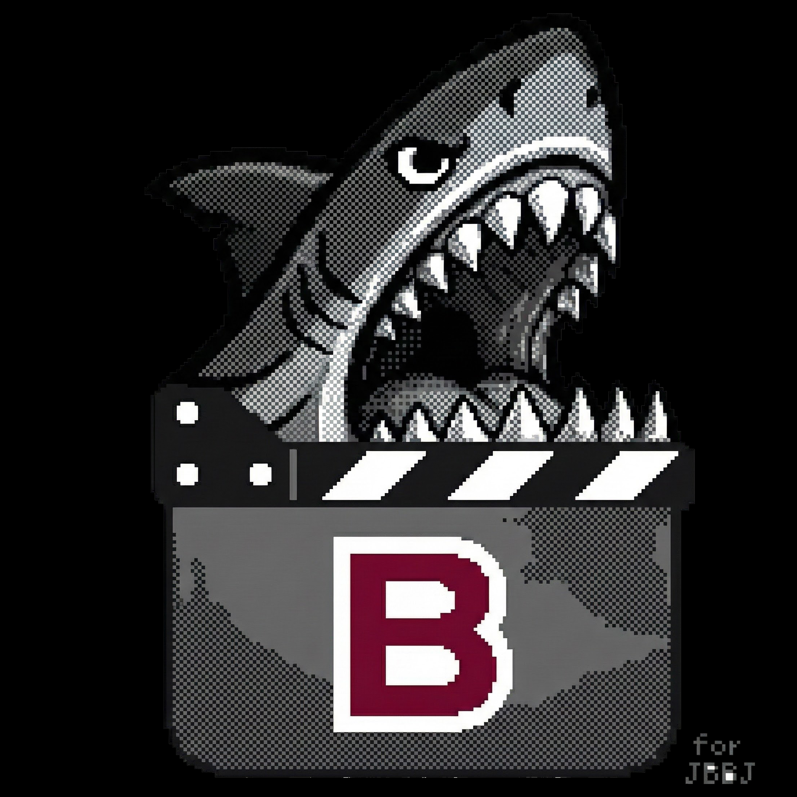
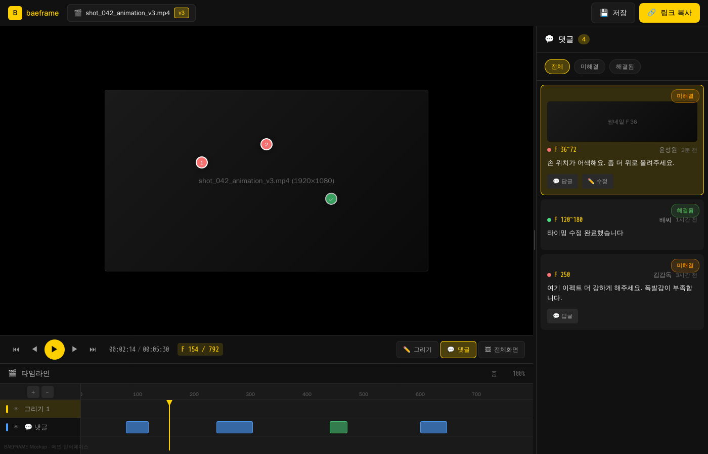
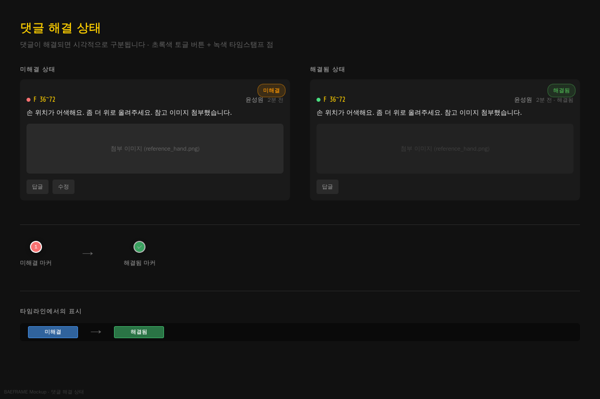
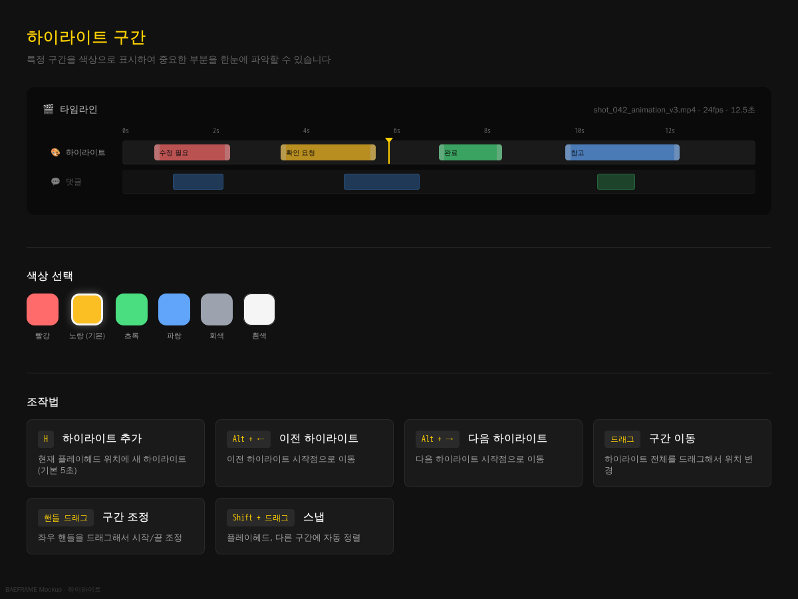

<div align="center">



# BAEFRAME

**애니메이션 스튜디오를 위한 비디오 리뷰 & 피드백 도구**

*프레임 단위로 정확하게. 그림으로 직관적으로. 링크 하나로 간편하게.*

[](https://github.com/baehandoridori/BAEFRAME)
[](https://www.electronjs.org/)
[](https://github.com/baehandoridori/BAEFRAME)
[](LICENSE)

[](https://github.com/baehandoridori/BAEFRAME/commits)
[](https://github.com/baehandoridori/BAEFRAME/pulls?q=is%3Amerged)
[](docs/modules.md)
[](docs/)

[**Web Viewer**](https://baeframe.vercel.app) &nbsp;&middot;&nbsp; [**Documentation**](docs/) &nbsp;&middot;&nbsp; [**Wiki**](https://github.com/baehandoridori/BAEFRAME/wiki) &nbsp;&middot;&nbsp; [**Issues**](https://github.com/baehandoridori/BAEFRAME/issues)

</div>

---

<div align="center">

<br/><br/>

> **BF** = **B**ae**F**rame = **B**est **F**riend — 작업자들의 베스트 프렌드
</div>

---

## 왜 BAEFRAME인가

### 우리 팀에 최적화된 인하우스 워크플로우 도구

BAEFRAME은 [스튜디오 장삐쭈](https://www.youtube.com/@Jangbbijju)에서 실제 제작 파이프라인에 맞춰 자체 개발한 영상 리뷰 도구입니다. 범용 SaaS 제품이 아닌, **팀의 실제 워크플로우를 관찰하고 그 고통을 직접 해결한 도구**입니다.

<table>
<tr>
<th width="50%">기존 워크플로우의 문제</th>
<th width="50%">BAEFRAME의 해결</th>
</tr>
<tr>
<td>

- 슬랙 스레드에 타임코드를 텍스트로 기록
- 스크린샷 → 그림판에서 표시 → 다시 붙여넣기
- 피드백 위치가 불명확해 자리까지 가서 직접 설명
- 버전별 스레드가 뒤섞여 피드백 추적 불가
- 재택 환경에서 피드백 전달이 특히 비효율적

</td>
<td>

- **프레임에서 바로** 댓글 + 그리기 → 링크 공유
- 영상 위에 직접 스케치하며 피드백
- Slack 링크 클릭 한 번으로 정확한 프레임 이동
- `.bframe` 파일 하나에 모든 리뷰 데이터 통합
- 실시간 협업으로 원격에서도 동시 리뷰

</td>
</tr>
</table>

### 왜 SaaS가 아닌 자체 개발인가

| 비교 항목 | Frame.io / SyncSketch | BAEFRAME |
|-----------|:---------------------:|:--------:|
| **비용** | 월 $15~49 × 인원수 | 무료 (자체 개발) |
| **커스터마이징** | 불가 | 팀 요청 즉시 반영 |
| **대용량 파일** | 업로드 필수 (수 분~수십 분) | 로컬에서 즉시 재생 |
| **오프라인** | 사용 불가 | 완전 지원 |
| **Slack 연동** | 제한적 웹훅 | 딥링크 원클릭 실행 |
| **워크플로우 적합도** | 범용 (타협 필요) | **우리 팀에 100% 맞춤** |

> Frame.io의 리뷰 시스템 + SyncSketch의 프레임 스케치 + Monday.com의 버전 관리를 하나의 도구에 통합했습니다.

### 인하우스 도구의 대체 불가능한 가치

```
팀의 피드백  →  즉시 기능 반영  →  워크플로우 개선  →  더 나은 피드백  →  ...
```

외부 SaaS에서는 불가능한, **팀 고유 워크플로우에 맞춘 지속적 최적화**가 가능합니다.
실제로 PR #97(첫 공식 사용 이슈)에서 보고된 13건의 현장 피드백이 당일 핫픽스로 반영되었습니다.

---

## 프로젝트 스케일

<div align="center">

| 항목 | 수치 |
|:----:|:----:|
| **버전** | v1.1.0-beta |
| **개발 기간** | 2024.12 ~ 현재 |
| **총 커밋** | 680+ |
| **총 PR** | 102+ (merged) |
| **코드 모듈** | 21개 renderer 모듈 |
| **개발 문서** | 7개 (2,500+ lines) |
| **실사용** | 스튜디오 장삐쭈 15~20명 |

</div>

> 애니메이터가 AutoHotkey 자동화 스크립트를 만들다 시작한 프로젝트가,
> 풀스택 데스크탑 앱 + 웹 뷰어 + 실시간 협업 시스템으로 성장했습니다.

---

## 주요 기능

### 핵심 기능 한눈에

<div align="center">

| 기능 | 설명 |
|:-----|:-----|
| **프레임 단위 리뷰** | mpv 기반 정밀 재생. 1프레임 단위 탐색, 구간 반복(I/O/L) |
| **댓글 마커** | 프레임 위 원하는 위치에 마커 배치. 이미지 첨부, 스레드 답글, 해결 표시 |
| **화면 위 스케치** | Canvas API 기반 드로잉. 펜, 화살표, 사각형, 원. 다중 레이어 + 어니언 스킨 |
| **실시간 협업** | Liveblocks Broadcast 기반. 댓글/그리기 즉시 동기화, 커서 공유, 편집 잠금 |
| **버전 비교** | 스플릿 뷰(Side-by-side, Overlay, Wipe). 동기화 재생으로 프레임 단위 비교 |
| **자동 버전 감지** | 폴더 내 `_v1`, `_v2`, `_re`, `_final` 자동 인식. 드롭다운으로 즉시 전환 |
| **코덱 자동 변환** | FFmpeg 기반 트랜스코딩. MPEG-4/PNG MOV → H.264 자동 변환 + 캐시(10GB) |
| **링크 공유** | `baeframe://` 프로토콜. Slack에서 클릭 한 번으로 앱 실행 + 파일 로드 |
| **웹 뷰어** | 앱 설치 없이 브라우저에서 리뷰. 모바일 지원. Google Drive API 연동 |
| **Windows 통합** | 영상 파일 우클릭 → "BAEFRAME로 열기". MSIX 기반 1차 메뉴 등록 |
| **재생목록** | 여러 영상을 묶어 관리. 최대 50개, 드래그 정렬, 연속 재생 |
| **하이라이트** | 타임라인 구간을 색상으로 마킹. "여기 수정", "여기 확인" 시각적 표현 |

</div>

---

### 서버리스 아키텍처 — Google Drive가 곧 서버

별도의 백엔드 서버, 데이터베이스, 인프라 비용이 없습니다.

```
팀원 A ──┐                    ┌── .bframe (리뷰 데이터)
팀원 B ──┼── Google Drive ────┤
팀원 C ──┘                    └── .mp4 (영상 파일)
```

- `.bframe` 파일이 Google Drive에 있으면 팀원 간 자동 동기화
- 서버 비용 **$0** — Google Workspace 요금만으로 충분
- 오프라인에서도 로컬 파일로 작업 가능

### 커스텀 프로토콜 — Slack에서 원클릭 실행

```
Slack 메시지:  "EP01_shot_015_v2 피드백 요청"
              baeframe://G:/프로젝트/EP01/shot_015_v2.mp4
                   ↓ 클릭
              앱 자동 실행 → 해당 영상 + 리뷰 데이터 로드
```

Windows 레지스트리에 자동 등록되어 추가 설정 없이 동작합니다.

### 자동 저장 — 모든 변경 즉시 반영

댓글 작성, 그리기 완료, 마커 이동, 하이라이트 추가 — 모든 변경사항이 500ms debounce로 자동 저장됩니다. 저장 버튼을 누를 필요가 없습니다.

---

## 스크린샷

<div align="center">



*댓글 마커 시스템 — 미해결(주황) vs 해결됨(초록) 상태가 타임라인에 시각적으로 표시됩니다*

<br/>



*하이라이트 — 타임라인 구간을 색상별로 표시하고 드래그로 범위 조정*

</div>

---

## 기술 스택

<div align="center">

| 분류 | 기술 | 역할 |
|:----:|:----:|:-----|
| **프레임워크** | Electron 28 | 데스크탑 앱 |
| **비디오 엔진** | mpv | 고정밀 프레임 재생 |
| **드로잉** | Canvas API | 벡터 그래픽 오버레이 |
| **실시간 협업** | Liveblocks 2.0 | Broadcast 기반 동기화 |
| **코덱 변환** | FFmpeg | 자동 트랜스코딩 |
| **캐시 DB** | sql.js (SQLite WASM) | 썸네일 캐시 |
| **번들러** | esbuild | Liveblocks 클라이언트 번들링 |
| **웹 뷰어** | HTML5 + Google Drive API | 서버리스 웹 리뷰어 |

</div>

---

## 시작하기

### 요구사항

- Windows 10/11
- Node.js 18+
- Git

### 설치 및 실행

```bash
git clone https://github.com/baehandoridori/BAEFRAME.git
cd BAEFRAME
npm install
npm start
```

### 개발 모드

```bash
npm run dev  # DevTools 자동 열림
```

### 빌드

```bash
npm run build:installer  # Windows 설치 파일 생성
```

### Windows 11 우클릭 통합

영상 파일 우클릭으로 BAEFRAME을 바로 열 수 있습니다.

```powershell
.\integration\installer\BAEFRAME-Integration-Setup.cmd
```

> 상세 설치 옵션, 팀 배포, 트러블슈팅은 [docs/integration.md](docs/integration.md) 참조

---

## 단축키

<details>
<summary><b>재생 제어</b></summary>

| 키 | 기능 |
|:--:|------|
| `Space` | 재생/일시정지 |
| `←` `→` | 1프레임 이동 |
| `Shift+←` `→` | 10프레임 이동 |
| `Home` / `End` | 처음/끝으로 |
| `I` / `O` / `L` | 시작점/종료점/구간 반복 |

</details>

<details>
<summary><b>댓글 & 그리기</b></summary>

| 키 | 기능 |
|:--:|------|
| `C` | 댓글 모드 토글 |
| `D` | 그리기 모드 토글 |
| `1` | 어니언 스킨 토글 |
| `F6` / `F7` | 키프레임 추가 (복사/빈) |
| `Shift+3` | 키프레임 삭제 |
| `Ctrl+Z` / `Ctrl+Y` | 실행 취소 / 다시 실행 |
| `H` | 하이라이트 추가 |

</details>

<details>
<summary><b>뷰 & 파일</b></summary>

| 키 | 기능 |
|:--:|------|
| `Ctrl+휠` | 타임라인 줌 |
| `Shift+휠` | 가로 스크롤 |
| `\` | 전체 보기 |
| `F` | 전체화면 |
| `Ctrl+O` | 파일 열기 |
| `Ctrl+S` | 저장 |
| `Ctrl+Shift+C` | 링크 복사 |
| `Shift+?` | 단축키 도움말 |

</details>

---

## .bframe 파일 포맷

모든 리뷰 데이터는 영상 옆에 `.bframe` JSON 파일로 저장됩니다.

```json
{
  "bframeVersion": "2.0",
  "videoFile": "shot_001.mp4",
  "fps": 24,
  "comments": { "layers": [{ "markers": ["..."] }] },
  "drawings": { "layers": [{ "keyframes": ["..."] }] },
  "highlights": [{ "startFrame": 48, "endFrame": 120, "color": "#ffa502" }]
}
```

> 전체 스키마 명세는 [docs/bframe-schema.md](docs/bframe-schema.md) 참조

---

## 향후 계획

| 우선순위 | 항목 | 설명 |
|:--------:|------|------|
| 높음 | 영상 렌더링 | 댓글/그리기 포함된 영상 내보내기 (해상도/토글 옵션) |
| 높음 | 성능 최적화 | 대용량 영상/다수 댓글 처리, 이벤트 리스너 정리 |
| 중간 | 웹 뷰어 고도화 | 키프레임 보기/추가, 실시간 협업 |
| 중간 | 보안 강화 | IPC 경로 검증, web-viewer XSS 수정 |

> 전체 로드맵은 [docs/roadmap.md](docs/roadmap.md) 참조

---

## 개발 문서

| 문서 | 설명 |
|------|------|
| [시스템 아키텍처](docs/architecture.md) | 프로세스 구조, IPC 통신, 데이터 흐름 |
| [.bframe 스키마](docs/bframe-schema.md) | 파일 포맷 명세, ER 다이어그램, 마이그레이션 |
| [모듈 가이드](docs/modules.md) | 21개 renderer 모듈 역할 및 의존 관계 |
| [개발 로드맵](docs/roadmap.md) | 마일스톤, 알려진 이슈, 향후 계획 |
| [웹 뷰어](docs/web-viewer.md) | 웹 버전 아키텍처, Vercel 배포 |
| [실시간 협업](docs/collaboration.md) | Liveblocks Broadcast 기반 동기화 |
| [Windows 통합](docs/integration.md) | 우클릭 메뉴 설치/진단/팀배포 |

---

## 만든 사람

<table>
<tr>
<td align="center" width="150">
<br />
<b>배한솔</b><br />
<sub>애니메이터 & 개발자</sub><br />
<sub>스튜디오 장삐쭈</sub>
</td>
</tr>
</table>

> 애니메이터로 일하면서 AutoHotkey로 팀 자동화 스크립트를 만들다,
> "이걸 앱으로 만들면 팀 전체가 편해지겠다"는 생각에서 시작했습니다.
> Claude Code AI와 함께 개발하고 있습니다.

---

<div align="center">

**BAEFRAME** — 작업자들의 베스트 프렌드

[Web Viewer](https://baeframe.vercel.app) &nbsp;&middot;&nbsp; [GitHub](https://github.com/baehandoridori/BAEFRAME) &nbsp;&middot;&nbsp; [Wiki](https://github.com/baehandoridori/BAEFRAME/wiki)

</div>
