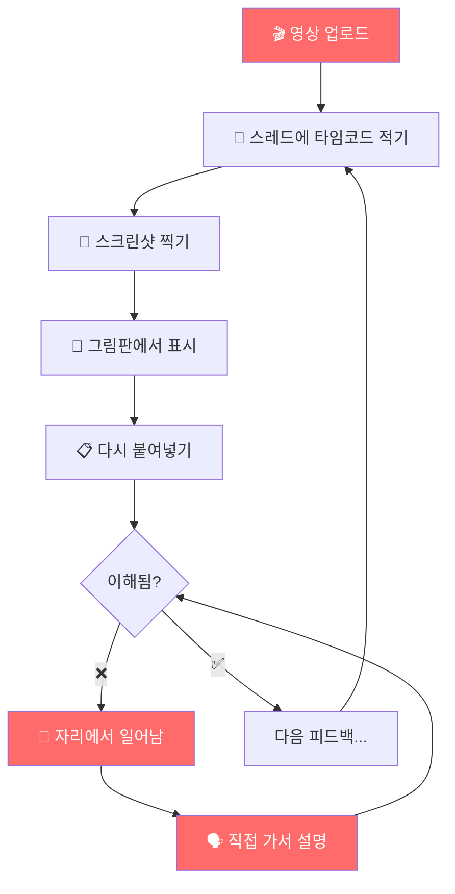
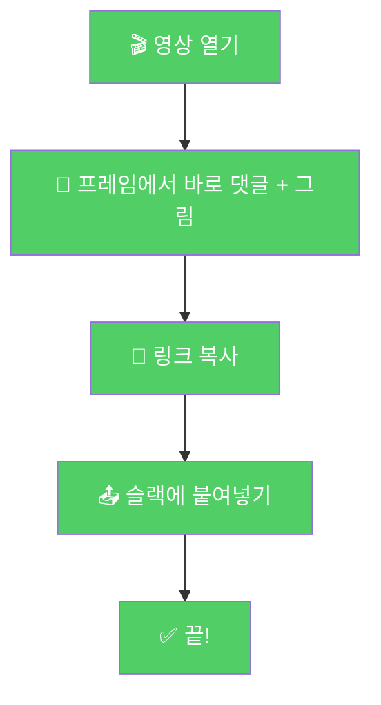
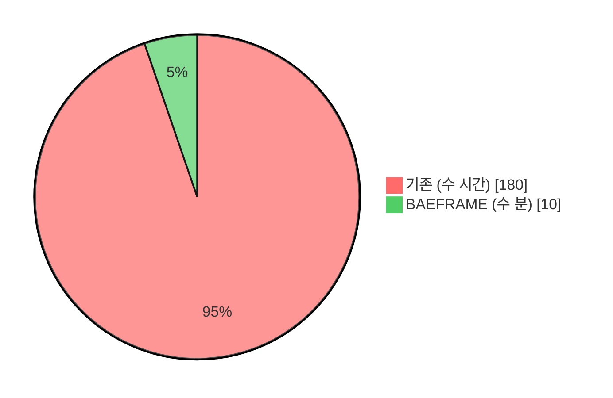
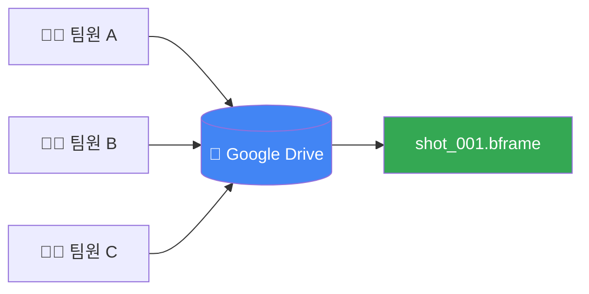
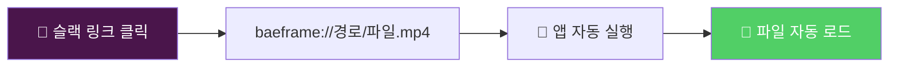

<div align="center">


# BAEFRAME

**애니메이션 스튜디오를 위한 비디오 리뷰 & 피드백 도구**

*프레임 단위로 정확하게. 그림으로 직관적으로. 링크 하나로 간편하게.*

[](https://github.com/baehandoridori/BAEFRAME)
[](https://www.electronjs.org/)
[](https://github.com/baehandoridori/BAEFRAME)
[](https://github.com/baehandoridori/BAEFRAME)
[](https://github.com/baehandoridori/BAEFRAME/commits)
[](https://github.com/baehandoridori/BAEFRAME/pulls?q=is%3Amerged)

[**웹 뷰어**](https://baeframe.vercel.app) · [**개발 문서**](docs/) · [**Wiki**](https://github.com/baehandoridori/BAEFRAME/wiki) · [**Issues**](https://github.com/baehandoridori/BAEFRAME/issues)

</div>

---

<div align="center">


*메인 인터페이스: 비디오 뷰어 + 타임라인 + 댓글 패널*
</div>

---

## 🎬 이게 뭔데?

**BAEFRAME**은 [스튜디오 장삐쭈](https://www.youtube.com/@Jangbbijju) 팀 내부에서 사용하는 영상 리뷰 도구입니다.

> **BF** = **B**ae**F**rame = **B**est **F**riend
> 작업자들의 베스트 프렌드가 되고 싶은 마음으로 만들었습니다.

[Monday.com](https://monday.com)의 버전 관리 + [SyncSketch](https://syncsketch.com)의 프레임 스케치 + [Frame.io](https://frame.io)의 리뷰 시스템을 합쳐서,
**"씨바 까짓거 그냥 내가 만들고만다"** 라는 마음으로 3주 만에 뚝딱 만들었습니다.

---

## 🤯 왜 만들었냐면

<table>
<tr>
<td width="50%" valign="top">

### 😵 기존의 고통


```mermaid
flowchart TD
    A[🎬 영상 업로드] --> B[💬 스레드에 타임코드 적기]
    B --> C[📸 스크린샷 찍기]
    C --> D[🎨 그림판에서 표시]
    D --> E[📋 다시 붙여넣기]
    E --> F{이해됨?}
    F -->|❌| G[🚶 자리에서 일어남]
    G --> H[🗣️ 직접 가서 설명]
    H --> F
    F -->|✅| I[다음 피드백...]
    I --> B

    style A fill:#ff6b6b,color:#fff
    style G fill:#ff6b6b,color:#fff
    style H fill:#ff6b6b,color:#fff
```

**슬랙 스레드 지옥** 🔥
- 영상1_v1 스레드 → 피드백 50개 (섞여있음)
- 영상1_v2 스레드 → 피드백 30개 (또 섞여있음)
- 어제 올린 영상 스레드 → 어딨더라...?

</td>
<td width="50%" valign="top">

### ✨ 이제는


```mermaid
flowchart TD
    A[🎬 영상 열기] --> B[💬 프레임에서 바로 댓글 + 그림]
    B --> C[🔗 링크 복사]
    C --> D[📤 슬랙에 붙여넣기]
    D --> E[✅ 끝!]

    style A fill:#51cf66,color:#fff
    style B fill:#51cf66,color:#fff
    style C fill:#51cf66,color:#fff
    style D fill:#51cf66,color:#fff
    style E fill:#51cf66,color:#fff
```

**단일 `.bframe` 파일** 📄
- ✅ 댓글 + 답글
- ✅ 그리기 레이어
- ✅ 하이라이트 구간
- ✅ Google Drive 자동 동기화

</td>
</tr>
</table>

<div align="center">

### ⏱️ 리뷰 왕복 시간


```mermaid
%%{init: {'theme': 'base', 'themeVariables': { 'pie1': '#ff6b6b', 'pie2': '#51cf66'}}}%%
pie showData
    "기존 (수 시간)" : 180
    "BAEFRAME (수 분)" : 10
```

| | 기존 방식 | BAEFRAME |
|:--:|:--:|:--:|
| **시간** | 😵 수 시간 | ✨ 수 분 |
| **앱 전환** | 슬랙 ↔ 그림판 ↔ 캡처도구 | 하나로 끝 |
| **자리 이탈** | 설명하러 직접 이동 | 링크 하나로 공유 |
| **피드백 찾기** | 스레드 뒤지기 | 타임라인에서 한눈에 |

</div>

---

## ✨ 주요 기능

<!-- 기능 한눈에 보기 -->
<div align="center">

| 🎬 재생 | 💬 댓글 | ✏️ 그리기 | 🎨 하이라이트 |
|:--:|:--:|:--:|:--:|
| 프레임 단위 탐색 | 마커로 피드백 | 영상 위에 직접 그리기 | 구간 색상 표시 |
| 구간 반복 (I/O/L) | 이미지 첨부 | 어니언 스킨 | 드래그로 조정 |
| mpv 기반 정밀 제어 | 스레드 답글 | 다중 레이어 | Shift로 스냅 |

| 📊 타임라인 | 🔀 스플릿 뷰 | 📁 버전 관리 | 🔗 공유 |
|:--:|:--:|:--:|:--:|
| 줌/스크롤 | 두 영상 비교 | 자동 버전 감지 | 링크 복사 → 슬랙 |
| 마커/키프레임 표시 | 동기화 재생 | 드롭다운 전환 | 웹 뷰어 지원 |
| 플레이헤드 드래그 | 오버레이 비교 (와이프) | _v1, _v2, _re... | baeframe:// 프로토콜 |

| 🎵 재생목록 | 🔄 실시간 협업 | 🎞️ 코덱 변환 | 🪟 Windows 통합 |
|:--:|:--:|:--:|:--:|
| 폴더/파일 관리 | Liveblocks 기반 | ffmpeg 자동 변환 | 우클릭 메뉴 통합 |
| 드래그 정렬 | 댓글/그리기 동기화 | 트랜스코딩 캐시 | MSIX 패키징 |
| 연속 재생 | 커서 위치 공유 | MOV/MPEG-4 지원 | 1차 메뉴 (sparse) |

</div>

---

<details>
<summary><b>🎬 재생 & 탐색</b> - 프레임 단위 정밀 제어</summary>

mpv 플레이어 기반으로 **정확한 프레임 단위** 탐색이 가능합니다.

| 키 | 동작 |
|:--:|------|
| `Space` | 재생/일시정지 |
| `←` `→` | 1프레임 이동 |
| `Shift+←` `→` | 10프레임 이동 |
| `Home` / `End` | 처음/끝으로 |
| `I` | 시작점(In) 설정 |
| `O` | 종료점(Out) 설정 |
| `L` | 구간 반복 토글 |

</details>

<details>
<summary><b>💬 댓글 & 마커</b> - 프레임에 피드백 남기기</summary>

영상 위 원하는 위치에 **댓글 마커**를 찍어 피드백을 남깁니다.

| 기능 | 설명 |
|------|------|
| **마커 찍기** | `C` 키 → 영상 클릭 → 댓글 입력 |
| **이미지 첨부** | 댓글에 스크린샷/이미지 붙여넣기 (Ctrl+V) |
| **마커 이동** | 드래그해서 위치 변경 |
| **구간 조정** | 마커 양 끝을 드래그 (시작/끝 프레임) |
| **스냅** | `Shift` + 드래그 → 재생바/시작점/끝점/하이라이트에 스냅 |
| **답글 달기** | 마커 더블클릭 → 스레드 팝업 |
| **완료 표시** | 체크 버튼 → 초록색 + 취소선 |
| **네비게이션** | `Shift+←/→` 이전/다음 댓글로 이동 |

<div align="center">


*미해결(주황) vs 해결됨(초록) 상태 비교*
</div>

</details>

<details>
<summary><b>✏️ 그리기 도구</b> - 영상 위에 직접 스케치</summary>

프레임 위에 직접 그려서 피드백합니다. **"여기 이렇게 해주세요"**를 그림으로!

**도구**: 🖊️ 펜 · ➡️ 화살표 · 🧹 지우개

**설정**: 색상 6가지 · 굵기 1~50px · 불투명도 0~100%

| 기능 | 단축키 |
|------|:------:|
| 그리기 모드 | `D` |
| 어니언 스킨 | `1` |
| 키프레임 추가 | `F7` (빈) / `F6` (복사) |
| 키프레임 삭제 | `Shift+3` |
| 키프레임 이동 | `A` / `D` |
| 실행취소/다시 | `Ctrl+Z` / `Ctrl+Y` |

**어니언 스킨**: 이전 2프레임 + 다음 1프레임 반투명 표시

</details>

<details>
<summary><b>🎨 하이라이트</b> - 구간 색상 표시</summary>

특정 구간을 색상으로 표시합니다. "여기 중요!", "여기 수정 필요"

| 키 | 동작 |
|:--:|------|
| `H` | 현재 위치에 하이라이트 추가 |
| `Alt+←` | 이전 하이라이트로 이동 |
| `Alt+→` | 다음 하이라이트로 이동 |

- 6가지 색상 (빨강/노랑/초록/파랑/회색/흰색)
- 드래그로 구간 조정
- `Shift` + 드래그로 스냅

<div align="center">


*타임라인에서 색상별 구간 표시 + 드래그로 조정*
</div>

</details>

<details>
<summary><b>📊 타임라인 & 기타</b></summary>

**타임라인**
| 기능 | 조작 |
|------|------|
| 줌 | `Ctrl+휠` 또는 슬라이더 |
| 가로 스크롤 | `Shift+휠` |
| 전체 보기 | `\` 키 |

**스플릿 뷰**: 두 영상 나란히 비교, 동기화 재생, 오버레이 비교 (와이프/불투명도)

**버전 관리**: 같은 폴더의 `_v1`, `_v2`, `_re` 등 자동 감지 → 드롭다운 전환

**재생목록**: 폴더/파일 관리, 드래그 정렬, 연속 재생

**실시간 협업**: Liveblocks 기반 댓글/그리기 실시간 동기화 ([상세](docs/collaboration.md))

**코덱 자동 변환**: ffmpeg 기반 MOV/MPEG-4 자동 트랜스코딩 + 캐시

**사용자 테마**: 이름별 테마 색상 + 고유 아바타
| 사용자 | 테마 |
|--------|------|
| 윤성원 | 💙 파란색 |
| 허혜원/모몽가 | 💗 핑크 |
| 한솔 | ❤️ 빨간색 |
| 기본 | 💛 노란색 |

</details>

---

## 🛠️ 설치

### 요구사항

- Windows 10/11
- Node.js 18+
- Git

### 설치 방법

```bash
# 1. 저장소 클론
git clone https://github.com/baehandoridori/BAEFRAME.git
cd BAEFRAME

# 2. 의존성 설치
npm install

# 3. 실행
npm start
```

### 개발 모드

```bash
npm run dev  # DevTools 자동 열림
```

### 빌드

```bash
npm run build:installer  # Windows 설치 파일 생성
```

### Windows 11 우클릭 통합

영상 파일 우클릭으로 BAEFRAME을 바로 열 수 있습니다.

```powershell
.\integration\installer\BAEFRAME-Integration-Setup.cmd
```

> 상세 설치 옵션, 팀 배포, 트러블슈팅은 [docs/integration.md](docs/integration.md) 참조

---

## ⌨️ 단축키 총정리

<details>
<summary><b>📹 재생 제어</b></summary>

| 키 | 기능 |
|:--:|------|
| `Space` | 재생/일시정지 |
| `←` `→` | 1프레임 이동 |
| `Shift+←` `→` | 10프레임 이동 |
| `Home` | 처음으로 |
| `End` | 끝으로 |
| `I` | 시작점 설정 |
| `O` | 종료점 설정 |
| `L` | 구간 반복 토글 |

</details>

<details>
<summary><b>💬 댓글 & 마커</b></summary>

| 키 | 기능 |
|:--:|------|
| `C` | 댓글 모드 토글 |
| `Shift+←` | 이전 댓글로 이동 |
| `Shift+→` | 다음 댓글로 이동 |

</details>

<details>
<summary><b>✏️ 그리기</b></summary>

| 키 | 기능 |
|:--:|------|
| `D` | 그리기 모드 토글 |
| `1` | 어니언 스킨 토글 |
| `F6` | 키프레임 추가 (복사) |
| `F7` | 빈 키프레임 추가 |
| `Shift+3` | 키프레임 삭제 |
| `A` / `D` | 이전/다음 키프레임 |
| `Ctrl+Z` | 실행 취소 |
| `Ctrl+Y` | 다시 실행 |

</details>

<details>
<summary><b>🎨 하이라이트</b></summary>

| 키 | 기능 |
|:--:|------|
| `H` | 하이라이트 추가 |
| `Alt+←` | 이전 하이라이트 |
| `Alt+→` | 다음 하이라이트 |

</details>

<details>
<summary><b>📊 타임라인 & 뷰</b></summary>

| 키 | 기능 |
|:--:|------|
| `Ctrl+휠` | 타임라인 줌 |
| `Shift+휠` | 가로 스크롤 |
| `\` | 전체 보기 |
| `F` | 전체화면 |
| `Shift+?` | 단축키 도움말 |

</details>

<details>
<summary><b>💾 파일</b></summary>

| 키 | 기능 |
|:--:|------|
| `Ctrl+O` | 파일 열기 |
| `Ctrl+S` | 저장 |
| `Ctrl+Shift+C` | 링크 복사 |

</details>

---

## 🧠 초천재 미스터배의 개쩌는 잔머리들

### 💡 Google Drive = 서버

서버 구축? 그런 거 없음. **Google Drive가 서버**입니다.


```mermaid
flowchart LR
    A[👨‍💻 팀원 A] --> D[(📁 Google Drive)]
    B[👩‍💻 팀원 B] --> D
    C[👨‍🎨 팀원 C] --> D
    D --> E[shot_001.bframe]

    style D fill:#4285f4,color:#fff
    style E fill:#34a853,color:#fff
```

- `.bframe` 파일이 Google Drive 폴더에 있으면 **자동 동기화**
- 별도 로그인/서버 비용 **제로**
- 오프라인에서도 로컬 파일로 작업 가능

### 🔗 baeframe:// 프로토콜

슬랙에서 **링크 클릭 한 번**이면 앱이 열립니다.


```mermaid
flowchart LR
    A[🔗 슬랙 링크 클릭] --> B[baeframe://경로/파일.mp4]
    B --> C[🚀 앱 자동 실행]
    C --> D[📂 파일 자동 로드]

    style A fill:#4a154b,color:#fff
    style D fill:#51cf66,color:#fff
```

Windows 레지스트리에 자동 등록 → 설정 필요 없음

### 💾 자동 저장

저장 버튼? 그런 거 안 눌러도 됩니다.

- 댓글 작성 → **자동 저장**
- 그리기 완료 → **자동 저장**
- 마커 이동 → **자동 저장**
- 하이라이트 추가 → **자동 저장**

---

## 🗂️ .bframe 파일

모든 리뷰 데이터(댓글, 그리기, 하이라이트)는 영상 옆에 `.bframe` JSON 파일로 저장됩니다.

```javascript
{
  bframeVersion: "2.0",
  videoFile: "shot_001.mp4",
  fps: 24,
  comments: { layers: [{ markers: [...] }] },   // 댓글 + 답글
  drawings: { layers: [{ keyframes: [...] }] },  // 그리기 레이어
  highlights: [{ startFrame, endFrame, color }]  // 구간 색상 표시
}
```

> 전체 스키마 명세는 [docs/bframe-schema.md](docs/bframe-schema.md) 참조

---

## 🚀 향후 계획

- [ ] 📹 **영상 렌더링** - 댓글/그리기 포함된 영상 내보내기 (해상도/토글 옵션)
- [ ] ⚡ **성능 최적화** - 대용량 영상/많은 댓글 처리, Timeline.destroy() 리스너 정리
- [ ] 🌐 **웹 뷰어 고도화** - 간단한 그리기 도구, 키프레임 추가
- [ ] 🔒 **보안 강화** - IPC 경로 검증, web-viewer XSS 수정

> 전체 로드맵은 [docs/roadmap.md](docs/roadmap.md) 참조

---

## 📊 개발 현황

| 항목 | 수치 |
|------|------|
| 버전 | **v1.1.0-beta** |
| 개발 기간 | 2024.12.23 ~ (진행 중) |
| 커밋 수 | **680+** |
| PR 수 | **102+** |
| 개발자 | 배한솔 (+ Claude Code AI 협업) |

> 코딩 배우면서 만들었습니다.
> AHK로 자동화 스크립트 만들다가 "이거 앱으로 만들면 되겠는데?" 싶어서 시작.

---

## 👨‍💻 만든 사람

<table>
<tr>
<td align="center" width="150">
<br />
<b>배한솔</b><br />
<sub>애니메이터 & 개발자</sub><br />
<sub>스튜디오 장삐쭈</sub>
</td>
</tr>
</table>

---

## 📚 개발 문서

| 문서 | 설명 |
|------|------|
| [시스템 아키텍처](docs/architecture.md) | 프로세스 구조, IPC 통신, 데이터 흐름 |
| [.bframe 스키마](docs/bframe-schema.md) | 파일 포맷 명세, ER 다이어그램, 마이그레이션 |
| [모듈 가이드](docs/modules.md) | 21개 renderer 모듈 역할 및 의존 관계 |
| [개발 로드맵](docs/roadmap.md) | 마일스톤, 알려진 이슈, 향후 계획 |
| [웹 뷰어](docs/web-viewer.md) | 웹 버전 아키텍처, Vercel 배포 |
| [실시간 협업](docs/collaboration.md) | Liveblocks Broadcast 기반 동기화 |
| [Windows 통합](docs/integration.md) | 우클릭 메뉴 설치/진단/팀배포 |

---

## 🙏 감사합니다

**스튜디오 장삐쭈** 팀원들에게 감사드립니다.

> 훌륭한 팀은 훌륭한 도구를 사용해야 합니다.

---

<div align="center">

**BAEFRAME** - 작업자들의 베스트 프렌드 🎬

[웹 뷰어](https://baeframe.vercel.app) · [GitHub](https://github.com/baehandoridori/BAEFRAME)

</div>

