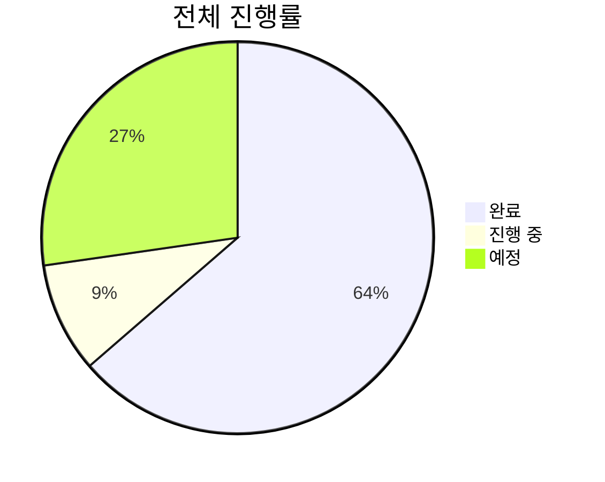

# BAEFRAME TODO

**개발 진행 상황 추적**

`Last Updated: 2024-12-30`

---

## 진행 상태 요약

| 상태 | 개수 | 비고 |
|:----:|:----:|------|
| `DONE` | 35 | 핵심 기능 완료 |
| `WIP` | 5 | 웹 뷰어, Undo/Redo |
| `TODO` | 15 | 버전 관리, 고급 기능 |

---

## 최근 완료 (2024-12-30)

| 기능 | 상세 |
|------|------|
| 입력 필드 먹통 수정 | pointerdown 방식으로 업계 표준 적용 |
| 특수 이름 볼드 표시 | 색상 이름별 스타일 적용 |
| 키프레임 드래그 프리뷰 | 투명도 0.5 클론 + 툴팁 |
| 프레임 삭제 버그 수정 | 키프레임 겹침 이슈 해결 |
| Shift+3 단축키 | 키프레임 삭제 단축키 추가 |
| 댓글 프레임 썸네일 | 토글 + 스케일 조절 |
| run-baeframe.bat 개선 | package.json 변경 감지, 자동 npm install, 캐시 정리 |

---

## 완료된 기능

<strong>Core Features</strong> - 핵심 기능

- [x] baeframe:// 프로토콜 등록 및 링크 공유
- [x] 영상 재생/일시정지/프레임 탐색
- [x] 그리기 레이어 (펜, 화살표, 지우개)
- [x] 댓글 시스템 (추가/수정/삭제/필터)
- [x] 타임라인 줌/스크롤/마커
- [x] 키프레임 레이어 시스템
- [x] 구간 반복 재생 (I/O/L)
- [x] 파일 열기/저장

<strong>UI/UX</strong> - 사용자 인터페이스

- [x] 이름별 UI 색상 테마 (윤성원→파랑, 혜원→핑크, 한솔→빨강)
- [x] 이름 설정 영구 저장 (localStorage)
- [x] 특정 이름 아바타 이미지 표시 (페더 효과)
- [x] B 버튼 크레딧 모달 (플렉서스 효과)
- [x] 마커 입력: Shift+Enter 줄바꿈, 자동 크기 조절
- [x] 리치 텍스트 에디터 (Ctrl+B 굵게, Ctrl+I 기울임)
- [x] 슬랙 스타일 스레드 팝업 (댓글 더블클릭)
- [x] 그리기 불투명도 옵션
- [x] 도구별 크기 저장 (지우개 기본 크기 증가)

<strong>Comments</strong> - 댓글 기능

- [x] 댓글 답글 (스레드) 기능
- [x] 우측 댓글 섹션 수정 기능
- [x] Slack 하이퍼링크 형식 적용
- [x] 스레드 팝업 키보드 단축키 차단
- [x] 스레드 답글 저장 버그 수정
- [x] 댓글에 프레임 썸네일 표시

<strong>Timeline</strong> - 타임라인

- [x] 줌 인/아웃 (Ctrl + 휠)
- [x] 가로/세로 스크롤
- [x] 댓글 마커 표시
- [x] 레이어 표시
- [x] 플레이헤드 드래그
- [x] 구간 반복 마커 표시
- [x] 확대 시 플레이헤드 드래그 감도 수정
- [x] 창 크기 변경 시 플레이헤드 위치 수정

<strong>Integration</strong> - 연동

- [x] Slack 이름에서 한글만 추출
- [x] 파일 열었을 때 다른 파일 열기 버튼
- [x] 현재 파일 경로 폴더 열기 버튼
- [x] 동영상 플레이어 최적화 (프레임 스킵 문제)

---

## 진행 예정

### Web Viewer 개발 `HIGH`

> 상세 계획: [BAEFRAME-WEB-VIEWER.md](./BAEFRAME-WEB-VIEWER.md)

**1단계: 웹 뷰어 (읽기 전용)**
- [ ] HTML5 비디오 플레이어 구현
- [ ] .bframe 파일 URL로 로드 및 파싱
- [ ] 댓글 목록 표시 (타임라인 마커 포함)
- [ ] 그리기 레이어 Canvas 렌더링
- [ ] 키프레임 애니메이션 재현
- [ ] 반응형 UI (모바일 대응)
- [ ] Vercel 배포

**2단계: Google Drive 연동**
- [ ] Google Sign-in 연동
- [ ] Google Drive API로 .bframe 읽기/쓰기
- [ ] 댓글 추가 기능
- [ ] 충돌 방지 로직 (병합)

**3단계: 고급 기능**
- [ ] 간단한 그리기 도구
- [ ] 키프레임 추가
- [ ] Slack Bot 연동

---

### 기능 추가 `MED`

| 기능 | 상세 | 우선순위 |
|------|------|:--------:|
| 댓글 이미지 삽입 | 댓글에 이미지 첨부 기능 | `MED` |
| 영상 내보내기 | 그리기 레이어 포함 내보내기 | `LOW` |
| 단축키 커스텀 | 사용자 지정 단축키 설정 | `LOW` |
| 웹 링크 복사 버튼 | Desktop에서 웹 뷰어 링크 생성 | `HIGH` |

---

### UI 개선 `MED`

- [ ] 레이어 패널 상하 높이 확장
- [ ] 댓글 섹션 리사이즈 버그 수정 (왼쪽 확장 시 느림)

---

### 버그 수정

> 현재 알려진 버그 없음

---

## 임시 비활성화

### 영상 어니언 스킨 `BLOCKED`

| 상태 | 문제 |
|------|------|
| 구현 완료 | 캔버스 오버레이가 비디오를 가리는 문제 |
| 시도 | z-index, visibility 조정 |
| 결과 | 해결 안 됨 |
| 필요 | 다른 렌더링 접근 방식 (WebGL, 합성 방식 변경) |

- [ ] 이전/이후 프레임 반투명 표시 기능

---

### 사용자 설정 `LOW`

- [ ] 앱 실행 시 이름 입력 자동 표시 수정

---

### 문서화 `LOW`

- [ ] README.md 작성
- [ ] 사용자 가이드 작성

---

## 개발 Phase 진행 상황

> 상세: [baeframe-dev-docs.md](./baeframe-dev-docs.md)

```mermaid
graph LR
    P0[Phase 0<br/>환경 설정] --> P1[Phase 1<br/>비디오 재생]
    P1 --> P2[Phase 2<br/>UI 레이아웃]
    P2 --> P3[Phase 3<br/>그리기]
    P3 --> P4[Phase 4<br/>댓글]
    P4 --> P5[Phase 5<br/>Undo/Redo]
    P5 --> P6[Phase 6<br/>타임라인]
    P6 --> P7[Phase 7<br/>버전 관리]
    P7 --> P8[Phase 8<br/>링크 공유]
    P8 --> P9[Phase 9<br/>사용자 설정]
    P9 --> P10[Phase 10<br/>마무리]

    style P0 fill:#4ade80,stroke:#333,color:#000
    style P1 fill:#4ade80,stroke:#333,color:#000
    style P2 fill:#4ade80,stroke:#333,color:#000
    style P3 fill:#4ade80,stroke:#333,color:#000
    style P4 fill:#4ade80,stroke:#333,color:#000
    style P5 fill:#fbbf24,stroke:#333,color:#000
    style P6 fill:#4ade80,stroke:#333,color:#000
    style P7 fill:#f87171,stroke:#333,color:#000
    style P8 fill:#fbbf24,stroke:#333,color:#000
    style P9 fill:#fbbf24,stroke:#333,color:#000
    style P10 fill:#f87171,stroke:#333,color:#000
```

| Phase | 상태 | 상세 |
|:-----:|:----:|------|
| 0 | `DONE` | 환경 설정 |
| 1 | `DONE` | 기본 비디오 재생 |
| 2 | `DONE` | UI 레이아웃 |
| 3 | `DONE` | 그리기 기능 |
| 4 | `DONE` | 댓글 시스템 |
| 5 | `WIP` | Undo/Redo |
| 6 | `DONE` | 타임라인 고급 기능 |
| 7 | `TODO` | 버전 관리 |
| 8 | `WIP` | 링크 공유 (일부 완료) |
| 9 | `WIP` | 사용자 설정 (일부 완료) |
| 10 | `TODO` | 마무리 & 테스트 |

---

### Phase 5: Undo/Redo `WIP`

- [ ] UndoManager 구현
- [ ] 그리기 Undo/Redo
- [ ] 댓글 Undo/Redo
- [ ] Ctrl+Z / Ctrl+Y 단축키

### Phase 7: 버전 관리 `TODO`

- [ ] 파일명에서 버전 파싱 (v1, V2, v03 등)
- [ ] 같은 이름의 버전 파일들 감지
- [ ] 버전 목록 UI
- [ ] 버전 전환

### Phase 10: 마무리 `TODO`

- [ ] 전체 기능 통합 테스트
- [ ] 에러 핸들링 보강
- [ ] 성능 최적화
- [ ] 배포 스크립트 (포터블)

---

## 단축키 목록

| 카테고리 | 단축키 | 기능 |
|----------|--------|------|
| **재생** | `Space` | 재생/일시정지 |
| | `← / →` | 1프레임 이동 |
| | `Shift + ← / →` | 10프레임 이동 |
| | `, / .` | 1프레임 이동 (대안) |
| **구간 반복** | `I` | 시작점 설정 |
| | `O` | 종료점 설정 |
| | `L` | 구간 반복 토글 |
| **레이어** | `1` | 레이어 추가 |
| | `2` | 레이어 삭제 |
| | `3` | 키프레임 추가 |
| | `Shift+3` | 키프레임 삭제 |
| | `4` | 프레임 삽입 |
| | `5` | 프레임 삭제 |
| **그리기** | `D` | 그리기 모드 토글 |
| | `Z` | 펜 도구 |
| | `X` | 지우개 도구 |
| **댓글** | `C` | 댓글 모드 토글 |
| | `Ctrl+B` | 텍스트 굵게 (편집 중) |
| | `Ctrl+I` | 텍스트 기울임 (편집 중) |
| **파일** | `Ctrl+O` | 파일 열기 |
| | `S / Ctrl+S` | 저장 |
| **타임라인** | `Ctrl+휠` | 줌 |
| | `Shift+휠` | 가로 스크롤 |

---

## 빌드 히스토리

| 버전 | 빌드 일시 | 비고 |
|:----:|:---------:|------|
| alpha_v1 | 2025-01-09 01:18 | 첫 테스트 빌드, 로그 경로 버그 발견 |
| alpha_v2 | 2025-01-09 (예정) | 프로세스 종료 + 공유 링크 파싱 수정 |

---

*마지막 업데이트: 2025-01-09*

