# BAEFRAME 개발 문서

<div align="center">

**Version** `1.0.0-dev` | **Last Updated** `2024-12` | **Platform** `Electron + mpv`

*애니메이션 스튜디오를 위한 프로페셔널 비디오 리뷰 솔루션*

</div>

---

## 목차

| # | 섹션 | 설명 |
|---|------|------|
| 1 | [프로젝트 개요](#1-프로젝트-개요) | 목적, 요구사항, 사용 시나리오 |
| 2 | [기술 스택](#2-기술-스택) | Electron, mpv, 핵심 기술 |
| 3 | [시스템 아키텍처](#3-시스템-아키텍처) | 폴더 구조, 모듈 설계 |
| 4 | [데이터 스키마](#4-데이터-스키마) | JSON 구조, 좌표계, 파일 포맷 |
| 5 | [기능 명세](#5-기능-명세) | 비디오, 그리기, 댓글, 타임라인 |
| 6 | [UI/UX 명세](#6-uiux-명세) | 레이아웃, 컬러, 단축키 |
| 7 | [디버그 시스템](#7-디버그--로깅-시스템) | 로거, 로그 패널, 가이드라인 |
| 8 | [에러 핸들링](#8-에러-핸들링-패턴) | Result 패턴, 에러 타입 |
| 9 | [개발 로드맵](#9-개발-로드맵) | Phase 0~10 상세 계획 |
| 10 | [배포](#10-배포-방식) | 포터블 배포, 프로토콜 등록 |

---

## 1. 프로젝트 개요

### 1.1 BAEFRAME이란?

**BAEFRAME**은 애니메이션 스튜디오 팀(15명)을 위한 **비디오 리뷰/피드백 전문 도구**입니다.

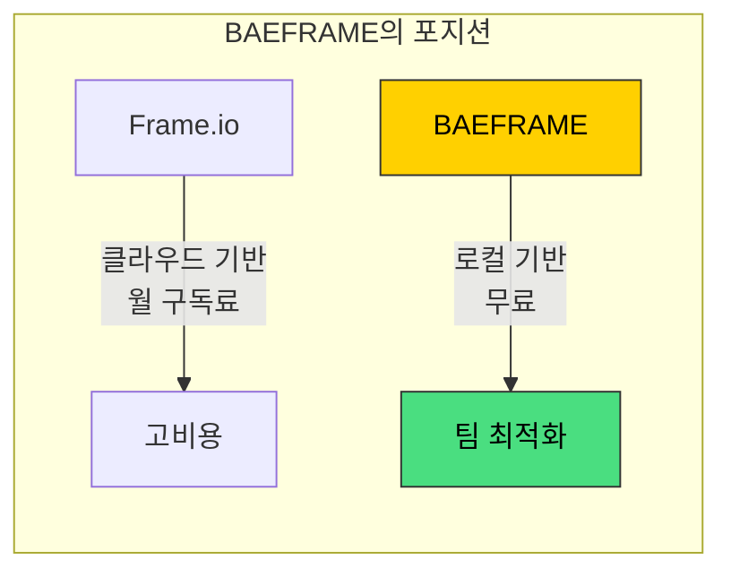

**핵심 가치:**
- **로컬 우선**: 서버 없이 Google Drive 공유 폴더만으로 운영
- **Slack 연동**: 팀의 기존 워크플로우와 자연스럽게 통합
- **프레임 정밀도**: 애니메이션 작업에 필수적인 프레임 단위 피드백

### 1.2 핵심 요구사항

| 구분 | 요구사항 | 상세 |
|:----:|----------|------|
| `PLAY` | 영상 재생 | MP4 H.264/265, MOV PNG 시퀀스 (1-2GB 파일 지원) |
| `SEEK` | 프레임 탐색 | ← → 키로 1프레임씩 정밀 이동 (24fps 기준) |
| `DRAW` | 마킹/그리기 | 화살표, 자유 드로잉을 영상 위에 오버레이 |
| `COMMENT` | 타임스탬프 댓글 | 특정 프레임에 피드백 작성 및 스레드 답글 |
| `SHARE` | 링크 공유 | `baeframe://경로` 프로토콜로 Slack에서 원클릭 오픈 |
| `VERSION` | 버전 관리 | `파일명_v1.mp4`, `파일명_v2.mp4` 자동 인식 및 비교 |

### 1.3 사용 시나리오

#### 시나리오 A: 피드백 요청 플로우

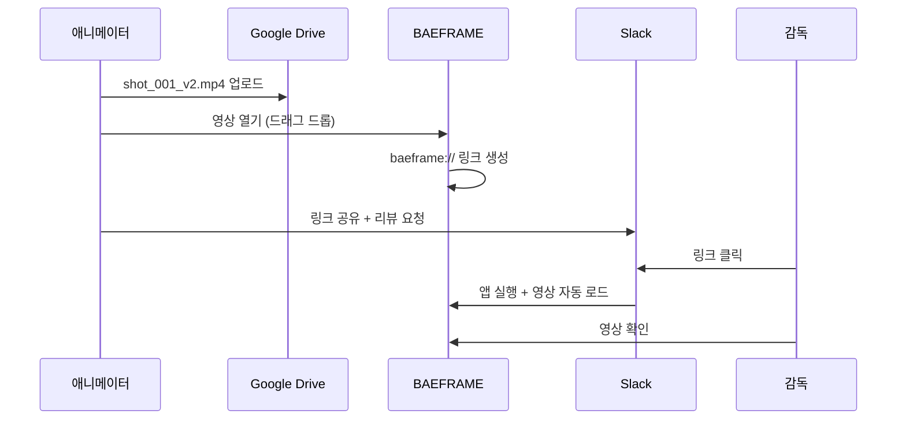

#### 시나리오 B: 피드백 작성 플로우

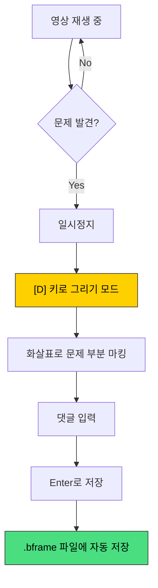

#### 시나리오 C: 피드백 확인 및 처리

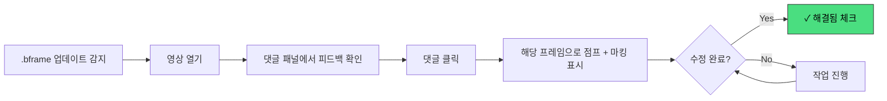

---

## 2. 기술 스택

### 2.1 핵심 기술 구성

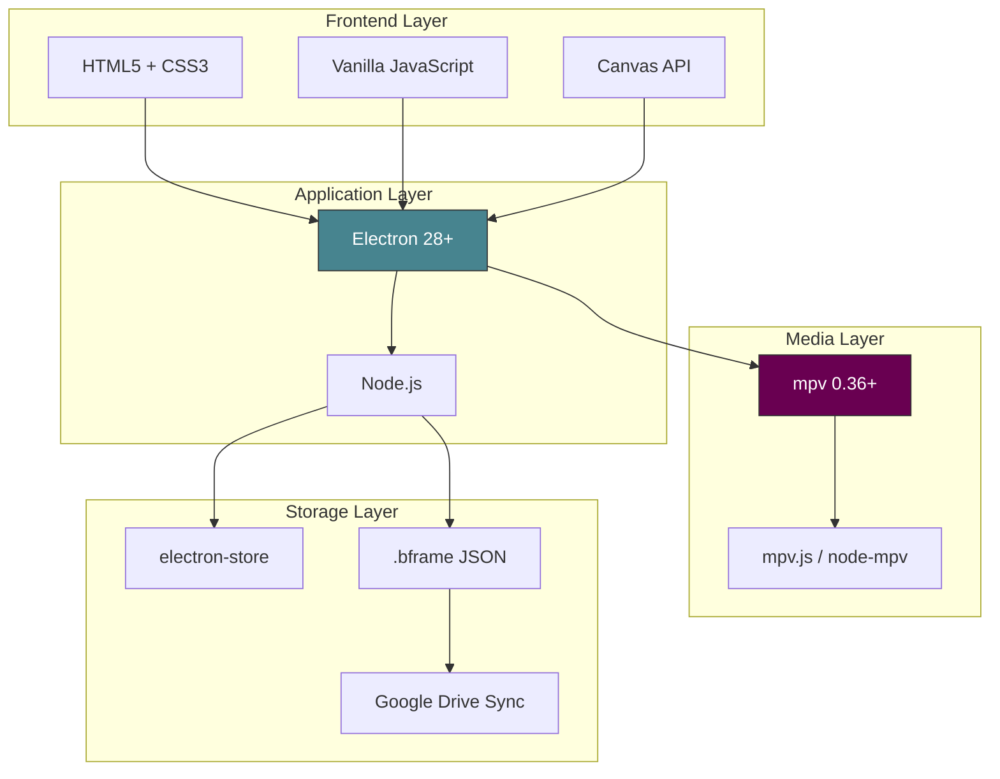

### 2.2 의존성 패키지

```json
{
  "dependencies": {
    "electron": "^28.0.0",
    "mpv.js": "^x.x.x",
    "electron-store": "^8.0.0"
  },
  "devDependencies": {
    "electron-builder": "^24.0.0",
    "electron-reload": "^2.0.0"
  }
}
```

### 2.3 mpv 연동 방식 비교

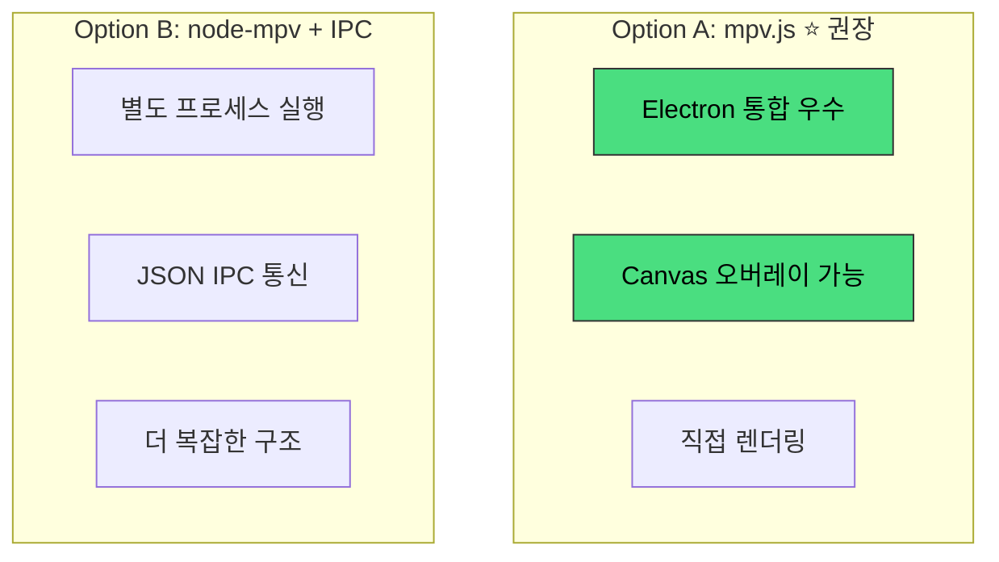

**검증 체크리스트:**
- [ ] mpv.js가 MOV PNG 시퀀스를 제대로 재생하는가?
- [ ] Canvas 오버레이가 영상 위에 정확히 겹쳐지는가?
- [ ] 프레임 단위 탐색 API가 정상 동작하는가?

---

## 3. 시스템 아키텍처

### 3.1 폴더 구조

```
baeframe/
├── package.json
├── electron-builder.yml
├── README.md
│
├── main/                      # ═══ Electron Main Process ═══
│   ├── index.js               # 앱 진입점
│   ├── window.js              # BrowserWindow 관리
│   ├── ipc-handlers.js        # IPC 핸들러 등록
│   ├── protocol.js            # baeframe:// 프로토콜 등록
│   ├── file-association.js    # .baef 파일 연결
│   └── logger.js              # 메인 프로세스 로거
│
├── preload/                   # ═══ Preload Scripts ═══
│   └── preload.js             # contextBridge API 노출
│
├── renderer/                  # ═══ Electron Renderer Process ═══
│   ├── index.html             # 메인 HTML
│   │
│   ├── styles/
│   │   ├── main.css           # 전역 스타일, CSS 변수
│   │   ├── header.css         # 헤더 영역
│   │   ├── viewer.css         # 비디오 뷰어
│   │   ├── timeline.css       # 타임라인
│   │   ├── comments.css       # 댓글 패널
│   │   └── shortcuts.css      # 단축키 도움말
│   │
│   ├── scripts/
│   │   ├── app.js             # 앱 초기화, 모듈 연결
│   │   ├── logger.js          # 렌더러 로거
│   │   │
│   │   ├── modules/           # ─── 기능 모듈 ───
│   │   │   ├── video-player.js      # mpv 제어
│   │   │   ├── drawing-canvas.js    # 그리기 레이어
│   │   │   ├── drawing-tools.js     # 펜, 화살표 도구
│   │   │   ├── timeline.js          # 타임라인 UI
│   │   │   ├── comments.js          # 댓글 패널
│   │   │   ├── version-manager.js   # 버전 감지/관리
│   │   │   ├── shortcuts.js         # 키보드 단축키
│   │   │   └── resizer.js           # 패널 리사이즈
│   │   │
│   │   ├── services/          # ─── 데이터/비즈니스 로직 ───
│   │   │   ├── review-data.js       # .bframe 읽기/쓰기
│   │   │   ├── user-settings.js     # 사용자 설정
│   │   │   ├── undo-manager.js      # Undo/Redo 스택
│   │   │   ├── link-generator.js    # baeframe:// 링크 생성
│   │   │   └── slack-integration.js # Slack API (추후)
│   │   │
│   │   └── utils/             # ─── 유틸리티 ───
│   │       ├── dom.js               # DOM 헬퍼
│   │       ├── time.js              # 타임코드 변환
│   │       ├── path.js              # 경로 처리
│   │       ├── vector-simplify.js   # 드로잉 포인트 단순화
│   │       └── debounce.js          # 디바운스/쓰로틀
│   │
│   └── assets/
│       ├── icons/
│       └── fonts/
│
├── shared/                    # ═══ Main/Renderer 공유 ═══
│   ├── constants.js           # 상수 정의
│   ├── ipc-channels.js        # IPC 채널명 상수
│   └── validators.js          # 데이터 검증
│
├── mpv/                       # ═══ mpv 바이너리 ═══
│   ├── win32/
│   │   └── mpv.exe
│   └── README.md              # mpv 설치 안내
│
└── logs/                      # ═══ 로그 파일 ═══
    └── .gitkeep
```

### 3.2 모듈 아키텍처

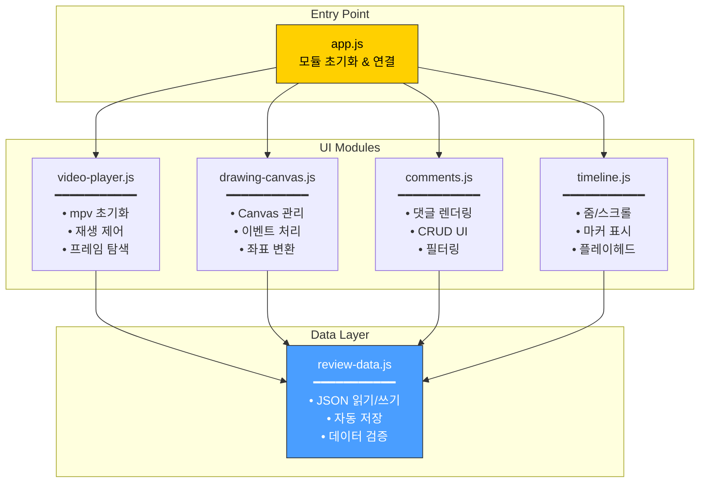

### 3.3 이벤트 기반 모듈 통신

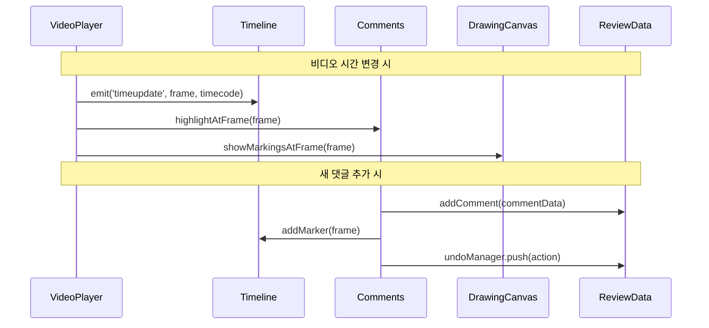

**코드 예시:**

```javascript
// 이벤트 기반 통신 (느슨한 결합)
videoPlayer.on('timeupdate', (frame, timecode) => {
  timeline.setCurrentFrame(frame);
  comments.highlightAtFrame(frame);
  drawingCanvas.showMarkingsAtFrame(frame);
});

comments.on('comment:add', (commentData) => {
  reviewData.addComment(commentData);
  timeline.addMarker(commentData.frame);
  undoManager.push({ type: 'ADD_COMMENT', data: commentData });
});
```

---

## 4. 데이터 스키마

### 4.1 .bframe 파일 구조 (v2.0)

> **스키마 버전**: 2.0 (2026-01-10 업데이트)
> **단일 소스**: `shared/schema.js`

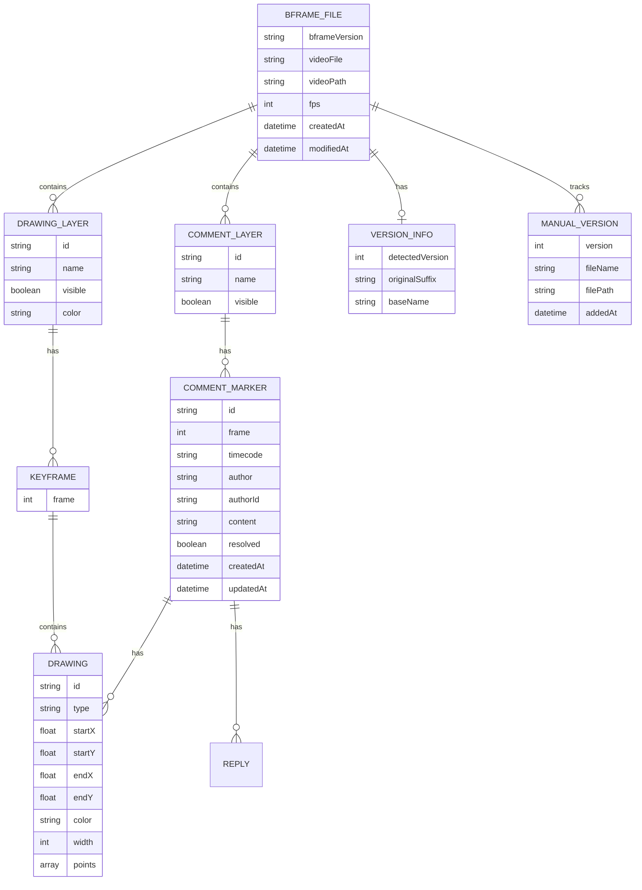

**전체 JSON 구조 (v2.0):**

```json
{
  "bframeVersion": "2.0",
  "videoFile": "EP01_shot_015_animation_v3.mp4",
  "videoPath": "G:/프로젝트/스튜디오장삐쭈야/EP01/EP01_shot_015_animation_v3.mp4",
  "fps": 24,
  "createdAt": "2024-12-20T10:30:00Z",
  "modifiedAt": "2024-12-20T15:45:00Z",

  "versionInfo": {
    "detectedVersion": 3,
    "originalSuffix": "_v3",
    "baseName": "EP01_shot_015_animation"
  },

  "manualVersions": [
    {
      "version": 1,
      "fileName": "EP01_shot_015_animation_v1.mp4",
      "filePath": "G:/프로젝트/스튜디오장삐쭈야/EP01/EP01_shot_015_animation_v1.mp4",
      "addedAt": "2024-12-18T09:00:00Z"
    }
  ],

  "comments": {
    "layers": [
      {
        "id": "layer_default",
        "name": "기본 레이어",
        "visible": true,
        "markers": [
          {
            "id": "c_1703067000_hong",
            "frame": 1008,
            "timecode": "00:00:42:00",
            "author": "홍길동",
            "authorId": "hong",
            "content": "캐릭터 손 위치가 조금 어색해 보여요.",
            "resolved": false,
            "createdAt": "2024-12-20T10:30:00Z",
            "updatedAt": "2024-12-20T10:30:00Z",
            "drawings": [
              {
                "id": "d_1703067000_1",
                "type": "arrow",
                "startX": 0.35,
                "startY": 0.45,
                "endX": 0.52,
                "endY": 0.38,
                "color": "#ff4757",
                "width": 3
              }
            ],
            "replies": []
          }
        ]
      }
    ]
  },

  "drawings": {
    "layers": [
      {
        "id": "drawing_layer_1",
        "name": "레이어 1",
        "visible": true,
        "color": "#ff4757",
        "keyframes": [
          {
            "frame": 120,
            "objects": [
              {
                "id": "d_1703067100_1",
                "type": "stroke",
                "points": [[0.12, 0.34], [0.15, 0.36], [0.18, 0.35]],
                "color": "#ffd000",
                "width": 2
              }
            ]
          }
        ]
      }
    ]
  },

  "highlights": [
    {
      "startFrame": 100,
      "endFrame": 200,
      "color": "#ffd000"
    }
  ]
}
```

### 4.1.1 마이그레이션

v1.0 → v2.0 자동 마이그레이션:

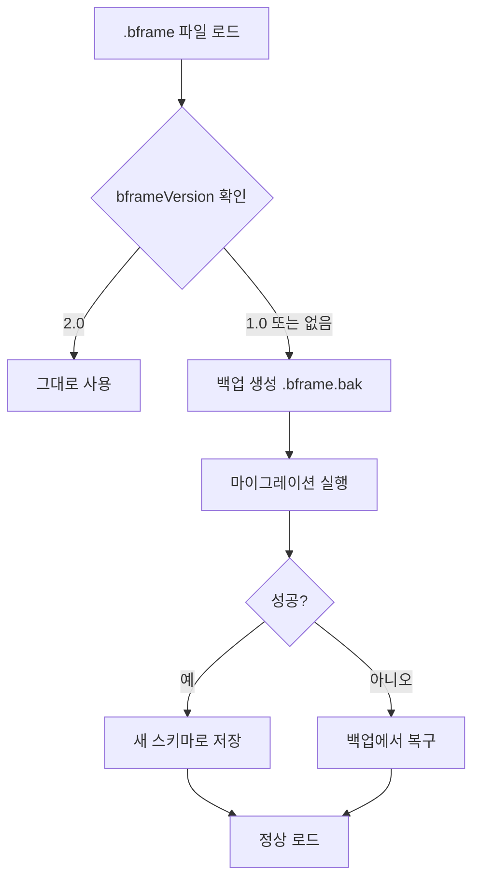

**변경 사항:**
- `version` → `bframeVersion`
- `comments: [...]` → `comments: { layers: [...] }`
- `versions: [...]` → `manualVersions: [...]` + `versionInfo`
- `updatedAt` → `modifiedAt`

### 4.2 좌표 시스템

그리기 좌표는 **0~1 사이의 정규화된 상대값**으로 저장하여 해상도에 독립적으로 동작합니다.

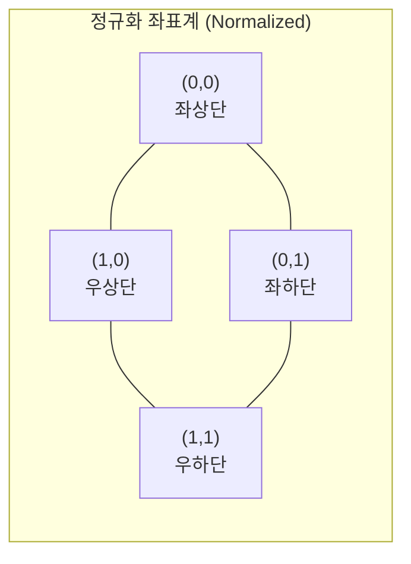

**좌표 변환 공식:**

| 방향 | 공식 | 용도 |
|------|------|------|
| 저장 시 | `x_normalized = x_pixel / canvas_width` | 픽셀 → 정규화 |
| 렌더 시 | `x_pixel = x_normalized * canvas_width` | 정규화 → 픽셀 |

### 4.3 포인트 단순화 (Ramer-Douglas-Peucker)

자유 드로잉 시 포인트 수를 줄여 파일 크기를 최적화합니다.

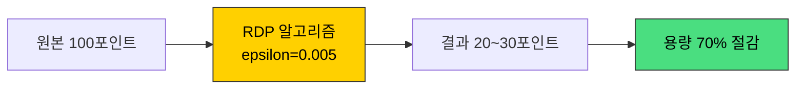

```javascript
/**
 * 드로잉 포인트를 단순화하여 용량 절감
 * @param {Array} points - [[x,y], [x,y], ...]
 * @param {number} epsilon - 허용 오차 (0.005 권장)
 * @returns {Array} 단순화된 포인트 배열
 */
function simplifyPoints(points, epsilon = 0.005) {
  // RDP 알고리즘 구현
}
```

### 4.4 .baef 파일 (바로가기)

```json
{
  "baeframe": "1.0.0",
  "videoPath": "G:/프로젝트/스튜디오장삐쭈야/EP01/EP01_shot_015_animation_v3.mp4"
}
```

### 4.5 사용자 설정 (electron-store)

저장 위치: `%APPDATA%/baeframe/config.json`

```json
{
  "user": {
    "name": "홍길동",
    "id": "hong"
  },
  "slack": {
    "connected": false,
    "userName": null
  },
  "ui": {
    "panelWidth": 320,
    "timelineHeight": 180,
    "theme": "dark"
  },
  "shortcuts": {}
}
```

---

## 5. 기능 명세

### 5.1 비디오 재생

| 기능 | 설명 | 단축키 | 우선순위 |
|------|------|:------:|:--------:|
| 영상 로드 | 드래그 드롭, 파일 열기, 프로토콜 | `Ctrl+O` | `HIGH` |
| 재생/일시정지 | 토글 재생 | `Space` | `HIGH` |
| 프레임 이동 | 1프레임씩 정밀 이동 | `← →` | `HIGH` |
| 초 단위 이동 | 24프레임(1초) 이동 | `Shift+← →` | `MED` |
| 처음/끝 이동 | 영상 시작/끝으로 점프 | `Home/End` | `MED` |
| 타임라인 탐색 | 클릭한 위치로 점프 | 클릭 | `HIGH` |
| 구간 반복 | In/Out 포인트 설정 및 루프 | `I/O/L` | `MED` |

### 5.2 그리기/마킹

| 기능 | 설명 | 단축키 | 우선순위 |
|------|------|:------:|:--------:|
| 화살표 | 드래그로 방향 표시 | - | `HIGH` |
| 자유 드로잉 | 펜처럼 자유롭게 | `Z` | `HIGH` |
| 지우개 | 그린 내용 삭제 | `X` | `HIGH` |
| 색상 선택 | 빨강/노랑/초록/파랑/흰색 | - | `HIGH` |
| 굵기 선택 | 1~5px | - | `MED` |
| 불투명도 | 투명도 조절 | - | `MED` |
| 실행 취소 | 마지막 작업 취소 | `Ctrl+Z` | `HIGH` |
| 다시 실행 | 취소 복원 | `Ctrl+Y` | `MED` |

### 5.3 댓글 시스템

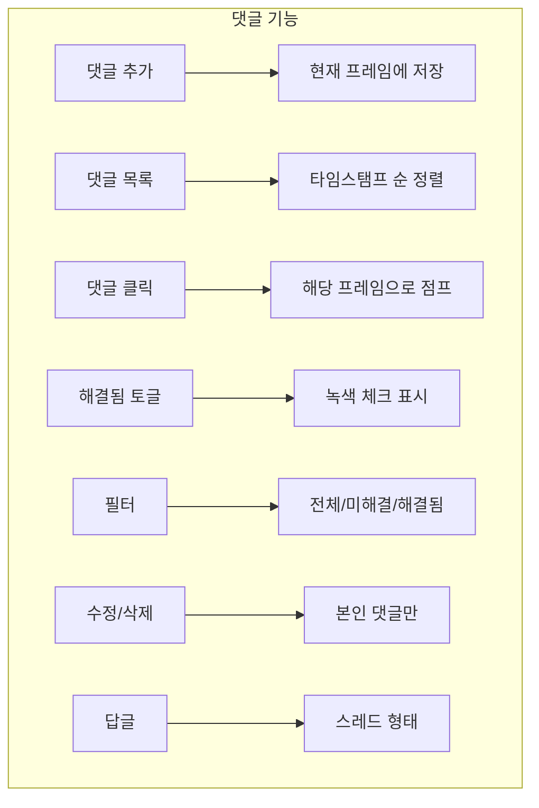

| 기능 | 설명 | 단축키 | 우선순위 |
|------|------|:------:|:--------:|
| 댓글 추가 | 현재 프레임에 댓글 | `C` | `HIGH` |
| 댓글 클릭 이동 | 해당 프레임으로 점프 | 클릭 | `HIGH` |
| 해결됨 토글 | 피드백 처리 완료 표시 | 체크박스 | `HIGH` |
| 필터링 | 전체/미해결/해결됨 | - | `MED` |
| 수정/삭제 | 본인 댓글만 가능 | - | `HIGH` |
| 답글 (스레드) | 댓글에 답글 달기 | 더블클릭 | `MED` |

### 5.4 타임라인

| 기능 | 설명 | 단축키 | 우선순위 |
|------|------|:------:|:--------:|
| 줌 인/아웃 | 타임라인 확대/축소 | `Ctrl+휠` | `HIGH` |
| 가로 스크롤 | 타임라인 이동 | `Shift+휠` | `HIGH` |
| 세로 스크롤 | 레이어 많을 때 | `휠` | `HIGH` |
| 댓글 마커 | 타임라인 위 마커 표시 | - | `HIGH` |
| 레이어 표시 | 키프레임 레이어 시각화 | - | `MED` |
| 플레이헤드 드래그 | 드래그로 위치 이동 | 드래그 | `MED` |
| 전체 보기 | 타임라인 전체 보기 | `\` | `MED` |

### 5.5 버전 관리

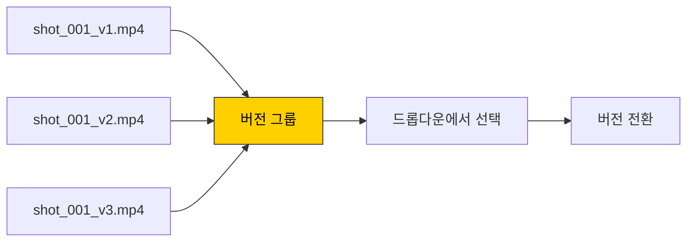

### 5.6 공유

| 기능 | 설명 | 단축키 | 우선순위 |
|------|------|:------:|:--------:|
| 링크 복사 | `baeframe://경로` 생성 | `Ctrl+Shift+C` | `HIGH` |
| 프로토콜 핸들링 | 링크 클릭 시 앱 실행 | - | `HIGH` |
| .baef 파일 연결 | 더블클릭 시 앱 실행 | - | `MED` |

---

## 6. UI/UX 명세

### 6.1 레이아웃

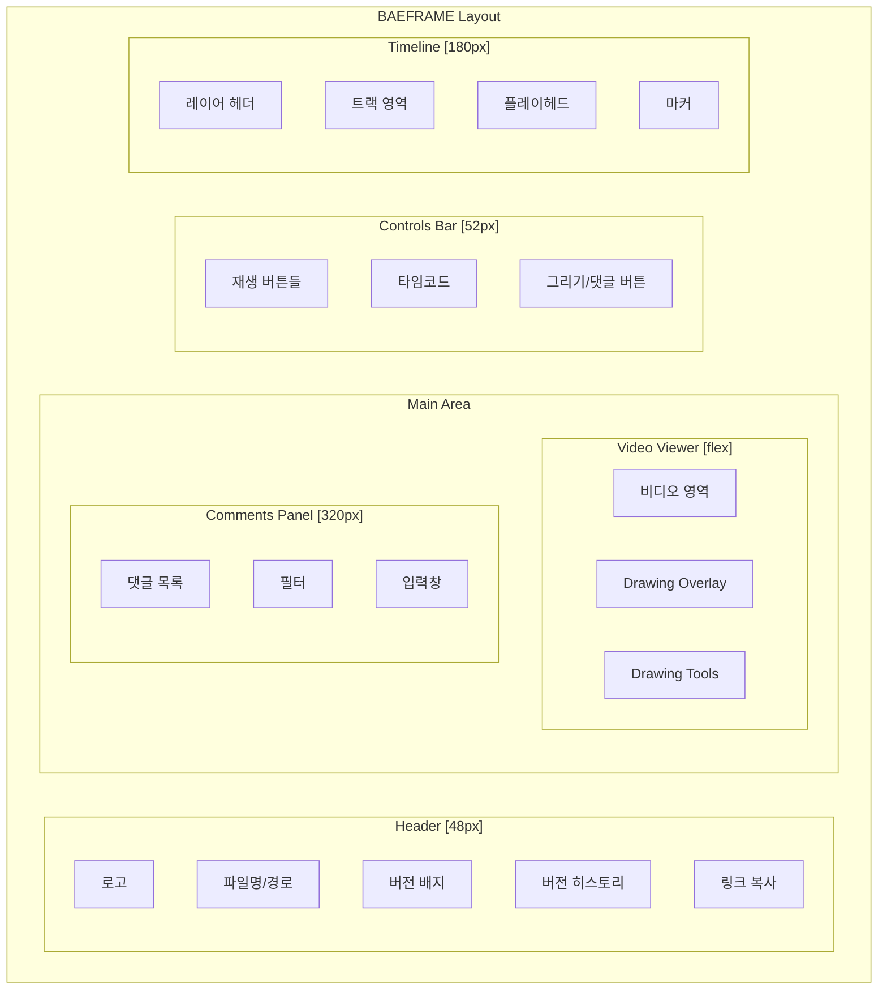

### 6.2 컬러 시스템

```css
:root {
  /* ═══ 배경 ═══ */
  --bg-primary: #0a0a0a;      /* 최상위 배경 */
  --bg-secondary: #111111;     /* 패널 배경 */
  --bg-tertiary: #1a1a1a;      /* 카드 배경 */
  --bg-elevated: #222222;      /* 떠있는 요소 */
  --bg-hover: #2a2a2a;         /* 호버 상태 */

  /* ═══ 테두리 ═══ */
  --border-subtle: #2a2a2a;
  --border-default: #3a3a3a;

  /* ═══ 텍스트 ═══ */
  --text-primary: #f5f5f5;     /* 주요 텍스트 */
  --text-secondary: #a0a0a0;   /* 보조 텍스트 */
  --text-tertiary: #666666;    /* 비활성 텍스트 */

  /* ═══ 액센트 (브랜드 옐로우) ═══ */
  --accent-primary: #ffd000;
  --accent-secondary: #e6bb00;
  --accent-glow: rgba(255, 208, 0, 0.15);

  /* ═══ 상태 색상 ═══ */
  --success: #4ade80;          /* 해결됨, 성공 */
  --error: #f87171;            /* 에러, 삭제 */
  --warning: #fbbf24;          /* 경고 */

  /* ═══ 그리기 팔레트 ═══ */
  --draw-red: #ff4757;
  --draw-yellow: #ffd000;
  --draw-green: #26de81;
  --draw-blue: #4a9eff;
  --draw-white: #ffffff;
}
```

### 6.3 키보드 단축키 전체 목록

| 카테고리 | 키 | 기능 |
|----------|-----|------|
| **재생** | `Space` | 재생/일시정지 |
| | `← / →` | 1프레임 이동 |
| | `, / .` | 1프레임 이동 (대안) |
| | `Shift + ← / →` | 10프레임 이동 |
| | `Home / End` | 처음/끝으로 |
| **구간 반복** | `I` | 시작점 설정 |
| | `O` | 종료점 설정 |
| | `L` | 구간 반복 토글 |
| **타임라인** | `Ctrl + 휠` | 줌 인/아웃 |
| | `Shift + 휠` | 가로 스크롤 |
| | `\` | 전체 보기 |
| **레이어** | `1` | 레이어 추가 |
| | `2` | 레이어 삭제 |
| | `3` | 키프레임 추가 |
| | `Shift + 3` | 키프레임 삭제 |
| | `4` | 프레임 삽입 |
| | `5` | 프레임 삭제 |
| **그리기** | `D` | 그리기 모드 토글 |
| | `Z` | 펜 도구 |
| | `X` | 지우개 도구 |
| | `Ctrl + Z` | 실행 취소 |
| | `Ctrl + Y` | 다시 실행 |
| **댓글** | `C` | 댓글 모드 토글 |
| | `Ctrl + B` | 텍스트 굵게 |
| | `Ctrl + I` | 텍스트 기울임 |
| **파일** | `Ctrl + O` | 파일 열기 |
| | `S / Ctrl + S` | 저장 |
| | `Ctrl + Shift + C` | 링크 복사 |
| **도움말** | `?` | 단축키 메뉴 토글 |

---

## 7. 디버그 & 로깅 시스템

### 7.1 로거 아키텍처

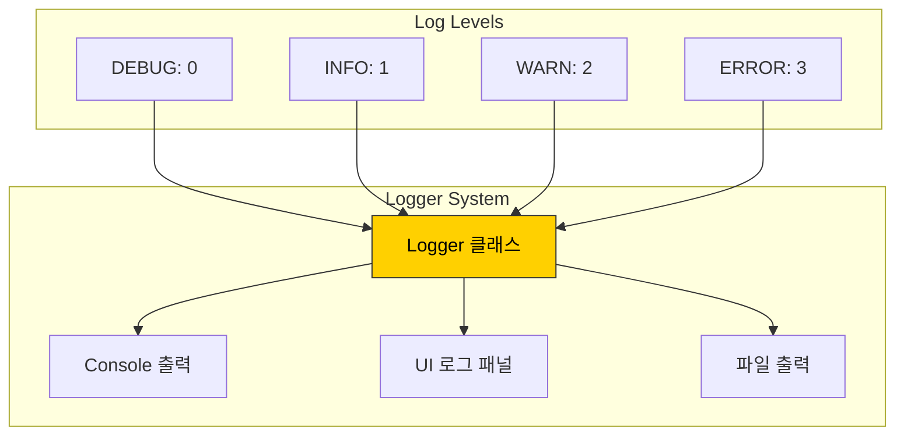

```javascript
// renderer/scripts/logger.js

const LOG_LEVELS = {
  DEBUG: 0,
  INFO: 1,
  WARN: 2,
  ERROR: 3
};

class Logger {
  constructor(module, options = {}) {
    this.module = module;
    this.level = options.level ?? LOG_LEVELS.DEBUG;
    this.enableConsole = options.console ?? true;
    this.enableFile = options.file ?? false;
    this.enableUI = options.ui ?? true;
  }

  debug(message, data) { this._output(LOG_LEVELS.DEBUG, message, data); }
  info(message, data) { this._output(LOG_LEVELS.INFO, message, data); }
  warn(message, data) { this._output(LOG_LEVELS.WARN, message, data); }
  error(message, data) { this._output(LOG_LEVELS.ERROR, message, data); }

  // 함수 실행 추적
  trace(fnName) {
    this.debug(`→ ${fnName}() 호출`);
    return {
      end: (result) => this.debug(`← ${fnName}() 완료`, result),
      error: (err) => this.error(`✖ ${fnName}() 실패`, err)
    };
  }
}

// 사용 예시
const log = createLogger('VideoPlayer');
log.info('영상 로드 시작', { path: videoPath });
```

### 7.2 로그 패널 UI

개발 모드에서 `Ctrl+Shift+D`로 화면 우측 하단에 로그 패널을 토글할 수 있습니다.

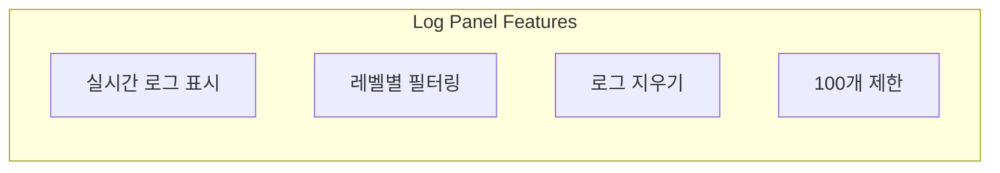

### 7.3 로깅 가이드라인

**올바른 사용:**
```javascript
log.info('영상 로드 시작', { path: videoPath, size: fileSize });
log.debug('프레임 이동', { from: oldFrame, to: newFrame });
log.warn('자동 저장 지연', { delay: ms, reason: 'file locked' });
log.error('JSON 파싱 실패', { error: e.message, file: jsonPath });
```

**피해야 할 사용:**
```javascript
log.info('loading...');           // 컨텍스트 없음
log.debug(videoPath);              // 메시지 없음
console.log('test');               // logger 미사용
```

### 7.4 전역 에러 핸들러

```javascript
window.onerror = (message, source, line, col, error) => {
  const log = createLogger('Global');
  log.error('Uncaught Error', {
    message, source, line, col,
    stack: error?.stack
  });
};

window.onunhandledrejection = (event) => {
  const log = createLogger('Global');
  log.error('Unhandled Promise Rejection', {
    reason: event.reason
  });
};
```

---

## 8. 에러 핸들링 패턴

### 8.1 Result 패턴

예외 대신 명시적인 성공/실패 반환을 사용합니다.

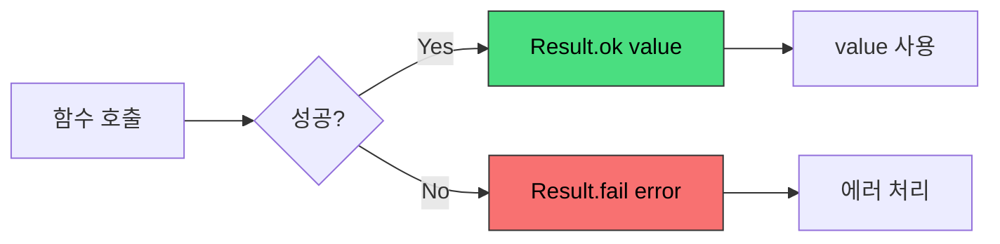

```javascript
// utils/result.js

export class Result {
  constructor(success, value, error) {
    this.success = success;
    this.value = value;
    this.error = error;
  }

  static ok(value) { return new Result(true, value, null); }
  static fail(error) { return new Result(false, null, error); }

  isOk() { return this.success; }
  isFail() { return !this.success; }

  map(fn) { return this.isOk() ? Result.ok(fn(this.value)) : this; }
  unwrapOr(defaultValue) { return this.isOk() ? this.value : defaultValue; }
}

// 사용 예시
async function loadReviewData(path) {
  try {
    const content = await fs.readFile(path, 'utf-8');
    const data = JSON.parse(content);

    if (!validateReviewData(data)) {
      return Result.fail(new Error('Invalid review data format'));
    }

    return Result.ok(data);
  } catch (e) {
    return Result.fail(e);
  }
}

// 호출부
const result = await loadReviewData(jsonPath);
if (result.isFail()) {
  showErrorToast('리뷰 데이터를 불러올 수 없습니다.');
  return;
}
const reviewData = result.value;
```

### 8.2 에러 코드 정의

```javascript
// shared/errors.js

export const ErrorCodes = {
  // 파일 관련
  FILE_NOT_FOUND: 'FILE_NOT_FOUND',
  FILE_READ_ERROR: 'FILE_READ_ERROR',
  FILE_WRITE_ERROR: 'FILE_WRITE_ERROR',
  INVALID_FILE_FORMAT: 'INVALID_FILE_FORMAT',

  // 비디오 관련
  VIDEO_LOAD_ERROR: 'VIDEO_LOAD_ERROR',
  VIDEO_CODEC_UNSUPPORTED: 'VIDEO_CODEC_UNSUPPORTED',
  MPV_NOT_FOUND: 'MPV_NOT_FOUND',

  // 데이터 관련
  JSON_PARSE_ERROR: 'JSON_PARSE_ERROR',
  DATA_VALIDATION_ERROR: 'DATA_VALIDATION_ERROR',

  // 권한 관련
  PERMISSION_DENIED: 'PERMISSION_DENIED',
};

export const ErrorMessages = {
  [ErrorCodes.FILE_NOT_FOUND]: '파일을 찾을 수 없습니다.',
  [ErrorCodes.VIDEO_LOAD_ERROR]: '영상을 불러올 수 없습니다.',
  [ErrorCodes.MPV_NOT_FOUND]: 'mpv 플레이어를 찾을 수 없습니다. 설치를 확인해주세요.',
};
```

### 8.3 사용자 피드백 (Toast)

```javascript
showToast('저장되었습니다.', 'success');
showToast('네트워크 오류가 발생했습니다.', 'error');
showToast('이 작업은 취소할 수 없습니다.', 'warning');
```

---

## 9. 개발 로드맵

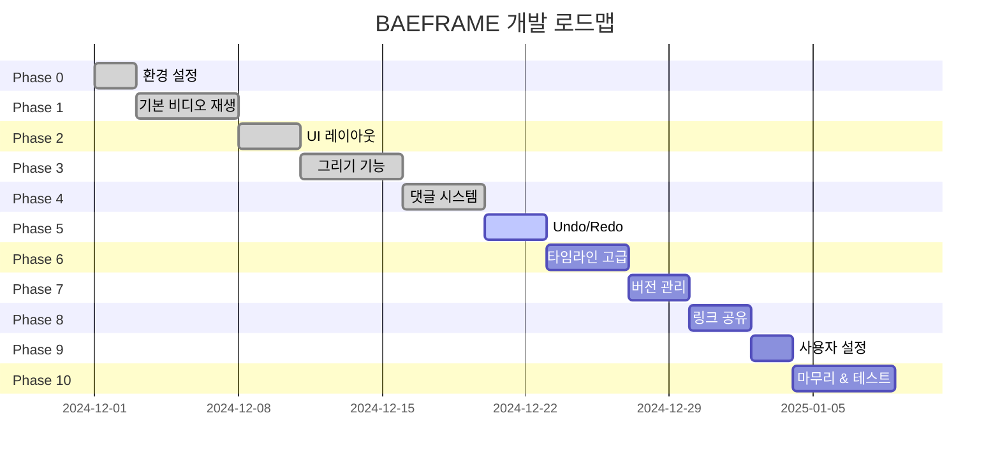

### Phase별 상세

<details>
<summary><strong>Phase 0: 환경 설정</strong></summary>

- [x] 프로젝트 초기화 (npm init, electron)
- [x] 폴더 구조 생성
- [x] ESLint, Prettier 설정
- [x] 로거 시스템 구현
- [x] 개발 모드 핫 리로드 설정
- [x] mpv 바이너리 포함 및 테스트

**체크포인트:** Electron 창이 열리고 mpv가 로드되는지 확인
</details>

<details>
<summary><strong>Phase 1: 기본 비디오 재생</strong></summary>

- [x] mpv.js 연동
- [x] 영상 파일 로드 (드래그 드롭)
- [x] 재생/일시정지
- [x] 프레임 단위 탐색 (← →)
- [x] 타임코드 표시
- [x] MOV PNG 시퀀스 재생 테스트

**체크포인트:** 1GB MOV 파일이 끊김 없이 재생되고, 프레임 단위 이동이 되는지 확인
</details>

<details>
<summary><strong>Phase 2: UI 레이아웃</strong></summary>

- [x] 헤더 구현
- [x] 컨트롤 바 구현
- [x] 댓글 패널 레이아웃
- [x] 타임라인 레이아웃
- [x] 패널 리사이저
- [x] CSS 변수 및 테마 적용

**체크포인트:** 목업과 동일한 레이아웃, 패널 크기 조절 가능
</details>

<details>
<summary><strong>Phase 3: 그리기 기능</strong></summary>

- [x] Canvas 오버레이 설정
- [x] 화살표 그리기
- [x] 자유 드로잉 (포인트 단순화 포함)
- [x] 색상/굵기 선택
- [x] 그리기 데이터 → JSON 변환
- [x] 프레임별 마킹 표시/숨김

**체크포인트:** 그린 마킹이 해당 프레임에서만 보이고, 다른 프레임으로 이동하면 사라짐
</details>

<details>
<summary><strong>Phase 4: 댓글 시스템</strong></summary>

- [x] .bframe 읽기/쓰기
- [x] 댓글 추가 UI
- [x] 댓글 목록 렌더링
- [x] 댓글 클릭 → 프레임 이동
- [x] 해결됨 토글
- [x] 필터링
- [x] 답글 (스레드)

**체크포인트:** 댓글이 저장되고, 앱 재시작 후에도 유지됨
</details>

<details>
<summary><strong>Phase 5: Undo/Redo</strong> (진행 중)</summary>

- [ ] UndoManager 구현
- [ ] 그리기 Undo/Redo
- [ ] 댓글 Undo/Redo
- [ ] Ctrl+Z / Ctrl+Y 단축키

**체크포인트:** 실행 취소가 제대로 동작하고, 히스토리 스택이 유지됨
</details>

<details>
<summary><strong>Phase 6: 타임라인 고급 기능</strong></summary>

- [x] 줌 인/아웃 (Ctrl + 휠)
- [x] 가로/세로 스크롤
- [x] 댓글 마커 표시
- [x] 레이어 표시
- [x] 플레이헤드 드래그

**체크포인트:** 타임라인 조작이 부드럽고, 마커 클릭으로 이동 가능
</details>

<details>
<summary><strong>Phase 7: 버전 관리</strong></summary>

- [ ] 파일명에서 버전 파싱 (v1, V2, v03 등)
- [ ] 같은 이름의 버전 파일들 감지
- [ ] 버전 목록 UI
- [ ] 버전 전환

**체크포인트:** shot_001_v1.mp4, shot_001_v2.mp4가 같은 그룹으로 표시됨
</details>

<details>
<summary><strong>Phase 8: 링크 공유</strong></summary>

- [x] baeframe:// 프로토콜 등록
- [x] 링크 복사 기능
- [x] 프로토콜 핸들링
- [ ] .baef 파일 생성 및 연결

**체크포인트:** Slack에서 링크 클릭 시 앱이 열리고 해당 영상 로드됨
</details>

<details>
<summary><strong>Phase 9: 사용자 설정</strong></summary>

- [x] 첫 실행 시 이름 입력
- [ ] Slack 이름 가져오기 (선택적)
- [x] 설정 저장 (electron-store)
- [x] 설정 UI

**체크포인트:** 설정한 이름이 댓글에 표시됨
</details>

<details>
<summary><strong>Phase 10: 마무리 & 테스트</strong></summary>

- [ ] 전체 기능 통합 테스트
- [ ] 에러 핸들링 보강
- [ ] 성능 최적화
- [ ] 배포 스크립트 (포터블)
- [ ] 사용자 가이드 작성

</details>

---

## 10. 배포 방식

### 10.1 포터블 배포 구조

```
G:/공유드라이브/Tools/baeframe/
├── baeframe.exe              # 실행 파일
├── resources/                # 앱 리소스
├── mpv/                      # mpv 바이너리
├── run-baeframe.bat          # 실행 스크립트
└── README.txt                # 사용 안내
```

```batch
@echo off
:: run-baeframe.bat
cd /d "%~dp0"
start "" "baeframe.exe" %*
```

### 10.2 팀원 설정 방법

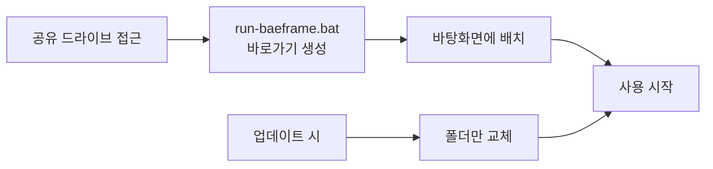

### 10.3 프로토콜 등록

**baeframe:// 프로토콜 (1회 실행):**

```batch
@echo off
set "APP_PATH=G:\공유드라이브\Tools\baeframe\baeframe.exe"

reg add "HKCU\Software\Classes\baeframe" /ve /d "URL:baeframe Protocol" /f
reg add "HKCU\Software\Classes\baeframe" /v "URL Protocol" /d "" /f
reg add "HKCU\Software\Classes\baeframe\shell\open\command" /ve /d "\"%APP_PATH%\" \"%%1\"" /f

echo 프로토콜 등록 완료!
pause
```

**.baef 파일 연결 (1회 실행):**

```batch
@echo off
set "APP_PATH=G:\공유드라이브\Tools\baeframe\baeframe.exe"

reg add "HKCU\Software\Classes\.baef" /ve /d "baeframe.ReviewFile" /f
reg add "HKCU\Software\Classes\baeframe.ReviewFile" /ve /d "baeframe Review File" /f
reg add "HKCU\Software\Classes\baeframe.ReviewFile\shell\open\command" /ve /d "\"%APP_PATH%\" \"%%1\"" /f

echo .baef 파일 연결 완료!
pause
```

---

## 부록: 트러블슈팅

| 문제 | 원인 | 해결 |
|------|------|------|
| mpv 로드 실패 | 바이너리 경로 오류 | `mpv/` 폴더 위치 확인 |
| MOV 재생 안 됨 | 코덱 미지원 | mpv 설정 확인 |
| Canvas 위치 어긋남 | 비디오 크기 변경 | resize 이벤트 핸들링 |
| JSON 저장 실패 | 파일 잠금 | 재시도 로직 추가 |
| 프로토콜 작동 안 함 | 레지스트리 미등록 | install-protocol.bat 실행 |

---

## 참고 자료

**공식 문서:**
- [Electron 공식 문서](https://www.electronjs.org/docs)
- [mpv.js GitHub](https://github.com/aspect-ratio/mpv.js)
- [node-mpv GitHub](https://github.com/j-holub/Node-MPV)
- [Canvas API - MDN](https://developer.mozilla.org/en-US/docs/Web/API/Canvas_API)

**알고리즘:**
- [Ramer-Douglas-Peucker](https://en.wikipedia.org/wiki/Ramer%E2%80%93Douglas%E2%80%93Peucker_algorithm)

**디자인 참고:**
- Frame.io V4 UI
- Monday.com 비디오 주석
- Premiere Pro 타임라인

---

<div align="center">

*문서 끝 | BAEFRAME Development Documentation*

</div>
