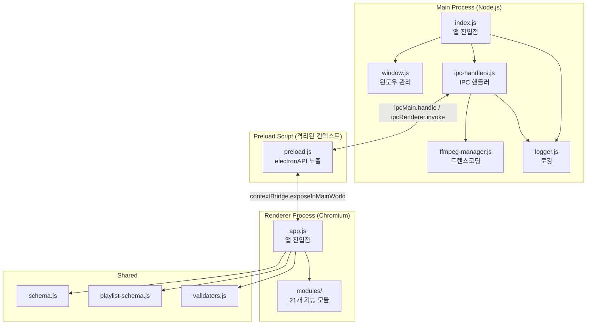
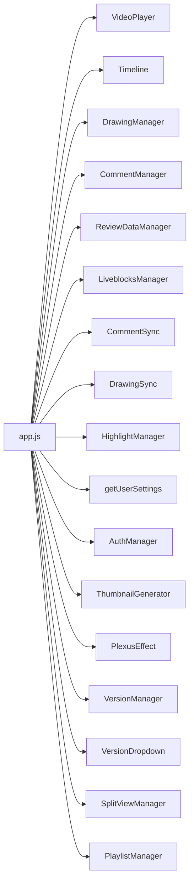
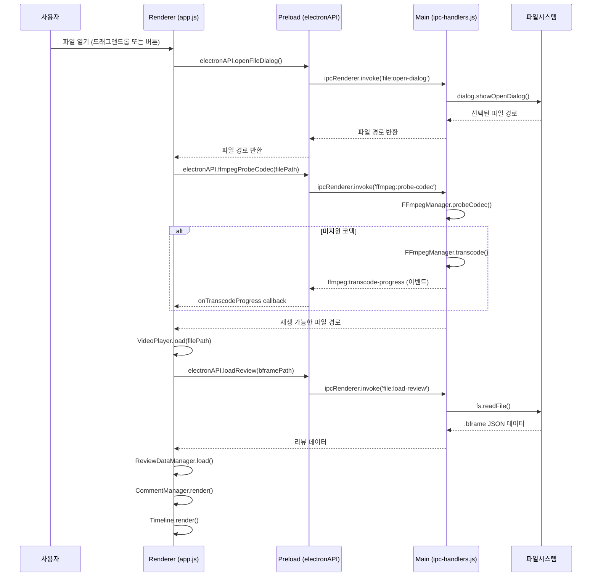
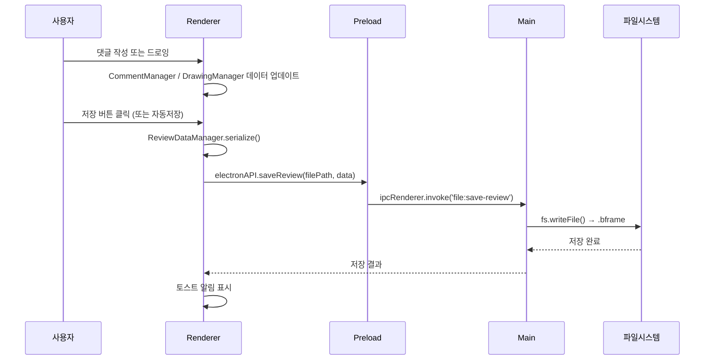
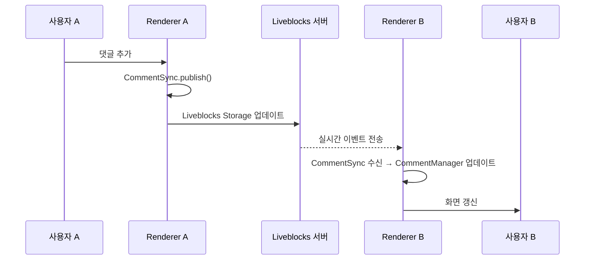
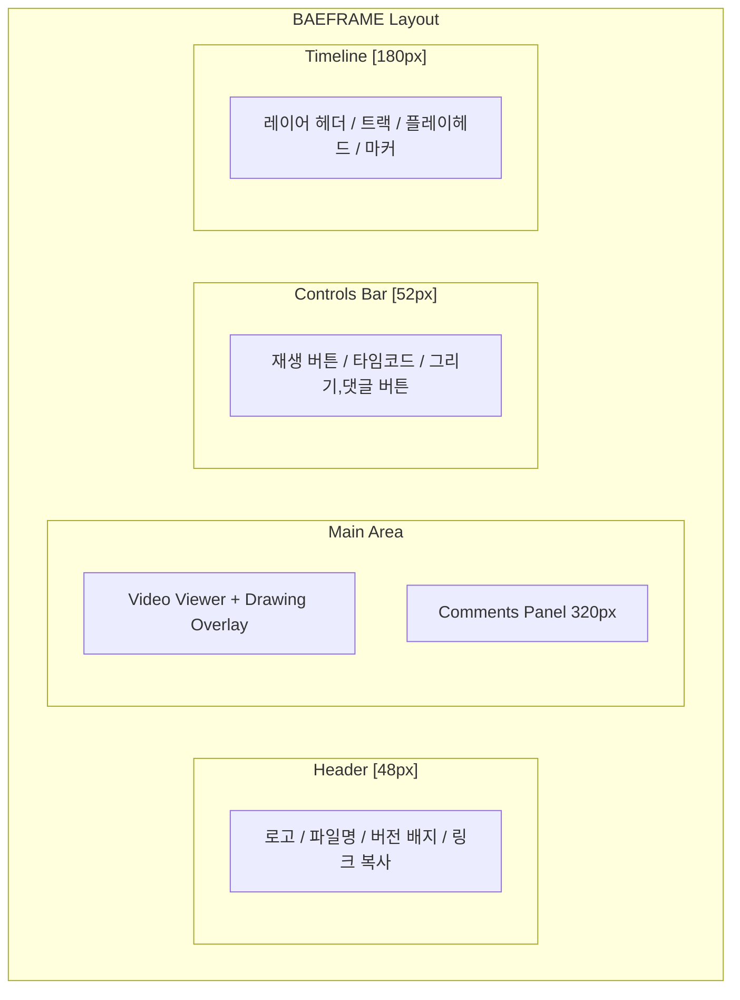

# BAEFRAME 시스템 아키텍처

> 이 문서는 BAEFRAME의 전체 시스템 구조를 설명합니다.
> 처음 코드를 보는 사람이 주요 구성 요소와 그 관계를 빠르게 파악할 수 있도록 작성되었습니다.

---

## 1. 기술 스택

### 런타임 및 프레임워크

| 패키지 | 버전 | 역할 |
|--------|------|------|
| `electron` | ^28.0.0 | 데스크탑 앱 프레임워크 |
| `electron-store` | ^8.1.0 | 설정/인증 데이터 영속 저장 |
| `electron-builder` | ^24.9.1 | 빌드 및 패키징 |

### 런타임 의존성

| 패키지 | 버전 | 역할 |
|--------|------|------|
| `@liveblocks/client` | ^2.0.0 | 실시간 협업 (댓글/드로잉 동기화) |
| `sql.js` | ^1.10.0 | 썸네일 캐시 DB (SQLite WebAssembly) |

### 개발 도구

| 패키지 | 역할 |
|--------|------|
| `esbuild` | Liveblocks 클라이언트 번들링 |
| `eslint` | 코드 품질 검사 |
| `prettier` | 코드 포맷팅 |
| `cross-env` | 크로스 플랫폼 환경 변수 설정 |

### 외부 바이너리

| 바이너리 | 역할 |
|----------|------|
| `mpv` | 비디오 재생 엔진 (HTML5 `<video>` 태그 백엔드) |
| `ffmpeg` / `ffprobe` | 코덱 감지 및 트랜스코딩 (미지원 코덱 → H.264 변환) |

---

## 2. 프로세스 아키텍처

### 전체 구조

Electron은 세 가지 실행 컨텍스트로 구성됩니다. Main Process는 Node.js 환경에서 실행되고, Renderer Process는 브라우저 환경에서 실행됩니다. Preload Script가 둘 사이를 안전하게 연결합니다.



### IPC 통신 방식

- **Renderer → Main**: `ipcRenderer.invoke(채널명, ...args)` → `ipcMain.handle(채널명, handler)`
- **Main → Renderer**: `mainWindow.webContents.send(채널명, data)` → `ipcRenderer.on(채널명, callback)`
- **보안**: `contextIsolation: true`, `nodeIntegration: false` 설정으로 Renderer에서 Node.js 직접 접근 차단. Preload의 `contextBridge`를 통해서만 Node.js API 접근 가능.

### 주요 IPC 채널 목록

| 채널 접두사 | 설명 | 방향 |
|------------|------|------|
| `file:` | 파일 열기, 저장, 로드, 감시, 버전 스캔 | R → M |
| `window:` | 최소화, 최대화, 닫기, 전체화면 | R → M |
| `app:` | 앱 버전 조회, 경로 조회, 종료 | R → M |
| `ffmpeg:` | 코덱 감지, 트랜스코딩, 캐시 관리 | R → M |
| `thumbnail:` | 썸네일 생성, 캐시 로드/저장/삭제 | R → M |
| `playlist:` | 재생목록 읽기/쓰기/삭제/링크 생성 | R → M |
| `gdrive:` | Google Drive 파일 ID 추출, 공유 링크 생성 | R → M |
| `auth:` | 인증 데이터 로드/저장 | R → M |
| `settings:` | 설정 로드/저장 | R → M |
| `clipboard:` | 클립보드 읽기, GDrive 링크 읽기 | R → M |
| `link:` | 클립보드 복사 | R → M |
| `folder:` | 탐색기 열기, 파일 위치 표시 | R → M |
| `shell:` | 외부 URL 열기 | R → M |
| `user:` | OS 사용자명, Slack 사용자 정보 | R → M |
| `integration:` | Windows 우클릭 통합 감지/수리 | R → M |
| `log:write` | 렌더러 로그를 메인 프로세스에 기록 | R → M (one-way) |
| `open-from-protocol` | baeframe:// 딥링크로 파일 열기 | M → R |
| `app:request-save-before-quit` | 종료 전 저장 요청 | M → R |
| `ffmpeg:transcode-progress` | 트랜스코딩 진행률 | M → R |
| `file:changed` | 파일 변경 감지 (실시간 동기화) | M → R |
| `open-playlist` | 재생목록 열기 이벤트 | M → R |

---

## 3. 폴더 구조

```
BAEFRAME/
├── main/                    # Electron Main Process
│   ├── index.js             # 앱 진입점, 프로토콜 등록, 생명주기 관리
│   ├── ipc-handlers.js      # 전체 IPC 핸들러 등록 (~1800줄)
│   ├── ffmpeg-manager.js    # FFmpeg 트랜스코딩 관리 (FFmpegManager 클래스)
│   ├── window.js            # BrowserWindow 생성 및 관리
│   └── logger.js            # 파일/콘솔 로깅 유틸리티
│
├── preload/
│   └── preload.js           # contextBridge로 electronAPI 및 platform 노출
│
├── renderer/                # Renderer Process (Chromium)
│   ├── index.html           # 메인 HTML
│   ├── loading.html         # 로딩 스플래시 화면
│   ├── scripts/
│   │   ├── app.js           # 렌더러 진입점, 모듈 초기화 및 연결
│   │   ├── logger.js        # 렌더러용 로거
│   │   ├── lib/
│   │   │   └── liveblocks-client.js  # esbuild로 번들된 Liveblocks
│   │   └── modules/         # 21개 기능 모듈
│   └── styles/              # CSS 스타일시트
│
├── shared/                  # Main/Renderer 공유 코드
│   ├── schema.js            # .bframe 파일 스키마 정의 (v2.0)
│   ├── playlist-schema.js   # .bplaylist 파일 스키마 정의
│   └── validators.js        # 데이터 유효성 검사
│
├── web-viewer/              # 웹 뷰어 (Vercel 배포)
├── mpv/                     # mpv 바이너리 (번들)
├── ffmpeg/                  # FFmpeg 바이너리 (번들)
├── build/                   # 빌드 리소스 (아이콘 등)
├── integration/             # Windows 우클릭 통합 스크립트
├── docs/                    # 아키텍처, 기획 문서
├── DEVLOG/                  # 기능별 개발 계획 문서
└── electron-builder.yml     # 빌드 설정
```

---

## 4. Main Process

### `main/index.js` - 앱 진입점

- Electron `app` 생명주기 이벤트 관리 (`ready`, `before-quit`, `window-all-closed`)
- `baeframe://` 커스텀 프로토콜 등록 및 딥링크 파싱
- 앱 시작 시 `startup-debug.log` 기록 (`%APPDATA%\baeframe\startup-debug.log`)
- 시작 시 로딩 창(`createLoadingWindow`) → 메인 창(`createMainWindow`) 순으로 표시
- Slack이 `G:/` → `G/`로 변환하는 경로 문제 자동 복원 포함

### `main/ipc-handlers.js` - IPC 핸들러

- 모든 `ipcMain.handle` 및 `ipcMain.on` 등록을 담당하는 단일 파일
- `setupIpcHandlers()` 함수를 export하여 `index.js`에서 호출
- 파일 I/O, 윈도우 제어, FFmpeg, 썸네일 캐시, 재생목록, 설정, 인증, Windows 통합 등 전 기능 커버
- PowerShell 스크립트 실행 유틸리티(`runPowerShellScript`, `runPowerShellCommand`) 포함
- 허용 파일 확장자: `.bframe`, `.json`, `.bak`, `.bplaylist`
- 허용 비디오 확장자: `.mp4`, `.mov`, `.avi`, `.mkv`, `.webm`

### `main/ffmpeg-manager.js` - 트랜스코딩 관리

- `FFmpegManager` 클래스로 구현
- MPEG-4 Part 2, PNG MOV 등 미지원 코덱을 H.264로 변환
- 지원 코덱: `h264`, `avc1`, `vp8`, `vp9`, `av1` (변환 불필요)
- H.264 인코더 우선순위: `libx264` → `libopenh264` → `h264_nvenc`(NVIDIA) → `h264_amf`(AMD) → `h264_qsv`(Intel) → `h264_mf`(Windows)
- 변환된 파일은 `transcoded/` 캐시 폴더에 저장 (기본 한도: 10GB)
- 동일 파일 중복 변환 방지: `pendingTranscodes` Map으로 Promise 공유

### `main/window.js` - 윈도우 관리

- `createLoadingWindow()`: 460×300 프레임리스 로딩 창 생성
- `createMainWindow()`: 화면 크기의 85% (최대 1600×1000, 최소 1024×700) 메인 창 생성
  - `preload.js` 연결, `contextIsolation: true`, `nodeIntegration: false`
  - `ready-to-show` 이벤트에서 로딩 창 닫고 메인 창 표시
  - 5초 타임아웃 안전장치 포함
- 윈도우 최소화, 최대화 토글, 닫기, 전체화면 토글 함수 제공

### `main/logger.js` - 로깅

- 로그 레벨: `DEBUG(0)`, `INFO(1)`, `WARN(2)`, `ERROR(3)`
- 로그 파일 위치:
  - 패키징 앱: `%APPDATA%\baeframe\logs\`
  - 개발 모드: 프로젝트 폴더 내 `logs\`

---

## 5. Renderer Process

### `renderer/scripts/app.js` - 앱 진입점

모든 기능 모듈을 import하고 초기화한 뒤 서로 연결합니다. DOM 요소를 캐싱하여 각 모듈에 전달하는 역할을 합니다.



### `renderer/scripts/modules/` - 기능 모듈 (21개)

상세 사양은 `docs/modules.md`를 참조하세요. 주요 모듈은 다음과 같습니다.

| 모듈 파일 | 역할 |
|----------|------|
| `video-player.js` | mpv 기반 비디오 재생, 프레임 단위 이동, 구간 반복 |
| `timeline.js` | 타임라인 렌더링, 플레이헤드 드래그, 줌 |
| `drawing-manager.js` | 드로잉 모드 관리, 도구 선택 |
| `drawing-canvas.js` | Canvas API 기반 드로잉 실제 처리 |
| `drawing-layer.js` | 레이어 데이터 구조 관리 |
| `comment-manager.js` | 댓글 생성/수정/삭제, 마커 렌더링 |
| `review-data-manager.js` | `.bframe` 파일 로드/저장 |
| `liveblocks-manager.js` | Liveblocks 실시간 협업 연결 |
| `comment-sync.js` | 실시간 댓글 동기화 |
| `drawing-sync.js` | 실시간 드로잉 동기화 |
| `highlight-manager.js` | 타임라인 하이라이트 구간 관리 |
| `version-manager.js` | 버전 이력 관리 |
| `version-dropdown.js` | 버전 선택 드롭다운 UI |
| `version-parser.js` | 파일명에서 버전 정보 파싱 |
| `split-view-manager.js` | 두 영상 나란히 보기(스플릿 뷰) |
| `playlist-manager.js` | 재생목록 관리 |
| `thumbnail-generator.js` | 비디오 썸네일 생성 및 캐시 |
| `auth-manager.js` | 사용자 인증 관리 |
| `user-settings.js` | 사용자 설정 관리 |
| `image-utils.js` | 클립보드/파일에서 이미지 처리 |
| `plexus.js` | 배경 플렉서스 애니메이션 효과 |

---

## 6. Shared

`shared/` 폴더는 Main Process와 Renderer Process가 공통으로 사용하는 코드를 보관합니다.

| 파일 | 설명 |
|------|------|
| `schema.js` | `.bframe` 파일의 스키마 정의 (v2.0). `BFRAME_VERSION`, `SUPPORTED_VERSIONS`, 타입 정의 포함 |
| `playlist-schema.js` | `.bplaylist` 파일의 스키마 정의 |
| `validators.js` | 파일 데이터 유효성 검사 함수 |

### `.bframe` 파일 형식

- JSON 기반 파일 포맷 (확장자: `.bframe`)
- 현재 스키마 버전: `2.0`
- 하위 호환 지원 버전: `1.0`, `2.0`
- Google Drive에서 자동 동기화되어 팀원 간 공유

### `.bplaylist` 파일 형식

- JSON 기반 재생목록 파일 포맷 (확장자: `.bplaylist`)
- 여러 `.bframe` 파일을 순서대로 재생하는 목록

---

## 7. 데이터 흐름

### 파일 열기 및 재생 흐름



### 피드백 저장 흐름



### 실시간 협업 흐름 (Liveblocks)



---

## 8. 빌드 & 배포

### 빌드 설정 (`electron-builder.yml`)

| 항목 | 값 |
|------|----|
| App ID | `com.baeframe.app` |
| 제품명 | `BFRAME_alpha_v2` |
| 출력 폴더 | `dist/` |
| 빌드 리소스 | `build/` |
| 포함 폴더 | `main/`, `preload/`, `renderer/`, `shared/` |
| 번들 리소스 | `mpv/` (mpv 바이너리), `ffmpeg/` (ffmpeg.exe, dll) |

### 파일 연결 및 프로토콜

- **파일 연결**: `.bframe` 확장자를 앱과 연결 (더블클릭으로 열기)
- **커스텀 프로토콜**: `baeframe://` 스킴 등록 (Slack 등 외부 앱에서 딥링크 지원)

### 빌드 명령어

```bash
# 설치 파일 없이 빌드 (dist/win-unpacked/)
npm run build

# 설치 파일 포함 빌드
npm run build:installer

# Liveblocks 클라이언트 번들링 (npm install 시 자동 실행)
npm run bundle:liveblocks
```

### 배포 환경

| 환경 | 경로 | 용도 |
|------|------|------|
| 개발 | `C:\BAEFRAME\` | 소스 수정 및 디버깅 |
| 빌드 검증 | `C:\BAEFRAME\dist\win-unpacked\` | exe 동작 사전 검증 |
| 팀 배포 | Google Drive 공유 폴더 | 팀원 실사용 |

### 로그 파일 위치

| 로그 | 경로 |
|------|------|
| 일반 로그 | `%APPDATA%\baeframe\logs\` |
| 시작 디버그 로그 | `%APPDATA%\baeframe\startup-debug.log` |

---

## 9. 로깅 시스템

Main과 Renderer 각각 `logger.js`가 존재하며, 레벨별 로깅을 지원한다.

### 로그 레벨

| 레벨 | 용도 |
|------|------|
| `DEBUG` | 상세 디버그 정보 (프레임 이동 등) |
| `INFO` | 일반 정보 (영상 로드, 저장 등) |
| `WARN` | 경고 (자동 저장 지연, 파일 잠금 등) |
| `ERROR` | 오류 (JSON 파싱 실패, 파일 읽기 오류 등) |

### 로깅 가이드라인

올바른 사용:
```javascript
log.info('영상 로드 시작', { path: videoPath, size: fileSize });
log.warn('자동 저장 지연', { delay: ms, reason: 'file locked' });
log.error('JSON 파싱 실패', { error: e.message, file: jsonPath });
```

피해야 할 사용:
```javascript
log.info('loading...');           // 컨텍스트 없음
console.log('test');               // logger 미사용
```

### 전역 에러 핸들러

```javascript
window.onerror = (message, source, line, col, error) => { /* 로깅 */ };
window.onunhandledrejection = (event) => { /* 로깅 */ };
```

---

## 10. UI/UX 기본 명세

### 레이아웃 구조



### 컬러 시스템 (CSS 변수)

```css
:root {
  /* 배경 */
  --bg-primary: #0a0a0a;      --bg-secondary: #111111;
  --bg-tertiary: #1a1a1a;     --bg-elevated: #222222;
  /* 텍스트 */
  --text-primary: #f5f5f5;    --text-secondary: #a0a0a0;
  /* 액센트 (브랜드 옐로우) */
  --accent-primary: #ffd000;   --accent-secondary: #e6bb00;
  /* 상태 */
  --success: #4ade80;          --error: #f87171;          --warning: #fbbf24;
  /* 그리기 팔레트 */
  --draw-red: #ff4757;         --draw-yellow: #ffd000;
  --draw-green: #26de81;       --draw-blue: #4a9eff;      --draw-white: #ffffff;
}
```

### 단축키 전체 목록

| 카테고리 | 키 | 기능 |
|----------|-----|------|
| **재생** | `Space` | 재생/일시정지 |
| | `← / →` | 1프레임 이동 |
| | `, / .` | 1프레임 이동 (대안) |
| | `Shift + ← / →` | 10프레임 이동 |
| | `Home / End` | 처음/끝으로 |
| **구간 반복** | `I` | 시작점 설정 |
| | `O` | 종료점 설정 |
| | `L` | 구간 반복 토글 |
| **타임라인** | `Ctrl + 휠` | 줌 인/아웃 |
| | `Shift + 휠` | 가로 스크롤 |
| | `\` | 전체 보기 |
| **그리기** | `D` | 그리기 모드 토글 |
| | `1` | 어니언 스킨 토글 |
| | `F6` | 키프레임 추가 (복사) |
| | `F7` | 빈 키프레임 추가 |
| | `Shift+3` | 키프레임 삭제 |
| | `Ctrl + Z / Y` | 실행 취소 / 다시 실행 |
| **댓글** | `C` | 댓글 모드 토글 |
| | `Shift + ← / →` | 이전/다음 댓글로 이동 |
| **하이라이트** | `H` | 하이라이트 추가 |
| | `Alt + ← / →` | 이전/다음 하이라이트 |
| **파일** | `Ctrl + O` | 파일 열기 |
| | `Ctrl + S` | 저장 |
| | `Ctrl + Shift + C` | 링크 복사 |
| **뷰** | `F` | 전체화면 |
| | `Shift + ?` | 단축키 도움말 |
