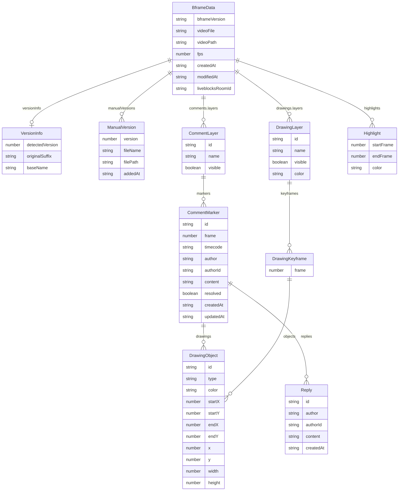

# .bframe 파일 포맷 명세

> .bframe은 BAEFRAME의 리뷰 데이터를 저장하는 JSON 파일입니다.

---

## 1. 개요

### .bframe이란?

.bframe 파일은 BAEFRAME 앱이 생성·관리하는 리뷰 데이터 파일입니다. 내부 형식은 일반 JSON이며, 확장자를 `.bframe`으로 구별합니다. 하나의 영상 파일에 하나의 .bframe 파일이 대응되며, 댓글 마커, 그리기 주석, 하이라이트 구간, 버전 정보 등 해당 영상에 대한 모든 리뷰 데이터를 담습니다.

### 버전 히스토리

| 버전 | 필드 식별자 | 주요 변경 사항 |
|------|------------|--------------|
| 레거시 | (없음) | 버전 필드 없이 flat 구조의 댓글 배열 사용 |
| v1.0 | `version` | 버전 필드 도입, 기본 레이어 구조 |
| v2.0 | `bframeVersion` | `bframeVersion` 필드로 식별자 변경, `versionInfo` / `manualVersions` 추가, `liveblocksRoomId` 추가 |

현재 최신 버전은 **2.0**입니다. (`BFRAME_VERSION = '2.0'`)

지원하는 마이그레이션 대상 버전: `['1.0', '2.0']`

### 저장 위치

.bframe 파일은 **영상 파일과 같은 디렉토리**에 저장됩니다. 파일명은 영상 파일명에서 확장자를 제거한 이름에 `.bframe`을 붙입니다.

```
/프로젝트/영상/
  ├── review_cut_v3.mp4
  └── review_cut_v3.bframe
```

---

## 2. 전체 JSON 구조

아래는 v2.0 기준 완전한 .bframe 파일 구조 예시입니다.

```json
{
  "bframeVersion": "2.0",
  "videoFile": "review_cut_v3.mp4",
  "videoPath": "C:/Projects/review_cut_v3.mp4",
  "fps": 24,
  "createdAt": "2026-03-01T10:00:00.000Z",
  "modifiedAt": "2026-03-17T09:30:00.000Z",
  "liveblocksRoomId": null,
  "versionInfo": {
    "detectedVersion": 3,
    "originalSuffix": "_v3",
    "baseName": "review_cut"
  },
  "manualVersions": [
    {
      "version": 1,
      "fileName": "review_cut_v1.mp4",
      "filePath": "C:/Projects/review_cut_v1.mp4",
      "addedAt": "2026-03-01T10:00:00.000Z"
    }
  ],
  "comments": {
    "layers": [
      {
        "id": "layer_1709123456789_abc123",
        "name": "기본 레이어",
        "visible": true,
        "markers": [
          {
            "id": "comment_1709123456789_def456",
            "frame": 72,
            "timecode": "00:00:03:00",
            "author": "홍길동",
            "authorId": "user_001",
            "content": "이 부분 색감 조정 필요합니다.",
            "resolved": false,
            "createdAt": "2026-03-10T14:00:00.000Z",
            "updatedAt": "2026-03-10T14:00:00.000Z",
            "drawings": [],
            "replies": [
              {
                "id": "reply_1709123456789_ghi789",
                "author": "김철수",
                "authorId": "user_002",
                "content": "확인했습니다.",
                "createdAt": "2026-03-11T09:00:00.000Z"
              }
            ]
          }
        ]
      }
    ]
  },
  "drawings": {
    "layers": [
      {
        "id": "drawing_1709123456789_jkl012",
        "name": "레이어 1",
        "visible": true,
        "color": "#ff4757",
        "keyframes": [
          {
            "frame": 72,
            "objects": [
              {
                "id": "obj_001",
                "type": "arrow",
                "color": "#ff4757",
                "startX": 0.2,
                "startY": 0.3,
                "endX": 0.5,
                "endY": 0.6
              }
            ]
          }
        ]
      }
    ]
  },
  "highlights": [
    {
      "startFrame": 48,
      "endFrame": 120,
      "color": "#ffa502"
    }
  ]
}
```

### 최상위 필드 요약

| 필드 | 타입 | 필수 여부 | 설명 |
|------|------|----------|------|
| `bframeVersion` | string | 필수 | 스키마 버전 (현재 `"2.0"`) |
| `videoFile` | string | 필수 | 영상 파일명 (확장자 포함) |
| `videoPath` | string | 필수 | 영상 파일 전체 경로 |
| `fps` | number | 필수 | 프레임 레이트 (기본값 24) |
| `createdAt` | string | 필수 | 최초 생성 시각 (ISO 8601) |
| `modifiedAt` | string | 필수 | 최종 수정 시각 (ISO 8601) |
| `liveblocksRoomId` | string \| null | 선택 | 실시간 협업용 Liveblocks Room ID |
| `versionInfo` | object \| null | 선택 | 파일명 기반 버전 정보 |
| `manualVersions` | array | 선택 | 수동으로 추가된 버전 목록 |
| `comments` | object | 필수 | 댓글 데이터 (`{ layers: [] }`) |
| `drawings` | object | 필수 | 그리기 데이터 (`{ layers: [] }`) |
| `highlights` | array | 필수 | 하이라이트 구간 목록 |

---

## 3. 스키마 상세

### 3.1 메타데이터

| 필드 | 타입 | 설명 | 예시 |
|------|------|------|------|
| `bframeVersion` | string | 스키마 버전. v1.0은 `version` 필드를 사용했으나 v2.0부터 `bframeVersion`으로 변경 | `"2.0"` |
| `videoFile` | string | 영상 파일명 (확장자 포함). `videoPath`에서 자동 추출 가능 | `"review_cut_v3.mp4"` |
| `videoPath` | string | 영상 파일 전체 경로. Windows 경로(`\`)와 Unix 경로(`/`) 모두 허용 | `"C:/Projects/review.mp4"` |
| `fps` | number | 영상의 프레임 레이트. 기본값 24 | `24`, `30`, `60` |
| `createdAt` | string | 파일 최초 생성 시각. ISO 8601 형식 | `"2026-03-01T10:00:00.000Z"` |
| `modifiedAt` | string | 파일 최종 수정 시각. ISO 8601 형식 | `"2026-03-17T09:30:00.000Z"` |
| `liveblocksRoomId` | string \| null | 실시간 협업 기능(Liveblocks) 연동 시 사용하는 Room ID. 미사용 시 `null` | `null` |

지원하는 영상 확장자: `.mp4`, `.mov`, `.avi`, `.mkv`, `.webm`

### 3.2 버전 정보

버전 정보는 같은 영상의 여러 버전 파일을 관리할 때 사용합니다.

#### versionInfo

파일명에서 자동으로 감지된 버전 정보입니다. `null`이면 버전 감지 미적용 상태입니다.

| 필드 | 타입 | 설명 | 예시 |
|------|------|------|------|
| `detectedVersion` | number \| null | 파일명에서 감지된 버전 번호 | `3` |
| `originalSuffix` | string \| null | 원본 버전 접미사 | `"_v3"`, `"_re"` |
| `baseName` | string | 버전 정보를 제외한 기본 파일명 | `"review_cut"` |

#### manualVersions

사용자가 수동으로 연결한 다른 버전의 영상 파일 목록입니다.

| 필드 | 타입 | 설명 | 예시 |
|------|------|------|------|
| `version` | number | 수동 지정된 버전 번호 | `1` |
| `fileName` | string | 파일명 | `"review_cut_v1.mp4"` |
| `filePath` | string | 전체 파일 경로 | `"C:/Projects/review_cut_v1.mp4"` |
| `addedAt` | string | 추가 시각 (ISO 8601) | `"2026-03-01T10:00:00.000Z"` |

### 3.3 댓글 (comments)

댓글은 `comments.layers` 배열 안에 레이어 단위로 구성됩니다.

#### 구조 계층

```
comments
  └── layers[]           (CommentLayer)
        └── markers[]    (CommentMarker)
              ├── drawings[]  (그리기 객체, DrawingObject 참조)
              └── replies[]   (답글)
```

#### CommentLayer

| 필드 | 타입 | 설명 |
|------|------|------|
| `id` | string | 레이어 고유 ID (`layer_timestamp_random`) |
| `name` | string | 레이어 표시 이름 |
| `visible` | boolean | 레이어 표시 여부 |
| `markers` | CommentMarker[] | 댓글 마커 목록 |

#### CommentMarker

| 필드 | 타입 | 필수 여부 | 설명 |
|------|------|----------|------|
| `id` | string | 필수 | 댓글 고유 ID (`comment_timestamp_random`) |
| `frame` | number | 필수 | 댓글이 위치하는 프레임 번호 |
| `timecode` | string | 선택 | 타임코드 문자열 (형식: `HH:MM:SS:FF`) |
| `author` | string | 선택 | 작성자 이름 (익명 가능) |
| `authorId` | string | 선택 | 작성자 ID |
| `content` | string | 조건부 필수 | 댓글 텍스트 내용. `drawings`가 있으면 생략 가능 |
| `resolved` | boolean | 선택 | 댓글 해결 여부 |
| `createdAt` | string | 선택 | 생성 시각 (ISO 8601) |
| `updatedAt` | string | 선택 | 수정 시각 (ISO 8601) |
| `drawings` | DrawingObject[] | 선택 | 이 댓글에 첨부된 그리기 주석 |
| `replies` | Reply[] | 선택 | 답글 목록 |

> `content`와 `drawings` 중 하나는 반드시 존재해야 합니다.

#### Reply (답글)

| 필드 | 타입 | 설명 |
|------|------|------|
| `id` | string | 답글 고유 ID |
| `author` | string | 작성자 이름 |
| `authorId` | string | 작성자 ID |
| `content` | string | 답글 내용 |
| `createdAt` | string | 생성 시각 (ISO 8601) |

### 3.4 그리기 (drawings)

그리기는 `drawings.layers` 배열 안에 레이어 단위로 구성됩니다. 각 레이어는 프레임별 키프레임을 가지며, 키프레임마다 그리기 객체 목록을 저장합니다.

#### 구조 계층

```
drawings
  └── layers[]           (DrawingLayer)
        └── keyframes[]  (DrawingKeyframe)
              └── objects[]  (DrawingObject)
```

#### DrawingLayer

| 필드 | 타입 | 설명 |
|------|------|------|
| `id` | string | 레이어 고유 ID (`drawing_timestamp_random`) |
| `name` | string | 레이어 표시 이름 |
| `visible` | boolean | 레이어 표시 여부 |
| `color` | string | 레이어 기본 색상 (HEX 형식, 예: `#ff4757`) |
| `keyframes` | DrawingKeyframe[] | 키프레임 목록 |

#### DrawingKeyframe

| 필드 | 타입 | 설명 |
|------|------|------|
| `frame` | number | 키프레임 프레임 번호 |
| `objects` | DrawingObject[] | 이 프레임에 그려진 객체 목록 |

#### DrawingObject

모든 타입에 공통으로 사용되는 필드:

| 필드 | 타입 | 설명 |
|------|------|------|
| `id` | string | 객체 고유 ID |
| `type` | string | 객체 타입 (아래 목록 참조) |
| `color` | string | 색상 (HEX 형식) |

지원하는 타입 목록:

| type | 설명 | 추가 필수 필드 |
|------|------|--------------|
| `arrow` | 화살표 | `startX`, `startY`, `endX`, `endY` |
| `line` | 직선 | `startX`, `startY`, `endX`, `endY` |
| `stroke` | 브러시 획 | `points` (배열) |
| `freehand` | 자유 곡선 | `points` (배열) |
| `circle` | 원 | `x`, `y`, `width`(선택), `height`(선택) |
| `rectangle` | 사각형 | `x`, `y`, `width`(선택), `height`(선택) |

좌표 필드(`startX`, `startY`, `endX`, `endY`, `x`, `y`)는 모두 **정규화 좌표계(0~1)** 를 사용합니다. 자세한 내용은 5절을 참조하세요.

### 3.5 하이라이트 (highlights)

타임라인에 표시되는 색상 구간 마커입니다.

| 필드 | 타입 | 설명 |
|------|------|------|
| `startFrame` | number | 하이라이트 시작 프레임 번호 |
| `endFrame` | number | 하이라이트 종료 프레임 번호 |
| `color` | string | 하이라이트 색상 (HEX 형식) |

---

## 4. ER 다이어그램



---

## 5. 좌표 시스템

### 정규화 좌표계 (0~1)

DrawingObject의 좌표는 영상 해상도에 독립적인 **정규화 좌표계**를 사용합니다.

- x축: 영상의 왼쪽 끝 = `0.0`, 오른쪽 끝 = `1.0`
- y축: 영상의 위쪽 끝 = `0.0`, 아래쪽 끝 = `1.0`
- 유효 범위: `0.0` 이상 `1.0` 이하

```
(0.0, 0.0) ─────────────── (1.0, 0.0)
     │                           │
     │        영상 영역           │
     │                           │
(0.0, 1.0) ─────────────── (1.0, 1.0)
```

### 변환 공식

정규화 좌표 → 화면 픽셀 좌표:

```
픽셀X = 정규화X × 영상너비(px)
픽셀Y = 정규화Y × 영상높이(px)
```

화면 픽셀 좌표 → 정규화 좌표:

```
정규화X = 픽셀X / 영상너비(px)
정규화Y = 픽셀Y / 영상높이(px)
```

이 방식을 사용하면 4K 영상과 HD 영상에 동일한 .bframe 데이터를 적용해도 상대적 위치가 유지됩니다.

---

## 6. 마이그레이션

### v1.0 → v2.0 변경사항

| 항목 | v1.0 | v2.0 | 비고 |
|------|------|------|------|
| 버전 식별 필드 | `version` | `bframeVersion` | 필드명 변경 |
| 실시간 협업 | (없음) | `liveblocksRoomId` | 신규 추가 (`null` 기본값) |
| 버전 관리 | (없음) | `versionInfo`, `manualVersions` | 신규 추가 |
| 레거시 댓글 형식 | `comments: [...]` (배열) | `comments: { layers: [...] }` | 구조 변경 |

### 레거시 → v1.0/v2.0 마이그레이션

레거시 데이터(버전 필드 없음)는 다음 규칙으로 마이그레이션됩니다.

- 댓글 배열이 `{ layers: [{ id: 'layer_default', ... }] }` 구조로 래핑됩니다.
- `versions` 배열이 있으면 `manualVersions`로 변환됩니다. 이때 `filename` 또는 `fileName` 필드는 `fileName`으로 정규화되고, `createdAt`은 `addedAt`으로 변환됩니다.
- `fps`가 숫자가 아니면 기본값 `24`로 설정됩니다.
- `createdAt`이 없으면 마이그레이션 시각으로 설정됩니다.

### 마이그레이션 판단 로직

```
1. data.bframeVersion 존재 → 해당 버전으로 인식 (v2.0)
2. data.version 존재       → 해당 버전으로 인식 (v1.0)
3. 둘 다 없음              → 'legacy'로 인식
```

`needsMigration(data)` 함수는 버전이 `"2.0"`이 아니면 `true`를 반환합니다.

---

## 7. 플레이리스트 스키마

여러 영상을 묶어서 공유하는 재생목록은 `.bplaylist` 파일로 저장됩니다. 내부 형식은 JSON입니다.

현재 버전: **1.0** (`PLAYLIST_VERSION = '1.0'`)

최대 항목 수: **50개** (`MAX_PLAYLIST_ITEMS = 50`)

저장 위치: 재생목록 내 첫 번째 영상과 같은 디렉토리에 저장됩니다. 파일명은 재생목록 이름에서 특수문자(`< > : " / \ | ? *`)를 `_`로 치환한 후 `.bplaylist`를 붙입니다.

### PlaylistData (최상위 구조)

| 필드 | 타입 | 필수 여부 | 설명 |
|------|------|----------|------|
| `playlistVersion` | string | 필수 | 스키마 버전 (`"1.0"`) |
| `name` | string | 필수 | 재생목록 이름 |
| `id` | string | 필수 | 재생목록 고유 ID (`playlist_timestamp_random`) |
| `createdAt` | string | 선택 | 생성 시각 (ISO 8601) |
| `modifiedAt` | string | 선택 | 수정 시각 (ISO 8601) |
| `createdBy` | string | 선택 | 생성자 이름 |
| `createdById` | string | 선택 | 생성자 ID |
| `items` | PlaylistItem[] | 필수 | 재생목록 항목들 (최대 50개) |
| `settings` | PlaylistSettings | 선택 | 재생 설정 |

### PlaylistItem

| 필드 | 타입 | 필수 여부 | 설명 |
|------|------|----------|------|
| `id` | string | 필수 | 항목 고유 ID (`item_timestamp_random`) |
| `videoPath` | string | 필수 | 영상 파일 전체 경로 |
| `bframePath` | string | 선택 | 연결된 .bframe 파일 경로 (없으면 빈 문자열) |
| `fileName` | string | 선택 | 표시용 파일명 |
| `thumbnailPath` | string | 선택 | 썸네일 캐시 파일 경로 |
| `order` | number | 선택 | 정렬 순서 (0부터 시작) |
| `addedAt` | string | 선택 | 추가 시각 (ISO 8601) |

### PlaylistSettings

| 필드 | 타입 | 기본값 | 설명 |
|------|------|--------|------|
| `autoPlay` | boolean | `false` | 항목 전환 시 자동 재생 여부 |
| `floatingMode` | boolean | `false` | 플로팅 모드 활성화 여부 |

### 예시

```json
{
  "playlistVersion": "1.0",
  "name": "3월 컷 리뷰",
  "id": "playlist_1709123456789_abc123",
  "createdAt": "2026-03-17T10:00:00.000Z",
  "modifiedAt": "2026-03-17T10:00:00.000Z",
  "createdBy": "홍길동",
  "createdById": "user_001",
  "items": [
    {
      "id": "item_1709123456789_def456",
      "videoPath": "C:/Projects/cut_A.mp4",
      "bframePath": "C:/Projects/cut_A.bframe",
      "fileName": "cut_A.mp4",
      "thumbnailPath": "",
      "order": 0,
      "addedAt": "2026-03-17T10:00:00.000Z"
    }
  ],
  "settings": {
    "autoPlay": false,
    "floatingMode": false
  }
}
```

---

## 8. 데이터 검증

`shared/validators.js`는 .bframe 데이터를 로드할 때 구조의 유효성을 검증하는 함수들을 제공합니다.

### 검증 함수 목록

| 함수 | 대상 | 반환값 |
|------|------|--------|
| `validateReviewData(data)` | BframeData 전체 | `{ valid, errors, warnings }` |
| `validateComments(comments)` | comments 객체 또는 배열 | `string[]` (에러 목록) |
| `validateCommentLayer(layer, index)` | CommentLayer | `string[]` |
| `validateCommentMarker(marker)` | CommentMarker | `string[]` |
| `validateDrawings(drawings)` | drawings 객체 | `string[]` |
| `validateDrawingLayer(layer, index)` | DrawingLayer | `string[]` |
| `validateDrawingObject(drawing)` | DrawingObject | `string[]` |
| `validateVersionInfo(versionInfo)` | VersionInfo | `string[]` |
| `validateManualVersion(manualVersion)` | ManualVersion | `string[]` |

### 최상위 검증 규칙 (validateReviewData)

| 검증 대상 | 규칙 | 구분 |
|----------|------|------|
| 데이터 자체 | 객체여야 함 | error |
| `bframeVersion` 또는 `version` | 없으면 레거시 데이터 경고 | warning |
| `bframeVersion` 또는 `version` 값 | 지원하는 버전 목록에 없으면 경고 | warning |
| `videoFile` 또는 `videoPath` | 둘 중 하나는 반드시 있어야 함 | error |
| `fps` | 있다면 숫자여야 함 | error |
| `comments` | 있다면 구조 검증 수행 | error |
| `drawings` | 있다면 구조 검증 수행 | error |
| `highlights` | 있다면 배열이어야 함 | error |
| `versionInfo` | 있다면 객체여야 함 | error |
| `manualVersions` | 있다면 배열이어야 함 | error |

### DrawingObject 타입별 검증 규칙

| type | 검증 필드 | 규칙 |
|------|----------|------|
| `arrow`, `line` | `startX`, `startY`, `endX`, `endY` | 0~1 범위의 숫자 |
| `stroke`, `freehand` | `points` | 배열이어야 함 |
| `circle`, `rectangle` | `x`, `y` | 0~1 범위의 숫자 |
| `circle`, `rectangle` | `width`, `height` | 있다면 숫자여야 함 |
| 모든 타입 | `id` | 있어야 함 |
| 모든 타입 | `type` | 지원 목록에 있어야 함 |
| 모든 타입 | `color` | 있어야 함 |

### 플레이리스트 검증 규칙 (validatePlaylistData)

| 검증 대상 | 규칙 | 구분 |
|----------|------|------|
| 데이터 자체 | 객체여야 함 | error |
| `playlistVersion` | 없거나 지원하지 않는 버전이면 오류 | error |
| `id` | 있어야 함 | error |
| `name` | 있어야 하며 문자열이어야 함 | error |
| `items` | 배열이어야 함 | error |
| `items.length` | 50개 초과 불가 | error |
| `items[n].id` | 각 항목에 id가 있어야 함 | error |
| `items[n].videoPath` | 각 항목에 videoPath가 있어야 함 | error |
| `settings` | 있다면 객체여야 함 | error |
