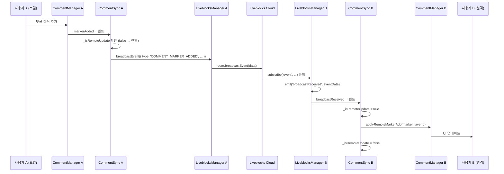
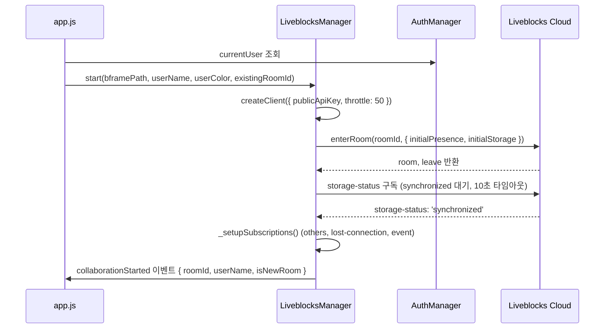
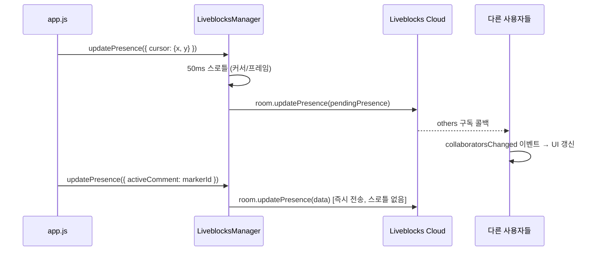

# 실시간 협업 시스템

> Liveblocks 기반 실시간 협업 기능의 아키텍처와 구현을 설명합니다.

---

## 1. 개요

### 목적

여러 사용자가 동일한 `.bframe` 파일을 동시에 열어 댓글 작성, 그리기, 커서 공유를 실시간으로 경험할 수 있도록 합니다.

### 기술 선택: Liveblocks

기존 협업 시스템은 Google Drive 파일 동기화(`.collab` 파일)에 의존했으며 다음 한계가 있었습니다:

| 한계 | 기존 방식 | Liveblocks |
|------|----------|------------|
| 동기화 지연 | 3~30초 | ~50ms (Broadcast) |
| Presence 업데이트 | 10초 폴링 | 즉시 (WebSocket) |
| 오프라인 감지 | 45초 타임아웃 | ~2초 |
| 충돌 해결 | 타임스탬프 비교 (last-write-wins) | Broadcast 기반 이벤트 전달 |
| 인프라 | Google Drive Desktop 필수 | 인터넷 + API 키 |

LAN P2P(WebRTC) 방식도 검토했으나, 네트워크 환경 의존성(NAT, STUN/TURN 서버)과 재택 근무 지원 불가 문제로 Liveblocks SaaS 방식을 채택했습니다.

**의존성**: `@liveblocks/client ^2.0.0`

**번들링**: Electron 렌더러에서 ESM으로 사용하기 위해 esbuild로 사전 번들링합니다.

```bash
npm run bundle:liveblocks
# esbuild ./node_modules/@liveblocks/client/dist/index.js --bundle --format=esm
# --outfile=renderer/scripts/lib/liveblocks-client.js
```

`postinstall` 훅에 등록되어 `npm install` 시 자동으로 실행됩니다.

---

## 2. 아키텍처

### Liveblocks Room 구조

각 `.bframe` 파일 하나가 하나의 Liveblocks Room에 대응됩니다.

- **첫 접속자**: Room ID를 생성하여 `.bframe` 파일의 `liveblocksRoomId` 필드에 저장
- **이후 접속자**: `.bframe`에서 `liveblocksRoomId`를 읽어 동일 Room에 접속
- Google Drive로 `.bframe` 파일이 공유되므로 Room ID도 자동으로 팀원과 공유됨

Room ID 형식: `bframe_{timestamp36}_{random12}`

### Broadcast 기반 통신

초기 설계에서는 Liveblocks Storage(CRDT)로 댓글을 동기화하려 했으나, Storage 구독 콜백이 실제로 작동하지 않는 문제가 발생했습니다. 이미 정상 작동하던 Broadcast 채널을 사용하도록 전환했습니다.

**현재 통신 전략:**

| 데이터 | 전송 방식 | 이유 |
|--------|---------|------|
| 댓글 CRUD (마커, 답글, 레이어) | Broadcast | Storage 구독 불안정 문제로 전환 |
| 그리기 (스트로크, 키프레임) | Broadcast | Base64 이미지 데이터 크기 (100KB~수MB) → CRDT 부적합 |
| 커서 위치, 재생헤드 프레임 | Presence | 실시간 상태 공유 |
| 편집 잠금 | Presence (`activeComment` 필드) | 즉시 반영 필요 |

**Broadcast의 한계와 폴백:**
- Broadcast는 현재 접속 중인 사용자에게만 전달됨
- 늦게 접속한 사용자는 로컬 `.bframe` 파일에서 데이터를 로드
- Google Drive 파일 감시(file:watch)를 폴백 안전망으로 유지 (~10초 지연)

### 동기화 범위

- **댓글**: 마커 추가/수정/삭제, 답글 추가/수정/삭제, 레이어 추가/제거
- **그리기**: 스트로크 시작/중간/종료 스트리밍, 키프레임 완성 데이터, 레이어 생성/삭제
- **Presence**: 마우스 커서 위치(정규화 좌표), 현재 재생 프레임, 그리기 모드 여부, 편집 중인 댓글 ID

---

## 3. 모듈 구조

### 3.1 liveblocks-manager.js

`renderer/scripts/modules/liveblocks-manager.js`

Room 생성, 연결, 해제 및 모든 Liveblocks 통신의 중앙 관리 모듈입니다. `EventTarget`을 상속하여 `app.js`의 기존 협업 인터페이스와 호환됩니다.

**주요 기능:**

- `start(bframePath, userName, userColor, existingRoomId)`: Room 접속. Storage 동기화 완료까지 대기(10초 타임아웃)
- `stop()`: Room 퇴장 및 모든 구독 해제
- `updatePresence(data)`: Presence 업데이트. `activeComment`, `userName`, `userColor`는 즉시 전송, 커서/프레임은 50ms 스로틀
- `broadcastEvent(data)`: Broadcast 메시지 전송
- `getOthers()`: 현재 접속 중인 다른 사용자 목록
- `checkEditLock(markerId)`: Presence 기반 편집 잠금 확인

**발행 이벤트:**

| 이벤트 | 설명 |
|--------|------|
| `collaborationStarted` | Room 접속 성공 |
| `collaboratorsChanged` | 접속자 목록 변경 |
| `broadcastReceived` | Broadcast 메시지 수신 |
| `connectionStatusChanged` | 연결 상태 변경 (`connected` / `reconnecting` / `disconnected`) |

**Presence 초기값:**

```javascript
{
  cursor: null,         // { x, y } 정규화 좌표
  currentFrame: 0,
  isDrawing: false,
  activeComment: null,  // 편집 중인 마커 ID (잠금 역할)
  userName: '...',
  userColor: '...'
}
```

**Storage 초기값 (현재 미사용, 구조 보존):**

```javascript
{
  commentLayers: new LiveList([]),
  highlights: new LiveList([]),
  drawingMeta: new LiveList([])
}
```

### 3.2 comment-sync.js

`renderer/scripts/modules/comment-sync.js`

CommentManager와 Liveblocks Broadcast 간 양방향 동기화를 담당합니다.

**Local → Remote**: CommentManager가 발행하는 이벤트를 수신하여 Broadcast로 전송

| CommentManager 이벤트 | Broadcast 타입 |
|----------------------|---------------|
| `markerAdded` | `COMMENT_MARKER_ADDED` |
| `markerUpdated` | `COMMENT_MARKER_UPDATED` |
| `markerDeleted` | `COMMENT_MARKER_DELETED` |
| `replyAdded` | `COMMENT_REPLY_ADDED` |
| `replyUpdated` | `COMMENT_REPLY_UPDATED` |
| `replyDeleted` | `COMMENT_REPLY_DELETED` |
| `layerAdded` | `COMMENT_LAYER_ADDED` |
| `layerRemoved` | `COMMENT_LAYER_REMOVED` |

**Remote → Local**: `broadcastReceived` 이벤트를 수신하여 `COMMENT_*` 타입별로 분기, CommentManager의 `applyRemote*` 메서드 호출

**무한 루프 방지**: `_isRemoteUpdate` 플래그로 원격에서 온 변경이 다시 Broadcast로 나가지 않도록 차단

### 3.3 drawing-sync.js

`renderer/scripts/modules/drawing-sync.js`

DrawingManager와 Liveblocks Broadcast 간 양방향 동기화를 담당합니다.

**Broadcast 메시지 크기 제한**: 1MB (`MAX_BROADCAST_SIZE = 1024 * 1024`)

**Local → Remote 흐름:**

| DrawingManager 이벤트 | Broadcast 타입 | 설명 |
|----------------------|---------------|------|
| `drawstart` (캔버스) | `STROKE_START` | 스트로크 시작 스트리밍 |
| `drawmove` (캔버스) | `STROKE_MOVE` | 스트로크 진행 스트리밍 |
| `drawend` | `DRAWING_KEYFRAME_UPDATE` | 완성된 키프레임 (Base64) |
| `layerCreated` | `DRAWING_LAYER_CREATED` | 레이어 생성 |
| `layerDeleted` | `DRAWING_LAYER_DELETED` | 레이어 삭제 |
| `keyframeRemoved` | `DRAWING_KEYFRAME_REMOVED` | 키프레임 삭제 |

스트로크 데이터는 `_strokeBuffer`에 누적 후 타이머로 flush하여 네트워크 부하를 줄입니다.

### 3.4 auth-manager.js

`renderer/scripts/modules/auth-manager.js`

사용자 인증 및 세션 관리를 담당합니다. 인증 파일 기반으로 팀원을 관리합니다.

**인증 방식:**
- 관리자 계정(하드코딩)으로 사용자 등록/삭제 관리
- 팀원은 이름을 입력하여 로그인 (비밀번호 불필요)
- 사용자별 테마 색상 선택 가능 (`기본(노랑)`, `빨강`, `파랑`, `핑크`, `초록`)

**주요 메서드:**
- `init()`: 앱 시작 시 인증 파일 로드
- `registerUser(name, theme)`: 신규 팀원 등록
- `isAuthAvailable()`: 인증 파일 접근 가능 여부 확인

로그인된 사용자의 이름과 색상이 Liveblocks Presence에 전달됩니다.

---

## 4. 데이터 흐름

### 댓글 작성 시퀀스 (Broadcast 방식)



### Room 접속 흐름



### Presence 업데이트 흐름



---

## 5. 설정

### Liveblocks Public Key

`renderer/scripts/modules/liveblocks-manager.js`에 하드코딩된 클라이언트용 공개 키를 사용합니다. 공개 키는 코드에 포함해도 안전합니다.

```javascript
const LIVEBLOCKS_PUBLIC_KEY = 'pk_dev_lKwyJLI2vKSI63mnDwK1zh6yKWzLflm_...';
```

### 클라이언트 설정

```javascript
createClient({
  publicApiKey: LIVEBLOCKS_PUBLIC_KEY,
  throttle: 50  // Presence 업데이트 최소 간격 (ms)
});
```

### 번들링

Electron 렌더러 프로세스는 Node.js 모듈을 직접 사용할 수 없으므로 `@liveblocks/client`를 ESM 형식으로 번들링합니다.

```bash
# npm install 시 자동 실행 (postinstall 훅)
npm run bundle:liveblocks
```

출력 파일: `renderer/scripts/lib/liveblocks-client.js`

`LiveObject`, `LiveList`, `LiveMap`은 `globalThis`에 등록하여 CommentSync, DrawingSync에서 접근 가능합니다.

---

## 6. 개발 히스토리

### 1단계: 설계 (2026-02-28)

기존 Google Drive 파일 동기화(`.collab` 파일, `CollaborationManager` 828줄)의 한계를 분석하고 Liveblocks 전환을 계획했습니다. LAN P2P(WebRTC) 방식을 검토했으나 네트워크 의존성 문제로 Liveblocks SaaS로 결정했습니다.

초기 설계는 다음 구조를 목표로 했습니다:
- **Presence**: 커서, 프레임 위치, 편집 상태 실시간 공유
- **Storage (CRDT)**: 댓글, 하이라이트 충돌 없는 동기화 (LiveList, LiveObject)
- **Broadcast**: 그리기 데이터 (Base64 이미지 크기 문제로 CRDT 대신)

총 7개 Phase로 구성: 인프라, Presence, 댓글 CRDT, 그리기 브로드캐스트, 로컬 저장 통합, 기존 시스템 정리, 스키마 업데이트 (Phase 8 웹 뷰어는 향후 과제)

### 2단계: Storage → Broadcast 전환 (2026-03-01)

Liveblocks Storage(CRDT) 구독 콜백이 한 번도 실행되지 않는 문제가 발견됐습니다. Presence와 동일한 WebSocket 경로를 사용하는 Broadcast는 정상 작동했으므로, 댓글 동기화도 Broadcast 방식으로 전환했습니다.

**변경 내용:**
- `comment-sync.js`: Storage 구독 코드 전체 제거, Broadcast 기반으로 재작성
- `drawing-sync.js`: Storage 메타 업로드 코드 제거, Broadcast 코드 유지
- `app.js`: `commentSync.start()` 인자 제거, 파일 감시 항상 활성화
- `liveblocks-manager.js`: Broadcast 송수신 진단 로그 추가

**.bframe 파일 저장**은 기존 auto-save(500ms debounce)가 그대로 담당하며, Google Drive 파일 감시는 Broadcast를 놓쳤을 때의 폴백으로 유지됩니다.

### 현재 상태

| Phase | 항목 | 상태 |
|-------|------|------|
| Phase 1 | 인프라 & SDK 설치, LiveblocksManager | 완료 |
| Phase 2 | Presence & 커서 공유 | 완료 |
| Phase 3 | 댓글 동기화 (Broadcast 전환) | 완료 |
| Phase 4 | 그리기 브로드캐스트 | 완료 |
| Phase 5 | 로컬 저장 통합 | 완료 |
| Phase 6 | 기존 시스템 정리 | 완료 |
| Phase 7 | 스키마 업데이트 (liveblocksRoomId) | 완료 |
| Phase 8 | 웹 뷰어 통합 | 대기 (향후) |
