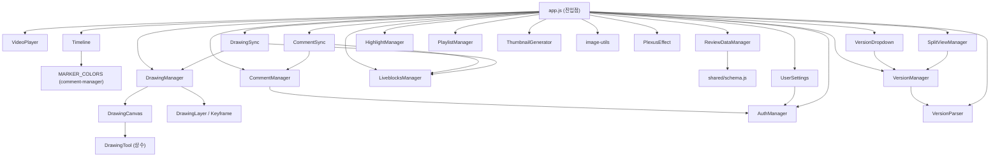

# Renderer 모듈 가이드

> 이 문서는 `renderer/scripts/modules/` 내 각 모듈의 역할과 관계를 설명합니다.
> 코드를 읽기 전에 전체 구조를 파악하기 위한 지도 역할을 합니다.

---

## 1. 개요

### 진입점

`renderer/scripts/app.js`가 앱의 진입점입니다. DOM이 준비되면 `initApp()` 함수가 실행되며, 모든 모듈을 순서에 맞게 인스턴스화하고 연결합니다.

### 모듈 초기화 순서 (app.js 기준)

`app.js`는 다음 순서로 모듈을 import합니다:

1. `VideoPlayer` — 비디오 재생 엔진
2. `Timeline` — 타임라인 UI
3. `DrawingManager`, `DrawingTool` — 그리기 통합 관리
4. `CommentManager`, `MARKER_COLORS` — 댓글 시스템
5. `ReviewDataManager` — `.bframe` 파일 I/O
6. `LiveblocksManager` — 실시간 협업 연결
7. `CommentSync` — 댓글 실시간 동기화
8. `DrawingSync` — 그리기 실시간 동기화
9. `HighlightManager`, `HIGHLIGHT_COLORS` — 타임라인 하이라이트
10. `getUserSettings` — 사용자 설정
11. `getAuthManager` — 인증
12. `getThumbnailGenerator` — 썸네일 생성
13. `PlexusEffect` — 배경 파티클 애니메이션
14. `getImageFromClipboard`, `selectImageFile`, `isValidImageBase64` — 이미지 유틸
15. `parseVersion`, `toVersionInfo` — 버전 파싱
16. `getVersionManager` — 버전 관리
17. `getVersionDropdown` — 버전 드롭다운 UI
18. `getSplitViewManager` — 스플릿 뷰
19. `getPlaylistManager` — 재생목록

---

## 2. 모듈 목록

| 모듈 파일 | 파일 크기 | 역할 | 주요 클래스 / export |
|-----------|-----------|------|----------------------|
| `video-player.js` | 24 KB | HTML5 비디오 재생, 프레임 단위 이동, 구간 반복 | `VideoPlayer` |
| `timeline.js` | 76 KB | 타임라인 눈금자, 플레이헤드, 줌, 레이어 헤더 렌더링 | `Timeline` |
| `drawing-canvas.js` | 16 KB | Canvas 2D API 직접 조작, 도구별 획 렌더링 | `DrawingCanvas`, `DrawingTool` |
| `drawing-layer.js` | 9 KB | 레이어·키프레임 데이터 모델 | `DrawingLayer`, `Keyframe` |
| `drawing-manager.js` | 32 KB | 레이어·캔버스·타임라인 통합 관리, 어니언 스킨 | `DrawingManager` |
| `drawing-sync.js` | 16 KB | 그리기 데이터 ↔ Liveblocks Broadcast 동기화 | `DrawingSync` |
| `comment-manager.js` | 31 KB | 프레임 마커 기반 댓글 CRUD, 답글, 색상 | `CommentManager`, `MARKER_COLORS` |
| `comment-sync.js` | 12 KB | 댓글 데이터 ↔ Liveblocks Broadcast 동기화 | `CommentSync` |
| `highlight-manager.js` | 11 KB | 타임라인 구간 하이라이트 CRUD | `HighlightManager`, `Highlight`, `HIGHLIGHT_COLORS` |
| `split-view-manager.js` | 65 KB | 두 버전 나란히/오버레이/와이프 비교 | `SplitViewManager` |
| `playlist-manager.js` | 24 KB | 재생목록 CRUD, 파일 탐색, 자동 재생 | `PlaylistManager` |
| `version-manager.js` | 8 KB | 폴더 스캔, 버전 목록 관리, 버전 전환 | `VersionManager`, `getVersionManager` |
| `version-dropdown.js` | 24 KB | 버전 드롭다운 UI, 수동 버전 추가, 프롬프트 모달 | `getVersionDropdown`, `showPromptModal` |
| `version-parser.js` | 8 KB | 파일명에서 버전 정보 추출 (`_v1`, `_re`, `_final` 등) | `parseVersion`, `toVersionInfo`, `isSameSeries`, `sortByVersion` |
| `liveblocks-manager.js` | 13 KB | Liveblocks Room 접속, Presence, Storage, Broadcast | `LiveblocksManager` |
| `auth-manager.js` | 12 KB | 인증 파일 기반 사용자 로그인, 세션, 테마 색상 | `AuthManager`, `getAuthManager` |
| `review-data-manager.js` | 27 KB | `.bframe` JSON 파일 저장·로드·마이그레이션 | `ReviewDataManager` |
| `user-settings.js` | 24 KB | 단축키, Slack 연동 등 사용자 설정 관리 | `getUserSettings` |
| `thumbnail-generator.js` | 16 KB | 비디오 썸네일 2단계 사전 생성 및 디스크 캐싱 | `ThumbnailGenerator`, `getThumbnailGenerator` |
| `image-utils.js` | 7 KB | 클립보드/파일 이미지 압축·리사이즈·Base64 변환 | `getImageFromClipboard`, `selectImageFile`, `isValidImageBase64`, `IMAGE_CONFIG` |
| `plexus.js` | 6 KB | 드롭존 배경의 파티클 연결선 애니메이션 | `PlexusEffect` |

---

## 3. 모듈 의존 관계 다이어그램

---

## 4. 기능 그룹별 상세

### 4.1 비디오 재생

**파일:** `video-player.js`

`VideoPlayer`는 `EventTarget`을 상속하며, HTML5 `<video>` 요소를 추상화합니다. mpv로 교체 가능하도록 인터페이스를 설계했습니다.

주요 기능:
- 재생/일시정지, 프레임 단위 이동 (`currentFrame`, `totalFrames`)
- 구간 반복 (`loop.inPoint`, `loop.outPoint`)
- 수동 seek 중 `timeupdate` 덮어쓰기 방지 (`_isSeeking` 플래그)
- 이벤트: `timeupdate`, `framechange`, `ended` 등을 dispatch하여 다른 모듈이 구독

---

### 4.2 그리기 시스템

**파일:** `drawing-canvas.js`, `drawing-layer.js`, `drawing-manager.js`, `drawing-sync.js`

4개 파일이 각자 다른 관심사를 담당합니다.

| 파일 | 책임 |
|------|------|
| `drawing-canvas.js` | Canvas 2D 컨텍스트 직접 조작. 펜·브러시·지우개·직선·화살표·사각형·원 도구 렌더링. `DrawingTool` 상수 정의 |
| `drawing-layer.js` | 데이터 모델 전담. `DrawingLayer`(레이어 메타정보)와 `Keyframe`(프레임별 캔버스 데이터) 클래스. JSON 직렬화/역직렬화 포함 |
| `drawing-manager.js` | 통합 오케스트레이터. `DrawingCanvas`와 `DrawingLayer`를 모두 소유하며 레이어 추가·삭제, 프레임 이동 시 캔버스 갱신, 어니언 스킨 렌더링을 담당 |
| `drawing-sync.js` | 네트워크 계층. `DrawingManager` 이벤트를 Liveblocks Broadcast로 내보내고, 원격 Broadcast를 수신해 `DrawingManager`에 적용. 1 MB 크기 제한 및 무한 루프 방지 플래그(`_isRemoteUpdate`) 포함 |

---

### 4.3 댓글 시스템

**파일:** `comment-manager.js`, `comment-sync.js`

`CommentManager`는 영상 프레임에 마커를 배치하고 댓글/답글을 CRUD합니다. `MARKER_COLORS` 상수를 export하며 `Timeline`도 이 색상 정의를 참조합니다.

`CommentSync`는 `CommentManager` 이벤트(`markerAdded`, `markerUpdated`, `markerDeleted`, `replyAdded`, `replyDeleted`, `replyUpdated`, `layerAdded`, `layerRemoved`)를 Liveblocks Broadcast로 전달하고, 원격 Broadcast를 수신해 로컬 상태를 동기화합니다.

---

### 4.4 타임라인

**파일:** `timeline.js`

`Timeline`은 `EventTarget`을 상속하며, 타임라인 전체 UI를 관장합니다. 줌(100%~800%), 플레이헤드 드래그, 댓글 마커 표시, 하이라이트 구간 표시, 그리기 레이어 헤더 렌더링을 담당합니다. `MARKER_COLORS`를 `comment-manager.js`에서 직접 import하여 마커 색상을 일치시킵니다.

---

### 4.5 버전 관리

**파일:** `version-manager.js`, `version-dropdown.js`, `version-parser.js`

세 파일이 파싱 → 관리 → UI 계층으로 분리됩니다.

| 파일 | 책임 |
|------|------|
| `version-parser.js` | 파일명 패턴 분석 유틸리티. `_v1`, `_re`, `_re2`, `_final` 등의 패턴을 정규식으로 파싱. `parseVersion`, `toVersionInfo`, `isSameSeries`, `sortByVersion` 함수 export |
| `version-manager.js` | 폴더를 스캔해 같은 시리즈의 버전 목록을 구성하고 버전 전환 이벤트를 발행. `VersionManager` 클래스, `getVersionManager` 싱글턴 getter |
| `version-dropdown.js` | 버전 목록을 드롭다운 UI로 표시하고, 수동 버전 추가 시 커스텀 프롬프트 모달(`showPromptModal`)을 띄움. `ReviewDataManager`를 외부 참조로 주입받아 저장 처리 |

---

### 4.6 스플릿 뷰

**파일:** `split-view-manager.js`

`SplitViewManager`는 두 버전을 동시에 재생하며 비교하는 기능을 담당합니다. 세 가지 뷰 모드(`side-by-side`, `overlay`, `wipe`)를 지원하며, 재생 동기화(`sync`) 및 독립 재생(`independent`) 모드를 갖습니다. `VersionManager`에서 버전 목록을 가져와 좌우 패널에 할당합니다. 파일이 65 KB로 가장 크며, 오버레이 투명도 조절과 와이프 핸들 드래그 로직도 포함합니다.

---

### 4.7 실시간 협업

**파일:** `liveblocks-manager.js`, `auth-manager.js`

`LiveblocksManager`는 Liveblocks 클라이언트 래퍼입니다. 각 `.bframe` 파일을 하나의 Room으로 매핑하고, Presence(커서, 재생헤드), CRDT Storage(댓글·하이라이트), Broadcast(그리기 데이터) 채널을 관리합니다. `LiveObject`, `LiveList`, `LiveMap`을 `globalThis`에 등록해 `CommentSync`, `DrawingSync`가 사용할 수 있게 합니다.

`AuthManager`는 인증 파일 기반 사용자 로그인과 세션을 관리합니다. 하드코딩된 admin 계정과 테마 색상(`AUTH_THEME_COLORS`)을 포함하며, `CommentManager`와 `UserSettings`가 현재 사용자 정보를 얻기 위해 참조합니다.

---

### 4.8 데이터 관리

**파일:** `review-data-manager.js`

`ReviewDataManager`는 `.bframe` JSON 파일의 단일 I/O 게이트웨이입니다. `shared/schema.js`의 `BFRAME_VERSION`, `needsMigration`, `migrateToV2` 등을 사용해 스키마 버전 관리와 마이그레이션을 처리합니다. Google Drive를 통한 파일 동기화에 대비해 오프라인 머지 로직(`mergeComments`)도 내장합니다.

---

### 4.9 UI / 유틸리티

**파일:** `user-settings.js`, `playlist-manager.js`, `highlight-manager.js`, `thumbnail-generator.js`, `image-utils.js`, `plexus.js`

| 파일 | 역할 |
|------|------|
| `user-settings.js` | `localStorage` 기반 사용자 설정 저장. 단축키 매핑(`DEFAULT_SHORTCUTS`), Slack 연동 정보 관리. `AuthManager`에서 사용자 정보를 가져와 설정에 연동 |
| `playlist-manager.js` | 재생목록 CRUD 및 파일 탐색. 최대 50개 항목(`MAX_PLAYLIST_ITEMS`), 자동 재생, 드래그 앤 드롭 추가 지원. 스키마 버전 `1.0` 내부 관리 |
| `highlight-manager.js` | 타임라인에 색상 구간 하이라이트를 추가·삭제합니다. `Highlight` 데이터 클래스와 `HIGHLIGHT_COLORS` 상수를 export. `Timeline`이 이 데이터를 구독해 렌더링 |
| `thumbnail-generator.js` | 비디오 로드 후 2단계(빠른 스캔 5초 간격 → 세부 채움 1초 간격)로 썸네일을 사전 생성하고 디스크에 캐싱. `EventTarget` 상속으로 완료 이벤트 발행 |
| `image-utils.js` | 댓글 첨부 이미지 처리. 클립보드에서 이미지 가져오기(`getImageFromClipboard`), 파일 선택(`selectImageFile`), Base64 유효성 검사(`isValidImageBase64`), 1920×1080 이하 압축·리사이즈 |
| `plexus.js` | 파일이 열리기 전 드롭존 배경에 표시되는 파티클 연결선 애니메이션(`PlexusEffect`). 색조가 warm → cool로 순환하며 삼각형 채움 효과 포함 |
