# BAEFRAME UI 심층 리뷰와 화면 설계 제안

2026.09.06 · 보강판 2 · BAEFRAME 기본 화면 + BEditer 전체 UI · 의사결정용 연구 보고서

**권고: 리뷰와 영상 제작의 목적은 유지하면서, 도구·선택 대상·시간·저장 상태의 문법을 먼저 통일한다.** 그 위에서 화면 공간을 조절하고 타임라인을 다시 설계해야 한다. 어두운 배경과 작은 버튼을 늘리는 것만으로는 전문 작업 도구의 신뢰를 얻기 어렵다.

이 문서는 기존 UX 보고서를 보존한 뒤, 새 편집기 개선까지 반영된 `5d1cb89`를 기준으로 다시 조사한 결과다. **앱 기능을 변경한 문서가 아니며, 아래 설계 그림은 모두 미구현 제안이다.** 현재 화면·측정·코드에서 확인한 문제와 후속 기능 제안을 구별했다. 이미 고친 획 이동 문제를 다시 미해결로 세지 않았다.

**이번 보강의 중심은 BAEFRAME 기본 앱과 BEditer를 같은 완성도로 제안하는 것이다.** 기존 구조도만으로는 BAEFRAME에서 영상을 열고, 댓글을 읽고 쓰며, 그림으로 리뷰하는 전체 모습이 부족했다. 기본 리뷰 → 드로잉 리뷰 → 기본 편집 → 세로 영상·드로잉 편집 순서로, 실제 내용과 상태를 채운 **완성 화면 시안 4장**과 기능별 새 위치를 추가했다. [새 완성 화면 4장 바로 보기](#finished-ui)

**현재 화면 캡처 27개**(리뷰 13개 + 편집 14개)를 수집하고, 공식 5개 제품의 15개 문서와 UI 이미지 6개를 대조했다. 본문에는 현재 대표 화면 17개, 공식 참고 6개, 완성 화면 시안 4개, 구조 설명 4개를 합쳐 **이미지 31개**를 배치했다. 이미지 선택 시 원본을 크게 볼 수 있다. 데스크톱 앱을 평가한 보고서이며, 이 **보고서의 모바일 열람**과 **앱의 모바일 지원**은 별개다.

## 1. 가장 먼저 결정해야 할 것

### 전문 UI의 목표는 ‘조작 결과를 예측할 수 있는 화면’이다

BAEFRAME의 강점은 영상을 보며 프레임에 직접 그리는 방식이다. 여기에 자르기·붙이기·영상 정지·짧은 릴 제작이 들어오면 하나의 화면에 서로 다른 대상이 등장한다. 영상 클립을 자르는 일, 그림의 일부 획을 옮기는 일, 같은 그림을 8프레임 유지하는 일, 리뷰 댓글의 적용 구간을 고르는 일은 모두 다른 작업이다. 그런데 모두 ‘선택’, ‘프레임’, ‘저장’이라는 짧은 말로만 표시하면 사용자는 실행 직전까지 결과를 추측해야 한다.

이번 조사에서 가장 중요한 발견은 **표시 상태와 실제 입력 상태가 어긋나는 사례**, **핵심 조작이 화면 밖으로 밀리는 사례**, **같은 시간 정보를 여러 단위로 해석해야 하는 구조**다. 이들은 취향의 문제가 아니다. 반면 색상 통일, 글자 크기, 패널 위치는 이 문제를 해결하도록 설계하고 실제 과제로 평가해야 할 제안이다.

| 결정 | 권고 | 이유와 지켜야 할 경계 |
|---|---|---|
| 제품 구조 | 리뷰와 영상 제작에 공통 화면 규칙을 적용하되, 우선 기존의 별도 창 구조 유지 | 파일 형식과 저장 책임까지 한 번에 합치면 UI 개선이 데이터 구조 개편으로 확대된다. 화면 문법부터 통일할 수 있다. |
| 작업 대상 | 도구 이름 옆에 대상·레이어·범위를 함께 표시 | ‘선택 V’만으로는 컷 선택인지 그림 선택인지 알기 어렵다. 예: ‘컷 04 / 포즈 / 그림 2개 / 24–32F’. |
| 타임라인 | 영상 전체 개요와 선택 컷의 드로잉 상세를 구분 | 짧은 릴의 컷 배열과 1프레임 단위 드로잉은 필요한 확대 수준이 다르다. |
| 밀도 | 글자 축소보다 패널 접기·경계 조절·명령 우선순위 적용 | 좁은 창과 세로 영상에서 현재 고정 배분은 실제 작업 영역을 지나치게 줄인다. |
| 저장·공유 | 로컬 저장, 리뷰 연결, 다른 사람에게 전달, 영상 출력을 별도 상태로 표시 | 하나의 체크나 토스트로 보존 범위를 설명할 수 없다. 현재 확인하지 않은 외부 전달 성공을 표시해서도 안 된다. |

**우선 해결할 항목은 U01·U05·U06이다.** 활성화된 것처럼 보이는 도구의 무응답과 화면 밖으로 사라지는 핵심 조작부터 해소해야 한다. 이후 U02–U04의 실패·저장 경로, U10–U14의 선택·시간·공간 구조를 정리한다. 외형 통일은 이 구조를 공통 부품으로 구현하는 단계에서 진행한다.

## 2. 조사 범위와 근거의 한계

### 무엇을 직접 확인했는가

| 근거 | 이번 확인 방식 | 판단할 수 있는 범위 |
|---|---|---|
| A · 리뷰창 실제 앱 | 기존 패키지 EXE, 별도 테스트 프로필, 합성 영상·댓글, 실제 파일 열기·설정·드로잉·저장. 네이티브 영상과 오버레이가 포함된 앱 영역 캡처 13개 | 해당 조건의 배치·표시·입력·저장 응답. 외부 협업은 제외 |
| A′ · 편집창 실제 renderer | 현재 HTML·스크립트·드로잉 번들을 격리 Chrome에서 실행. 실제 마우스·키보드·영상 디코딩·V3 드로잉. 캡처 14개 | 현재 편집 화면의 동작. 파일 대화상자·저장 IPC는 시험용 연결이므로 운영체제 전체 흐름은 제외 |
| B · 현재 소스 | 화면 상태, CSS, 명령 처리, 저장/열기 코드를 캡처와 대조 | 구조와 조건을 확인. 코드만으로 실제 사용 빈도나 모든 실패를 확정하지 않음 |
| C · 공식 타사 자료 | Premiere·Animate·Resolve·Harmony·Frame.io 공식 문서 15개와 삽입 UI 이미지 6개 | 공식 설명과 화면 구성의 참고. 타사 앱을 직접 설치·조작한 비교는 아님 |
| D · 설계 판단 | 위 근거를 바탕으로 문제·해결안·수용 기준 작성 | 후속 프로토타입과 사용성 검증이 필요한 권고 |

리뷰창 기본 조건은 1440×900, 좁은 창은 1100×720이며 DPR은 1.5다. 별도 페이지 확대 125% 스트레스 캡처만 DPR 1.875다. 외부 전송을 막기 위해 HTTP(S)를 차단했고, Pretendard CDN의 한국어 서브셋 15개 요청도 차단됐다. 따라서 **폭·줄바꿈 실측은 이 오프라인 조건의 결과**이며 일부 글리프가 대체 글꼴로 표시되었을 수 있다. 해당 구조의 CSS도 함께 확인했지만 온라인 글꼴에서 정확히 같은 픽셀 값이 나온다는 뜻은 아니다.

편집창은 1440×900와 1050×720에서 가로·세로 영상, 긴 원본 이름, 동일 원본 12컷으로 구성한 6분 편집, 9개 그림 레이어를 확인했다. 출력 화면의 43%는 진행 UI를 관찰하기 위해 주입한 값이다. 누락 원본 오류는 실제 미디어 검사에서 만든 ENOENT를 열기 응답으로 반환했다. 최종 MP4 품질이나 실제 인코딩 진행률의 정확성을 이 조사로 검증한 것은 아니다.

### 이전 개선과 이번 문제를 구분한다

| 앞선 피드백 | 이번 판단 |
|---|---|
| 획을 옮기면 엉뚱한 좌표로 이동 | 이전 개선 기준선을 유지한다. 이번에 새로 찾은 U01은 입력 활성 상태 문제이며, V를 다시 선택한 뒤에는 선택과 위치가 정상이다. |
| 편집창에서 도구 전환 시 배치가 튐 | V/C/H 전환 전후 스테이지 배치는 이번 검사에서 유지됐다. 리뷰창의 큰 부동 팔레트 U07은 별도 화면의 공간 문제다. |
| 화면 이동과 그림 수정의 충돌 | 편집창 H/가운데 버튼 팬 후 V3 내용이 달라지지 않음을 확인했다. 체감 성능을 모든 PC에서 보장한 것은 아니다. |
| 타임라인 확대·의미 없는 격자 | 편집창 확대와 적응형 눈금은 이미 존재한다. 이번 U12는 6분 전체 맞춤에서 인접 키가 겹치는 잔여 문제다. |
| 현재 도구 표시 없음 | 편집창과 리뷰 팔레트 모두 활성 표시가 있다. ‘어디에도 표시가 없다’고 다시 쓰지 않는다. U01은 표시와 실제 입력의 불일치다. |

초기 실험에서 검게 나온 영상은 네이티브 영상 창을 캡처에 포함하지 않은 도구상의 문제였고, 빈 댓글은 시험 데이터 필드 오류였다. 둘 다 수정 후 다시 수집했으며 제품 문제에서 제외했다. 정적 검사에서 나온 빈 이미지 주소 3개도 숨겨진 미리보기의 초기 상태여서 현재 화면의 깨진 이미지로 세지 않았다.

## 3. 현재 화면에서 드러나는 구조

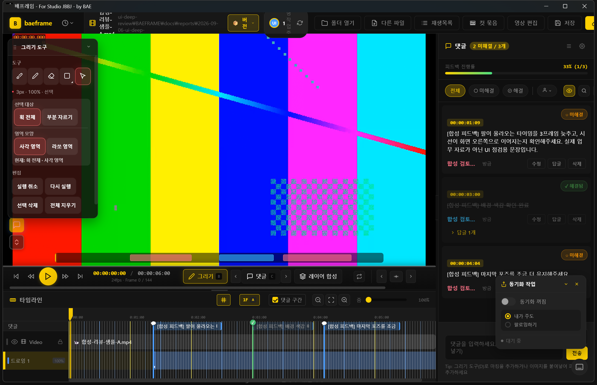

현재 앱 · 선택 도구가 정상 활성화된 리뷰창. 영상 왼쪽을 덮는 큰 팔레트, 아래쪽의 여러 도구 줄, 오른쪽 댓글 입력부와 겹치는 동기화 패널이 동시에 보인다. 합성 영상·댓글, 오프라인 1440×900 조건. 이 화면의 활성 표시 자체는 정상이다.

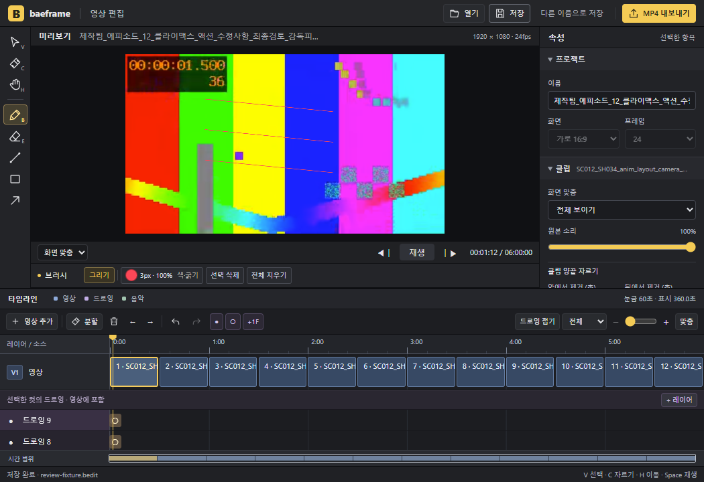

현재 편집 renderer · 1050×720, 6분·12컷·9레이어. 같은 원본의 컷 이름이 비슷하게 잘리고 인접 드로잉 키가 겹친다. 이 화면은 실제 renderer 입력과 시험용 파일 IPC를 사용했다.

두 창은 모두 어두운 바탕과 노란 강조를 쓰지만 정보의 위치와 밀도가 다르다. 리뷰창은 영상·댓글·협업 상태가 같은 공간을 경쟁하고, 편집창은 프로젝트 속성과 선택 컷 속성이 한 패널에서 계속 이어진다. 도구를 한 줄 줄이는 것보다 먼저 **각 영역이 책임지는 정보**를 정해야 한다.

| 영역 | 지금의 부담 | 새 설계에서 맡길 책임 |
|---|---|---|
| 문서 헤더 | 긴 경로·버전·연결·여러 명령이 경쟁 | 문서 정체성, 수정/저장 상태, 핵심 저장·출력 명령 |
| 미리보기 | 부동 도구·알림·선택 표시가 겹침 | 영상과 그림, 현재 입력 대상, 보기 배율 |
| 도구 바 | 도구·문맥 설정·도움말·편집 명령 혼재 | 활성 도구와 현재 도구에 필요한 최소 설정 |
| 오른쪽 패널 | 리뷰는 댓글과 협업, 편집은 프로젝트와 컷의 상세가 혼재 | 리뷰에서는 피드백 대상, 제작에서는 현재 선택 대상의 속성 |
| 타임라인 | 전체 컷·프레임·레이어가 같은 확대 수준을 공유 | 편집 개요와 선택 컷의 상세 시간 구조, 명시적 범위 |
| 상태 영역 | 성공 메시지가 다음 메시지로 바뀜 | 지속되는 문서 상태와 일시 작업 진행을 분리 |

## 4. 타사 UI에서 무엇을 가져올 것인가

공식 문서의 기능 설명, 이미지에서 보이는 배치, BAEFRAME에 적용할 판단을 구별한다. 아래에서 **‘적용’은 이 보고서의 제안**이다. 특정 회사의 레이아웃·아이콘을 그대로 복제하는 안이 아니다. 모든 자료는 2026-09-06 확인 기준이며, 문서 갱신일과 스크린샷 촬영 시점은 다를 수 있다.

### Premiere — 도구의 의미와 작업 영역을 읽게 한다

공식 도움말은 도구 선택에 따라 커서가 바뀌고, Razor가 클릭한 클립 지점에서 분할하며, Hand가 타임라인의 보기를 이동한다고 설명한다. 도구 이름과 단축키는 호버로 확인한다. 패널은 크기와 배치를 조절할 수 있다. [Adobe 도구 문서](https://helpx.adobe.com/premiere/desktop/get-started/tour-the-workspace/tools-panel-and-options-panel.html), [패널 조절](https://helpx.adobe.com/premiere/desktop/get-started/tour-the-workspace/customize-panels.html)

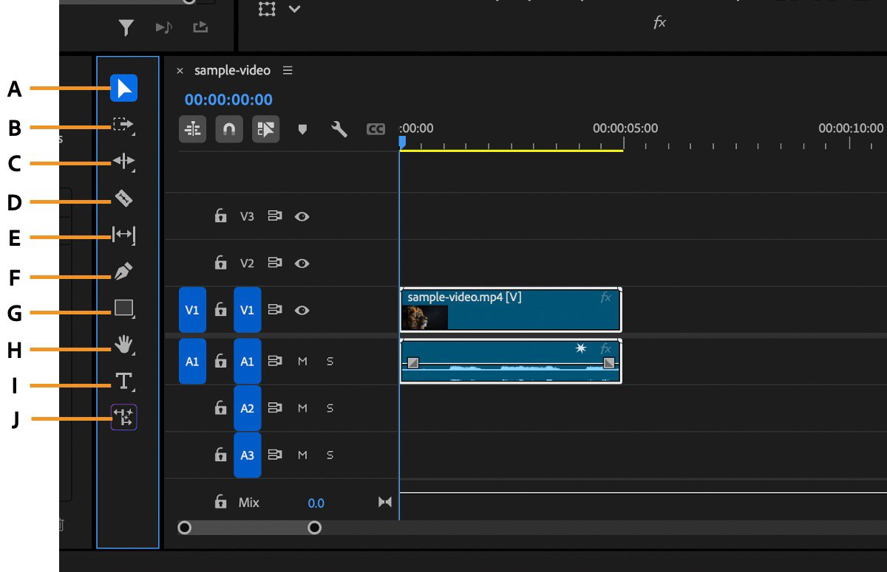

Adobe 공식 도움말 이미지 · 세로 도구 열, 활성 도구, 트랙 헤더를 참고한다. 이미지의 A–J는 설명용 표식이며 단축키 표가 아니다. 정지 이미지가 모든 커서 동작을 입증하지는 않는다.

**적용:** BAEFRAME의 V/C/H/B는 도구 이름·대상·커서가 함께 바뀌어야 한다. C로 자를 때 클릭 예정 프레임과 적용될 컷을 먼저 보여준다. 패널의 경계 조절도 사용자가 실제 작업 비중에 맞춰 공간을 바꾸는 수단으로 도입한다. **가져오지 않을 것:** 복잡한 모든 편집 도구의 초기 노출. Premiere의 Pen이 다루는 효과 키프레임과 BAEFRAME의 자유 드로잉 획은 다른 대상이다.

### Animate — 그림의 시작과 유지, 빈 상태를 시간에 연결한다

공식 문서는 새 내용이 시작되는 키프레임, 빈 키프레임, 같은 내용이 지속되는 구간을 구별한다. 프레임 단위 선택과 구간 단위 선택도 별개다. 타임라인 보기에서는 프레임 크기와 표시 방식을 조절할 수 있다. [Adobe 프레임·키프레임](https://helpx.adobe.com/animate/desktop/animation/frames-keyframes.html), [Animate 타임라인](https://helpx.adobe.com/animate/desktop/workspace-and-workflow/timeline.html)

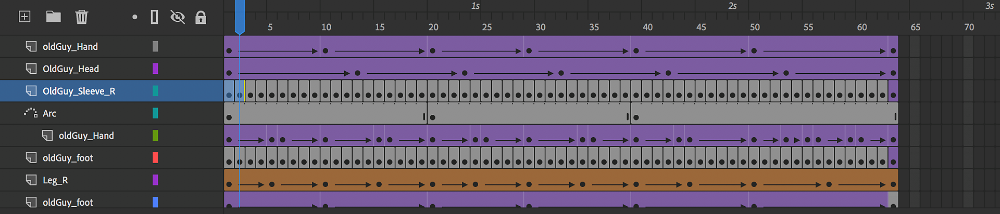

Adobe 공식 타임라인 이미지 · 레이어 선택과 프레임 행, 눈금, 플레이헤드의 관계를 참고한다. 트윈이 포함된 예시이며 BAEFRAME가 같은 보간 기능을 지원한다는 뜻은 아니다.

**적용:** 사용자가 원하는 Animate식 드로잉의 핵심은 촘촘한 사각 격자의 외형이 아니라 **그림이 언제 바뀌고 얼마 동안 유지되는지 읽히는 구조**다. 확대할 때는 프레임 셀을, 축소할 때는 유지 구간과 변경 지점을 보여준다. 빈 키와 레이어 숨김도 구별한다. **주의:** 프레임 선택과 획 선택을 같은 강조색 하나로 표현하면 적용 범위를 혼동할 수 있다.

### DaVinci Resolve — 전체 맥락과 세부 편집을 분리한다

Cut 페이지는 위쪽에 전체 편집, 아래쪽에 확대된 작업 구간을 두는 이중 타임라인을 설명한다. 편집점 위 포인터 위치에 따라 트림 커서가 바뀌는 동작도 안내한다. [Blackmagic Design Cut](https://www.blackmagicdesign.com/products/davinciresolve/cut)

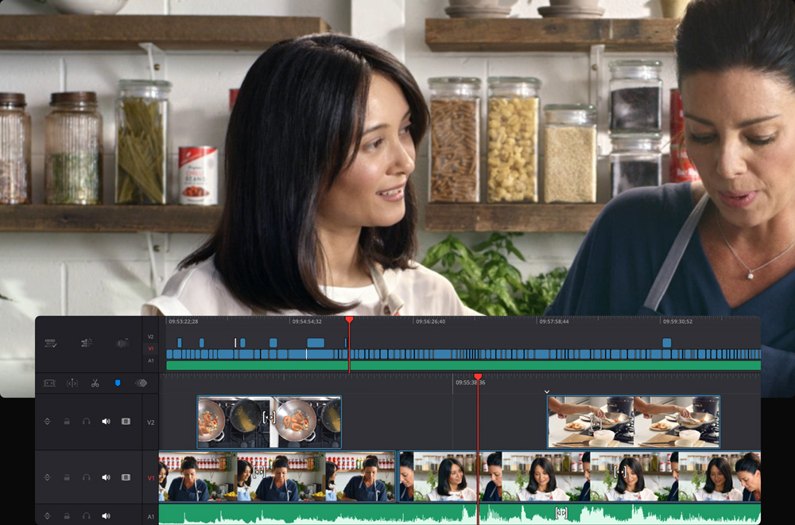

Blackmagic Design 제품 페이지의 합성 소개 이미지 · 전체 개요와 확대 영역의 관계를 설명하는 참고다. 실제 전체 앱 창의 정확한 픽셀 배치를 재현한 자료로 취급하지 않는다. 페이지는 확인 당시 Resolve 21을 안내하며 갱신 날짜는 표기하지 않는다.

**적용:** BAEFRAME에는 작은 전체 개요를 남기고 선택 컷의 드로잉을 세밀하게 보는 방식이 적합하다. 6분 전체 맞춤에서 12F 간격의 키를 억지로 모두 누르게 할 필요가 없다. **주의:** 화면 높이가 낮을 때 완전한 타임라인 두 개를 항상 펼치면 오히려 미리보기가 작아진다. 개요는 얇게 유지하고 필요할 때 상세를 펼치는 안을 검증한다.

### Harmony — 그림 내용과 노출 길이를 별개로 다룬다

Harmony 문서는 한 그림이 보이는 프레임 수를 노출로 다루고, 여러 그림의 노출 길이 변경과 빈 구간 채우기를 명시적 작업으로 설명한다. [Harmony 25 노출 개념](https://docs.toonboom.com/help/harmony-25/advanced/timing/about-exposure.html), [동일 노출 설정](https://helpcentre.toonboom.com/hc/en-ca/articles/41575716406547-How-do-I-change-my-drawings-to-all-have-the-same-exposure), [그림 사이 빈 구간 채우기](https://helpcentre.toonboom.com/hc/en-ca/articles/44457300755347-How-do-I-fill-in-gaps-between-my-drawing-frames)

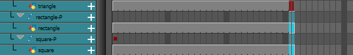

Toon Boom 공식 도움말의 600×95 부분 이미지 · 레이어와 선택 범위만 보여준다. 노출 설정 대화상자나 실행 결과는 이 이미지에 없으며 기능 설명은 연결된 본문에 근거한다.

**적용:** ‘이 그림을 8F 유지’와 ‘영상의 이 프레임을 8F 정지’는 별도 명령과 표식을 가져야 한다. 드로잉 구간을 늘렸다고 영상 재생이 멈추거나 컷이 길어졌다고 오해하게 해서는 안 된다. **주의:** 향후 노출 편집을 도입할 때 현재 저장 모델과 컷 분할 후 그림 소유권을 먼저 정해야 한다. 화면 띠만 늘리는 구현으로 끝낼 수 없다.

### Frame.io — 피드백의 대상·구간·버전을 놓치지 않게 한다

공식 댓글 문서는 단일 시점과 구간 댓글을 구분한다. 비교 보기에는 각 자산 이름과 댓글 대상이 남아 있으며, 버전 관리와 댓글 완료는 서로 다른 개념이다. [미디어 댓글](https://help.frame.io/en/articles/9105251-commenting-on-your-media), [비교 보기](https://help.frame.io/en/articles/9952618-comparison-viewer), [버전 관리](https://help.frame.io/en/articles/9101068-versioning-in-frame-io), [댓글 패널·완료 상태](https://help.frame.io/en/articles/9105278-comments-panel-overview)

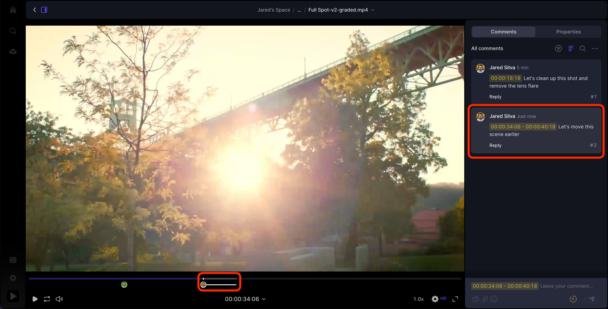

Frame.io 공식 도움말 이미지 · 구간의 시작·끝과 댓글 패널의 관계를 참고한다. 2025년 문서의 예시 화면이며 주황 테두리는 원본 설명 이미지에 포함되어 있다.

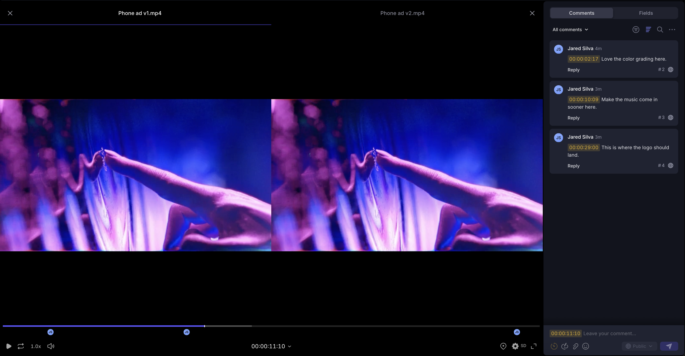

Frame.io 공식 비교 도움말 이미지 · 각 파일명과 피드백 대상의 정체성을 참고한다. 이미지 파일명은 2024-10-03, 문서 갱신은 2026년이므로 최신 UI 캡처라고 주장하지 않는다.

**적용:** 댓글 카드에서 적용 구간과 작성자를 읽을 수 있어야 하고, 원본 리뷰에서 작성한 피드백이 편집 결과의 어느 컷에 대응하는지 표시해야 한다. **주의:** 댓글 해결, 로컬 저장, 공유 전달, 출력 완료를 같은 체크로 통합하지 않는다. 비교 기능과 클라우드 버전 관리를 이번 UI 개편의 필수 구현으로 확대하지도 않는다.

### 비교 결과를 BAEFRAME에 맞게 걸러낸다

| 필요 | 가장 직접적인 참고 | BAEFRAME의 적용 판단 | 그대로 적용할 때의 위험 |
|---|---|---|---|
| C로 클릭 분할, 활성 도구 | Premiere | 도구·커서·예정 위치·대상 표시 | 보조 도구를 모두 노출해 초심자의 밀도 증가 |
| 그림 키·유지·빈 프레임 | Animate + Harmony | 드로잉 시간의 별도 문법 유지 | 영상 정지와 그림 노출을 같은 막대로 혼합 |
| 긴 편집의 세부 키 조작 | Resolve | 전체 개요 + 선택 컷 상세 | 타임라인 두 개의 높이를 과도하게 사용 |
| 댓글의 시간·작성자·버전 | Frame.io | 피드백 정체성과 구간을 지속 표시 | 현재 없는 클라우드 기능까지 약속 |
| 작업별 패널 밀도 | [Premiere 작업 영역](https://helpx.adobe.com/premiere/desktop/get-started/tour-the-workspace/what-are-workspaces.html) | 소수의 레이아웃과 경계 조절 | 자유 배치 기능부터 만들며 복잡성 증가 |

## 5. 문제 목록과 우선순위

P1은 주 작업의 입력 또는 핵심 조작 접근을 직접 막아 우선 수정할 항목, P2는 반복 혼란·오류 복구·가독성을 해치는 항목, P3는 체계를 정리하거나 구조 결정이 필요한 항목이다. **우선순위는 데이터 손실의 증거나 근거 신뢰도와 같지 않다.** 이번 조사에서 데이터 손실을 새로 확정한 항목은 없다.

| ID | 문제 | 우선순위 | 근거 성격 |
|---|---|---|---|
| [U01](#u01) | V 활성 표시와 실제 그림 선택 입력 불일치 | P1 | A′+B 재현 |
| [U02](#u02) | 열기 오류 후 미리보기 준비 표시 잔류 | P2 | A′+B 재현 |
| [U03](#u03) | 이름 입력 중 Ctrl+S 무동작 | P2 | A′+B 재현 |
| [U04](#u04) | 원본 누락 시 다시 연결하는 경로 부재 | P2 | B+시험 오류 화면, 복구 설계 |
| [U05](#u05) | 긴 이름·경로가 헤더와 저장 버튼을 밀어냄 | P1 | A+B 조건부 실측 |
| [U06](#u06) | 좁은 리뷰창에서 패널과 타임라인 충돌 | P1 | A+B 실측 |
| [U07](#u07) | 리뷰 선택 팔레트가 영상 가림 | P2 | A+B 공간 설계 |
| [U08](#u08) | 재생·그리기·합성·볼륨의 긴 가로 줄 | P2 | A+B 실측 |
| [U09](#u09) | 꺼진 동기화 패널이 댓글 입력부 가림 | P2 | A+B 관찰, 원인 일부 미확정 |
| [U10](#u10) | 속성에서 선택한 컷의 정체성 부족 | P2 | A′+B 설계 |
| [U11](#u11) | 편집·컷·원본 시간과 초/F 단위 혼재 | P2 | A′+B 설계 |
| [U12](#u12) | 전체 맞춤에서 인접 그림 키 겹침 | P2 | A′+B 실측 |
| [U13](#u13) | 고정 패널 배분과 작은 세로 미리보기 | P2 | A′+B 실측 |
| [U14](#u14) | 수동 확대 후에도 보기 값은 ‘전체’ | P3 | A′+B 재현 |
| [U15](#u15) | 댓글 카드에 구간의 끝이 보이지 않음 | P2 | A+B 설계 |
| [U16](#u16) | 작성자 이름보다 반복 액션이 공간 차지 | P2 | A+B 조건부 실측 |
| [U17](#u17) | 의미 있는 안내 텍스트의 낮은 대비 | P2 | A+B 평면 배경 측정 |
| [U18](#u18) | 작은 글자와 고정 높이, 확대 시 잘림 | P2 | A′+B, 통제된 글자 확대 |
| [U19](#u19) | 안내 D와 실제 그리기 기본 키 B 불일치 | P2 | A+B 코드·화면 |
| [U20](#u20) | 앱 전체 설정이 댓글 설정 아래 존재 | P2 | A+B 정보 구조 |
| [U21](#u21) | 첫 실행 이름 입력이 영상 열기까지 차단 | P2 | A+B, 정책 개선 제안 |
| [U22](#u22) | 작성자 필터·출력 진행의 접근 가능한 이름 누락 | P2 | A/A′+B 표본 검사 |
| [U23](#u23) | 저장한 문서의 이름·위치·시점이 지속되지 않음 | P2 | A/A′+B 상태 설계 |
| [U24](#u24) | 출력 대상·단계·진행을 다시 확인하기 어려움 | P2 | A′ fixture+B 표시 검토 |
| [U25](#u25) | 리뷰·제작의 시각 규칙과 설정 분리 | P3 | B+D 체계 제안 |
| [U26](#u26) | 작업 문맥에 따른 명령 의미를 설명할 공통 규칙 부족 | P3 | B+C+D 구조 제안 |

## 6. 입력·실패·저장의 신뢰를 먼저 회복한다

### U01 · 활성화된 선택 도구가 첫 드래그를 받지 않는다

**P1 · 재현한 동작 · 편집창 ED-02.** 저장된 V3 그림 프로젝트를 새 편집 페이지에서 열면 V의 `aria-pressed=true`와 ‘선택’ 표시가 보인다. 그러나 실제 `drawingMode=false`, 그림 오버레이의 `pointer-events=none`이다. 첫 드래그는 그림을 선택하지 않고, V를 다시 누른 뒤 같은 드래그는 정상 선택한다.

<figure><figcaption>첫 열기: 표시와 실제 입력 상태가 다름.</figcaption></figure><figure><figcaption>V를 다시 선택: 같은 그림의 선택이 정상 작동.</figcaption></figure>

**왜 문제인가:** 사용자는 자신이 잘못 드래그했는지, 레이어가 잠겼는지, 과거 좌표 버그가 재발했는지 알 수 없다. 이미 활성인 버튼을 다시 눌러야 하는 규칙은 화면에서 설명되지 않는다. 앞선 좌표 오류와 다른 문제다.

**구조와 해결:** 기본 도구 값과 드로잉 입력 허용 값이 별개로 시작한다. 기본 V를 실제 사용 가능한 선택 상태로 초기화하거나, ‘영상 선택 / 그림 입력 잠금’을 서로 다른 상태로 명시해야 한다. 현재 제품 목적에는 활성 도구가 실행 가능한 입력을 뜻하도록 상태를 합치는 안을 우선한다. 근거: `renderer/scripts/editor/editor.js:12,26,745,767`.

**부작용·완료 기준:** 자동 활성화가 영상 드래그나 텍스트 입력을 가로채지 않아야 한다. 새 창→그림 있는 프로젝트 열기→V 재입력 없이 그림 선택·이동→저장·재열기까지 동일한 대상과 위치를 유지해야 한다. 입력 차단 중이면 활성 도구로 보이게 두지 않고 차단 이유를 표시한다.

### U02 · 열기 실패가 현재 작업 화면을 ‘준비 중’처럼 남긴다

**P2 · 재현한 동작 · ED-01.** 정상 프로젝트가 열린 상태에서 누락 원본 오류를 반환하면 `busy=false`인데 `body.editor-seeking=true`가 남는다. CSS는 실제 영상과 드로잉 오버레이를 숨기고 이전 스틸을 보여준다. 화면이 남아 있어 정상처럼 보이지만 입력 대상은 가려진다.

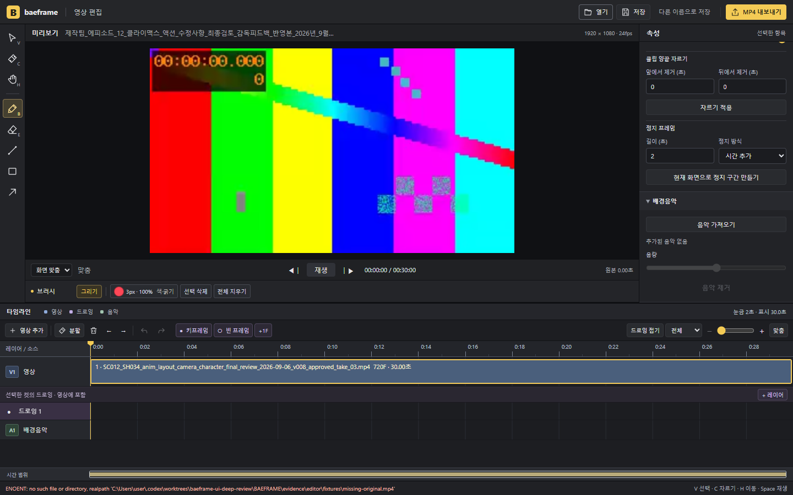

현재 renderer + 실제 미디어 검사에서 얻은 ENOENT를 반환한 시험 연결. 하단 영문 오류와 남아 있는 미리보기 상태를 관찰했다. 영구 멈춤이나 데이터 손실을 재현한 화면은 아니다.

**왜 문제인가:** 다른 파일 열기에 실패했을 뿐인데 기존 작업도 고장난 것처럼 보인다. 작은 오류 문구와 실제 작업 가능 상태가 다른 이야기를 한다.

**구조와 해결:** 성공·실패가 공통으로 종료해야 할 미리보기 준비 상태를 정리한다. 실패 시 이전 프로젝트의 준비 완료 상태를 복원하거나 다시 준비한다. ‘열기 실패, 현재 프로젝트는 유지됨’처럼 대상과 영향을 말한다. 근거: `editor.js:117,264`, `editor.css:349`.

**부작용·완료 기준:** 늦게 도착한 이전 미리보기가 새 프로젝트를 덮지 않도록 작업 식별을 유지한다. 정상 파일→실패 파일→현재 그림 입력→다른 정상 파일 순서에서 준비 상태가 남지 않아야 한다. 성공하는 추가 탐색으로 회복 가능한 현상이므로 앱 전체 영구 정지로 과장하지 않는다.

### U03 · 이름을 입력하면서 누른 Ctrl+S가 조용히 무시된다

**P2 · 재현한 동작 · ED-03.** 프로젝트 이름 입력칸을 수정하고 포커스를 유지한 채 Ctrl+S를 누르면 저장 호출은 0회다. 입력칸 값만 바뀌고 프로젝트 이름은 이전 값이다. 이어 마우스로 저장하면 새 이름까지 정상 저장된다.

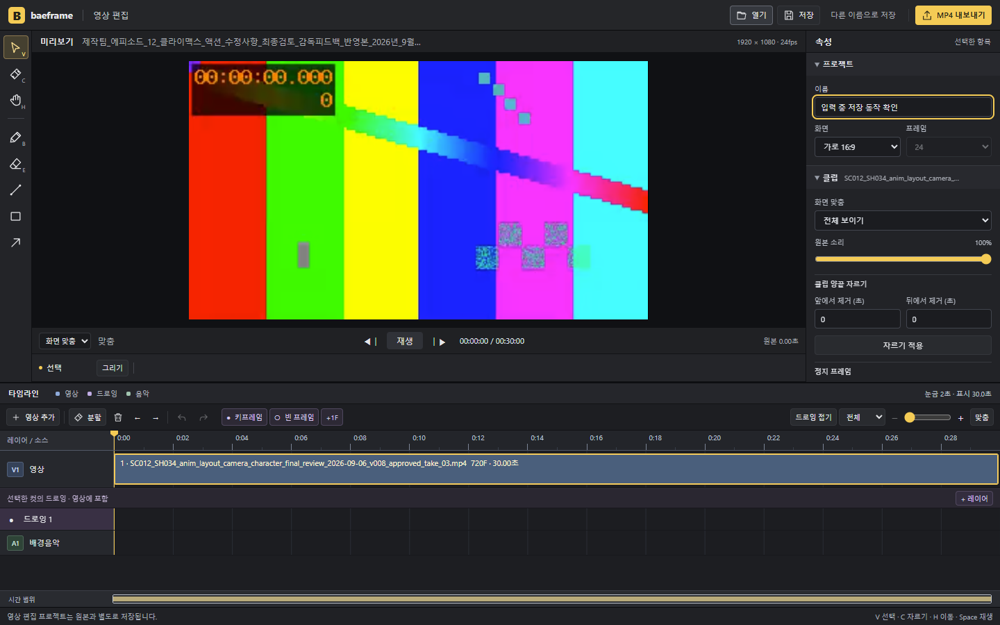

**왜 문제인가:** 문서 이름이나 숫자를 고친 직후 저장하는 자연스러운 순서에서 아무 피드백 없이 저장이 생략된다. 마우스 저장 시 이름이 빠지던 과거 문제와 혼동해서는 안 된다. 그 부분은 이번에 정상이다.

**구조와 해결:** 키 처리기가 모든 입력칸에서 먼저 반환한다. 문자 도구 단축키(B/C/V)와 문서 명령(Ctrl+S)을 분리한다. 저장 명령은 현재 입력을 검증·확정하고 저장한다. 근거: `editor.js:1289,1303,1220`.

**부작용·완료 기준:** 입력 중 Ctrl+Z는 우선 텍스트 편집에 적용하고, 한글 조합 중인 글자를 잘라 저장하지 않아야 한다. 이름·숫자·일반 텍스트 필드 각각에서 저장 호출이 한 번 발생하며 마지막 입력이 포함되는지 확인한다. 유효하지 않은 숫자는 저장 성공처럼 표시하지 않고 해당 필드로 안내한다.

### U04 · 원본이 없을 때 사용자가 복구할 길이 없다

**P2 · 복구 설계 공백 · ED-04.** 현재 열기 처리는 참조 원본을 검사한 뒤 프로젝트를 반환한다. 하나가 없으면 전체 열기를 거절하고 하단에 영문 ENOENT와 경로가 나타난다. 누락 파일 목록이나 ‘다시 연결’이 없다. U02는 실패 후 기존 화면 상태의 버그이고, 이 항목은 누락 프로젝트의 복구 경로 문제다.

**왜 문제인가:** 폴더를 옮긴 사용자는 편집 구조를 확인하면서 원본 위치를 연결할 수 없다. 오류 문자열이 해결 행동을 대신한다.

**해결:** ‘원본 영상 1개를 찾을 수 없습니다’와 파일 이름을 보여주고 다시 연결, 다른 파일 열기, 현재 작업으로 돌아가기를 제공한다. 이후 단계에서 편집 구조를 읽기 전용으로 여는 방안을 검토한다. 복구 전 출력은 명확히 제한한다. 근거: `main/editor-window.js:156,172`, `main/editor-media.js:69`, `editor.js:39`.

**부작용·완료 기준:** 같은 파일명이라는 이유만으로 다른 영상을 자동 대체하면 안 된다. 새 원본의 길이·규격이 편집 범위를 만족하는지 확인하고 차이를 보여준다. 누락 1개/여러 개, 취소, 잘못된 대체, 재연결 후 재열기를 검증한다. 원본 파일을 임의 수정하는 기능으로 확대하지 않는다.

### U23 · 저장 상태가 사라지면 어느 문서에 반영됐는지 남지 않는다

**P2 · 두 창 공통 상태 설계 · RV-13 + ED-10.** 리뷰창에는 접근성 상태 알림과 저장 칩이 존재하고 합성 리뷰 저장 4회가 성공했다. 다만 저장됨 상태는 약 2초 후 숨겨진다. 편집창도 저장 경로를 갖고 있지만 화면에는 주로 프로젝트 이름이 보이고, 저장 시 하단에 나타난 경로는 다음 진행·오류 메시지로 교체된다.

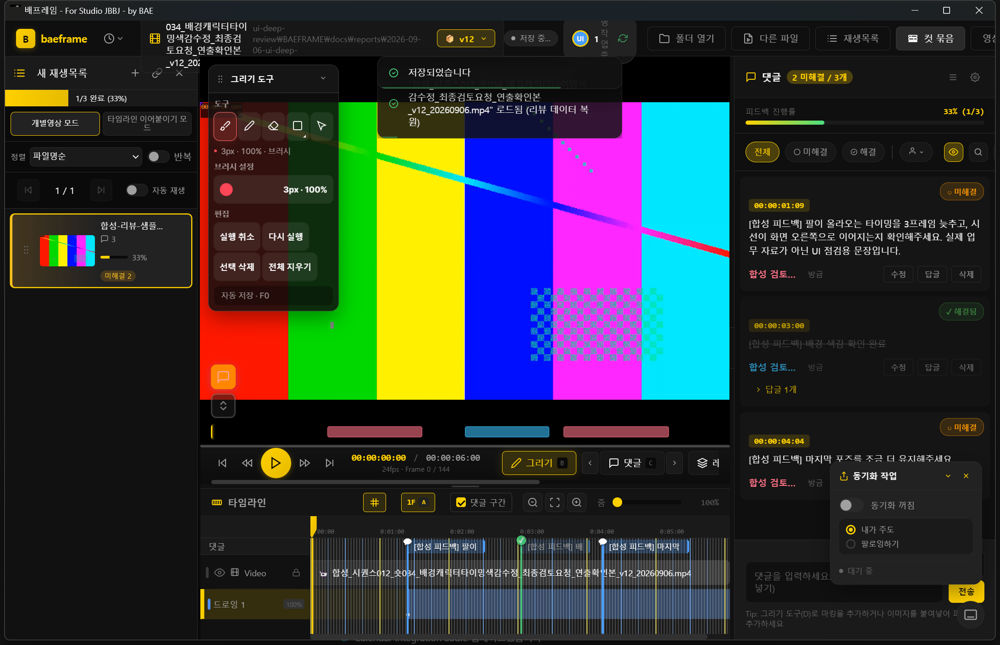

실제 리뷰 저장 성공 후 화면. ‘저장됨’ 알림과 후속 ‘저장 중’ 칩이 겹친 일시 상태를 저장 실패로 해석하지 않는다. 여기서의 문제는 저장 대상과 완료 시점이 지속되지 않는 표현이다.

**왜 문제인가:** ‘영상 이름’, ‘리뷰 파일’, ‘편집 프로젝트 이름’, ‘출력 파일’이 비슷해질수록 사용자는 어느 파일을 보존했는지 확신하기 어렵다. 리뷰 헤더의 경로는 영상 디렉터리이므로 현재 .bframe 저장 위치와 같다고 가정하면 안 된다.

**해결:** 문서 이름, 수정 점, ‘이 기기에 저장됨’, 마지막 완료 시각을 작은 고정 영역에 둔다. 클릭하면 실제 저장 파일·폴더를 확인한다. 새 문서는 ‘아직 저장 안 함’으로 표시한다. 공유·동기화는 별도 상태다. 근거: `index.html:90`, `app.js:2426,2446`, `editor.js:578,1134`, `controller.js:210`.

**부작용·완료 기준:** 경로 전체를 항상 노출해 U05를 재발시키지 않는다. 수정 점은 긴 이름 뒤에 붙여 잘리게 하지 않는다. 저장 성공은 디스크 쓰기 완료 이후에만 표시하고, 새 문서/수정/저장 중/완료/실패/다른 이름 저장을 구별한다. 잘못된 경로 저장이나 원본 덮어쓰기는 이번에 재현하지 않았다.

### U24 · 출력 도중 대상과 진행을 다시 확인하기 어렵다

**P2 · 표시 검토 · ED-12.** 출력 상태는 하단 ‘영상 출력 중…’, 약 100px 진행막대, 취소 명령으로 표시된다. 출력 전 위치 선택 대화상자가 있고 해상도·fps는 미리보기 상단에 남아 있다. 다만 출력 상태 영역에는 대상 파일명·폴더·현재 단계·숫자 진행률이 없다.

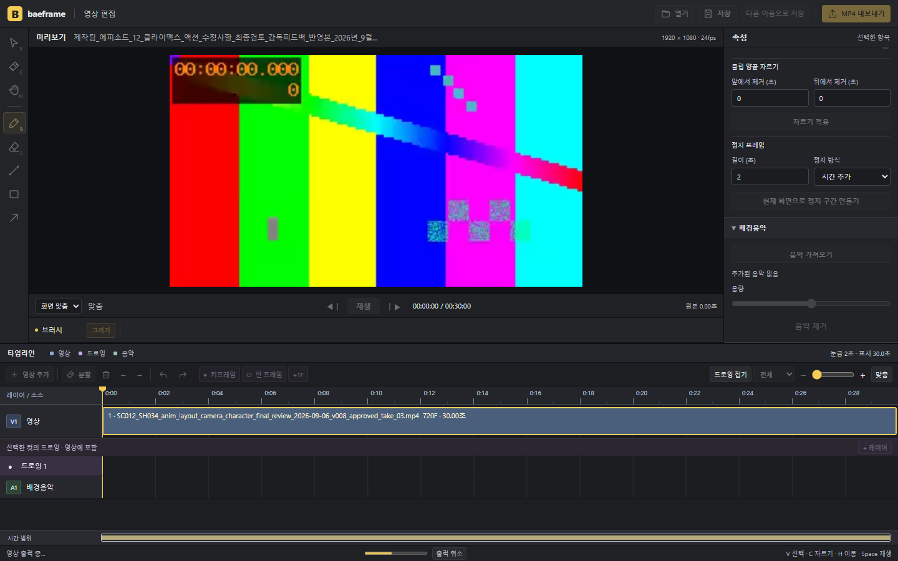

진행값 43%를 주입한 표시 검토 화면이다. 실제 인코딩 시간·진행률 정확성·취소 동작·출력 화질의 검증 결과가 아니다.

**왜 문제인가:** 잠시 다른 일을 하다 돌아왔을 때 어떤 파일을 어느 폴더에 만드는지 확인하기 어렵다. 출력 규격은 다른 위치를 봐야 한다. 작업을 잠그는 시간이 길어지면 작은 하단 문구만으로 상태를 추적하기 힘들다.

**해결:** 화면 크기를 흔들지 않는 출력 상태 영역에 파일명/폴더, 해상도·fps, 현재 단계, 제공 가능한 실제 진행률을 표시한다. 숫자로 측정할 수 없는 준비 단계는 불확정 진행으로 표현한다. 완료 후 ‘폴더 열기’와 ‘영상 확인’을 제공하고, 취소는 계속 접근 가능하게 둔다. 근거: `editor.html:354`, `editor.js:1268,1285`, `editor.css:1063`.

**부작용·완료 기준:** 근거 없는 남은 시간을 만들거나 준비 시간을 0% 멈춤처럼 보이게 하지 않는다. 준비/인코딩/완료/취소/실패마다 제목과 가능한 다음 행동을 검사한다. 출력 실패를 프로젝트 저장 실패와 구분한다.

## 7. 영상이 중심이 되는 공간 배분

### U05 · 긴 파일명이 저장 버튼을 화면 밖으로 밀어낸다

**P1 · 조건부 실측 · RV-01.** 오프라인 1440×900의 긴 합성 이름·경로에서 52px 헤더 안 파일명 높이가 약 86.67px로 늘고 위쪽으로 넘쳤다. 저장 직후 헤더 내용 폭은 1706px, 표시 폭은 1440px이며 저장 버튼 x좌표가 약 1502px로 화면 밖이다.

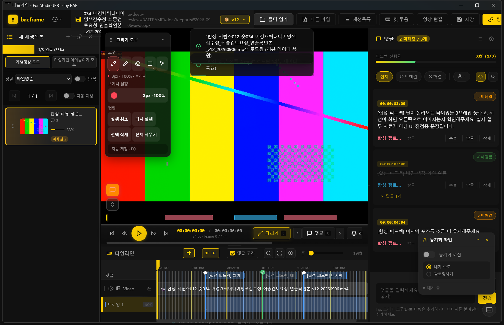

**왜 문제인가:** 파일 식별과 저장 조작이라는 핵심 영역이 동시에 무너진다. 파일 이름의 길이를 사용자가 항상 통제할 수 없고 공유드라이브 경로는 길어질 수 있다.

**구조와 해결:** 한 줄 파일명·최소 너비·축소 가능 영역·고정 작업 영역의 계약이 부족하다. 이름은 한 줄 말줄임, 전체 이름과 경로는 상세 보기로 옮기며 저장 등 핵심 명령은 축소하지 않는다. 보조 명령은 더보기에 넣는다. 근거: `main.css:522,546,561`, `index.html:33`.

**부작용·완료 기준:** 말줄임으로 버전 구분 부분이 모두 사라지지 않도록 끝부분이나 확장자도 확인 가능하게 한다. 한글/영문/공백 없는 긴 이름, 깊은 경로, 저장 중 상태, 온라인 글꼴 로딩 전후에서 핵심 명령이 항상 창 안에 남아야 한다. 현재 픽셀 수치는 대체 글꼴 가능성이 있는 오프라인 조건으로 한정한다.

### U06 · 좁은 리뷰창에서 보조 패널이 주 작업 영역을 잠식한다

**P1 · 실측 · RV-02.** 1100×720에서 재생목록 280px와 댓글 320px가 열리면 가운데 영상·타임라인은 490px다. 타임라인 내용은 571px로 넘치고 제목이 세로로 갈라진다. 여러 레이어의 정상적인 세로 스크롤 자체를 결함으로 보지는 않는다.

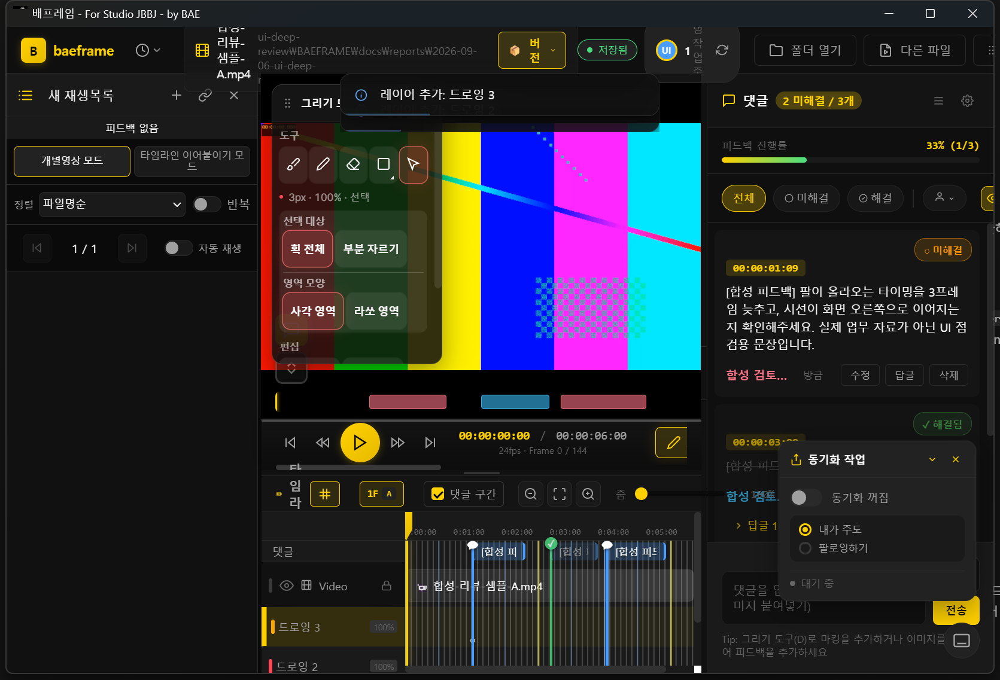

**왜 문제인가:** 이미 적은 영상 면적에 팔레트까지 겹치며, 현재 시간·레이어 이름·명령을 함께 읽기 어려워진다. 창을 줄였다고 타임라인의 뜻이 깨져서는 안 된다.

**해결:** 가운데 작업 영역의 최소 필요 폭을 정하고, 그 아래에서는 한쪽 보조 패널을 접거나 일시 패널로 전환한다. 시간·재생·주요 명령을 유지하고 부가 명령부터 더보기로 옮긴다. 사용자가 다시 넓힐 때 이전 패널 상태를 복원한다. 근거: `main.css:2979,2999`, `index.html:960`.

**부작용·완료 기준:** 사용자가 읽던 댓글과 스크롤 위치를 자동 접기 때문에 잃지 않아야 한다. 1100/1366/1440px에서 재생목록·댓글 각각 및 동시 열기, 긴 제목, 여러 레이어로 확인한다. 접힌 패널의 존재와 다시 여는 버튼은 항상 보여야 한다.

### U07 · 리뷰 선택 팔레트가 선택할 영상을 가린다

**P2 · 공간 설계 · RV-05.** 현재 리뷰 팔레트는 CSS 너비 220px, 최대 높이 70vh로 선택 대상·영역 모양·편집 명령을 세로로 펼친다. 실제 선택 도구의 활성 표시와 약 35.73×40px 버튼은 정상이다. 문제는 영상 왼쪽의 선과 색을 가리는 면적이다. 대표 화면은 3장의 첫 이미지다.

**왜 문제인가:** 사용자는 그림을 선택하려고 도구를 켰는데 그 도구 때문에 선택할 부분을 보지 못한다. 팔레트를 옮기는 행동이 매번 작업 순서에 끼어든다.

**해결:** 도구 열은 짧게 고정하고 ‘획 전체/부분’, ‘사각/라쏘’ 같은 현재 도구 설정은 한 줄 문맥 바에 둔다. 상세 명령은 접는다. 선택 수·레이어·프레임은 별도 큰 도움말 대신 짧은 요약으로 표시한다. 근거: `main/mpv-overlay-host.js:438,480`, `mpv-fabric-toolbar.js:134`.

**부작용·완료 기준:** 설정을 숨겨 기능 발견성이 떨어지지 않도록 메뉴 제목과 현재 값을 남긴다. 선택/그리기/지우개 전환 시 미리보기 사각형의 크기와 중심이 바뀌지 않아야 한다. 영상 모서리의 획도 팔레트를 이동하지 않고 선택 가능하도록 검증한다. 네이티브 영상·DOM 오버레이 경계는 별도 통합 검증이 필요하다.

### U08 · 재생 줄의 명령을 찾기 위해 가로로 이동해야 한다

**P2 · 실측 · RV-03.** 재생·주석·합성·볼륨이 하나의 스크롤 줄에 있다. 1440px 창에서도 표시 폭 1022px에 내용은 1142px이며, 좁은 창에서는 458px에 같은 내용이 들어간다. 6px 스크롤바가 있어 접근 경로는 있지만 숨은 명령을 발견하기 어렵다.

**해결:** 재생/프레임 이동/현재 시간은 고정하고 그리기·댓글은 작업 문맥에 맞춰 묶는다. 합성·반복·볼륨처럼 부가 설정은 이름 있는 팝오버로 둔다. 상위 줄을 늘려 모든 버튼을 펼치는 것보다 영상 면적과 도구 발견성을 함께 평가한다. 근거: `main.css:2583`, `index.html:770`.

**부작용·완료 기준:** 자주 쓰는 명령까지 전부 숨기지 않는다. 실제 작업 빈도를 아직 조사하지 않았으므로 제안된 그룹은 초기안이다. 작은 창에서도 재생과 한 프레임 이동은 가로 스크롤 없이 접근 가능하고, 숨은 옵션의 현재 상태는 버튼에 표시되어야 한다.

### U09 · 꺼진 동기화 상태가 댓글 입력보다 앞에 나온다

**P2 · 관찰·설계 · RV-04.** 로컬 합성 리뷰를 연 뒤 별도 열기 조작 없이 ‘동기화 꺼짐’ 패널이 나타나 댓글 작성부를 덮었다. 패널은 fixed 위치, 너비 220px, `z-index:1000`이다. 자동 노출의 정확한 근본 원인은 이번에 끝까지 추적하지 않았다.

**왜 문제인가:** 현재 사용하지 않는 상태 설명이 지금 작성해야 할 댓글보다 높은 시각 계층을 차지한다. 여러 토스트·팔레트가 겹치는 문제도 같은 공간 규칙의 부재로 확대된다.

**해결:** 비활성·참여자 없음은 작은 연결 상태칩으로 시작한다. 사용자가 열면 패널 안에 도킹하며 입력칸·전송·재생을 덮지 않는다. 일시 알림은 한 영역에서 합치거나 대기열로 보여주고 성공 알림이 새 오류를 가리지 않게 한다. 근거: `main.css:12383`, `app.js:18611`.

**부작용·완료 기준:** 실제 연결 오류까지 조용히 숨겨서는 안 된다. 연결 해제/로컬 작업/진행 중/실패를 구분하고, 입력 포커스가 있는 동안 상태 알림으로 조작이 가려지지 않아야 한다. 클라우드 동기화 성공은 이번에 검증하지 않았다.

### U13 · 고정된 편집 패널이 세로 영상과 여러 레이어 모두에 맞지 않는다

**P2 · 실측 · ED-08.** 1050×720에서 속성은 246px, 타임라인은 약 266.39px로 전체 높이의 37%다. 세로 영상은 약 150.75×267.61px로 표시된다. 9개 레이어 중 한 행이 완전히, 다음 행이 대부분 보이며 나머지는 스크롤해야 한다.

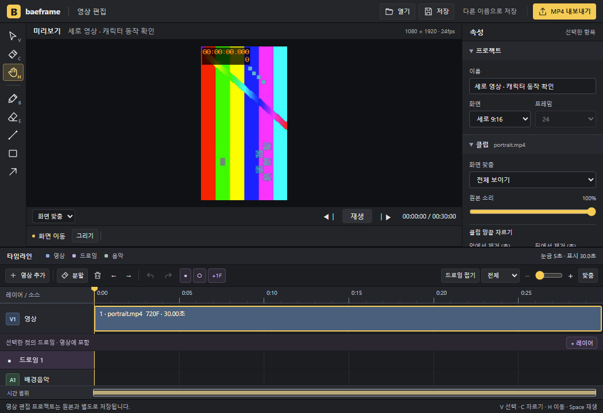

**왜 문제인가:** 세로 영상을 크게 확인할 때와 여러 그림 레이어를 편집할 때 필요한 공간 비율이 다른데 같은 고정 배분을 사용한다. 영상 비율 계산의 오류는 이번에 재현하지 않았다.

**해결:** 미리보기/타임라인 경계를 드래그해 조절하고, 속성 접기 및 소수의 작업 배치를 기억한다. 선택 대상 요약은 속성 상단에 남기고 상세 설정만 스크롤한다. ‘영상 중심’과 ‘드로잉 중심’의 두 배치를 먼저 비교한다. 근거: `editor.css:32,506,1103`, `main/editor-window.js:102`.

**부작용·완료 기준:** 패널을 극단적으로 줄여 도구가 사라지지 않도록 최소 높이와 복원 명령을 둔다. 사용자 조절 중 화면 팬·배율이 갑자기 초기화되면 안 된다. 1050×720의 세로 영상·9레이어 과제에서 현재 대상과 필요한 명령을 동시에 읽을 수 있는지 확인한다.

## 8. 선택 대상과 시간축을 다시 읽을 수 있게 한다

### U10 · 속성 패널만 보고 어느 컷을 수정하는지 알기 어렵다

**P2 · 선택 문맥 · ED-05.** 같은 긴 원본을 12개 컷으로 배치하면 타임라인에는 컷 번호가 있지만 속성 제목은 원본 이름만 말줄임한다. 드로잉 제목은 ‘선택한 컷의 드로잉’으로 고정된다. 속성 안에 컷 번호·편집 시작/끝·원본 in/out이 함께 남지 않으며 1050px에서는 원본 위치도 숨겨진다. 타임라인 호버에는 전체 이름과 길이를 읽는 대안이 존재한다.

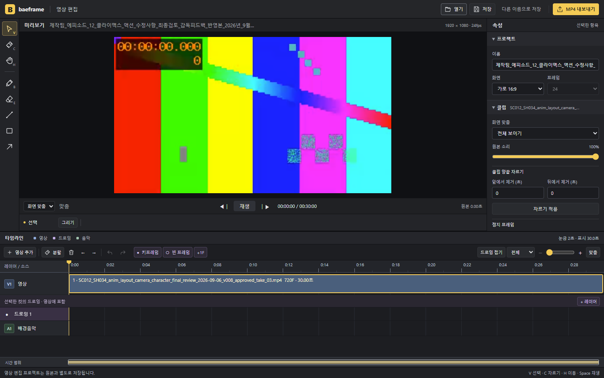

**왜 문제인가:** 같은 원본의 컷 03과 컷 04는 서로 다른 편집 대상인데 이름만 같게 보인다. 내부 선택이 잘못된 버그가 아니라 사용자가 선택의 정확성을 확인하기 어려운 구조다.

**해결:** 속성 상단에 ‘컷 04 · 파일명’, 편집 시작/끝, 길이를 고정한다. 드로잉 행도 같은 컷 번호에 연결한다. 그림을 선택하면 ‘컷 04 / 포즈 레이어 / 그림 2개’로 문맥이 깊어진다. 프로젝트 설정은 별도 탭으로 분리한다. 근거: `editor.js:588,589`, `editor.css:526,1093`.

**부작용·완료 기준:** 클릭마다 패널이 완전히 재배치되어 포인터 아래 버튼이 바뀌지 않도록 제목 영역과 설정 영역의 경계를 유지한다. 같은 원본 12컷 중 지정한 컷을 선택해 원본 in/out·현재 드로잉 레이어를 화면만 보고 확인하는 과제를 수행한다. 선택이 여러 개일 때는 임의의 한 컷 속성을 대표값으로 오해하게 하지 않는다.

### U11 · 같은 시간을 서로 다른 단위로 계산해야 한다

**P2 · 시간·범위 표현 · ED-06.** 24fps에서 36F 위치는 편집 시계에 `00:01:12`로 표시된다. 마지막 칸이 프레임인 형식이지만 라벨·툴팁이 없다. 별도 원본 위치는 초 단위이며 작은 창에서 숨겨진다. 양끝 자르기 입력은 0.05초 단위이고 내부에서는 프레임으로 반올림한다. 계산이 틀렸다는 주장이 아니라, 적용될 프레임 수가 미리 보이지 않는 문제다.

**왜 문제인가:** 사용자는 ‘현재 전체 위치’, ‘컷 안 위치’, ‘원본에서 가져온 위치’를 머릿속으로 바꿔 읽어야 한다. 24fps의 0.05초와 60fps의 0.05초는 같은 프레임 수가 아니다. 정밀한 드로잉과 컷 편집에서는 이 차이가 중요하다.

**해결:** ‘편집 MM:SS:FF · 24fps’와 ‘컷 로컬 F’를 구분한다. 원본 in/out은 선택 속성에 둔다. 자르기 수치는 프레임 입력 또는 초/F 전환을 지원하고, 실행 전 ‘앞 1F 제거 → 길이 47F’처럼 실제 결과를 보여준다. 근거: `editor.js:582,1166`, `preview-clock.js:17`, `editor.html:223`.

**부작용·완료 기준:** 화면 형식을 바꾸면서 저장된 시간 값까지 임의 변환해서는 안 된다. 편집 fps와 원본 fps가 다른 경우 원본 시간은 별도 기준임을 표시한다. 컷 시작/끝·정지 삽입·재배치·프로젝트 fps 변경의 지원 여부별로 표시와 실제 길이가 일치하는지 검사한다. 소수 fps의 드롭프레임 표기는 별도 정책을 정하기 전 임의로 도입하지 않는다.

### U12 · 전체 맞춤에서 여러 키가 하나처럼 겹친다

**P2 · 실제 타깃 겹침 · ED-07.** 6분 전체 맞춤에서 0/12/24/36F 키 버튼은 18×20px지만 가로 간격은 약 1.23px다. 앞 세 버튼의 중심에서 실제 hit test가 자기 버튼을 반환하지 않고 마지막 키만 성공했다. 기본 확대 기능은 이미 있으며, 여기서는 축소 상태의 구조 표현이 문제다.

**왜 문제인가:** 그림이 몇 번 바뀌는지 읽을 수 없고 원하는 앞쪽 키를 마우스로 고르기 어렵다. 단순히 버튼이 44px보다 작아서 문제라고 판단한 것이 아니다.

**해결:** 겹칠 수준에서는 ‘키 4개 · 0–36F’ 묶음이나 변경 밀도 표시로 바꾸고 클릭하면 해당 구간을 확대한다. 확대 후에는 개별 키와 빈 키를 구별한다. 이전/다음 키 이동과 현재 키의 번호도 함께 제공한다. 근거: `editor.js:417`, `editor.css:943`.

**부작용·완료 기준:** 축소할 때 키가 없어졌다고 느끼지 않도록 개수·범위를 보존한다. 여러 키 중 임의 하나를 클릭 결과로 선택하지 않는다. 6분 전체 보기→묶음 선택→12F 키 이동→24F에 복제→전체 복귀 과제에서 대상과 현재 위치를 잃지 않아야 한다. 접근성 타깃 평가는 간격과 대체 수단을 함께 검사한다.

### U14 · 확대된 화면을 ‘전체’라고 표시한다

**P3 · 상태 불일치 · ED-11.** 전체 맞춤에서 + 또는 Ctrl+휠로 확대하면 내부 모드는 manual로 바뀌지만 드롭다운 값은 ‘전체’다. 실제 눈금과 표시 시간·개요는 갱신된다. 확대 계산 자체가 망가진 것은 아니다.

**해결:** 이 메뉴가 현재 상태를 표시한다면 ‘수동’ 항목을 추가하고 전체/선택 컷/수동을 동기화한다. 단순 명령 메뉴라면 현재 상태처럼 보이는 선택값을 없앤다. 근거: `editor.js:538,554,1200`.

**부작용·완료 기준:** 상태 동기화가 사용자의 확대 기준점이나 팬을 초기화하면 안 된다. 버튼·휠·맞춤 명령을 번갈아 사용해 실제 범위와 메뉴 설명이 항상 일치하는지 검사한다.

### U15 · 구간 댓글의 끝을 카드에서 읽을 수 없다

**P2 · 리뷰 범위 표현 · RV-06.** 합성 댓글 범위가 33–60F, 72–96F, 100–130F인데 카드의 시간칩은 시작만 표시한다. 타임라인에는 범위가 존재한다. 카드만 읽을 때 단일 시점과 구간 댓글의 차이가 남지 않는다.

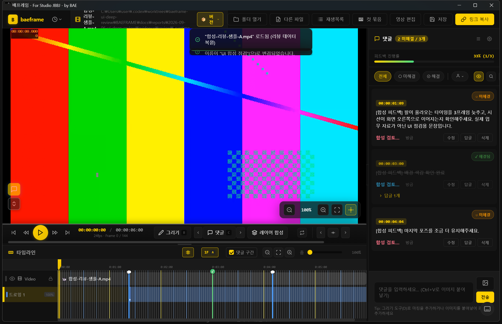

**왜 문제인가:** ‘이 한 장면’인지 ‘이 구간 전체’인지 확인하려고 시선을 타임라인으로 옮겨야 한다. 컷 편집 이후 원본 리뷰를 연결할 때도 범위의 정체성이 중요하다.

**해결:** 단일 시점은 한 시간, 구간은 시작–끝 또는 시작+길이를 표시한다. 선택 카드와 타임라인 범위를 같은 대상으로 연결하고 키보드로 해당 구간 시작으로 이동할 수 있게 한다. Frame.io의 구간 댓글은 참고 근거이며, BAEFRAME의 저장 범위를 새로 바꾸라는 의미는 아니다. 근거: `app.js:13468,13524`. [Frame.io 구간 댓글 문서](https://help.frame.io/en/articles/9105251-commenting-on-your-media)

**부작용·완료 기준:** 긴 시간칩이 작성자를 밀어 U16을 악화시키지 않도록 시간 전용 줄이나 접힌 상세를 사용한다. 1프레임·여러 프레임·긴 구간·필터 선택에서 카드와 타임라인이 같은 범위를 가리켜야 한다. 끝 프레임 포함 여부도 표시·저장 규칙과 맞춘다.

### U16 · 작성자를 구별할 공간이 반복 액션에 밀린다

**P2 · 조건부 실측 · RV-07.** 현재 댓글 상단에서 ‘합성 검토자 A/B’가 모두 ‘합성 검토…’로 잘렸다. 작성자 영역은 최대 80px이며 같은 줄에 시간·수정·답글·삭제가 있다. 작성자 span에 전체 이름을 읽는 title은 없다.

**왜 문제인가:** 여러 사람이 비슷한 이름을 쓸 때 누가 쓴 의견인지 구별하기 어렵다. 작성자 색을 기억하는 방식에 의존하게 된다. 실제 글리프 폭은 오프라인 글꼴 조건의 영향을 받을 수 있다.

**해결:** 작성자와 작성 시간을 독립 메타 줄로 두고, 자주 쓰지 않는 수정·삭제를 더보기로 묶는다. 축약 시 전체 이름 확인 경로를 제공한다. 답글과 해결 상태는 작업 빈도에 맞춰 유지한다. 근거: `main.css:6097`, `app.js:13538`.

**부작용·완료 기준:** 모든 액션을 호버 때만 나타내면 키보드 사용자가 놓칠 수 있다. 포커스와 메뉴로도 접근 가능해야 한다. 접힌 카드/답글/해결됨/좁은 패널에서 작성자와 범위를 각각 확인하는 과제를 검사한다.

## 9. 읽기·학습·설정의 공통 규칙

### U17 · 읽어야 할 안내에 가장 흐린 텍스트가 쓰인다

**P2 · 측정한 대비 · RV-08.** 평면 배경에서 댓글 입력 안내는 11px, `#666666 / #1a1a1a`로 약 **3.03:1**이다. 지원 형식 안내는 12px, `#666666 / #000000`으로 약 **3.66:1**이다. 둘 다 비활성 버튼이 아니라 사용자가 읽는 문장이다.

**판단:** 일반 크기 텍스트의 WCAG 기준 4.5:1에 못 미치는 표본이다. 프레임 표시에는 그라데이션 배경이 있어 자동 계산 3.448 값을 확정 대비로 사용하지 않았다. 앱 전체 접근성 적합성 평가도 수행하지 않았다. [W3C 텍스트 대비 기준](https://www.w3.org/WAI/WCAG22/Understanding/contrast-minimum)

**해결:** ‘읽어야 하는 보조 정보’와 ‘비활성/장식’을 서로 다른 토큰으로 분리한다. 안내·현재 프레임·저장 위치는 실제 배경에서 읽히게 하고, 해결된 댓글도 상태는 약하게 표현하되 본문까지 무조건 흐리게 하지 않는다. 근거: `main.css:1152,2704,6325`.

**부작용·완료 기준:** 화면 전체를 밝게 만들어 영상보다 UI가 튀지 않도록 강조의 위계를 유지한다. 기본/호버/선택/해결 상태와 평면/영상 위 배경을 따로 측정한다. 장식선과 disabled 항목에 일반 텍스트 기준을 일괄 적용하지 않는다.

### U18 · 글자가 작고, 키우면 고정 높이 안에서 잘린다

**P2 · 가독성·통제 실험 · ED-09.** 편집창 설정 라벨·눈금·하단 안내는 10px, 시계와 주요 값은 11px인 표본이 많다. computed font-size를 2배로 바꾼 시험에서는 정지 생성 문구가 버튼 밖으로 잘리고 도구 이름·단축키가 겹쳤다. 일부 주요 텍스트의 대비는 5.94–12.16:1로 충분했으므로 대비 부족으로 일괄 분류하지 않았다.

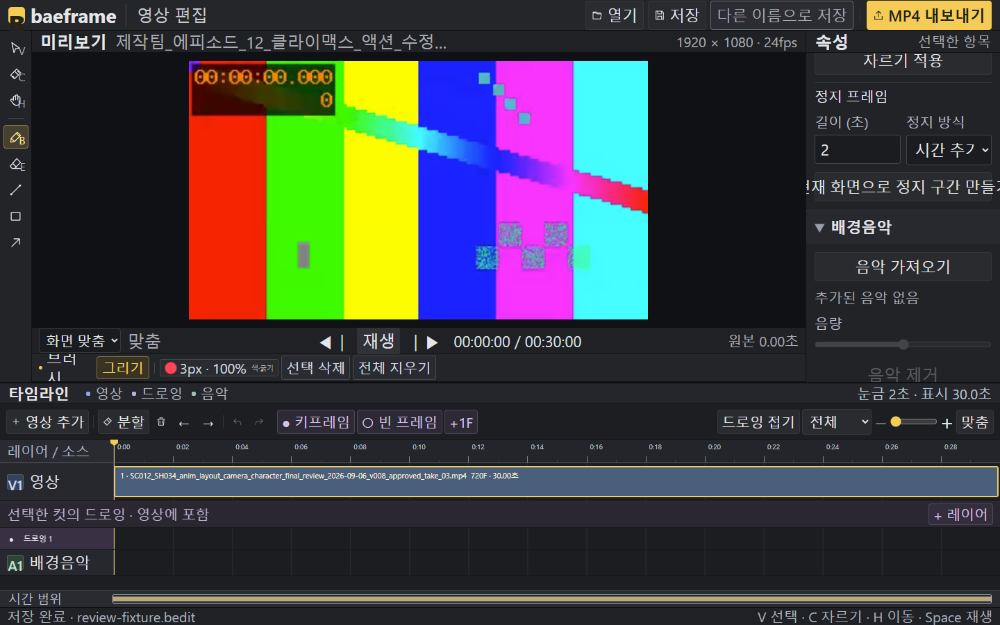

글자 크기만 2배로 주입한 스트레스 화면. Windows 글자 배율 200%나 OS 디스플레이 확대를 직접 검증한 결과가 아니다.

**왜 문제인가:** 프레임과 수치를 반복 확인하는 도구에서 읽기 부담이 누적된다. 기본 크기 10px만으로 WCAG 위반이라고 단정할 수는 없지만, 확대 시 내용이 가려지는 구조는 해결할 필요가 있다.

**해결:** 공통 글자 배율과 밀도 설정을 제공하고 핵심 시간·선택 대상·설정값을 우선 크게 한다. 툴바는 글자 확대에 맞춰 줄바꿈·높이·더보기 정책을 적용한다. 초기 제품 목표는 본문 13–14px, 핵심 수치 14–16px에서 검토하되 실제 화면으로 조정한다. 이는 표준이 강제하는 수치가 아니다. 근거: `editor.css:20,551,648,1045`.

**부작용·완료 기준:** 글자만 키워 미리보기를 더 작게 만들지 않는다. 패널 접기와 함께 검증하며, 두 창에 같은 설정이 적용되도록 한다. 실제 Windows 디스플레이 배율과 글자 배율을 별도 축으로 검사하고 긴 한국어·숫자·단축키가 잘리지 않아야 한다.

### U19 · 도움말은 D, 실제 기본 그리기는 B다

**P2 · 코드·화면 불일치 · RV-09.** 댓글 입력부는 ‘그리기 도구(D)’라고 안내하지만 재생줄은 B, 기본 설정의 drawMode도 KeyB다.

**왜 문제인가:** 화면의 안내를 신뢰한 사용자가 원하는 동작에 도달하지 못한다. 단축키가 설정 가능할수록 하드코딩된 도움말은 더 빨리 틀어진다.

**해결:** 액션 하나에 이름·기본 키·사용자 키·버튼 툴팁·도움말을 연결한다. 재지정 즉시 모든 표기를 갱신한다. 근거: `index.html:1214`, `user-settings.js:31`.

**부작용·완료 기준:** 기존 설정을 새 기본값으로 덮어쓰지 않는다. 기본 B, 사용자 재지정, 키 해제, 충돌 상태에서 버튼·도움말·단축키 창이 같은 내용을 표시해야 한다. 문자 입력 중 도구가 실행되지 않는 것도 함께 확인한다.

### U20 · 앱 설정을 찾으려면 댓글 설정을 열어야 한다

**P2 · 정보 구조 · RV-10.** ‘댓글 설정’ 메뉴 아래에 이름 변경, 단축키, Windows 통합 진단, 캐시, 앱 설정이 함께 있다. 실제 앱 설정 안에는 개인정보·알람·테마·재생·단축키 탭이 있다. 설정 탭 자체는 명확하고 본문 겹침은 관찰하지 않았다.

<figure>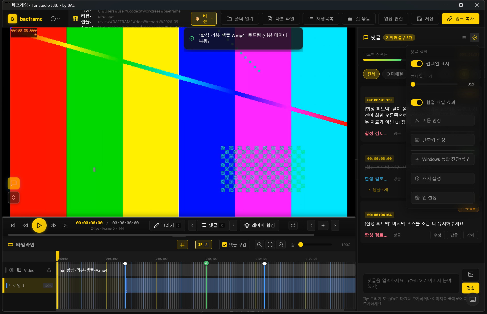<figcaption>댓글 설정 메뉴의 범위가 제목보다 넓다.</figcaption></figure><figure>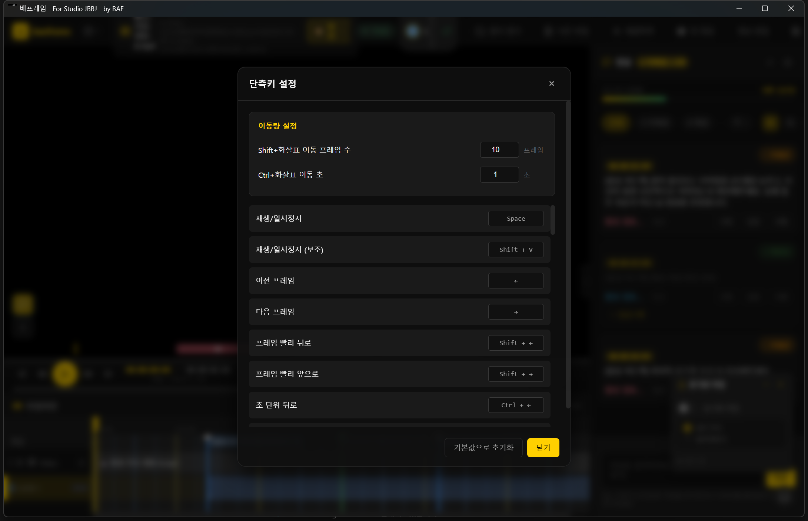<figcaption>현재 단축키 목록. 향후 공통 명령 체계의 진입점을 정리한다.</figcaption></figure>

**왜 문제인가:** 재생·테마·키 설정은 댓글의 하위 기능이 아니다. 사용자가 자신의 질문과 맞지 않는 패널에서 전역 설정을 찾아야 한다. 단축키 관련 진입점도 공통 창으로 정리할 필요가 있다.

**해결:** 앱 상단의 일관된 위치에 환경설정을 둔다. 댓글 메뉴는 썸네일·표시·댓글 관련 동작으로 좁힌다. 설정 검색, 현재 키 충돌 설명, 기본값 복원은 후속 편의 기능으로 검토한다. 근거: `index.html:1026,1032,1060,1075`.

**부작용·완료 기준:** 기존 사용자를 위해 한동안 예전 위치에 새 경로 안내를 남길 수 있다. 리뷰/제작 어느 창에서도 같은 설정 이름으로 도달해야 한다. ‘테마 변경’, ‘그리기 키 변경’, ‘캐시 위치 확인’ 과제에서 사용자가 메뉴 이름을 추측하지 않아도 되는지 검증한다.

### U21 · 첫 이름 입력이 읽기 전용 작업보다 먼저 요구된다

**P2 · 의도된 정책의 개선 제안 · RV-11.** 깨끗한 프로필에서 이름 모달의 닫기·취소가 숨겨지고 이름 입력 전에는 파일 열기 화면으로 진행할 수 없다. 작성자 식별을 위한 정책일 수 있어 기능 버그로 분류하지 않는다.

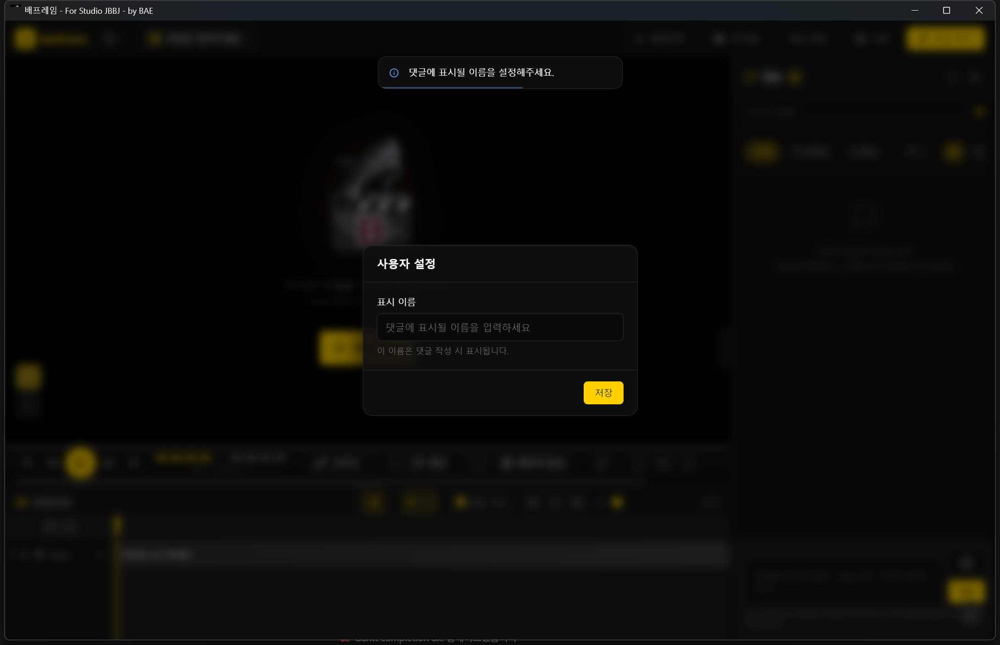

**왜 문제인가:** 사용자가 우선 영상을 보기만 하려는 상황에서도 작성자 정보를 요구한다. 필요 이유와 사용 시점이 떨어져 있다.

**해결:** 영상 확인은 먼저 허용하고 첫 댓글·공유처럼 작성자 식별이 필요한 순간에 이름을 요청하는 안을 검토한다. 임시 방문자로 연 상태와 작성할 수 있는 상태는 분명히 구별한다. 근거: `app.js:15702,15711,15720`, `index.html:1632`.

**부작용·완료 기준:** 이름 없는 댓글이나 나중에 잘못 귀속되는 기록이 생겨서는 안 된다. 읽기만 수행한 경우의 마찰과, 작성 시점의 명확한 설명을 함께 평가한다. 현재 사용자 정책과 협업 데이터 규칙을 확인한 뒤 변경한다.

### U22 · 아이콘과 진행막대의 목적을 읽을 이름이 없다

**P2 · 확인한 표본 · RV-12 + ED-12.** 작성자 필터 버튼은 텍스트·title·aria-label이 없고 아이콘과 화살표만 있다. 출력 progress 요소도 label/aria-label/aria-labelledby가 없다. 작성자 필터는 약 48.68×28.67px로 단순 크기 부족 사례가 아니다.

**왜 문제인가:** 아이콘에 익숙하지 않은 사용자는 기능을 추측해야 하고, 접근성 도구가 의미 있는 이름을 전달하기 어렵다. 전체 키보드·스크린리더 감사는 별도 필요하다.

**해결:** 필터에는 ‘작성자로 필터링’이라는 접근 가능한 이름과 시각적 힌트를 제공한다. 선택한 작성자 또는 선택 수를 표시한다. 출력 막대에는 작업 대상과 연결되는 이름을 둔다. 근거: `index.html:1109`, `editor.html:354`.

**부작용·완료 기준:** 모든 아이콘에 항상 긴 텍스트를 붙여 밀도를 키울 필요는 없다. 툴팁·포커스·접근 가능한 이름의 역할을 구분한다. 키보드로 진입해 목적과 선택 상태를 읽을 수 있고, 상태 알림이 매 프레임 과도하게 반복되지 않아야 한다.

### U25 · 같은 앱 안에서 시각 규칙을 두 번 배운다

**P3 · 코드 기반 체계 제안 · ED-13.** 리뷰창은 Pretendard 계열과 공유 테마 변수를, 편집창은 Segoe UI/Malgun Gothic과 별도 고정 다크 색을 쓴다. 기본 드로잉 행도 리뷰 44px, 편집 32px로 독립되어 있다. 두 창 모두 다크·노랑이라는 연결점은 이미 있다.

**판단:** 색상 값이나 행 높이가 다르다는 사실 자체는 버그가 아니다. 문제는 선택·현재 시간·저장·오류 같은 공통 개념에 같은 규칙을 적용하기 어렵고, 읽기·밀도 설정이 분리될 가능성이다. 실제 사용자가 얼마나 혼란을 느끼는지는 후속 과제로 확인해야 한다.

**해결:** 문서 헤더, 도구 버튼, 선택 강조, 시간 표시, 상태 알림, 숫자 입력, 메뉴, 포커스 토큰을 공유한다. 편집 트랙과 리뷰 댓글의 밀도는 작업 특성에 맞게 다르게 유지한다. 근거: `main.css:50,77,90`, `app.js:16230`, `editor.css:1`.

**부작용·완료 기준:** 전역 CSS 일괄 교체로 네이티브 오버레이 위치나 레거시 테마를 깨뜨리지 않는다. 공통 부품을 한 영역씩 적용하며 기존 기능과 설정을 보존한다. 같은 상태가 두 창에서 같은 의미로 읽히는지 검토한다.

### U26 · 같은 키와 ‘선택’이 가리키는 대상을 설명해야 한다

**P3 · 구조 제안 · 현재 코드 + 타사 비교.** 리뷰 기본 C는 댓글 모드이고 새 편집창 C는 자르기다. 이는 별도 창의 문맥에 따라 합리적일 수 있다. 하지만 ‘Premiere처럼’이라는 요구를 키 이름만 복사하는 것으로 처리하면 리뷰의 습관·드로잉의 획 선택·타임라인의 컷 선택이 충돌한다. 근거: `user-settings.js:30`, 편집창의 현재 V/C/H 명령 처리.

**해결:** 모든 명령에 작업 영역, 입력 대상, 적용 범위를 둔다. 현재 창이 ‘리뷰’인지 ‘영상 제작’인지 계속 보이고, 키 도움말은 해당 문맥을 따라야 한다. Premiere식 제작 기본값과 기존 리뷰 기본값을 명시적으로 제공한다. 기존 사용자 설정을 조용히 바꾸지 않는다. [Premiere 작업 영역 개념](https://helpx.adobe.com/premiere/desktop/get-started/tour-the-workspace/what-are-workspaces.html)

**부작용·완료 기준:** 지나치게 많은 모드를 만들면 매번 모드를 확인하는 부담이 생긴다. 우선 두 작업 목적과 하나의 공통 명령 목록으로 제한한다. 입력칸에서는 문자 키가 문자를 쓰고, 문서 저장은 동작하며, 타임라인과 캔버스에서는 명시된 대상으로 Delete/Undo가 적용되어야 한다. 편집창 내부 Undo는 이미 존재한다. 리뷰·제작 두 문맥을 아우르는 Undo 정책은 데이터 경계까지 검토한 별도 사양이 필요하다.

## 10. BAEFRAME·BEditer 완성 화면 제안

**기본 BAEFRAME의 리뷰 경험과 BEditer의 제작 경험을 함께 다듬는다.** 아래 네 장은 같은 크기·글꼴·색상·부품을 사용한 완성 화면 예시다. 영상, 파일 목록, 댓글, 선택 속성, 타임라인을 채워 실제로 사용할 때의 밀도를 보여준다. 앞의 현재 앱 캡처와 달리 **모두 미구현 디자인 시안**이며, 시안 제작용 HTML을 이미지로 렌더했다. 그림 속 영상은 이 보고서를 위해 생성한 가상의 애니메이션 장면이고 파일명·작성자·댓글도 예시다.

### 10.1 · 하나의 스타일, 두 가지 작업 목적

두 앱에서 영상이 중심이고 문서 헤더·도구 줄·재생 줄·하단 시간축의 위치가 반복된다. 오른쪽은 리뷰할 때 댓글, 만들 때 선택 속성을 맡는다. BAEFRAME를 편집기의 축소판으로 만들지 않고, 기존 리뷰 업무에 필요한 목록·버전 정보·댓글 작성·구간 피드백을 완성된 화면의 절반으로 다룬다.

| 구분 | BAEFRAME 기본 앱 | BEditer | 함께 사용할 규칙 |
|---|---|---|---|
| 작업 대상 | 현재 열린 원본과 그 원본의 리뷰 | 여러 컷으로 구성한 결과 영상 | 헤더에 파일 이름·리뷰/제작 문맥을 계속 표시 |
| 왼쪽 영역 | 영상 목록·재생목록·컷 묶음·그림 레이어 | 프로젝트 미디어·시퀀스·선택 컷의 그림 레이어 | 같은 목록 높이, 선택·잠금·숨김 표시 |
| 가운데 | 원본 보기와 드로잉 리뷰 | 편집 결과와 세로 출력 미리보기 | 영상 비율 유지, 보기 배율과 출력 변형 구별 |
| 오른쪽 | 구간 댓글과 입력창, 필요 시 그림 속성 | 선택 컷·그림·프로젝트 속성 | 대상 이름과 적용 범위를 먼저 읽음 |
| 아래 시간축 | 원본 시간 위의 댓글·그림 노출 | 출력 시간 위의 컷·그림·소리 | 동일 눈금·재생 위치, 서로 다른 대상 이름 |
| 저장물 | 리뷰 파일 .bframe | 편집 프로젝트 .bedit와 별도 출력 영상 | 이 기기에 저장됨 / 공유·연결 / 내보내기를 구분 |
| C 단축키 | 댓글 작성 | 클립 위치에서 자르기 | 현재 문맥의 이름·커서·키 안내를 함께 표시 |

공통 외형의 출발점은 **짙은 회색 면, 읽히는 밝은 글자, 얇은 구획선, 절제된 노랑**이다. 영상·그림·소리는 작은 역할색과 이름으로 구별한다. 여러 패널을 둥근 카드로 겹치기보다 정렬된 면과 경계로 묶는다. 노랑을 배경 전체에 바르지 않고 주요 실행과 현재 도구에 집중한다. Premiere의 명령 인식, Animate의 노출 문법, Frame.io의 댓글 맥락을 BAEFRAME의 작업에 맞게 적용한 결과이며, 특정 제품의 화면을 복제한 것은 아니다.

### 10.2 · 완성 화면 ① BAEFRAME 기본 리뷰

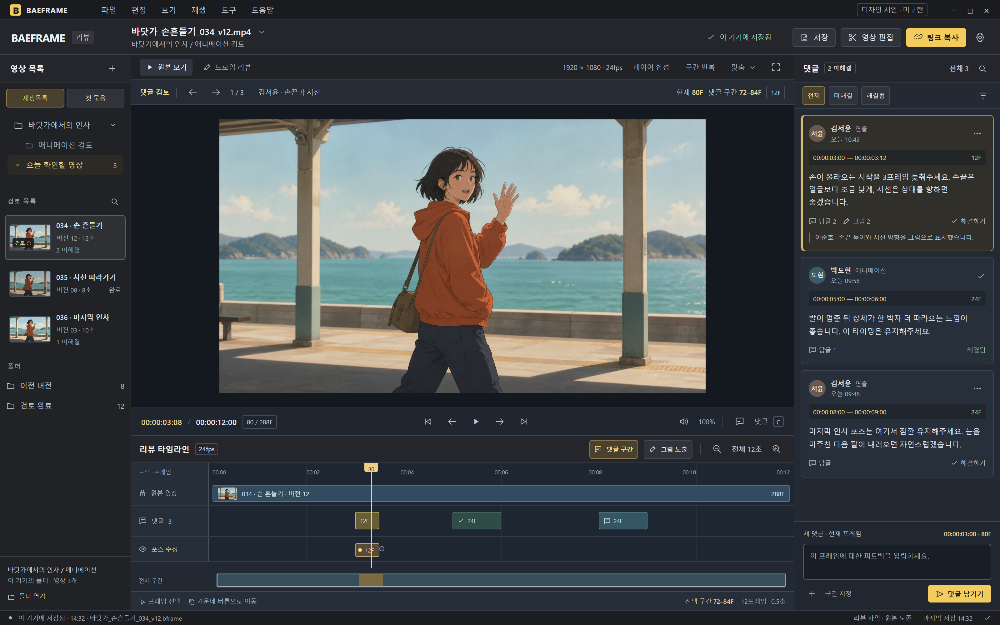

BAEFRAME 기본 리뷰 · 1600×1000 설계 / 3200×2000 이미지. 원본 영상 80F를 보며 72–84F 구간의 의견을 확인하는 예시. 영상 목록, 댓글 작성, 원본 시간축을 기본 화면의 주 작업으로 구성했다. 이미지를 누르면 글자까지 크게 볼 수 있다.

**화면에서 달라지는 점.** 파일명은 상단 왼쪽에 충분한 폭을 받고, 저장·링크 복사는 오른쪽 고정 영역에 남는다. 영상 목록은 폴더·현재 파일·버전·검토 상태를 연결한다. 댓글은 작성자 → 구간 → 본문 → 답글·해결의 순서로 읽히고, 입력창은 패널 아래에 항상 자리한다. 동기화 설명이 댓글 입력을 밀어내지 않는다. 댓글 카드는 선택된 구간만 강조하며 해결된 의견의 본문도 읽을 수 있게 둔다.

하단의 파란 원본 행은 편집 가능한 컷 배열이 아니라 현재 영상의 길이를 보여주는 잠긴 기준행이다. 댓글 범위와 그림 유지 구간은 각각 다른 행에 놓인다. 선택한 댓글을 읽으면서 원본을 잘라 버릴 수 있다는 인상을 주지 않는다. 반복·볼륨·레이어 합성은 재생·보기 영역에서 이름을 보고 찾을 수 있게 유지한다.

| 현재 기능·필요 | 제안한 위치와 노출 | 유지 또는 추가할 설계 | 연결 문제 |
|---|---|---|---|
| 영상 열기·폴더·다른 파일 | 왼쪽 목록과 하단 폴더 열기, 상단 파일 메뉴 | 기존 열기 경로 유지. 목록의 검토 상태 요약은 표시 개선 제안 | U05·U06 |
| 재생목록·컷 묶음 | 왼쪽 상단 두 탐색 탭 | 기존 탐색 기능 유지. 여기의 컷 묶음은 영상 자르기 명령이 아님 | RV-02 |
| 파일명·버전 확인 | 문서 헤더와 선택한 목록 항목 | 긴 이름은 영역 안에서 줄임, 전체 이름은 툴팁/파일 정보로 제공. 버전 비교 화면은 별도 범위 | U05·U23 |
| 저장·링크 복사·영상 편집 진입 | 오른쪽 고정 문서 명령 | 기존 기능 유지. 로컬 저장과 공유 상태 문구 분리 | U23·U25 |
| 재생·프레임 이동·현재/전체 시간 | 영상 바로 아래 고정 재생 줄 | 핵심 조작 기본 노출, fps와 현재 프레임을 함께 표시 | U08·U11 |
| 보기 배율·반복·합성·볼륨 | 영상 위 보기 줄과 재생 줄 | 세부 옵션은 이름 있는 메뉴로 접기, 현재 상태 표시 | U08·U14 |
| 구간 댓글·답글·해결 | 오른쪽 댓글 목록 | 양 끝 시간과 길이, 작성자 역할, 해결 여부를 읽기 순서대로 정리 | U15·U16 |
| 검색·필터·댓글 쓰기·이미지 첨부 | 패널 상단 검색/필터, 하단 고정 입력창의 + 메뉴 | 입력창 보존. 범위 지정과 이미지 첨부는 서로 다른 명령으로 명명 | U09·U16·U22 |
| 앱 설정·협업 연결 | 헤더 설정, 문서 연결 상태의 별도 상세 | 설정 진입 분리 제안. 꺼진 연결 안내는 패널 전체를 차지하지 않음 | U09·U20 |

**완성의 기준:** 예쁜 영상만 크게 보이는 화면이 아니라, 사용자가 다른 영상을 열고, 의견을 찾고, 답글을 달고, 새 구간 의견을 남긴 다음 저장까지 끝낼 수 있는 화면이어야 한다. 이 시안은 그 경로의 위치를 제안하며 실제 댓글 전송이나 외부 협업 성공을 증명하지 않는다.

### 10.3 · 완성 화면 ② BAEFRAME 드로잉 리뷰

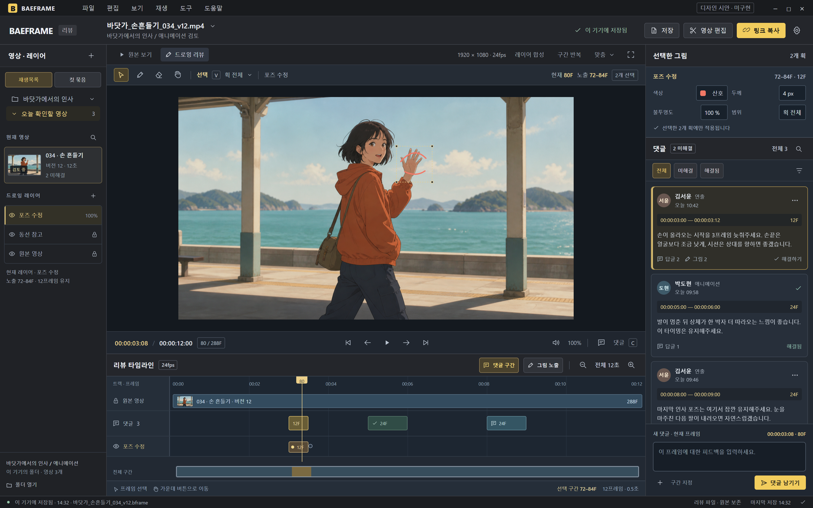

BAEFRAME 드로잉 리뷰 · 동일한 원본의 손 주변 획 2개를 선택한 상태. 현재 80F, 포즈 수정 레이어, 노출 72–84F, 색·두께·불투명도를 화면에 함께 표시한다. 선택 상자는 실제 영상 안의 획에 맞춰 작성한 시안이다.

**화면에서 달라지는 점.** 선택 도구 창을 영상 위에 크게 펼치지 않고, 영상 위의 고정 도구 줄과 오른쪽 속성 영역에 나눈다. 원본 보기에서도 같은 높이의 작업 줄을 확보해 드로잉 진입 때문에 영상의 위치나 배율이 갑자기 바뀌지 않게 한다. 도구 줄에는 활성 V, 획 전체/부분, 선택 모양, 현재 레이어·프레임·개수를 읽을 수 있게 둔다. 세부 명령은 이름 있는 메뉴에서 확장한다.

오른쪽은 선택한 그림의 속성을 먼저 보여주고 그 아래 댓글을 유지한다. 선택 속성 때문에 댓글 작성이 사라지지 않는다. 왼쪽의 그림 레이어와 하단 노출 행이 같은 이름을 사용하므로 ‘어느 레이어의 어느 그림을 바꾸는가’를 다시 계산할 필요가 없다. 화면의 선택 테두리와 실제 획 좌표는 같은 변환을 써야 하며, 완성 이미지가 기존 좌표 버그의 수정 검증을 대신하지 않는다.

| 현재 기능·필요 | 제안한 위치와 노출 | 유지 또는 추가할 설계 | 연결 문제 |
|---|---|---|---|
| 펜·지우개·선택·보기 이동 | 영상 위 고정 작업 줄, 활성 도구와 이름 기본 노출 | 기존 도구 유지. 고정 높이 도킹으로 큰 부동 팔레트 개선 | U01·U07 |
| 획 전체/부분 선택, 사각/라쏘 | 선택 도구 옆 범위·모양 메뉴 | 기본값을 줄에 표시하고 대안은 메뉴로 펼침 | U07·U26 |
| 레이어 선택·순서·잠금·표시·삭제 | 왼쪽 레이어 목록과 레이어 문맥 메뉴 | 선택·잠금·숨김 표시, 이름·순서·복제·삭제 진입 보존 | U10·U25 |
| 색·두께·불투명도 | 오른쪽 선택 속성 상단 | 선택한 획의 값과 새로 그릴 펜의 기본값을 구별 | U10·U26 |
| 실행 취소·재실행·선택 삭제·전체 지우기 | 공통 편집 메뉴와 선택 문맥 메뉴 | 삭제 범위 명시. 전체 지우기는 이름과 확인 단계로 구분 | U26 |
| 그림 키·빈 키·유지 구간 | 하단 그림 노출 행, 확대 조절 | 기존 드로잉 방식을 유지하는 노출 편집 설계. 새 편집 명령의 구현 범위는 별도 확정 | U11·U12 |
| 그림과 연결된 구간 의견 | 오른쪽 댓글의 범위·그림 표시와 입력창 | 리뷰 업무를 유지. 그림 편집을 위해 댓글 패널 전체를 교체하지 않음 | U09·U15 |

**부드러운 조작의 계약:** 드래그 중 화면은 포인터를 계속 따라가고, 놓는 순간 다른 좌표로 뛰지 않아야 한다. 팬은 보기 위치만 바꾸고 획 데이터와 실행 취소 기록을 오염시키지 않아야 한다. 기본 리뷰와 드로잉 리뷰의 영상 영역 일치, 100%/맞춤/확대 상태에서의 선택 일치, 이동 도중 포인터 이탈·취소를 후속 프로토타입에서 검증한다. 이 문서의 정지 화면으로 반응 속도를 검증했다고 주장하지 않는다.

### 10.4 · 완성 화면 ③ BEditer 기본 편집

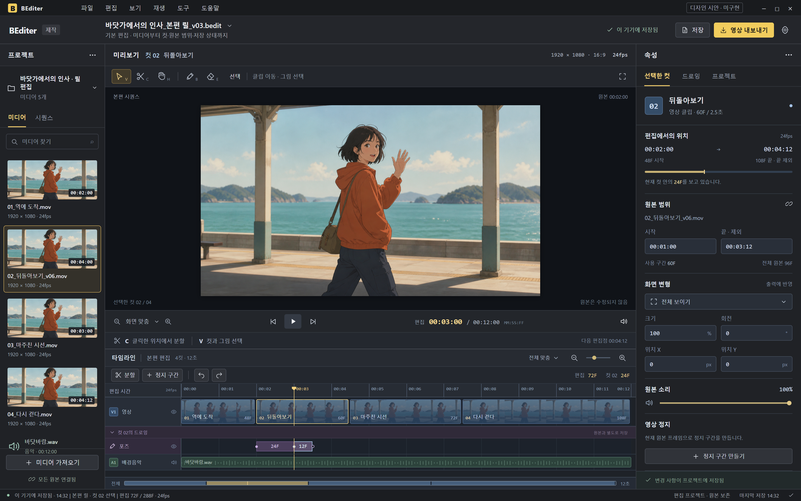

BEditer 기본 편집 · 4컷 / 12초 / 24fps. 편집 위치 72F는 선택한 컷 02 안의 24F이며, 이 컷의 원본 시작이 24F이므로 미리보는 원본 위치는 48F다. 영상·그림·소리의 구분과 선택 컷 속성을 한 화면에 배치했다.

**화면에서 달라지는 점.** 왼쪽은 가져온 미디어와 프로젝트, 가운데는 결과 미리보기, 오른쪽은 현재 컷의 속성을 맡는다. 컷 번호·이름·편집 위치·원본 범위를 한 묶음으로 보여주고 화면 변형은 그 아래에 둔다. 영상 보기 배율과 최종 출력에 반영되는 크기·위치는 서로 다른 영역에 배치한다. 출력 해상도·비율·fps는 미리보기 제목 줄에 남는다.

타임라인에는 영상 필름스트립, 선택 컷의 드로잉 레이어, 소리 행을 읽을 수 있는 높이로 배치한다. C로 자르기 상태에 들어간 뒤 클립의 특정 위치를 눌러 분할한다는 명령이 도구 이름·키·커서에 연결되어야 한다. 빈 공간 클릭, 잠긴 행, 그림 키 클릭이 같은 방식으로 영상을 자르면 안 된다. 아래 전체 개요는 현재 확대 구간을 이동하는 역할이며 두 개의 독립 편집 시간을 만들지 않는다.

| 현재 기능·필요 | 제안한 위치와 노출 | 유지 또는 추가할 설계 | 연결 문제 |
|---|---|---|---|
| 미디어 가져오기·프로젝트 열기/저장 | 왼쪽 미디어 목록과 고정 가져오기, 문서 헤더 | 현 편집 경로 유지. 프로젝트/미디어 탐색 계층은 개선 제안 | U05·U23 |
| V 선택·C 자르기·H 보기 이동 | 영상 위 공통 도구 줄, 타임라인 명령 | 기존 키 의미를 읽을 수 있게 강화. 입력 포커스별 적용 범위 명세 | U26 |
| 컷 배열·분할·정지 구간 | 타임라인 영상 행과 상단 명령 | 현 편집 기능의 위치 정리. 영상 정지와 그림 유지는 다른 명령 | U11·U12 |
| 선택 컷의 길이·원본 시작/끝 | 오른쪽 선택 컷 속성 최상단 | 현재 선택을 고정 표시. 끝 경계 제외를 프레임 값과 함께 설명 | U10·U11 |
| 크기·위치·회전과 보기 배율 | 출력 변형은 오른쪽, 보기 배율은 재생 줄 | 기존 영상 맞춤 contain/cover와 보기 배율 유지. 영상 클립의 크기·회전·X/Y 직접 조절은 **확장 제안** | U13·U14 |
| 그림 레이어와 키 편집 | 선택 컷 아래 펼침 행, 속성의 드로잉 탭 | 다른 컷의 키를 잘못 수정하지 않게 소유 컷 표시 | U10·U12 |
| 영상 내보내기 | 문서 헤더의 주 실행, 출력 상세 패널 | 기존 출력 진입 유지. 대상 폴더·단계·수치 진행은 U24 후속 설계 | U24 |
| 배경 음악·소리 행 | 이름·음량·파형이 있는 별도 행 | 기존 배경음악 1개 가져오기·미리듣기·음량·출력 연결 유지. 파형 표시와 세부 오디오 편집 UI는 **확장 제안** | 기존 제작 기능 + 확장 범위 |

영상 행과 소리 행이 있다고 멀티트랙 합성·전환 효과·자동 리플 편집이 모두 제공된다는 뜻은 아니다. 첫 구현 사양은 현재 가능한 컷 연결·분할·정지·드로잉·배경음악을 정리하고, 파형과 세부 오디오 편집·프로젝트 탐색의 확장 범위를 따로 결정해야 한다.

### 10.5 · 완성 화면 ④ BEditer 세로 영상·드로잉

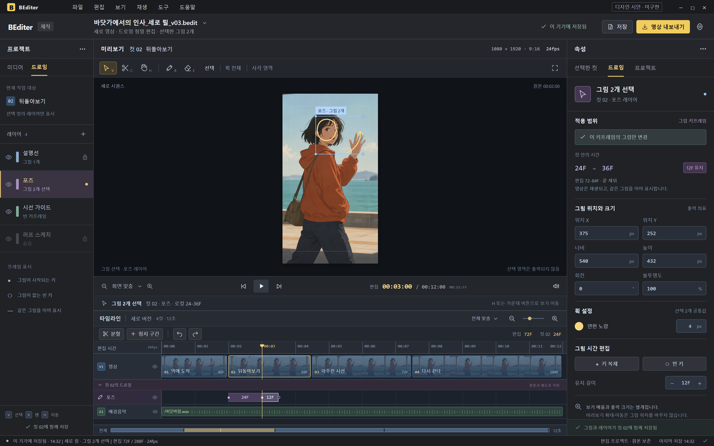

BEditer 세로 제작 · 출력 1080×1920 / 9:16 / 24fps. 컷 02의 포즈 레이어에서 그림 2개를 선택했다. 컷 안 24–36F와 편집 72–84F가 같은 12프레임 노출을 가리키며, 선택 테두리는 출력 영상에 포함되지 않는다.

**화면에서 달라지는 점.** 미디어 탐색이 덜 필요한 드로잉 단계에서는 왼쪽을 선택 컷의 레이어 목록으로 전환한다. 가운데는 세로 영상 비율을 유지하고, 오른쪽은 ‘그림 2개 / 컷 02 / 포즈 레이어’를 먼저 밝힌다. 위치·크기·불투명도·획 설정 아래에는 키 복제, 빈 키, 유지 길이가 이어진다. Animate 방식의 ‘이 시점에 그림을 만들고 이어 보여주는’ 흐름을 보존한다.

세로 화면을 공간에 맞춰 보여주는 기능과 원본을 세로 출력에 맞게 자르는 기능은 다르다. 재생 줄의 화면 맞춤은 작업용 배율이고, 선택 컷 탭의 출력 변형이 결과물을 바꾼다. 중앙 가이드와 선택 테두리는 편집 보조이며 결과 영상에는 들어가지 않는다. 주변 여백을 무조건 없애기 위해 세로 영상을 가로로 늘리지 않는다.

| 현재 기능·필요 | 제안한 위치와 노출 | 유지 또는 추가할 설계 | 연결 문제 |
|---|---|---|---|
| 세로 출력·프레임 확인 | 미리보기 상단 해상도/비율/fps, 하단 편집 시간 | 현재 출력 설정을 계속 확인하는 배치 | U13·U24 |
| 선택 컷 레이어·잠금·숨김 | 왼쪽 드로잉 탭, 선택 컷 이름 고정 | 레이어 목록의 문맥 보존, 다른 컷 데이터와 구별 | U10·U12 |
| 선택 획 위치·크기·공통 속성 | 오른쪽 드로잉 탭 | 수치 직접 편집·혼합값 표시는 **확장 제안**, 현 속성 기능 전체 구현 주장 아님 | U10·U26 |
| 그림 시작·빈 상태·같은 그림 유지 | 타임라인 점/빈 점/띠와 오른쪽 노출 길이 | 기존 키프레임 원리를 유지하는 편집 UI 제안 | U11·U12 |
| 보기 확대·팬 | 재생 줄 보기 배율, H/가운데 버튼 안내 | 화면 이동과 그림 이동을 분리하고 도구 전환으로 영상 위치가 튀지 않게 함 | U01·U13·U14 |
| 그림 적용 범위·저장 범위 | 오른쪽 상단과 하단 저장 상태 | 이 키프레임의 그림인지, 컷 전체인지 명확히 표시 | U10·U23 |

**영상 정지와 그림 유지의 예:** 그림을 12F 유지하면 그 구간에서 영상은 계속 움직이면서 같은 그림이 보인다. 영상 정지 12F를 넣으면 선택한 원본 프레임 내용이 12F 동안 고정되고 편집의 재생 시간은 진행한다. 두 명령을 같은 ‘홀드’ 버튼 하나로 합치지 않는다. 원본 리뷰에 그린 획을 편집 결과로 가져오는 연결 정책도 새 기능 사양으로 다루고 자동 적용을 가정하지 않는다.

### 10.6 · 네 화면에 적용한 구체적인 마감 규칙

| 요소 | 이번 완성 시안의 선택 | 구현에서 지켜야 할 점 |
|---|---|---|
| 배경과 구획 | 바탕 #17181B, 패널 #202226, 떠오르는 면 #2A2D32, 경계 #363940 | 네이티브 영상 위의 오버레이와 패널 경계를 실제 앱에서 확인 |
| 글자 | 주 글자 #EDF0F4, 보조 글자 #AEB3BD, Segoe UI·맑은 고딕 계열 | CDN 의존 없이 한국어 가독성 비교. 표시는 토큰 후보이며 모든 상태의 대비 인증 아님 |
| 강조 | 노랑 #F2CD5D, 영상 파랑·그림 보라·소리 초록 | 이름·아이콘·테두리를 함께 사용. 브러시 색과 선택색은 독립 |
| 문서 영역 | 상단 메뉴 32px, 문서 헤더 56px, 하단 상태 24px | 긴 이름도 저장·출력 명령을 밀어내지 않음 |
| 패널 | 1600px 예시에서 왼쪽 210px, 오른쪽 330px, 중앙은 나머지 | 절대 고정 사양 아님. 접기·리사이즈·레이아웃 초기화가 필요 |
| 도구와 시간축 | 고정 작업 줄, 대상 이름을 가진 행, 의미 있는 간격의 눈금 | 보기 확대와 시간 확대 분리. 좁아진 키는 묶음/상세 보기로 접근 |
| 피드백 | 저장 위치·대상·시각, 선택 이름·개수, 현재 도구 이름 | 토스트가 사라진 뒤에도 핵심 상태는 남아야 함 |

첫 화면과 선택 상태만 그렸다고 전체 제품 설계가 끝난 것은 아니다. 다음 상태도 동일한 부품 규칙으로 이어져야 한다.

| 상태 | BAEFRAME | BEditer |
|---|---|---|
| 첫 실행·빈 문서 | 영상 열기·폴더 열기부터 가능, 댓글 작성 전에 이름 필요 여부 안내 | 미디어 가져오기·프로젝트 열기, 아직 출력 대상이 없음을 표시 |
| 선택 없음·다중 선택 | 댓글 입력 유지, 그림 속성에는 선택 안내 또는 혼합값 | 선택 컷/그림/프로젝트 탭의 적용 대상 명시, 혼합값을 임의 단일값으로 표시하지 않음 |
| 원본 누락·열기 실패 | 현재 리뷰와 입력을 보존하고 실패한 파일을 표시 | 현재 프로젝트를 보존하고 다시 찾기·취소·오프라인 상태를 안내 |
| 저장·출력 실패 | 저장하지 못한 문서와 재시도 위치 표시 | 프로젝트 저장 실패와 MP4 출력 실패를 분리해 복구 |
| 작은 창·글자 확대 | 우선 목록 접기, 댓글 입력·재생·저장 보존 | 우선 미디어 접기, 선택 속성 재배치, 영상과 시간축 크기 조절 |

위 상태 표는 **후속 설계 요구사항**이며 네 장에 전부 구현한 상태 예시가 아니다. 특히 1100×720, Windows 배율, 접근성 글자 확대, 다중 모니터, 실제 드래그 반응은 12장의 검증 과제를 통과해야 확정할 수 있다. 네 장은 완성 스타일을 비교하기 위한 동일한 1600×1000 기준 화면이다.

### 10.7 · 완성 화면을 뒷받침하는 구조 설명

다음 네 그림은 완성 화면과 별개인 기존 **구조 설명도**다. 부품 책임·시간 기준·상태를 확대해 설명한다. 앞의 네 화면이 전체 외형의 기준이며, 구조도의 단순화된 배치나 버튼 치수를 그대로 구현하지 않는다. 버튼이 그려져 있다고 이미 동작하거나 이번 개편의 확정 범위라는 뜻은 아니다.

### 제안 A · 흔들리지 않는 작업 화면과 선택 문맥

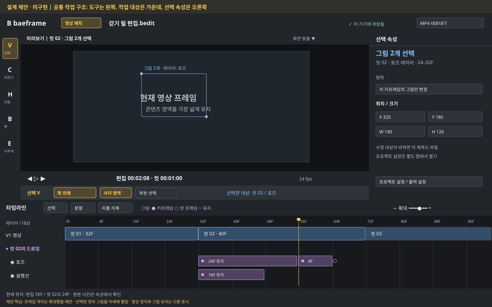

**읽는 순서:** 문서 이름과 저장 상태 → 현재 작업 대상 → 영상/그림 → 현재 시간 → 타임라인의 선택 범위다. 도구가 바뀌어도 영상 사각형이 갑자기 이동하지 않게 한다. 이 예시는 V로 그림 2개를 선택한 상태이며, 선택된 컷 02 아래에 드로잉 레이어만 펼친다.

| 설계 요소 | 해결하려는 문제 | 구현 전에 결정할 점 |
|---|---|---|
| 좌측 짧은 도구 열 | U07의 큰 부동 팔레트 | 리뷰창의 네이티브 영상·오버레이와 안전하게 도킹할 방식 |
| 고정 문맥 줄 | U01·U10·U26의 선택 의미 | 컷·프레임 범위·그림 다중 선택의 우선순위 |
| 선택 속성 상단 고정 | U10·U13의 대상 상실 | 혼합 선택 시 공통값/서로 다른 값의 표시 |
| 계층형 타임라인 | U11·U12의 시간 혼재 | 선택하지 않은 컷의 레이어를 펼치는 전문가 보기 필요성 |
| 문서 상태 영역 | U05·U23의 헤더 경쟁 | 긴 파일명, 수정 점, 저장 실패 상태의 최소 공간 |

그림에 있는 위치/크기 입력과 리플 삭제 등은 배치 후보다. 현재 제공 범위와 연결하지 않은 버튼을 실제 프로토타입에 활성 상태로 놓지 않는다. 프레임 표기의 `24–32F` 같은 범위는 후속 사양에서 끝 경계 포함/제외를 명확히 정해야 한다.

### 제안 B · 영상 정지와 그림 유지를 다른 언어로 표시

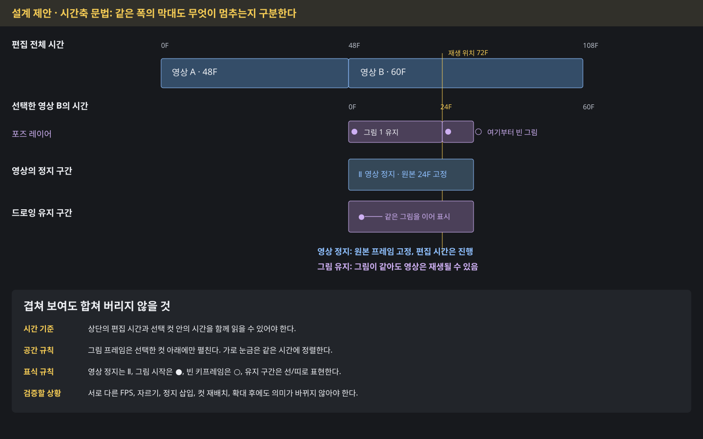

예시의 프레임 위치는 0부터 센다. A는 48F, B는 60F이며 편집 전체 72F는 B 안의 24F다. **같은 눈금 위치를 유지하면서 기준만 명시**한다. 영상 정지는 원본 프레임의 내용을 고정하지만 출력의 재생 시간과 플레이헤드는 계속 진행한다. 아래의 영상 정지와 드로잉 유지 행은 두 개념의 비교를 위한 설명이며 하나의 현재 프로젝트 실행 결과가 아니다.

| 시간에 놓이는 대상 | 권고 표식 | 사용자가 알 수 있어야 할 것 |
|---|---|---|
| 영상 클립 | 이름·컷 번호가 있는 막대 | 편집 시작/끝, 길이, 원본 범위 |
| 영상 정지 구간 | 정지 표식 Ⅱ + 길이 | 어느 원본 프레임이 고정되는지, 편집 길이가 어떻게 바뀌는지 |
| 그림 키프레임 | 채운 점 ● + 필요 시 번호 | 여기서 그림 내용이 시작/변경됨 |
| 빈 그림 키 | 빈 점 ○ | 레이어 숨김과 달리 이 시점의 그림이 비어 있음 |
| 같은 그림 유지 | 키에서 이어지는 선/띠 | 새 그림을 만들지 않고 같은 내용을 계속 표시 |
| 리뷰 구간 | 별도 리뷰 행의 범위 표식 | 영상/그림을 편집하는 선택 범위와 다름 |
| 속성 애니메이션 키 | 별도 속성 행, 향후 도입 시 | 현재 드로잉 키와 같은 기능으로 오해시키지 않음 |

**저장 구조 원칙:** UI를 통일한다고 리뷰의 원본 시간이나 drawingsV3에 임의 필드를 넣지 않는다. 컷 분할·정지·재배치 후 그림 소유권과 시간 매핑은 현재 모델에 맞춰 명세해야 한다. 리뷰 원본 피드백을 편집 결과에 표시할 때는 대응 관계를 보여주며 원본 리뷰 자체를 조용히 바꾸지 않는다.

### 제안 C · 상태를 색 하나에 맡기지 않는다

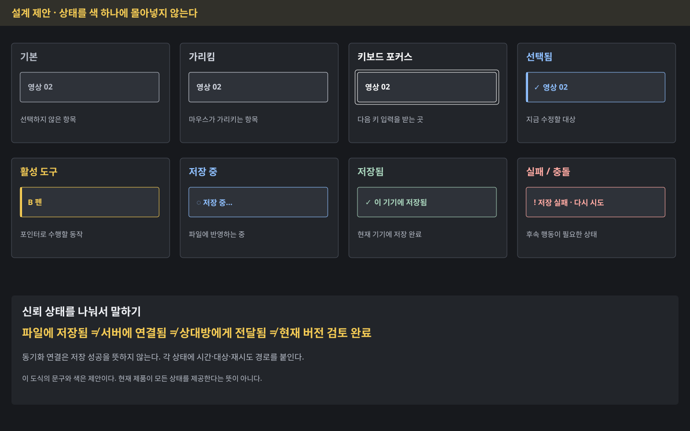

활성 도구, 선택된 대상, 키보드 포커스는 서로 다른 상태다. 같은 노랑으로 전부 칠하면 어느 곳이 입력을 받는지 알기 어렵다. 저장 성공도 단순 녹색 점보다 ‘이 기기에 저장됨’이라는 목적어가 중요하다.

| 상태 | 필요한 표시 | 잘못 섞었을 때의 결과 |
|---|---|---|
| 활성 도구 | 눌림 형태 + 도구 이름 + 커서 | 도구 선택과 그림 선택을 혼동 |
| 선택 대상 | 대상 외곽선/행 강조 + 이름·개수 | 다른 컷이나 레이어를 편집했다고 생각 |
| 키보드 포커스 | 별도 포커스 링 | Delete/단축키 적용 위치 예측 불가 |
| 일시 준비 중 | 이유·범위·완료/실패 경로 | 이전 스틸을 정상 화면으로 오해 |
| 저장됨 | 문서 이름·위치·완료 시점 | 연결됨을 저장 완료로 오해 |
| 연결됨 | 연결 대상·연결 상태 | 상대가 파일을 받거나 읽었다고 오해 |
| 오류 | 원인 + 영향 + 다음 행동 | 영문 오류만 보고 사용자가 복구 방법 추측 |

선택색은 사용자가 고른 브러시 색과 독립되어야 한다. 빨간 선을 그렸다는 이유로 오류 상태처럼 보이거나, 노란 그림 때문에 활성 도구를 찾기 어려워지지 않도록 화면 내용과 UI 표식을 구분한다.

### 제안 D · 리뷰와 제작은 목적을 유지하며 같은 규칙을 쓴다

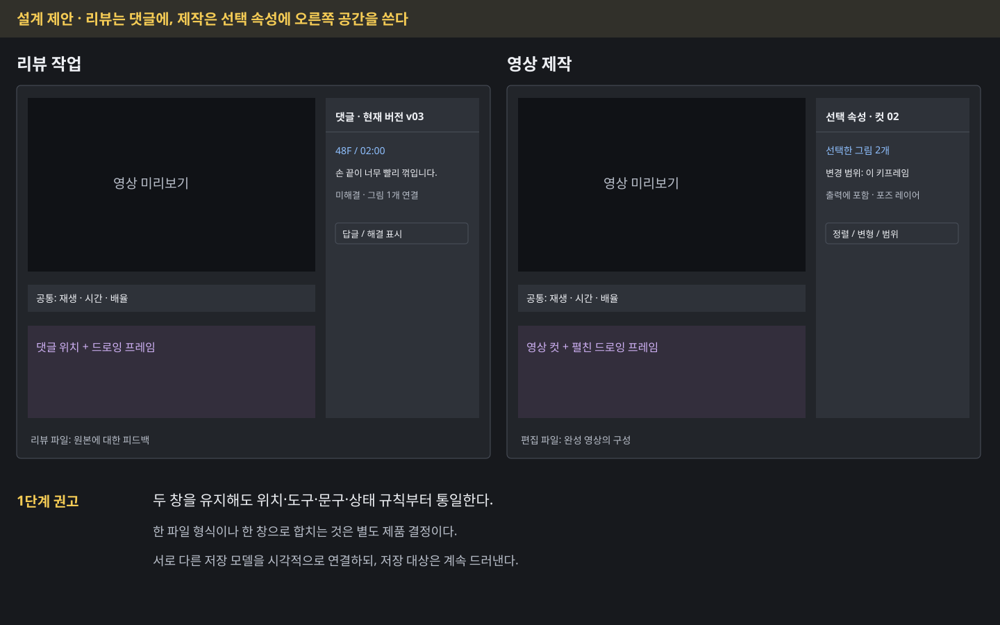

리뷰는 원본을 보고 의견을 남기는 작업이고, 제작은 편집 결과를 만드는 작업이다. 오른쪽 패널의 책임은 달라도 문서 상태, 도구 위치, 시간 표현, 포커스, 오류 처리는 공유할 수 있다. 그림의 리뷰/제작 표시는 방향 설명이며 현재 창을 즉시 하나로 합치자는 확정안이 아니다.

| 대안 | 장점 | 비용·위험 | 판단 |
|---|---|---|---|
| 현재 화면의 색·여백만 수정 | 작은 변경으로 빠르게 일부 개선 | 선택·시간·저장 혼란과 밀도 문제는 남음 | 단기 보완에만 사용 |
| 공통 규칙 + 별도 작업 문맥 | 기존 리뷰와 드로잉 강점을 유지하며 일관성 개선 | 공통 상태·명령·부품 설계가 먼저 필요 | **권고** |
| 하나의 거대한 편집 창으로 통합 | 장기적으로 화면 이동을 줄일 가능성 | 파일 형식·Undo·원본 리뷰·출력 시간의 충돌, 개발 범위 급증 | 별도 제품 실험 이후 판단 |

## 11. 디자인 시스템과 인터랙션 계약

### 먼저 고정할 공통 부품

그림자·테두리·아이콘을 개별 화면마다 조정하는 방식은 유지 비용이 크다. 다음 부품의 상태와 크기 규칙부터 공통으로 정한다. 한 번에 전체 CSS를 바꾸지 않고, 문서 헤더와 상태 영역부터 점진적으로 적용한다.

| 부품 | 최소로 포함할 정보·상태 | 초기 설계 목표와 검증 |
|---|---|---|
| 문서 헤더 | 파일 이름, 수정 점, 저장 상태, 핵심 명령, 전체 위치 보기 | 긴 이름·다른 배율에서도 핵심 명령 유지 |
| 도구 버튼 | 아이콘, 이름/툴팁, 현재 키, 눌림, 비활성 이유 | 기본 조작 높이 28–32px부터 비교. 절대 표준값이 아닌 제품 후보 |
| 문맥 바 | 도구, 선택 대상, 레이어, 적용 범위 | 도구 전환 시 영역 높이 안정, 정보 없음도 명확히 표시 |
| 숫자 입력 | 값, 단위, 검증 오류, 확정/취소 | 마우스·키보드·한글 조합·Ctrl+S와 충돌 없음 |
| 시간 표시 | 기준, 형식, fps, 현재/총 길이 | 편집·컷·원본 중 어떤 시간인지 읽힘 |
| 타임라인 키/구간 | 대상 종류, 시작/끝, 선택, 잠금/숨김 | 확대 수준별 묶음과 개별 조작, 키보드 대안 |
| 댓글 카드 | 작성자, 구간, 본문, 상태, 액션 | 좁은 패널·긴 이름·답글에서도 정체성 유지 |
| 상태/오류 | 진행 단계, 영향 대상, 다음 행동 | 저장·출력·연결·열기 실패의 문구를 분리 |

글자는 단일한 공통 계열을 선택하고 한국어·숫자·라틴 글자의 실제 가독성을 비교한다. 초기안은 본문 13–14px, 보조 라벨 12–13px, 핵심 시간 14–16px, 간격은 4/8/12/16 단위로 시작한다. 핵심 시간은 자리 폭이 일정한 숫자를 사용하면 재생 중 흔들림을 줄일 수 있다. 이 수치들은 **프로토타입의 출발점**이며 WCAG나 Windows의 강제 규격이 아니다. 콘텐츠의 그룹·간격·강조를 일관되게 다루는 원칙은 Microsoft 지침도 참고할 수 있다. [Windows 콘텐츠 구성](https://learn.microsoft.com/en-us/windows/apps/design/basics/content-basics)

### 색상과 접근성의 범위를 정확히 정한다

제품의 노란색은 브랜드와 주요 조작에 유지할 수 있다. 선택 대상은 별도 강조, 영상 트랙과 드로잉 행은 역할색, 오류는 경고색으로 구분하되 **색만으로 뜻을 전달하지 않는다.** 전체 면을 여러 색으로 채우기보다 작은 표식·선·제목과 함께 사용한다.

| 평가 기준 | 이 보고서에서 적용하는 방식 |
|---|---|
| 일반 텍스트 대비 4.5:1 | 읽어야 할 안내·값·메타데이터의 실제 배경에 적용. 큰 텍스트와 예외는 표준 정의에 따름. [W3C](https://www.w3.org/WAI/WCAG22/Understanding/contrast-minimum) |
| 의미 있는 비텍스트 요소 3:1 | 조작과 상태를 알아보는 데 필요한 표시를 평가. 모든 장식선에 일괄 적용하지 않음. [W3C](https://www.w3.org/WAI/WCAG22/Understanding/non-text-contrast.html) |
| 타깃 크기 24×24 CSSpx 기준 | WCAG 2.2 AA에는 간격·동등 기능·인라인·필수 표현 등의 예외가 있음. 모든 버튼에 44px를 강제하지 않음. 프레임 셀은 실제 겹침과 대체 조작을 함께 검사. [W3C](https://www.w3.org/WAI/WCAG22/Understanding/target-size-minimum.html) |
| 포커스가 가려지지 않음 | 사용자 입력 지점을 패널·알림이 완전히 덮지 않도록 검사. [W3C](https://www.w3.org/WAI/WCAG22/Understanding/focus-not-obscured-minimum.html) |

현재 일부 표본을 검사한 것이며 앱 전체의 WCAG 적합성 인증이 아니다. 고밀도 편집 도구라는 이유로 작은 글자나 식별 불가능한 상태를 정당화하지도 않는다.

### 클릭·드래그·키보드가 같은 결과를 설명해야 한다

| 동작 | 실행 전에 보여줄 것 | 실행 중·후에 지킬 것 |
|---|---|---|
| V로 그림 선택 | 그림 입력 가능 여부, 현재 레이어·잠금 | 선택 수/범위 표시, 화면 좌표와 실제 위치 일치 |
| C로 컷 분할 | 가리킨 컷과 분할 예정 프레임 | 정확한 위치에서 분할, 결과 컷 정체성 표시, 입력칸 문자 C 보호 |
| H/가운데 버튼 팬 | 보기 이동 커서, 배율 | 손을 움직이는 동안 화면 반응, 종료 즉시 멈춤, 저장된 그림 내용 불변 |
| 타임라인 확대 | 현재 확대 기준점, 전체 대비 위치 | 현재 프레임·선택 범위 유지, 수동 상태 표시 |
| 그림 유지 길이 변경 | 대상 레이어·그림과 새 길이 | 다른 키·영상 시간에 미치는 영향 미리보기, 충돌 규칙 명시 |
| Delete | 컷/키/획/댓글 중 대상 | 문맥에 맞는 명령명과 Undo, 전체 삭제로 암묵적 확대 금지 |
| Ctrl+S | 저장할 문서와 현재 수정 상태 | 입력값 확정, 중복 저장 방지, 완료 후 실제 대상 표시 |
| Esc | 취소 가능한 현재 임시 동작 | 드래그/팝오버/선택 중 무엇을 해제했는지 예측 가능 |

‘프리미어처럼 부드럽다’는 말을 완료 기준으로 두면 평가가 어렵다. 팬과 스크럽은 **입력 중 미리보기 갱신**, **중단 후 지연된 이동 없음**, **다른 프로젝트 응답이 섞이지 않음**, **포인터와 그림의 상대 위치 유지**로 나눠 측정한다. 후속 성능 실험에서는 같은 PC·영상·배율로 입력부터 표시까지의 지연과 프레임 간격의 상위 지연을 기록한다. 이번에는 성능 수치를 새로 측정하지 않았으므로 ‘항상 60fps’ 같은 약속을 하지 않는다.

## 12. 실제 작업 흐름으로 제안안을 검증한다

### 과제 1 · 긴 파일을 열고 특정 구간에 의견 남기기

1. 긴 한글 이름의 영상을 열고 현재 파일 전체 이름을 확인한다.
2. 재생목록과 댓글을 열어 1100px 창에서 작업한다.
3. 33–60F 구간에 댓글을 남기고, 카드에서 작성자와 끝 범위를 읽는다.
4. 저장한 .bframe 위치와 마지막 저장 상태를 확인한다.

**성공 기준:** 핵심 명령이 화면 밖으로 나가지 않고, 댓글 입력을 상태 패널이 가리지 않으며, 카드만 보고 적용 범위를 확인할 수 있다. **연결 항목:** U05·U06·U08·U09·U15·U16·U23.

### 과제 2 · 저장된 그림을 선택하고 옮기기

1. 새 편집창에서 그림이 들어 있는 프로젝트를 연다.
2. 표시된 V 상태에서 그림 두 개를 선택한다.
3. 확대·팬 후 이동하고 다른 키프레임으로 갔다 돌아온다.
4. 저장·재열기 후 같은 위치와 레이어 소유권을 확인한다.

**성공 기준:** V를 불필요하게 다시 누르지 않고 첫 입력이 동작한다. 화면 팬은 그림 데이터를 바꾸지 않으며, 획 이동만 의도한 내용을 바꾼다. **연결 항목:** U01·U07·U10·U26. 과거 좌표 개선을 반드시 회귀 검사한다.

### 과제 3 · 영상 정지와 그림 유지를 구별해 릴 편집하기

1. 두 컷을 붙이고 C로 원하는 지점을 나눈다.
2. 원본의 한 프레임으로 영상 정지 구간을 만든다.
3. 별도 드로잉 레이어에서 그림을 유지하고 빈 키를 넣는다.
4. 영상은 움직이지만 그림은 유지되는 경우, 영상과 그림이 모두 멈추는 경우를 각각 확인한다.

**성공 기준:** 사용자가 각 명령의 결과와 전체 길이 변화를 실행 전에 설명할 수 있다. 컷 분할 후 원본 시간과 드로잉 범위가 연결된다. 이 과제의 후속 노출 편집 UI는 미구현 제안이며 현재 기능과 구분해 프로토타입을 만든다. **연결 항목:** U10·U11·U12·U26.

### 과제 4 · 긴 편집에서 특정 그림 키 찾기

1. 6분·12컷·9레이어 프로젝트를 1050×720에서 연다.
2. 전체 개요에서 지정된 컷을 찾는다.
3. 겹친 키 묶음을 확대하고 12F 키를 선택한다.
4. 타임라인 높이를 늘렸다 줄이고 전체 보기로 돌아온다.

**성공 기준:** 임의의 다른 키가 선택되지 않고, 작업 중 컷 이름·레이어·현재 시간이 남는다. 전체/선택 컷/수동 표시가 실제 범위와 일치한다. **연결 항목:** U10·U12·U13·U14·U18.

### 과제 5 · 입력 중 저장하고 출력 상태 확인하기

1. 프로젝트 이름을 한글로 수정한 뒤 입력칸에서 Ctrl+S를 누른다.
2. 저장 대상과 완료 상태를 확인한다.
3. 영상을 출력하고 작업 중 파일명·규격·진행 단계를 확인한다.
4. 취소 또는 실패 상태에서 프로젝트 저장이 유지되는지 확인한다.

**성공 기준:** 마지막 입력이 포함된 저장이 한 번 수행된다. 출력 완료와 프로젝트 저장을 혼동하지 않는다. 실제 인코딩은 후속 Electron·FFmpeg 통합 검사에서 수행한다. **연결 항목:** U03·U22·U23·U24.

### 과제 6 · 원본이 없을 때 현재 작업을 지키며 복구하기

1. 정상 프로젝트에서 누락 원본이 있는 다른 프로젝트를 연다.
2. 오류의 영향과 현재 작업 보존 상태를 읽는다.
3. 다시 연결을 취소하거나 올바른 원본을 지정한다.
4. 현재 프로젝트의 그림 입력, 복구한 프로젝트의 시간·저장을 확인한다.

**성공 기준:** 실패 후 준비 중 상태가 남지 않는다. 잘못된 대체를 자동 수용하지 않는다. 복구 UI는 새 기능으로 사양을 정하며 원본 파일을 임의 수정하지 않는다. **연결 항목:** U02·U04·U23.

### 검증 환경을 한 가지 화면 크기에 고정하지 않는다

| 축 | 후속 검사 조합 | 이번 확인과의 구분 |
|---|---|---|
| 창 크기 | 리뷰 1100, 편집 1050, 공통 1366/1440/1920px 폭; 낮은 높이 720px 포함 | 이번은 리뷰 1440/1100, 편집 1440/1050 조건 |
| 배율 | Windows 디스플레이 100/125/150/200%, 글자 크기 별도 | 이번 page zoom 125%와 글자 주입 200%는 OS 검증을 대신하지 않음 |
| 영상 | 가로/세로/정지 구간, 긴 원본 이름, 여러 컷 | 합성 영상으로 현재 대표 상태 검사 |
| 드로잉 | 0/1/여러 레이어, 인접 키, 빈 키, 선택·잠금·숨김 | 9레이어 밀도와 실제 V3 입력 일부 검사 |
| 입력 | 마우스, 키보드, 펜, 포커스 이동, 한글 조합 | 이번 마우스·키보드 중심, 펜 미검사 |
| 실패 | 누락 원본, 권한 부족, 저장 실패, 출력 취소, 창 닫기 | 누락 오류 표시·선택·입력 저장 일부만 검사 |
| 협업 | 두 PC, 실제 수신자, 권한 차이, 연결 해제 | 이번 외부 전송 차단, 미검사 |
| 네이티브 창 | 영상·Fabric·DOM 정렬, 전체 화면, 다중 모니터 | page zoom 스트레스의 어긋남은 원인/지원 범위 미확정 |

Windows 문서는 작은 창과 서로 다른 디스플레이 환경을 고려하도록 안내한다. 다만 여기 제시한 테스트 조합과 패널 치수는 BAEFRAME의 제품 검증안이다. [Windows 앱 권장 사항](https://learn.microsoft.com/en-us/windows/apps/get-started/best-practices)

사용성 검증은 비개발자 리뷰 사용자, 드로잉 중심 사용자, 영상 편집 경험자에게 동일한 과제를 주고 **첫 시도 성공 여부, 잘못 선택한 대상, 도움 요청, 되돌리기, 중단 이유**를 기록한다. 아직 사용자를 모집하거나 시간을 측정하지 않았으므로 생산성 향상률과 만족도 점수는 제시하지 않는다.

## 13. 구현 순서와 완료 조건

### 1단계 · 주 작업을 막는 상태와 화면 경계

**대상:** U01·U02·U03·U05·U06·U19·U22. 활성 표시와 실제 입력, 오류 종료, 전역 저장 키, 헤더 보존, 좁은 창, 틀린 도움말, 접근 가능한 이름을 정리한다. 큰 레이아웃 개편과 분리해 원인을 좁힐 수 있다.

**완료 조건:** 재현 순서에서 문제를 확인하는 검사가 먼저 실패하고 수정 후 통과한다. 기존 획 좌표·도구 전환 안정성·팬 데이터 불변이 유지된다. 이 단계에서도 앱 코드 변경은 별도 작업이며 본 보고서에서 실행하지 않았다.

### 2단계 · 공통 문서·선택·상태 부품

**대상:** U07·U09·U10·U17·U18·U20·U23·U24·U25. 문서 헤더, 선택 문맥, 도구 바, 상태 영역, 환경설정 진입을 공통 규칙으로 만든다. 리뷰와 제작을 각각 유지하면서 같은 문법을 적용한다.

**완료 조건:** 가로/세로·좁은/넓은 창에서 선택 대상과 저장 상태가 지속된다. 고대비·글자 크기·긴 이름을 검사하고, 네이티브 오버레이가 있는 리뷰창은 실제 앱으로 확인한다. 단순 HTML 배치 검사만으로 완료하지 않는다.

### 3단계 · 타임라인과 패널을 작업에 맞게 조절

**대상:** U08·U11·U12·U13·U14·U15·U16. 전체 개요, 선택 컷의 드로잉 상세, 키 묶음, 범위 카드, 패널 경계 조절을 프로토타입으로 검증한다. 픽셀 배치보다 시간 의미와 hit 영역부터 확정한다.

**완료 조건:** 6분·12컷·9레이어 과제에서 특정 키를 선택하고 전체로 돌아올 수 있다. 영상 정지와 그림 유지가 구별되며, 컷 이동·분할 뒤에도 표식과 데이터가 일치한다. 프레임 매핑 테스트와 실제 마우스 검사를 함께 수행한다.

### 4단계 · 복구·첫 사용·명령 체계 확장

**대상:** U04·U21·U26과 앞 단계에서 확정되지 않은 정책. 원본 재연결, 첫 이름 요청 시점, 작업별 단축키, Undo 적용 범위를 별도 사양으로 작성한다.

**완료 조건:** 누락·취소·잘못된 대체에서 데이터가 안전하며 현재 작업으로 돌아갈 수 있다. 기존 사용자 키 설정과 .bframe 하위 호환성을 보존한다. 파일 형식 통합, 고급 오디오, 효과 키 애니메이션, 클라우드 버전 관리 등은 이 UI 보고서만으로 승인된 구현 범위에 넣지 않는다.

### 구현 계획으로 넘기기 전에 확정할 결정

| 결정 항목 | 이 보고서의 권고 초안 | 확정 방법 |
|---|---|---|
| 선택 문맥 | 도구+대상+레이어+범위의 고정 요약 | 그림/컷/범위 혼합 과제 프로토타입 |
| 타임라인 기본 | 전체 개요 + 선택 컷 드로잉 펼침 | 긴 편집과 짧은 릴 양쪽 비교 |
| 좁은 창 | 핵심 영상/시간 유지, 보조 패널 먼저 접기 | 최소 창과 사용자 배율 검사 |
| 단축키 | 제작은 Premiere 친화, 리뷰는 기존 설정 보존 | 문자 입력·문서 명령·캔버스 포커스 표 작성 |
| 저장 설명 | 문서별 로컬 저장 상태를 지속 표시 | 저장/다른 이름/오류/출력의 상태 전이 검토 |
| 복구 범위 | 누락 원본 재연결부터, 자동 대체 금지 | 현재 파일 모델·미디어 검사 계약 확인 |

일정과 비용은 아직 산정하지 않는다. 실제 네이티브 오버레이 배치, 상태 소유권, 시간 매핑의 변경 폭을 확인한 뒤 단계별로 계산해야 한다. 디자인 시안 승인과 앱 코드 변경·PR·배포 승인은 별도 작업 범위다.

## 14. 출처·추적과 남은 불확실성

### 현재 코드와 화면 근거

이 보고서의 현재 상태 기준은 **`5d1cb89afcae21429c1e076a6964bc11cd990228`**, 앱 표기 버전은 **2.9.0-beta**다. 리뷰창의 실제 패키지와 편집 renderer 근거는 같은 개선 기준선을 대상으로 한다. 새 공식 릴리스를 배포했다는 뜻은 아니다.

| 보고서 항목 | 원시 근거 식별자 |
|---|---|
| U01 / U02 / U03 / U04 | ED-02 / ED-01 / ED-03 / ED-04 |
| U05 / U06 / U07 / U08 / U09 | RV-01 / RV-02 / RV-05 / RV-03 / RV-04 |
| U10 / U11 / U12 / U13 / U14 | ED-05 / ED-06 / ED-07 / ED-08 / ED-11 |
| U15 / U16 / U17 / U18 / U19 | RV-06 / RV-07 / RV-08 / ED-09 / RV-09 |
| U20 / U21 / U22 | RV-10 / RV-11 / RV-12 + ED-12 |
| U23 / U24 / U25 / U26 | RV-13 + ED-10 / ED-12 / ED-13 / 현재 명령 코드 + 비교·설계 |

원시 관찰은 `evidence/review-findings.json`, `evidence/editor-findings.json`에 있고, 각 화면의 측정·재현 조건·소스 줄을 기록했다. 경쟁 자료는 `evidence/references/reference-ledger.json`에 페이지 시점·이미지 출처·한계·해시를 보존했다. 이 파일들은 로컬 조사 자료이며 모바일 게시본에 테스트 프로필·원시 로그·합성 영상 파일을 포함하지 않는다.

리뷰 하니스는 오류 0건, 정상 종료 exit 0이며 편집 Chrome 검사도 pageerror 0, exit 0이다. 이는 **이번 증거 수집의 실행 결과**다. 과거의 자동 테스트 통과 수를 이번 UI 보고서의 새 테스트 수치로 재사용하지 않는다.

### 제외하거나 미확정으로 남긴 것

- **Windows DPI 결함 확정:** page zoom 125%에서 네이티브 영상/오버레이와 DOM 위치 어긋남이 보였지만 지원 계약과 원인을 확정하지 않았다. OS 배율·다중 모니터·전체 화면을 별도로 검사해야 한다.
- **온라인 글꼴에서의 정확한 줄바꿈:** 리뷰창은 외부 요청을 막은 상태다. 긴 이름 문제의 온라인 재확인과 실제 글리프 선택 추적이 필요하다.
- **실사용 협업 성공:** 두 PC·실제 수신자·Drive 권한·연결 상태 전달은 이번에 시험하지 않았다. 저장과 공유를 구분하자는 제안이 외부 전달 실패의 새 재현 증거는 아니다.
- **전체 접근성 인증:** 대비·이름·일부 크기 표본만 확인했다. 키보드 전 경로, 스크린리더, 펜, OS 글자 배율은 별도 감사가 필요하다.
- **성능 향상·사용자 선호:** 새 지연 수치나 사용자 실험을 수집하지 않았다. 배치 선호와 생산성 향상률을 확정하지 않는다.
- **타사 최신 실행 화면:** 공식 문서와 원본 이미지를 비교했다. 오래된 이미지도 구조 참고로 사용했으며 모든 최신 바이너리를 직접 실행하지 않았다.

### 공식 참고 문서 목록

본문의 각 비교·표준 설명에 직접 연결된 출처를 붙였다. 아래는 추가 추적용 목록이다. 이미지의 권리는 각 제작사에 있으며 출처와 설명 맥락을 유지했다. 이미지 6개는 공식 문서의 원본 바이트를 보존했고 AI로 재구성하거나 현재 BAEFRAME 캡처처럼 표시하지 않았다.

| 자료 | 공식 출처 | 문서 시점·범위 |
|---|---|---|
| R01 · Adobe Premiere | [Tools panel in Premiere](https://helpx.adobe.com/premiere/desktop/get-started/tour-the-workspace/tools-panel-and-options-panel.html) | 2026-01-07 · 현재 Premiere 데스크톱 도움말 |
| R02 · Adobe Premiere | [Overview of workspaces](https://helpx.adobe.com/premiere/desktop/get-started/tour-the-workspace/what-are-workspaces.html) | 2026-01-07 · 현재 Premiere 데스크톱 도움말 |
| R03 · Adobe Premiere | [Customize panels](https://helpx.adobe.com/premiere/desktop/get-started/tour-the-workspace/customize-panels.html) | 2026-01-07 · 현재 Premiere 데스크톱 도움말 |
| R04 · Adobe Animate | [How to use frames and keyframes in Animate](https://helpx.adobe.com/animate/desktop/animation/frames-keyframes.html) | 2026-06-09 · 현재 Animate 도움말; 페이지는 제품이 maintenance mode임을 안내 |
| R05 · Adobe Animate | [How to use the timeline in Animate](https://helpx.adobe.com/animate/desktop/workspace-and-workflow/timeline.html) | 2026-06-09 · 현재 Animate 도움말 |
| R06 · DaVinci Resolve | [DaVinci Resolve – Cut](https://www.blackmagicdesign.com/products/davinciresolve/cut) | 갱신일 미표기 · 현재 제품 페이지; 개별 이미지의 정확한 앱 빌드 번호는 미확인 |
| R07 · DaVinci Resolve | [DaVinci Resolve – Edit](https://www.blackmagicdesign.com/products/davinciresolve/edit) | 갱신일 미표기 · 현재 제품 페이지 |
| R08 · Toon Boom Harmony | [Harmony 25 Advanced Documentation: About Exposure](https://docs.toonboom.com/help/harmony-25/advanced/timing/about-exposure.html) | 갱신일 미표기 · Harmony 25 Advanced |
| R09 · Toon Boom Harmony | [How do I change my drawings to all have the same exposure?](https://helpcentre.toonboom.com/hc/en-ca/articles/41575716406547-How-do-I-change-my-drawings-to-all-have-the-same-exposure) | 2026-07-21T13:28 · 현재 Harmony 지원 문서; 세부 에디션 미명시 |
| R10 · Toon Boom Harmony | [How do I fill in gaps between my drawing frames?](https://helpcentre.toonboom.com/hc/en-ca/articles/44457300755347-How-do-I-fill-in-gaps-between-my-drawing-frames) | 2026-07-21T13:28 · 현재 Harmony 지원 문서 |
| R11 · Frame.io | [Commenting on your media](https://help.frame.io/en/articles/9105251-commenting-on-your-media) | 2025-03-14T17:47:49Z · Frame.io V4 Knowledge Center |
| R12 · Frame.io | [Comments Panel Overview](https://help.frame.io/en/articles/9105278-comments-panel-overview) | 2024-10-11 · Frame.io V4 Knowledge Center |
| R13 · Frame.io | [Versioning in Frame.io](https://help.frame.io/en/articles/9101068-versioning-in-frame-io) | 2026-09-04T14:06:06Z · Frame.io V4; Version Saves 부분은 Frame.io Drive의 Mounted Storage에 한정 |
| R14 · Frame.io | [Comparison Viewer](https://help.frame.io/en/articles/9952618-comparison-viewer) | 2026-05-19 · Frame.io V4 Knowledge Center |
| R15 · Frame.io / Adobe Premiere | [Adobe Premiere Frame.io V4 Panel Overview (25.6 and later)](https://help.frame.io/en/articles/12833113-adobe-premiere-frame-io-v4-panel-overview-25-6-and-later) | 2026-06-16T18:43:54Z · Premiere 25.6 이상 내장 Frame.io V4 패널 |

### 다음 작업의 출발점

첫 구현 사양은 **U01·U02·U03의 상태 정합성**, **U05·U06의 핵심 조작 보존**, **10장의 BAEFRAME 기본 리뷰·드로잉 리뷰와 BEditer 두 화면**을 함께 기준으로 작성하는 것이 적절하다. 기본 앱의 댓글·목록·저장 경로를 편집기 개편 뒤로 밀지 않는다. 공통 문서 헤더·고정 작업 줄·상태 부품을 먼저 정리하고, 리뷰 원본 시간과 편집 출력 시간을 각각 유지한 채 타임라인을 다듬는다. 구조 설명 A/B는 그 구현의 선택·시간 규칙을 보충한다.
