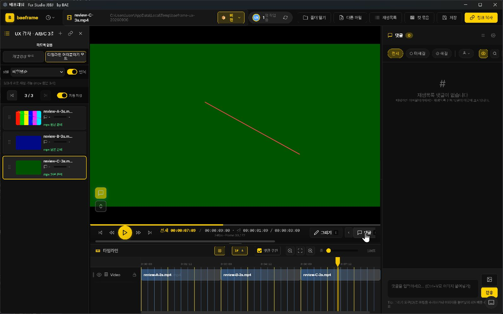
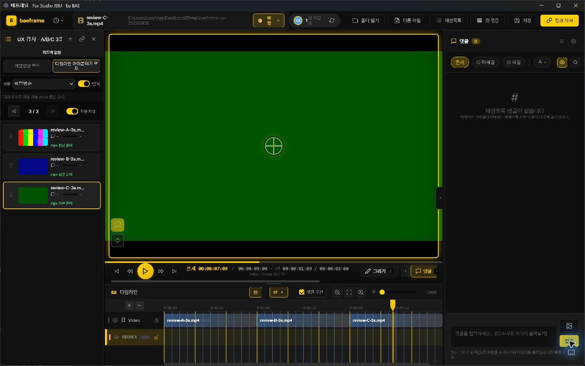
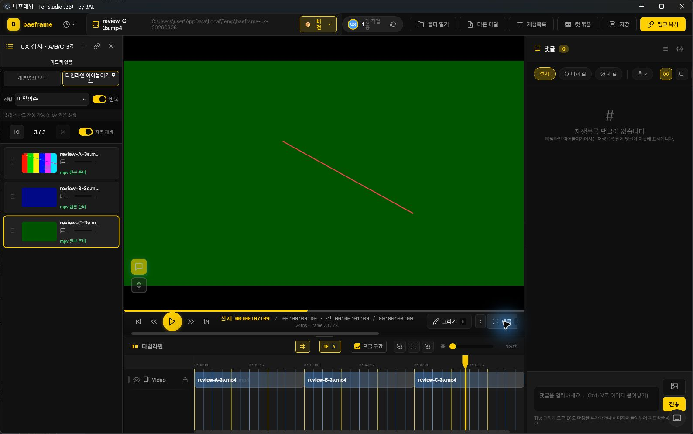

# 배프레임 UX 심층 점검

코멘트·드로잉·공유가 끊기지 않는 리뷰 도구를 위한 개선 보고서

**2026년 9월 6일 · v2.9.0-beta · Windows · 현재 main 소스 기준**

## 먼저 읽을 결론

**지금 가장 필요한 것은 화면 전체의 재디자인보다, 영상을 넘기고 그림을 보며 댓글을 달고 공유하는 과정의 연결을 바로잡는 일입니다.** 영상 중심의 어두운 화면, 오른쪽 댓글, 아래 타임라인이라는 기본 배치는 목적에 잘 맞습니다. 하지만 다음 영상 전환이 불필요하게 기다리고, 댓글 작성 중 기존 그림이 사라지며, 공유받는 웹 화면에도 새 방식의 그림이 표시되지 않는 문제가 확인됐습니다.

이번 조사에서 **우선 개선 항목 19개**를 정리했습니다. 다음 릴리스에서 우선 다룰 P1은 9개, 사용 흐름을 다듬을 P2는 9개, 후속 기능 제안 P3는 1개입니다. 전체 서비스 중단이나 실제 저장 데이터 파괴를 확인한 P0 문제는 없습니다. 모든 항목을 실제 화면에서 재현한 것은 아니며, 각 항목에 검증 방법을 표시했습니다.

영상 전환·가시성 외에도 **창 닫기의 저장 보호, 재생목록 저장 위치, 이미지 붙여넣기의 대상과 투명도**에서 추가 문제를 확인했습니다. [I16](#i16) · [I17](#i17) · [I18](#i18) · [I19](#i19)

가장 먼저 할 일은 다음 세 가지입니다.

1. **영상 전환의 불필요한 대기 제거.** 리뷰 파일이 없는 정상 영상도 매번 약 0.82초를 기다립니다. 실제 앱 로그와 저장 함수 실측이 일치합니다. [I01](#i01)
2. **그림이 리뷰 끝까지 보이도록 연결.** 댓글 작성 때 재생 방식이 바뀌면 저장된 그림이 화면에서 사라집니다. 웹 공유 화면에도 같은 새 그림 형식의 표시 경로가 없습니다. [I02](#i02) · [I03](#i03)
3. **작성·저장·공유 상태를 믿을 수 있게 수정.** 위치 지정 취소로 댓글 초안이 사라지고, 공유 전 저장 실패가 성공 안내로 이어질 수 있습니다. [I04](#i04) · [I05](#i05)

제품 코드는 수정하지 않았습니다. 아래 내용은 수정 판단과 후속 구현에 사용할 조사 보고서입니다.

## 무엇을 어떻게 확인했는가

| 구분 | 이번에 확인한 범위 | 해석할 때 주의할 점 |
|---|---|---|
| 실제 Windows 앱 | 별도 테스트 프로필에서 mpv 재생, A→B→C 연속 재생과 반복, Space 정지·재개, 패널 배치, 선 그리기와 저장, 댓글 진입·취소 | 현재 소스를 Electron으로 실행했습니다. 배포 설치 파일 전체의 인증 시험은 아닙니다. |
| 현재 소스 분석 | 재생 전환, mpv/HTML5 전환, 댓글·필터·단축키, V3 그림, 저장·공유·협업 상태 | 코드가 허용하는 위험과 실제 화면 재현을 구분했습니다. |
| 기존 자동 테스트 | 관련 8개 묶음, **1,879 pass / 0 fail / 0 cancelled**, 모두 종료 코드 0 | 소스 구조 검사와 모의 실행을 포함합니다. 사용자 작업 전체의 성공을 보장하지 않습니다. |
| 추가 재현 | 현행 함수를 추출해 실패·취소·비동기 경계 실행, 실제 파일 읽기 지연 측정, 실제 저장 V3 파일의 웹 표시 확인 | 일부 외부 경계는 모의 처리했습니다. 해당 결과를 실제 클립보드·네트워크 전달 성공으로 해석하지 않습니다. |
| 공개 웹 뷰어 | 현재 배포 HTML·JavaScript를 GET으로 확인하고, 내려받은 렌더 함수에 실제 앱이 만든 테스트 파일을 로컬에서 전달 | 사용자의 리뷰 파일은 업로드하지 않았습니다. 실제 수신자 로그인·Drive 접근 검증은 별도입니다. |
| 비교 앱 | Frame.io, SyncSketch, Premiere, VLC의 공식 문서 | 기능과 작업 흐름을 비교했습니다. 같은 환경에서 경쟁 앱의 속도나 가독성을 직접 측정하지 않았습니다. |

소스 기준은 `d72f6b7a87af9e5805eb03a0e0a6017bba999f32`입니다. 실행에는 `--mpv-pilot`, `--fabric-drawing-pilot`, `--fabric-drawing-v3-shadow`를 사용했습니다. 테스트 영상은 직접 만든 1280×720, 24fps, 3초 H.264 영상 3개입니다. 실제 화면의 내부 크기는 1586×963 CSS 픽셀, 배율 지표는 DPR 1.5였습니다.

이번에는 빌드·배포, 두 PC 동시 협업, 실제 공유 계정, 펜 장치, 다중 모니터 전체 조합을 검증하지 않았습니다. 이 부분은 마지막의 후속 검증표에 따로 적었습니다.

## 현재 잘 되어 있는 부분

**기본 화면의 중심은 영상에 있습니다.** 검은 배경과 노란 주요 조작은 영상 감상을 방해하지 않고, 오른쪽 피드백과 아래 시간축의 위치도 익숙합니다. 이 구조를 유지하면서 조작 영역과 상태 표현을 다듬는 쪽이 적절합니다.

**연속 재생 자체가 전부 고장 난 상태는 아닙니다.** 자동 다음 영상 재생과 반복을 켠 실제 앱에서 A→B→C→A 순서가 작동했습니다. Space로 정지한 뒤 다시 Space를 눌러 재생이 진행되는 것도 확인했습니다. 문제는 전환에 붙는 대기와 중간 상태 표시입니다.

**리뷰의 기본 재료는 상당 부분 갖춰져 있습니다.** 댓글의 프레임·구간, 상태·작성자·검색 필터, 해결 표시, 이전 버전 댓글 보기와 가져오기 경로가 이미 있습니다. V3 그림은 이번 실제 앱에서 한 획을 그리고 저장한 뒤 현행 저장 모듈이 유효한 파일로 수락했습니다. 저장 실패 표시와 재시도 기능도 존재합니다. 따라서 “필터가 없다”, “버전 리뷰가 없다”, “저장 오류를 전혀 알리지 않는다”는 평가는 맞지 않습니다.

**재생 전환과 저장의 보호 장치도 유지해야 합니다.** 중복 종료 이벤트, 이전 영상의 늦은 응답, 전환 중복 실행을 막는 코드와 파일 복구·저장 충돌 처리가 있습니다. 느린 부분을 고칠 때 이 보호 장치를 한꺼번에 없애면 다른 회귀를 만들 수 있습니다.

## 우선순위 한눈에 보기

| 항목 | 우선순위 | 사용자에게 생기는 일 | 확인 수준 |
|---|---|---|---|
| [I01 영상마다 반복되는 불필요한 대기](#i01) | P1 | 리뷰가 없는 새 영상도 다음 재생 시작 전 약 0.82초 대기 | 실제 앱 로그 + 실제 파일 실측 |
| [I02 댓글 작성 중 기존 그림 미표시](#i02) | P1 | 그림을 설명하려고 댓글을 열면 그림이 사라짐 | 실제 화면 + 저장 파일 + 소스 |
| [I03 공유 웹 화면의 V3 그림 미지원](#i03) | P1 | 수신자가 새 방식의 그림을 볼 수 없음 | 현재 배포 코드 + 유효 파일 함수 재현 |
| [I04 저장 실패와 충돌하는 공유 성공 안내](#i04) | P1 | 최신 리뷰가 저장된 것으로 오해하고 전달 | 현행 함수의 실패 조건 재현 |
| [I05 댓글 위치 지정 취소 시 초안 유실](#i05) | P1 | 전송을 누르고 취소하면 작성한 글이 없어짐 | 실제 화면·DOM + 함수 재현 |
| [I06 늦게 끝난 댓글 전환의 영상 재열기 위험](#i06) | P1 | 다른 영상을 선택한 뒤 이전 요청이 재생 방식을 바꿀 수 있음 | 현행 함수의 비동기 조건 재현 |
| [I07 정지·취소와 재생 실패의 혼동](#i07) | P2 | 사용자가 멈춘 영상도 오류·건너뜀으로 표시될 수 있음 | 현행 함수 재현 + 소스 |
| [I08 전환 중 파일명·시간·선택 위치 불일치](#i08) | P2 | 새 파일명 옆에 이전 영상의 프레임이 잠시 표시 | 실제 DOM 표본 + 소스 |
| [I09 mpv 탐색 미리보기와 최근 파일 이미지](#i09) | P2 | 찾으려는 장면을 재생 전 확인하기 어려움 | 소스 + 썸네일 생성 실패 재현 |
| [I10 패널을 열면 핵심 조작이 가로로 밀림](#i10) | P2 | 댓글·음량 접근에 가로 스크롤이 필요해짐 | 실제 화면 + 크기·색상 측정 |
| [I11 단축키·레이어 기능의 발견성](#i11) | P2 | 안내와 실제 조작이 다르거나 기능을 찾기 어려움 | 현재 HTML·설정·처리 코드 |
| [I12 필터 결과와 다음 댓글 이동 불일치](#i12) | P2 | 미해결만 보는 중 해결된 댓글로 이동 | 현행 함수 재현 + 소스 |
| [I13 재생과 리뷰 진입 규칙의 불명확함](#i13) | P2 | 이어보기인데 멈추거나 그리는 중 다음 영상으로 이동 | 실제 앱 + 의도된 정책의 소스 대조 |
| [I14 저장·연결·상대방 반영 상태의 혼합](#i14) | P2 | 연결됨을 최신 리뷰 전달 완료로 이해할 수 있음 | 상태 계산·안내 문구 소스 |
| [I15 댓글·그림·버전의 관계 보강](#i15) | P3 | 무엇을 지적했고 새 버전에서 고쳤는지 추적이 번거로움 | 현재 구조와 비교 앱을 바탕으로 한 제안 |
| [I16 창 닫기의 종료 전 저장 확인 누락](#i16) | P1 | X·Alt+F4로 닫으면 저장 확인 요청이 빠질 수 있음 | 현행 함수와 Electron 이벤트 순서의 모의 실행 |
| [I17 늦은 재생목록 저장이 현재 저장 위치를 바꿈](#i17) | P1 | B 목록을 편집하고 저장했는데 A 파일 경로로 저장 요청 | 실제 목록 관리 모듈 + 모의 파일 IPC |
| [I18 이미지 붙여넣기 대상 영상·프레임 변경](#i18) | P1 | A에서 붙인 이미지가 나중에 선택한 B에 추가될 수 있음 | 현행 콜백·합성 레이어 모듈의 비동기 재현 |
| [I19 투명 이미지의 배경이 불투명해짐](#i19) | P2 | 붙여넣은 참조 이미지가 영상의 가려서는 안 될 부분을 가림 | 현행 이미지 처리 함수의 실제 픽셀 대조 |

P1은 핵심 리뷰 작업의 신뢰를 위해 다음 릴리스에서 먼저 다룰 항목입니다. P2는 반복 작업의 혼란과 불편을 줄이는 항목, P3는 안정화 후 검토할 확장입니다. 개발 소요 시간 추정은 포함하지 않았습니다.

## 화면에서 확인한 핵심 장면

현재 기본 배치입니다. 영상 중심 구조는 유지할 가치가 있습니다. 양쪽 패널을 열면 아래 조작 영역의 실제 너비가 줄어드는 것이 문제입니다.

**댓글 작성 중, Frame 33:** 같은 프레임에 저장한 빨간 선이 보이지 않습니다.

**취소 후, 같은 Frame 33:** 선이 다시 나타납니다. 이번 현상은 저장된 그림의 삭제가 아니라 재생 방식 전환에 따른 표시 누락입니다.

## 상세 발견과 개선안

### I01 리뷰 파일이 없는 영상도 매번 약 0.82초를 기다린다

**P1 · 재생 전환 지연 · 실제 앱 로그와 실제 파일 읽기 실측**

리뷰를 아직 시작하지 않은 영상에는 `.bframe`이 없는 것이 정상입니다. 그런데 현재 읽기 처리는 파일이 없으면 여러 번 재시도합니다. 다음 영상은 일시정지로 열리고 리뷰 읽기가 끝난 뒤 재생되므로, 이 대기가 영상 사이에 그대로 들어갑니다. 반복 재생에서도 매번 발생합니다.

현행 저장 함수를 실제 임시 파일에 실행한 결과, 없는 파일의 읽기는 **828.256 / 818.909 / 822.136ms**, 존재하는 작은 JSON은 **0.990 / 0.849 / 1.413ms**였습니다. 실제 앱 로그에서도 리뷰 파일 없음의 읽기 20건이 818~979ms, 중앙값 863ms였습니다. 재시도에 설정된 대기 합계만 775ms입니다.

3초 영상들의 파일명 변경 간격은 반복 구간에서 4.144~4.684초로 관찰됐습니다. 이는 약 500ms 간격으로 읽은 화면 문구의 간격입니다. **실제 첫 프레임 표시 지연이나 무음 구간 길이를 측정한 수치가 아니며, 전환 비용 전체를 0.82초 하나로 설명할 수도 없습니다.**

**제안:** 정상적인 새 리뷰의 파일 부재와, 저장·복구 중 잠깐 파일이 사라진 상황을 구분합니다. 새 리뷰임을 확인할 수 있는 경로는 빠르게 통과하고, 뒤늦게 생성되는 리뷰 파일은 기존 감시 기능으로 발견합니다. 모든 `ENOENT` 재시도를 삭제하는 수정은 피해야 합니다.

**완료 기준:** 같은 3초 영상 반복에서 정상 파일 부재가 의도적인 775ms 대기를 만들지 않습니다. 다른 인스턴스가 뒤늦게 만든 파일의 발견과 복구·동시 저장 테스트는 유지합니다. 이전 영상 종료→다음 선택→미디어 준비→리뷰 준비→재생 요청→첫 프레임을 별도로 기록해 남은 지연을 측정합니다.

근거: `main/review-file-store.js:30–49,559–571,2085–2125`, `app.js:10849–10876`. [실측·로그와 원인 분석](evidence/playback-live-transition-analysis.md) · [재현 결과](evidence/playback-live-transition-probe.json).

### I02 그림을 보며 댓글을 쓰려는 순간 그림이 사라진다

**P1 · 핵심 리뷰 맥락 누락 · 실제 화면 재현**

테스트 영상 C의 Frame 33에 빨간 선을 그리고 저장했습니다. 댓글 작성에 들어가면 같은 프레임의 선이 보이지 않았고, 댓글 모드를 취소하자 다시 나타났습니다. 데이터 삭제는 확인되지 않았습니다.

현재 기본 설정의 하이브리드 리뷰는 지원 가능한 영상에서 댓글 작성 시 mpv에서 HTML5로 전환합니다. 이때 mpv 그림 오버레이는 제거됩니다. 새 그림 형식인 V3의 표시 경로는 mpv에서만 유효하고, HTML5 쪽은 기존 그림 형식의 렌더링으로 내려가므로 연결이 끊깁니다.

**제안:** 댓글 작성 동안에도 같은 프레임의 V3 그림·레이어 표시를 유지합니다. HTML5 경로에 V3 표시를 연결하거나, 연결이 준비될 때까지 그림이 있는 문서는 표시가 유지되는 리뷰 경로를 사용합니다. `.bframe`의 레거시 `drawings`에 그림을 이중 저장하는 우회는 권하지 않습니다.

**완료 기준:** 그리기→댓글 입력→등록 또는 취소→다시 보기에서 획·도형·숨긴 레이어·그림 유지 구간이 일치합니다. 재생 방식 전환 여부와 코덱을 바꿔 대조합니다.

근거: `app.js:2536–2552,8564–8579,9947–9971,10846–10917`, `fabric-drawing-pilot-controller.js:1248–1249`, `drawing-manager.js:1552,1577–1583`. [상세 대조 R2](evidence/review-findings.md) · [유효한 실제 저장 파일](evidence/native-drawing-sample.bframe) · [저장 모듈 검증 결과](evidence/review-native-sample-check-result.log).

### I03 공유 웹 화면이 새 그림 형식을 표시하지 못한다

**P1 · 공유 결과 불완전 · 현재 배포 코드와 유효 파일의 함수 실행**

현재 공유 주소가 연결하는 공개 웹 뷰어의 코드를 직접 확인했습니다. 영상·댓글·캔버스는 있지만, 프레임의 그림을 표시하는 함수는 레거시 `drawings`만 읽습니다. 내려받은 `app.js`에는 `drawingsV3` 참조가 없습니다.

실제 앱이 저장한 Frame 33의 한 획 파일을 현행 V3 저장 모듈이 유효하다고 수락했습니다. 그 파일을 **현재 배포본에서 내려받은 웹 렌더 함수**에 같은 프레임으로 전달하면 캔버스를 비우지만 그림은 0회 그립니다. 외부에 파일을 올리지 않고 로컬에서 검증했습니다. 웹 저장 보호 로직은 알 수 없는 루트 데이터를 보존하므로, 이 결과를 V3 데이터 삭제라고 설명해서는 안 됩니다.

**제안:** 웹에 V3의 읽기 전용 표시부터 연결합니다. 앱과 웹이 같은 프레임·레이어·좌표·그림 유지 구간을 해석하는 공통 규칙을 가져야 합니다. 구현 전에는 앱의 공유 화면에서 웹으로 전달되는 정보 범위를 명확히 알립니다.

**완료 기준:** 앱에서 만든 획·도형·숨김 레이어·구간 그림의 화면이 웹 수신자에게도 일치합니다. 이후 실제 수신자의 로그인, 영상 접근, 리뷰 파일 접근까지 별도의 공유 시나리오로 확인합니다.

확인 대상: [현재 공유 진입 페이지](https://baeframe.vercel.app/open.html) · [현재 배포 렌더 코드](https://baeframe.vercel.app/scripts/app.js). 배포 코드 SHA-256: `57b9bbbd6f7ba05642fa53ed8feaa8fcfef25408306b60c43c51f9cfd7892113`. [검증 결과와 요청 기록](evidence/web-compatibility-result.json) · [재현 스크립트](evidence/web-compatibility-probe.cjs).

### I04 저장 실패 뒤에도 공유 성공 안내가 이어질 수 있다

**P1 · 상태 안내 결함 · 현행 클릭 함수의 실패 조건 재현**

공유 전 자동 저장에서 `save()`가 `false`를 반환해도 반환값을 확인하지 않고 “자동 저장되었습니다”를 표시하는 경로가 있습니다. 이후 경로 복사도 진행합니다. 처음 리뷰 파일을 만드는 데 실패하거나 최신 변경이 저장되지 않은 상태에서, 사용자는 최신 리뷰가 준비됐다고 오해할 수 있습니다.

별도의 저장 실패 표시와 재시도 UI는 이미 있습니다. 이번 문제는 오류 표시가 전혀 없다는 것이 아니라 **공유 쪽 성공 안내가 실제 저장 결과와 모순될 수 있다는 것**입니다. 외부 클립보드는 모의 처리했으며 실제 타인에게 공유하지 않았습니다.

**제안:** 저장 결과와 전달할 파일의 준비 여부를 확인한 뒤 안내합니다. 저장 실패 시 작성 내용을 유지하고 재시도를 제공합니다. 기존 파일의 링크를 복사할 수 있게 하더라도 최신 변경이 포함되지 않았음을 같은 화면에서 알립니다.

**완료 기준:** 반환값 `false`, 예외, 첫 파일 생성 지연에서 잘못된 저장 성공 문구가 나오지 않습니다. 사용자가 “파일 저장됨”과 “경로 복사됨”을 구분할 수 있습니다.

근거: `app.js:3260–3274,3321–3326`, `review-data-manager.js:1404,1486,1626,1634`. [재현 로그](evidence/review-reproduce-result.log) · [상세 R1](evidence/review-findings.md).

### I05 댓글의 위치 지정을 취소하면 작성한 글이 사라진다

**P1 · 초안 유실 · 실제 앱과 현행 함수에서 재현**

오른쪽 입력창에 글을 쓰고 전송을 누르면 댓글 등록이 완료되는 대신 화면의 위치를 찍는 단계로 들어갑니다. 입력창은 이때 먼저 비워집니다. 위치를 정하기 전에 댓글 버튼을 눌러 모드를 취소하면 글이 돌아오지 않고 등록된 댓글도 0개였습니다.

**제안:** 실제 등록까지 초안을 보존합니다. 위치 선택이 필요한 버튼에는 “위치 지정”처럼 다음 동작을 알려주고, 취소하면 원래 글로 돌아옵니다. 화면 위치가 필요 없는 전체 의견에는 텍스트만 등록하는 경로도 검토할 수 있습니다.

**완료 기준:** 글·이미지 입력→위치 지정→취소의 각 경로에서 초안이 복구됩니다. 이번 실기는 텍스트와 댓글 버튼 취소만 확인했으므로 Esc, 바깥 클릭, 그리기 전환, 첨부 이미지도 추가 검증해야 합니다.

근거: `app.js:3121–3135`, `comment-manager.js:451–454`. [실제 앱 단계별 기록](evidence/native-comment-draft.json) · [함수 재현](evidence/review-reproduce-result.log).

### I06 늦게 끝난 댓글 준비가 새 영상 선택에 끼어들 수 있다

**P1 · 비동기 전환 위험 · 현행 함수의 조건 통제 재현**

영상 A에서 댓글 모드를 시작하면 재생 방식 전환 가능 여부를 비동기로 확인합니다. 이 응답 전에 B를 선택하거나 댓글 모드를 끝내더라도, 응답 후 원래 파일과 진입 의도가 여전히 유효한지 확인하지 않는 경로가 있습니다. 이전 요청이 현재 파일을 다시 열고 재생 방식을 바꿀 수 있습니다.

이 조건은 현재 함수를 추출하고 코덱 응답의 완료 순서를 통제해 재현했습니다. **실제 앱에서 빠른 클릭 경쟁으로 재현한 결과는 아닙니다.** 사용자 조작과 응답 시점에 따라 발생하는 위험으로 분류합니다.

**제안:** 댓글 진입을 시작한 파일과 요청 번호를 기억하고, 기다림이 끝날 때 같은 파일·같은 댓글 의도인지 다시 확인합니다. 이미 취소된 요청은 현재 재생에 영향을 주지 않게 합니다.

**완료 기준:** A 댓글 진입→즉시 B 선택, 댓글 진입→즉시 취소, 연속 재생 도중 진입 각각에서 늦은 응답이 새 영상이나 모드를 덮어쓰지 않습니다.

근거: `app.js:8560` 부근 `enterHybridReviewEngineIfPossible`. [재현 코드와 결과](evidence/playback-probes.log) · [전환 조사](evidence/playback-findings.md).

### I07 사용자의 정지와 실제 재생 실패를 구분해야 한다

**P2 · 전환 상태 오분류 · 함수 재현과 소스 확인**

재생 시작의 마지막 재시도를 기다리는 동안 사용자가 정지하면, 대기가 실패로 끝난 뒤 세션이 취소됐는지 다시 확인하지 않고 재생 오류로 기록할 수 있습니다. 해당 영상은 그 세션의 자동 전환 대상에서 제외되고 “건너뜀”으로 보일 수 있습니다. 수동 선택이나 새 세션에서 다시 시도할 수 있으므로 영구 제외는 아닙니다.

또한 파일 준비 지연, 정보 확인 실패, 실제 디코딩 실패가 비슷한 건너뜀 안내로 합쳐지면 사용자는 이유와 복구 방법을 알기 어렵습니다. 길이를 확인하지 못한 영상이 이어붙인 타임라인에서 폭 0으로 계산되는 경로도 있습니다. 이런 영상은 “길이 확인 필요”로 남겨 전체 길이가 아직 확정되지 않았음을 알려야 합니다.

mpv 응답 중단 후 복구가 현재 프레임을 정지 상태로 다시 여는 경로도 있습니다. 복구 성공과 이어보기 세션 재개는 다르므로 “복구됨 · Space로 계속 재생”처럼 다음 행동이 드러나야 합니다. 실제 강제 종료·응답 중단 복구는 이번 실기 범위에 포함하지 않았습니다.

**제안:** 준비 중·사용자 정지·취소됨·파일 접근 실패·재생 실패를 구분합니다. 실패한 항목에는 이유와 재시도를 제공하고, 사용자가 멈춘 경우에는 오류 상태를 남기지 않습니다.

**완료 기준:** 각 대기 단계에서 정지·새 파일 선택·모드 변경을 해도 오류로 누적되지 않습니다. 진짜 실패는 원인과 재시도 결과를 확인할 수 있습니다.

근거: `app.js:20129–20134,20170–20198,19912–19924,19646–19703,1904–1944`, `playlist-continuous-core.js:18–33,57–74`. [추가 함수 재현](evidence/playback-probes.log) · [상세 분석](evidence/playback-findings.md).

### I08 영상이 바뀌는 중 파일명과 프레임 표시가 잠시 엇갈린다

**P2 · 현재 리뷰 대상의 가시성 · 실제 DOM 관찰**

실제 연속 재생 표본에서 파일명은 C인데 시간은 이전 B의 끝인 02:23·Frame 71로 남는 순간이 있었습니다. A가 표시되는 동안 재생목록 위치가 먼저 2/3이 된 표본도 있습니다. 현재 선택, 미디어 로드, 파일명, 재생 시간의 갱신 시점이 서로 다릅니다.

이 결과는 화면 문구의 불일치를 보여줍니다. 그 순간 네이티브 영상이 실제로 어떤 프레임을 표시했는지, 잘못된 프레임에 댓글이 저장됐는지는 확인하지 않았습니다.

**제안:** 준비 중인 다음 항목과 현재 재생 중인 항목을 구분하고, 새 영상이 활성화될 때 파일명·현재 컷 번호·시간·프레임을 함께 갱신합니다. 이전 영상의 늦은 시간 응답을 막는 기존 보호는 유지합니다.

**완료 기준:** 파일명이 바뀐 뒤 이전 컷의 시간·프레임이 정상 상태처럼 표시되지 않습니다. 준비 상태에서는 “B 준비 중”처럼 아직 전환 중임을 알 수 있습니다.

근거: `app.js:19359–19367,19927–19934,20305,10764–10766`. [실제 표본](evidence/native-playback-autoplay.json) · [갱신 순서 분석](evidence/playback-live-transition-analysis.md).

### I09 mpv에서 장면을 찾는 미리보기가 약해지고 최근 파일 이미지도 실패할 수 있다

**P2 · 시각적 탐색 저하 · 현재 소스와 별도 생성 재현**

현재 mpv 경로는 타임라인 미리보기용 영상 경로를 반환하지 않고 기존 생성기를 비웁니다. 이 생성기를 요구하는 타임라인 hover, 스크럽 미리보기, 댓글 프레임 썸네일의 가용성이 낮아집니다. **재생목록 카드의 썸네일이나 댓글에 첨부한 이미지는 별도 경로이므로 모두 사라진다는 뜻은 아닙니다.**

최근 파일 이미지에는 별개로 두 문제가 확인됐습니다. 새 mpv 실행에서 FFmpeg 초기화 전에 호출하면 실행 파일을 찾지 못할 수 있고, `.jpg.tmp` 출력에 형식을 지정하지 않으면 번들 FFmpeg가 형식을 결정하지 못합니다. 실제 실행에서 후자는 종료 코드 -22였고, 같은 입력에 `-f image2`를 명시한 대조 실행은 0이었습니다.

**제안:** 현재 재생을 움직이지 않는 독립적인 프레임 추출과 캐시를 사용합니다. 캐시 준비 중과 실패를 구분하고, 댓글의 대표 프레임과 탐색 미리보기를 같은 미디어 식별 규칙으로 연결합니다. 최근 파일 캡처는 초기화와 출력 형식을 함께 수정합니다.

**완료 기준:** mpv로 재생하면서 타임라인과 댓글의 원하는 장면을 식별할 수 있고, 미리보기 요청이 재생 위치·소리·댓글 대상 프레임을 바꾸지 않습니다. 새 프로필 첫 실행에서도 최근 파일 이미지가 만들어집니다.

근거: `app.js:10219–10224,10822–10835,11247,13494`, `main/recent-thumb-capture.js:42–79`. [전환·탐색 조사](evidence/playback-findings.md) · [최근 파일 이미지 재현](evidence/playback-recent-thumb-findings.md).

### I10 양쪽 패널을 열면 중요한 버튼이 가로 스크롤 뒤로 밀린다

**P2 · 가시성과 접근성 · 실제 크기·색상 측정**

현재 화면 크기에서 양쪽 패널을 열면 아래 조작 영역의 보이는 너비는 884px입니다. 내용은 개별 모드에서 1123px, 이어보기에서 1377px이었습니다. 이어보기에서는 댓글 버튼 일부가 잘리고 음량 조작은 가로 스크롤 뒤에 있었습니다. 기능이 삭제된 것이 아니라, 한눈에 보이지 않는 것입니다.

이어보기의 전체 시간·현재 컷 시간·프레임·여러 버튼이 한 줄에서 경쟁합니다. 파일명과 모드 문구도 좁은 폭에서 줄이 어색하게 바뀝니다. 파일 경로는 12px의 `#666` 계열이며, 현재 어두운 배경 토큰들에서 대비는 약 3.03~3.45:1입니다. 일반 크기 텍스트의 4.5:1 기준보다 낮습니다. 이 수치는 해당 색 조합의 계산이며 전체 화면의 접근성 인증은 아닙니다. [W3C 대비 기준](https://www.w3.org/WAI/WCAG22/Understanding/contrast-minimum.html)

**제안:** 영상 중앙·오른쪽 댓글·아래 타임라인의 기본 배치를 유지합니다. 하단 첫 줄에는 재생, 프레임 이동, 댓글, 그리기를 고정하고 보조 기능은 명시적인 더보기로 옮깁니다. 전체 시간과 현재 컷 시간은 이름을 붙여 분리하고, 너비가 줄면 보조 줄로 이동합니다. 파일명은 말줄임과 전체 보기, 경로는 펼쳐 보기로 정리합니다. 낮은 대비의 작은 글자는 색과 크기를 함께 조정합니다.

키보드 접근성도 함께 정리해야 합니다. 실제 작성자 필터 버튼은 접근 가능한 이름이 비어 있었습니다. 아이콘 버튼의 이름, 포커스 표시, 24~33px 수준의 작은 조작 목표를 점검하되, 데스크톱 전체에 모바일 크기 기준을 일괄 적용할 필요는 없습니다.

**완료 기준:** 같은 화면과 더 작은 창, Windows 배율 변경에서 핵심 리뷰 버튼이 가로 스크롤 없이 보입니다. 아이콘을 보지 못해도 버튼의 목적을 식별할 수 있습니다. 넓은 화면에서는 현재 영상 면적과 단축 조작 효율을 유지합니다.

근거: `renderer/styles/main.css:23,561,2583–2597`. [실제 UI 측정값](evidence/native-ui-metrics.json) · [패널 화면](assets/09-continuous-review.png).

### I11 단축키 안내와 실제 기능을 같은 기준으로 만들어야 한다

**P2 · 잘못된 안내와 기능 발견성 · 현재 설정·처리 코드 대조**

입력 도움말은 그리기를 D로 안내하지만 기본 설정의 그리기는 B이고 D는 다음 키프레임입니다. 댓글 이동 버튼의 Shift+좌우 안내도 실제 빠른 프레임 이동 처리와 겹칩니다. 일부 안내가 사용자 설정의 단축키에서 자동 갱신되지 않기 때문입니다.

mpv에서는 F6/F7 등의 레거시 키프레임 조작이 제한되는 반면 설정에 액션이 남아 있습니다. 레이어 숨김·잠금처럼 내부 기능이나 단축 조작이 있어도 화면에서 찾기 어려운 부분도 있습니다. 이를 모든 레이어 기능의 고장으로 확대해서는 안 됩니다.

**제안:** 버튼 도움말, 입력 안내, 설정 화면을 같은 액션 정의에서 생성합니다. 현재 모드에서 가능한 조작과 불가능한 조작을 구분하고 대안을 안내합니다. 레이어의 보임·잠금처럼 결과를 바꾸는 상태는 목록에서 확인하고 바꿀 수 있게 합니다.

**완료 기준:** 기본값·사용자 재지정·현재 재생 모드에서 표시된 키와 실제 실행이 일치합니다. 선택 획 삭제와 키프레임 삭제의 차이도 드러나야 합니다.

근거: `renderer/index.html:806,814,1213`, `user-settings.js:22–31,53`, `app.js:1611–1630,6307–6413,14649,15158–15165`. [단축키와 레이어 조사](evidence/review-findings.md).

### I12 다음 댓글 버튼이 현재 필터 결과를 따라가지 않는다

**P2 · 작업 흐름 개선 · 현행 함수 재현**

미해결 댓글만 표시해도 이전·다음 댓글 버튼은 현재 영상의 모든 마커를 기준으로 이동합니다. 재현 데이터에서 해결된 Frame 24와 미해결 Frame 96을 넣으면, 보이는 결과는 96 하나인데 다음 이동은 24를 반환했습니다. 재생목록 전체 댓글 목록과 현재 영상만 탐색하는 버튼의 범위도 다릅니다.

기존 버튼을 모든 마커 탐색으로 설계했을 가능성이 있으므로, 명시 사양 위반보다는 리뷰 흐름을 통일하는 개선으로 분류합니다.

**제안:** 목록과 이전·다음 버튼이 같은 검색·상태·작성자 결과를 순회하게 합니다. “현재 영상”과 “재생목록 전체”의 범위를 보이고, 전체 범위라면 다음 컷의 해당 프레임까지 이동하게 합니다.

**완료 기준:** 보이는 목록의 순서와 이동 결과가 일치합니다. 숨긴 해결 댓글로 뜻밖에 이동하지 않고, 컷을 넘어갈 때도 올바른 파일과 프레임이 선택됩니다.

근거: `app.js:3076–3110,13369–13400`, `comment-manager.js:882–912`. [재현 결과](evidence/review-reproduce-result.log) · [분류 재검토 R4](evidence/review-findings.md).

### I13 이어보기와 리뷰 진입의 규칙을 사용자가 예측할 수 있어야 한다

**P2 · 정책 개선 · 실제 앱과 의도된 동작의 대조**

실제 앱에서 이어보기 모드와 반복을 켜도 자동 다음 재생이 꺼져 있으면 첫 영상 끝에서 멈췄습니다. 자동 다음 재생을 켠 뒤에는 반복이 작동했습니다. 타임라인 모드와 자동 진행 설정이 분리된 현재 동작이며, 이것만으로 연속 재생 결함이라고 판정할 수는 없습니다. 다만 “이어보기”라는 이름만으로는 차이를 이해하기 어렵습니다.

그리기 도구를 켜도 재생은 계속되고 영상 끝에서 다음 컷으로 넘어갈 수 있습니다. 현재 테스트는 그리기 토글이 임의로 재생을 멈추지 않는 정책을 명시적으로 보호합니다. 따라서 단순히 pause 한 줄이 빠졌다고 고치기보다, 리뷰 작업에 맞는 기본 정책을 정해야 합니다. 이번 조사에서 획의 잘못된 영상 저장이나 유실은 입증하지 않았습니다.

**제안:** 자동 진행은 “끝나면 다음 영상 재생”처럼 결과를 말하는 이름으로 표시합니다. 일반 리뷰 진입은 정지 상태를 기본으로 검토하고, 재생하면서 표시하는 작업은 별도의 명시적 모드로 둡니다. 획을 입력 중일 때는 대상 파일과 프레임이 바뀌지 않도록 해야 합니다. 진행 안내는 “mpv 원본 준비”보다 “다음 영상 준비 중”처럼 사용자 행동에 필요한 정보가 우선입니다.

**완료 기준:** 이어보기·자동 진행·반복의 조합을 화면에서 설명할 수 있습니다. 댓글이나 그림을 입력하는 도중 컷이 넘어가도 작업이 어떤 영상·프레임에 속하는지 흔들리지 않습니다.

근거: `app.js:11465–11541,1858–1865,20284–20327`, `fabric-drawing-pilot-controller.js:625–665,2364–2443`, `fabric-drawing-pilot-source.test.js:158,165`. [실제 반복 표본](evidence/native-playback-autoplay.json) · [정책 대조 R8](evidence/review-findings.md).

### I14 연결됨과 최신 리뷰 전달 완료는 다른 상태다

**P2 · 신뢰 상태 표현 · 현재 소스 확인**

현재 협업 상태에서는 연결됨을 동기화 완료로 표현하는 경로가 있습니다. 사용자는 이를 “내 최신 리뷰가 파일에 저장됐고 상대방에게도 보인다”로 받아들일 수 있습니다. 하지만 연결, 로컬 파일 저장, 외부 파일 전달, 상대 화면 반영은 서로 다른 확인입니다. 이번 조사에서 실제 두 PC의 데이터 불일치를 재현한 것은 아닙니다.

**제안:** 최소한 “저장 중 / 저장됨 / 저장 실패”와 “협업 연결됨”을 구분합니다. 상대 반영 완료는 확인 응답이 있을 때만 표현합니다. 확인할 수 없는 전달 단계를 성공 상태로 단정하지 않고, 사용자가 재시도하거나 마지막 저장 시점을 확인할 수 있게 합니다.

**완료 기준:** 네트워크가 끊기거나 저장이 실패해도 연결 상태가 저장 성공을 대신하지 않습니다. 실제 두 PC 테스트에서 각 상태가 관찰한 사건과 일치합니다.

근거: `app.js:18267–18269,18497–18515`. [협업 상태 조사 R6](evidence/review-findings.md). 기존 저장 실패 표시와 재시도는 유지할 대상입니다.

### I15 댓글·그림·버전을 하나의 피드백으로 묶는 방향을 검토할 만하다

**P3 · 후속 기능 제안 · 현재 구조와 공식 비교 자료 기반**

현재 댓글과 V3 그림은 별도 자료이며, 어떤 그림이 어떤 댓글을 설명하는지 명시적으로 연결되지 않습니다. 같은 프레임에 여러 의견이 쌓이면 해석 부담이 커집니다. 이전 버전 댓글 보기와 가져오기는 이미 있으므로, 이를 다시 만드는 제안은 아닙니다.

**제안:** 선택한 그림과 댓글을 함께 보여주는 피드백 묶음, 해당 위치의 대표 이미지, 미해결 의견을 새 버전과 비교하는 흐름을 검토합니다. 프레임 번호만으로 버전을 연결하면 컷 길이가 달라질 때 어긋날 수 있으므로 대응 관계가 확인되지 않은 경우 이를 드러내야 합니다. 모든 댓글 해결과 영상 승인도 같은 상태로 합치지 않는 편이 좋습니다.

**완료 기준:** 댓글 하나를 선택했을 때 지적한 그림과 프레임이 분명하고, 새 버전에서 처리 여부를 확인할 수 있습니다. 기존 `.bframe` 하위 호환성과 V3 저장 규칙을 지키는 별도 설계가 먼저 필요합니다.

근거: `comment-manager.js:221–251`, `review-data-manager.js:2436` 이후, `app.js:11002–11102,13333–13361`. 비교 근거는 다음 절의 Frame.io·SyncSketch 공식 문서입니다.

## 추가 점검: 종료와 자료 보호

이 절은 앞의 15개 항목과 별도로 확인한 네 가지입니다. 사용자 자료를 손상시키는 실험은 하지 않았습니다. 현행 함수·모듈을 실행하고 외부 파일 저장은 모의 처리했으며, 투명도 문제는 실제 이미지 픽셀로 대조했습니다.

### I16 X 버튼이나 Alt+F4로 닫을 때 저장 확인이 빠질 수 있다

**P1 · 종료 전 저장 보호 · 현행 핸들러의 이벤트 순서 재현**

일반적으로 앱 자체의 종료 요청은 창이 살아 있는 동안 저장 확인을 보냅니다. 그러나 현재 창의 X 버튼·Alt+F4로 닫는 경로에서는 창이 먼저 닫히고, 그 뒤 앱 종료 처리가 진행됩니다. 이때 저장을 요청할 창이 이미 없어 확인을 건너뛰는 경로가 있습니다.

현행 종료·창 닫힘·beforeunload 함수를 추출해 Electron의 이벤트 순서대로 실행했습니다. 창을 먼저 닫는 경우 저장 확인 요청은 0회였고, 창이 살아 있는 상태에서 앱 종료를 요청하는 대조에서는 1회였습니다. 일반 종료의 취소 보호는 존재합니다. **실제 앱에서 사용자 파일을 미저장 상태로 닫아 데이터 손실까지 확인한 실험은 아닙니다.** 이미 자동 저장이 완료된 자료가 항상 사라진다는 뜻도 아닙니다.

**제안:** 창이 파괴되기 전의 닫기 요청 단계에서 저장·확인을 마치고, 성공하거나 사용자가 명시적으로 선택한 뒤 창을 닫습니다. X·Alt+F4·앱 메뉴 종료가 같은 저장 절차를 사용하도록 정리합니다.

**완료 기준:** 자동 저장 대기 중이거나 저장 실패 상태에서 세 종료 경로 모두 작성 내용을 보호합니다. 취소하면 창과 편집 상태가 유지되고, 저장 완료 후 종료가 반복 호출되지 않습니다.

근거: `main/window.js:142,214–216,298–300`, `main/index.js:551–617`, `app.js:1492–1499`. [추가 저장·종료 조사](evidence/additional-save-close-findings.md). 이벤트 선후는 [Electron 앱 수명주기](https://www.electronjs.org/docs/latest/api/app)와 [BrowserWindow](https://www.electronjs.org/docs/latest/api/browser-window)의 문서 계약에 대조했습니다.

### I17 늦게 끝난 목록 저장이 다른 목록의 저장 위치를 바꾼다

**P1 · 다른 재생목록 파일 덮어쓰기 위험 · 실제 관리 모듈과 모의 파일 저장**

A 재생목록을 저장하는 동안 B 목록을 열고, A 저장이 나중에 끝나는 조건을 실행했습니다. 내용은 B인데 현재 저장 경로는 A로 바뀌고, 수정됨 표시도 꺼졌습니다. 그 상태에서 B를 수정해 다시 저장하면 **B의 내용을 A 경로로 쓰는 파일 저장 요청**까지 발생했습니다.

현재 `PlaylistManager`의 저장·열기를 그대로 사용하고 파일 IPC만 모의 처리했습니다. 따라서 잘못된 경로로 저장을 요청하는 동작은 확인했지만 실제 디스크 파일을 덮어쓰지는 않았습니다. 저장 완료 후 B를 여는 정상 순서와 저장 거부 조건에서는 기존 보호가 작동했습니다.

**제안:** 저장을 시작한 목록의 식별자·파일 경로·수정 시점을 함께 기억합니다. 저장 응답은 해당 목록에만 반영하고, 그 사이 새 목록을 열었거나 추가 수정이 생겼다면 현재 경로와 수정됨 표시를 덮어쓰지 않게 합니다.

**완료 기준:** A 저장→B 열기→A 응답, A 저장→새 목록 생성→A 응답, 같은 목록 저장 중 추가 수정에서 현재 목록의 경로와 미저장 상태가 정확합니다. 다음 저장도 사용자가 보고 있는 목록의 의도된 파일로 전달됩니다.

근거: `renderer/scripts/modules/playlist-manager.js:172–183,303–329`와 현재 `open()` 경로. [실행 결과·정상 대조](evidence/additional-save-close-findings.md).

### I18 붙여넣는 동안 이동하면 이미지가 다른 영상이나 프레임에 들어간다

**P1 · 잘못된 리뷰 대상에 자료 추가 · 현행 붙여넣기 콜백과 관리 모듈 실행**

이미지 붙여넣기는 압축과 디코딩을 기다립니다. 이 시간이 끝나기 전에 영상을 바꾸거나 다른 프레임으로 이동하면, 완료 시점의 현재 영상·프레임에 이미지가 추가될 수 있습니다. 처음 붙여넣기를 시작한 대상이 유지되는지 확인하지 않는 경로입니다.

대조에서는 A의 Frame 24에서 시작하고 그대로 기다리면 Frame 24에 정상 추가됐습니다. 기다리는 동안 같은 A의 Frame 48로 이동하면 48에, B의 Frame 168로 바꾸면 B에 추가됐습니다. 현행 콜백과 합성 레이어 관리 모듈로 재현했으며, 실제 클립보드나 화면 클릭을 사용한 실기 결과는 아닙니다.

**제안:** 붙여넣기 시작 시 대상 영상·프레임을 확정합니다. 처리 도중 대상이 바뀌면 원래 문서에 안전하게 반영하거나 작업을 취소하고 알려줍니다. 이전 작업의 완료가 현재 화면에 성공 알림만 남기는 상황도 구분해야 합니다.

**완료 기준:** 이미지 처리가 느린 조건에서 파일 변경·프레임 이동·파일 닫기를 해도 다른 문서에 추가되지 않습니다. 그대로 기다리는 정상 경로와 여러 이미지의 순서도 유지됩니다.

근거: `app.js:2988–3013`, `CompositionLayerManager.addLayerFromDataUrl`의 현재 시간·길이 조회 경로. [추가 이미지 조사](evidence/additional-export-findings.md).

### I19 투명 PNG를 붙여넣으면 배경이 불투명해질 수 있다

**P2 · 참조 이미지 표현 손실 · 실제 픽셀 처리 대조**

합성 레이어에 투명한 참조 이미지를 붙여 영상 위에 겹쳐 보려 해도, 공통 압축 과정의 기본 JPEG 변환은 투명도를 보존하지 못합니다. 결과적으로 원래 비어 있어야 할 부분이 영상 위를 가릴 수 있습니다.

현행 이미지 압축 함수를 실제 캔버스 픽셀에 실행한 결과, 투명 PNG의 alpha 0인 픽셀이 기본 JPEG 결과에서 255가 됐습니다. 같은 입력을 PNG 형식으로 처리한 대조에서는 0이 유지됐습니다. 실제 UI 붙여넣기나 외부 전송을 수행한 결과는 아닙니다.

**제안:** 합성·참조 이미지에서는 투명도를 보존하는 형식을 유지합니다. 불투명 사진만 JPEG로 압축하는 식으로 목적과 원본의 투명도에 맞게 선택하고, 변환 품질 때문에 배경이 생기지 않도록 합니다.

**완료 기준:** 투명·반투명·불투명 PNG와 일반 사진을 붙였을 때 투명 영역과 가장자리가 보존됩니다. 파일 용량 제한이 필요하면 해상도와 압축률을 조절하되 투명도를 알리지 않고 없애지 않습니다.

근거: 현재 `image-utils`의 `getImageFromClipboard()` → `compressImage()` 기본 형식 경로. [픽셀 대조와 호출 경로](evidence/additional-export-findings.md).

**추가 기능 제안:** 작업을 끝낼 때 아직 보지 못했거나 오류로 건너뛴 컷을 모아 보여주는 검토 목록, 공유 전에 수신자가 볼 그림·댓글·버전을 미리 확인하는 화면이 유용합니다. 이는 확인한 버그와 별도의 제안입니다. 기존 필터·해결 표시·버전 댓글 기능을 활용하고, “재생했다”와 “검토를 완료했다”를 구분하는 방향이 좋습니다.

## 다른 앱과 비교하면 무엇이 중요한가

배프레임은 영상만 재생하는 도구보다 리뷰 도구에 가깝습니다. 그러므로 VLC의 재생 접근성, Frame.io·SyncSketch의 피드백 맥락, Premiere의 조작 정리 방식을 참고하되, 편집기 전체 기능을 옮길 필요는 없습니다. 아래는 공식 기능 문서를 바탕으로 한 설계 판단이며 경쟁 앱의 실제 UI를 같은 조건으로 측정한 순위표가 아닙니다.

| 비교 대상 | 공식 문서에서 확인한 점 | 배프레임에 적용할 판단 |
|---|---|---|
| Frame.io 댓글 | 프레임·구간·위치 의견과 시간 지정 없는 의견을 구분한다. [댓글 안내](https://help.frame.io/en/articles/9090684-getting-started-how-do-i-leave-comments) | 위치 지정이 필요한 의견과 글만 남기는 의견을 나누면 I05의 전송 혼란을 줄일 수 있다. |
| Frame.io 비교 | 나란히 보는 비교 화면에서 재생·확대를 맞추고 댓글 대상을 구분한다. [Comparison Viewer](https://help.frame.io/en/articles/9952618-comparison-viewer) | 안정화 후 이전 버전과 현재 버전을 비교하며 미해결 의견을 확인하는 흐름이 유용하다. 영상의 픽셀 차이 합성 지원을 주장하는 것은 아니다. |
| Frame.io 탐색·플레이어 | 프레임 이동과 에셋 이동을 구분하고, 재생 속도 유지·반복·리뷰 상태를 제공한다. [탐색](https://help.frame.io/en/articles/10535490-move-smoothly-in-the-viewer-with-asset-navigation), [플레이어](https://help.frame.io/en/articles/9105311-player-page-features) | 프레임·댓글·컷 이동을 서로 다른 명확한 액션으로 만들고, 현재 범위를 표시한다. 승인 상태와 댓글 해결 상태도 구분한다. |
| SyncSketch 댓글 | 댓글 선택으로 프레임 이동, 시간축의 주석 표시, 해결 상태와 직접 링크를 제공한다. [댓글 사용](https://support.syncsketch.com/hc/en-us/articles/32393948568852-Using-SyncSketch-Comments) | 댓글 목록과 시간축, 그림이 같은 피드백을 가리켜야 한다. 필터와 다음 댓글 이동의 범위를 맞추는 것이 먼저다. |
| SyncSketch 시퀀스 | 여러 항목을 선택해 순차 반복하고, 한 샷을 따로 본 뒤 선택한 시퀀스로 복귀하는 흐름을 설명한다. [Sequence Playback](https://support.syncsketch.com/hc/en-us/articles/32393997541396-Sequence-Playback) | 컷별 검토와 전체 흐름 확인을 왕복하기 쉽게 한다. 제공 요금제·브라우저 조건은 별도로 확인해야 한다. |
| Premiere | 모니터 아래 버튼을 선택·정렬하고 두 줄로 배치할 수 있다. [모니터 조작 영역](https://helpx.adobe.com/premiere/desktop/get-started/source-and-program-monitor-adjustments/display-controls-in-the-source-and-program-monitors.html) | 작은 창에서 버튼이 끝없이 가로로 밀리기보다 핵심 조작과 보조 조작을 나누는 근거가 된다. |
| VLC | 속도, 시간 이동, 북마크, 전체 화면, 화면 비율, 캡처, 재생목록 접근을 메뉴에서 구분한다. [메뉴 구성](https://docs.videolan.me/vlc-user/desktop/3.0/en/gettingstarted/desktopoverview/windows_and_linux/menu_bar.html) | 모든 기능을 영상 아래 한 줄에 넣을 필요는 없다. 자주 쓰는 리뷰 조작을 고정하고 나머지 접근 경로를 명확히 한다. |

**가시성 판단:** 현재의 영상·댓글·시간축 배치는 충분히 유지할 만합니다. 개선의 중심은 색상 테마 변경보다 핵심 버튼의 항상 보임, 현재 파일과 리뷰 대상의 일치, 보조 글자 대비, 실제 기능과 맞는 도움말입니다. 다른 앱보다 객관적으로 우수하거나 열등하다는 종합 점수는 매기지 않았습니다.

## 권장 수정 순서

| 순서 | 묶어서 다룰 항목 | 사용자에게 달라질 점 | 같이 지킬 조건 |
|---|---|---|---|
| 1 | I02·I03·I04·I05·I06·I16·I17·I18 | 그림·글·붙여넣은 자료와 저장 위치를 믿을 수 있음 | V3 형식 보존, 초안·종료 보호, 파일·모드 전환 후 늦은 응답 차단 |
| 2 | I01·I07·I08 | 짧은 컷을 연속으로 볼 때 불필요한 대기와 전환 혼란 감소 | 복구·동시 저장 보호, 중복 EOF 방지, 이전 파일 응답 차단 |
| 3 | I09·I10·I11·I12·I19 | 장면과 의견을 빨리 찾고 참조 이미지와 중요한 버튼을 정확히 봄 | 현재 기본 배치 유지, 사용자 단축키, 현재 재생 위치 독립성, 투명도 보존 |
| 4 | I13·I14, 이후 I15 | 리뷰 진입·자동 진행·전달 상태가 예측 가능해짐 | 기존 사용자의 작업 방식 검토, 두 PC 실기, 버전 대응 관계 설계 |

첫째 묶음과 둘째 묶음은 서로 다른 작업으로 병행할 수 있습니다. 다만 댓글·그림의 표시 연결과 전환 보호를 수정하는 작업은 같은 파일·프레임의 소유권 규칙을 공유해야 합니다. 화면 정리만 먼저 끝내면 겉은 편해져도 핵심 리뷰 누락은 남습니다.

## 수정 후 반드시 다시 확인할 사용자 시나리오

| 시나리오 | 확인할 결과 | 이번 조사 상태 |
|---|---|---|
| 로컬 3초 A/B/C 반복, 리뷰 파일 없음/있음 | 순서·정지·재개와 첫 프레임 지연을 따로 기록 | 없음 조건의 실제 반복·Space·읽기 실측 완료. 첫 프레임 지연 계측은 미실시 |
| 0.2초 짧은 컷, 다양한 fps·VFR, 오디오·코덱 혼합 | 중복 넘김·정지·소리 잘림·잘못된 시간 표시 없음 | 미실시 |
| 네트워크/Drive 파일 준비 지연, 영상 정보 미확정 | 준비·취소·진짜 실패를 구분하고 재시도 가능 | 일부 현행 함수 재현. 실제 Drive 미실시 |
| 그리기→댓글→취소/등록→재열기 | 같은 프레임의 그림·글·레이어 상태 유지 | 한 획 저장, 댓글 진입·취소의 표시 문제 확인. 전체 재열기 조합은 미실시 |
| 글·이미지 초안, Esc·바깥 클릭·그리기 전환 | 등록 전까지 초안 복구 | 텍스트와 댓글 버튼 취소 확인. 나머지 미실시 |
| 저장 실패→공유, 첫 파일 생성 지연 | 최신 상태와 복사 성공을 혼동하지 않음 | 현행 함수의 실패 경로 재현. 실제 외부 공유 미실시 |
| 실제 수신자가 앱과 웹으로 같은 리뷰 열기 | 영상·댓글·V3 그림·레이어 결과 일치 | 공개 코드와 유효 파일의 로컬 웹 함수 실행. 수신자 로그인 미실시 |
| 두 PC 동시 작성, 끊김·재접속·저장 충돌 | 덮어쓰기 방지, 상태 문구와 실제 반영 일치 | 관련 자동 테스트만 실행. 두 PC 실기 미실시 |
| 창 크기·배율·전체 화면·다중 모니터·모달 | 조작이 보이고 mpv가 UI를 가리지 않음 | 단일 창·DPR 1.5 확인. 전체 조합 미실시 |
| 펜·빠른 획·레이어 변경·실행취소·재열기 | 획 유실과 잘못된 대상 저장 없음 | 자동 테스트와 한 획 실기. 펜·전체 실기 미실시 |
| 미저장 상태에서 X·Alt+F4·앱 메뉴 종료 | 저장 성공 또는 명시 선택 전에는 창이 파괴되지 않음 | 현행 이벤트 핸들러 모의 실행. 실제 미저장 파일 종료 실기 미실시 |
| A 목록 저장 중 B 열기·새 목록 만들기·추가 수정 | 늦은 저장 응답이 현재 경로와 수정 상태를 바꾸지 않음 | 현행 모듈과 모의 파일 IPC에서 잘못된 다음 저장 요청 확인 |
| 이미지 붙여넣기 중 파일·프레임 이동, 투명 PNG 입력 | 원래 대상 유지와 투명도 보존 | 현행 콜백·모듈 재현, 실제 픽셀 대조. 실제 클립보드 실기 미실시 |

mpv는 별도 네이티브 표면을 사용하므로 웹 요소의 `z-index`만 올려서는 모든 덮임 문제를 해결할 수 없습니다. 모달·캡처·전체 화면 검증은 실제 앱에서 수행해야 합니다. 또한 “자동 테스트 통과”와 “사람이 작업을 끝까지 완료함”을 릴리스 확인표에서 별도 항목으로 유지하는 것이 좋습니다.

## 검증 수치와 근거 파일

| 실행 명령 | pass | fail | cancelled | 종료 코드 | 로그 |
|---|---:|---:|---:|---:|---|
| `npm.cmd run test:playlist` | 330 | 0 | 0 | 0 | [playlist](evidence/playback-playlist.log) |
| `npm.cmd run test:mpv` | 353 | 0 | 0 | 0 | [mpv](evidence/playback-mpv.log) |
| `npm.cmd run test:drawing` | 334 | 0 | 0 | 0 | [drawing](evidence/review-drawing.log) |
| `npm.cmd run test:fabric-drawing-pilot` | 628 | 0 | 0 | 0 | [pilot](evidence/review-fabric-drawing-pilot.log) |
| `npm.cmd run test:fabric-drawing-persistence` | 164 | 0 | 0 | 0 | [persistence](evidence/review-persistence.log) |
| `npm.cmd run test:comment-input` | 19 | 0 | 0 | 0 | [comment](evidence/review-comment-input.log) |
| `npm.cmd run test:cluster` | 43 | 0 | 0 | 0 | [cluster](evidence/review-cluster.log) |
| `npm.cmd run test:collaboration` | 8 | 0 | 0 | 0 | [collaboration](evidence/review-collaboration.log) |
| **합계** | **1,879** | **0** | **0** | **모두 0** | 추가 재현은 이 합계에 포함하지 않음 |

추가 재현은 결함의 조건을 확인하는 조사입니다. 재현 스크립트의 종료 코드 0은 “조사가 예상대로 실행됐다”는 의미이며, 제품 문제가 해결됐다는 뜻이 아닙니다. 반대 사례도 확인해 댓글 필터 이동을 P1 결함에서 P2 설계 개선으로 낮추고, 그림 표시 누락을 데이터 삭제와 구분했습니다. 추가 종료·목록 저장 검사는 8 pass / 0 fail / 0 cancelled, 종료 코드 0이고, 이미지 붙여넣기·픽셀 대조 실행도 종료 코드 0입니다. 이 추가 검사는 위 기존 테스트 합계에 포함하지 않았습니다.

- [재생·전환 상세 조사](evidence/playback-findings.md), [실제 전환 지연 조사](evidence/playback-live-transition-analysis.md), [썸네일 실패 조사](evidence/playback-recent-thumb-findings.md)
- [댓글·드로잉·공유 상세 조사](evidence/review-findings.md), [자동 테스트 집계](evidence/review-test-results.json), [반대 사례 점검](evidence/review-self-audit-result.log)
- [현재 공개 웹 호환성 조사](evidence/web-compatibility.md), [웹 실행 기록](evidence/web-compatibility-result.json), [실제 앱 V3 파일의 유효성 확인](evidence/review-native-sample-check-result.log)
- [경쟁 앱 공식 출처 8개와 해석 범위](evidence/competitor-sources.md)
- [추가 종료·재생목록 저장 조사](evidence/additional-save-close-findings.md), [추가 이미지 붙여넣기·투명도 조사](evidence/additional-export-findings.md)
- [실제 재생 표본](evidence/native-playback-autoplay.json), [댓글 초안 기록](evidence/native-comment-draft.json), [화면 크기 측정](evidence/native-ui-metrics.json)

소스 위치는 위에 명시한 커밋 기준입니다. 보고서·캡처·실험 근거만 추가했으며, 제품 코드 수정·제품 소스 커밋·PR·앱 배포·외부 메시지 전송은 수행하지 않았습니다. 보고서는 별도 사이트에 본인만 열람할 수 있도록 게시했습니다. 원시 로그와 테스트 파일은 모바일 게시본에 포함하지 않았습니다.
