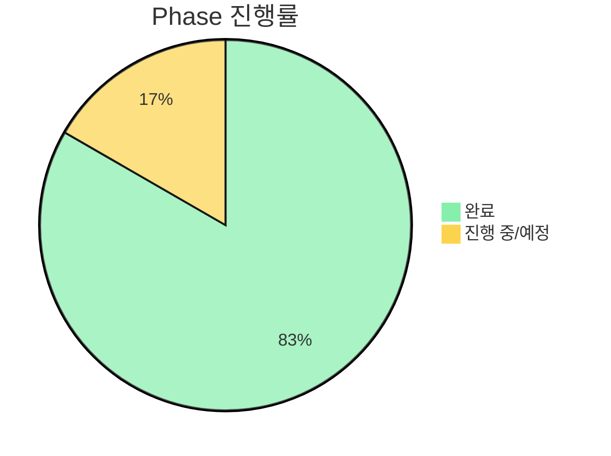
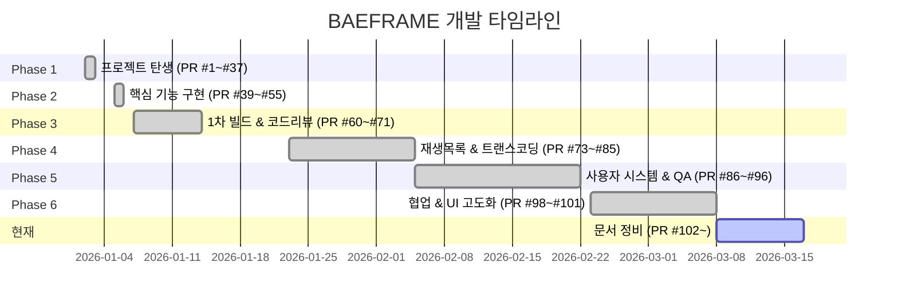
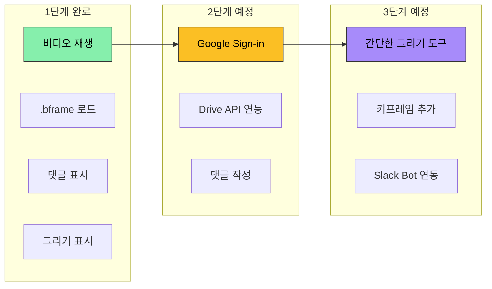

# BAEFRAME 개발 로드맵

> 이 문서는 BAEFRAME의 개발 히스토리와 현재 상태, 향후 계획을 정리합니다.
> PR 히스토리와 커밋 로그를 기반으로 실제 완료된 내용만 기술합니다.

---

## 1. 프로젝트 현황

| 항목 | 내용 |
|------|------|
| **버전** | v1.1.0-beta |
| **개발 기간** | 2024-12-23 ~ (현재) |
| **총 커밋 수** | 683개 |
| **총 PR 수** | 102개 (PR #1 ~ #102) |
| **총 Issue 수** | 26개 |
| **개발자** | 배한솔 (+ Claude Code AI 협업) |

---

## 2. 개발 Phase 진행 상황

| Phase | 상태 | 내용 |
|:-----:|:----:|------|
| 0 | 완료 | 환경 설정 (Electron + mpv 셋업) |
| 1 | 완료 | 기본 비디오 재생 |
| 2 | 완료 | UI 레이아웃 |
| 3 | 완료 | 그리기 기능 (펜, 화살표, 지우개, 브러시 외곽선, 네모 브러시) |
| 4 | 완료 | 댓글 시스템 (추가/수정/삭제/필터/스레드/검색) |
| 5 | 완료 | Undo/Redo (UndoManager, Ctrl+Z/Y) |
| 6 | 완료 | 타임라인 고급 기능 (줌/스크롤/마커/드래그/리사이즈) |
| 7 | 완료 | 버전 관리 (스플릿 뷰, 오버레이 비교 모드 포함) |
| 8 | 완료 | 코덱 지원 확장 (FFmpeg 트랜스코딩, 캐시) |
| 9 | 완료 | 링크 공유 (baeframe:// 프로토콜, Slack 듀얼 링크) |
| 10 | 완료 | 사용자 설정 (이름/테마/단축키 커스텀, 로그인 시스템) |
| 11 | 예정 | 마무리 & 전체 통합 테스트 |

### 전체 기능 현황 요약

| 상태 | 개수 | 비고 |
|:----:|:----:|------|
| 완료 | 51 | 핵심 기능 + UI/UX + 그리기 + 타임라인 + 협업 |
| 진행 중 | 2 | 웹 뷰어 고도화, 문서화 |
| 예정 | 17 | 코드 리뷰 수정 7개 + 버그 1개 + 기타 9개 |

---

## 3. 주요 릴리스 타임라인

### Phase 1: 프로젝트 탄생 (2026-01-02 ~ 01-03) — PR #1~#37

> `start-bae-frame-project` 브랜치 하나에서 13개 PR을 생성하며 빠른 반복 개발.
> 프로젝트 초기 셋업부터 웹 뷰어, Google Drive 연동, Slack 듀얼 링크까지 2일 만에 기반 구축.

| PR 범위 | 내용 |
|---------|------|
| #1~#6 | 프로젝트 초기 셋업 및 구조 구성 |
| #3~#5 | 웹 뷰어 개발 시작 |
| #7~#13 | Google Drive 파일 로드 — 에러 처리 → 공유 드라이브 → sql.js 전환 (7번 반복 개선) |
| #15~#16 | 마커 표시 오류 수정, 유니버설 링크 및 공유 기능 |
| #18~#25 | 웹 공유 기능, OAuth → 클립보드 방식 전환, DB 기반 파일 ID 추출 |
| #26~#33 | 모바일 웹 뷰어, Slack 웹 링크 지원, 프로그레시브 다운로드 |
| #34~#37 | BAEFRAME 로고 적용, 인증 세션 365일 연장, 전체화면 개선 |

### Phase 2: 핵심 기능 구현 (2026-01-05 ~ 01-06) — PR #39~#55

> Undo/Redo, 전체화면, 단축키 커스텀, 댓글 이미지 첨부 등 핵심 사용자 기능 집중 개발.

| PR | 내용 |
|----|------|
| #39~#41 | 파일 정리, CLAUDE.md 및 Wiki 페이지 추가 |
| #49 | Undo/Redo 글로벌 시스템, 전체화면, 단축키 커스텀, 댓글 마커 툴팁 (15커밋) |
| #50 | 댓글 이미지 첨부 기능 추가 |
| #55 | UI/UX 개선 + 댓글 설정 초기화 타이밍 수정 (8커밋) |

### Phase 3: 1차 빌드 & 코드 리뷰 (2026-01-07 ~ 01-14) — PR #60~#71

> alpha_v1, alpha_v2 테스트 빌드 배포. GPT Codex 코드 리뷰 반영, 보안/안정성 강화.

| PR | 커밋 수 | 내용 |
|----|---------|------|
| #60 | 10 | GPT Codex 리뷰(#54) 검증 + 타임라인 하이라이트 + AHK→Electron 프로토콜 전환 |
| #63 | 22 | 프로토콜 핸들러 반복 디버그 + Slack 웹 URL 하이퍼링크 |
| #64 | 10 | 빌드 + Slack 이슈 수정 (alpha_v1, alpha_v2 배포) |
| #67 | — | 보안 취약점 및 데이터 보호 강화 |
| #71 | 26 | 버전 관리 + 댓글 범위 표시 + 브러시 도구 + FFmpeg 트랜스코딩 |

> 알파 빌드 배포:
> - alpha_v1: 2026-01-09 01:18 (첫 테스트 빌드, 로그 경로 버그 발견)
> - alpha_v2: 2026-01-09 05:30 (슬랙 프로토콜 수정, 아이콘 적용)

### Phase 4: 재생목록 & 트랜스코딩 (2026-01-23 ~ 02-05) — PR #73~#85

> 재생목록(Playlist) 기능 신규 구현. FFmpeg 트랜스코딩 호환성 반복 개선.
> PR #73은 28커밋으로 프로젝트 최대 규모 PR.

| PR | 커밋 수 | 내용 |
|----|---------|------|
| #73 | 28 | 캔버스 크래시 수정 + 보안 + FFmpeg + 파일 감시 실시간 동기화 + UI (최대 규모) |
| #74~#75 | — | 재생목록 기능 구현 계획서 및 FAQ 작성 (docs) |
| #76 | — | 타임라인 마커 색상 및 UI 버그 수정 4건 |
| #77, #79 | — | 플레이리스트 링크 baeframe:// 프로토콜 지원, renderer URL→파일 경로 변환 |
| #78 | 22 | 재생목록(Playlist) 기능 구현 (Slack 호환 링크 7번 이상 수정) |
| #80~#81 | — | FFmpeg LGPL 빌드 폴백 — h264_nvenc 실패 시 libx264 자동 전환 |
| #83~#85 | — | 로그인 시스템 계획 및 협업 UI 분석 문서 (docs) |

### Phase 5: 사용자 시스템 & QA (2026-02-05 ~ 02-22) — PR #86~#96

> 첫 팀 배포를 앞두고 로그인 시스템, 댓글 검색, Windows 접근성 설치기 구현.
> PR #96은 27커밋으로 MSIX 서명·.NET 런타임·인코딩·관리자 권한 등 Windows 환경 차이로 반복 수정.

| PR | 커밋 수 | 내용 |
|----|---------|------|
| #86 | 5 | 재생목록 핫픽스 (EBUSY/썸네일/TDZ 오류) |
| #90~#91 | — | 댓글 검색 UX 구현 (접힘형 검색창, 한글 예시, 매치 하이라이트) |
| #92 | 7 | 로그인 세션 시스템 구현 + 권한 관리 개선 |
| #93 | — | 댓글 검색 핫픽스 — 검색창 닫힘 동작 수정 + 매칭 글로우 강화 |
| #94 | — | 앱 시작 로딩 화면 도입 + DEVLOG 날짜 규칙 정리 |
| #95 | — | Windows 접근성 업데이트 통합 계획 DEVLOG 추가 (docs) |
| #96 | 27 | Windows 접근성 통합 설치기 (MSIX, 인증서, .NET 런타임, 정책 프로비저닝) |

### Phase 6: 협업 & UI 고도화 (2026-02-23 ~ 03-08) — PR #98~#101

> 첫 공식 사용 이슈(#97) 핫픽스, 실시간 협업 아키텍처 전환 (Liveblocks Storage → Broadcast),
> 타임라인 리디자인, 비디오 캐시 반복 수정.

| PR | 커밋 수 | 내용 |
|----|---------|------|
| #98 | 13 | #97 첫 공식 사용 핫픽스 + 레이어 설정 팝업 + UI 글래스모피즘 업그레이드 |
| #99 | 16 | 실시간 협업: Liveblocks Storage(CRDT) → Broadcast 방식으로 아키텍처 전환 |
| #100 | 5 | 타임라인 바 리디자인 + 볼륨/시크바/성능/어드민 개선 8건 |
| #101 | 11 | 스플릿 뷰 오버레이 비교 모드 + 트랜스코딩/썸네일 캐시 버그 반복 수정 (5회 추적) |

### 현재: 문서 정비 (2026-03-08 ~ ) — PR #102~

| PR | 내용 |
|----|------|
| #102 | PR 히스토리 기반 개발 연대기 문서 추가 |
| (현재) | 시스템 아키텍처, .bframe 스키마, 모듈 가이드, 로드맵 문서 작성 |

---

## 4. 최근 변경사항 (2026-02 ~ 2026-03)

### 2026-03-17 (현재 브랜치)
- 시스템 아키텍처 문서 작성 (`docs/architecture.md`)
- .bframe 파일 포맷 명세 문서 작성 (`docs/bframe-schema.md`)
- renderer 모듈 가이드 문서 작성 (`docs/modules.md`)

### 2026-03-08 (PR #101)
- 스플릿 뷰 오버레이 비교 모드 추가 (와이프 방식)
- 트랜스코딩 캐시 키를 파일 내용(해시) 기반으로 변경
- robocopy /MIR이 캐시 폴더를 삭제하는 버그 수정
- 로딩 오버레이 잔존 및 스플릿 뷰 모드 초기화 버그 수정

### 2026-03-06 (PR #100)
- 타임라인 바 전면 리디자인
- 볼륨 슬라이더, 시크바 개선
- 어드민 표시 이름 입력 버그 수정
- 댓글 입력 간헐적 불가 버그 수정
- 타임라인 코멘트 드래그 시 토스트 알림 반복 생성 버그 수정

### 2026-03-02 (PR #99)
- Liveblocks 기반 실시간 협업 시스템 구현
- Liveblocks Storage(CRDT) → Broadcast 방식으로 아키텍처 전환 (10초 동기화 지연 해결)
- 드로잉 레이어/키프레임 실시간 동기화
- 실시간 협업 10개 버그 일괄 수정

### 2026-02-23 (PR #98)
- 첫 공식 사용(이슈 #97) 이후 긴급 핫픽스 13건
- UI 글래스모피즘 프리미엄 업그레이드
- 레이어 설정 말풍선 팝업 추가
- 드로잉 깜빡임 근본 원인 수정

### 2026-02-22 (PR #96)
- Windows 접근성 통합 설치기 구현 (MSIX 패키지 기반 우클릭 메뉴 등록)
- 사내 인증서/정책 자동 프로비저닝
- .NET 6 런타임 자동 설치

### 2026-02-10 ~ 02-12
- 댓글 검색 기능 구현 (접힘형 UI, 한글 예시, 매치 하이라이트)
- 로그인 세션 시스템 + 권한 관리 개선 (PR #92)
- 앱 시작 로딩 화면 도입 (PR #94)

---

## 5. 알려진 이슈

### 즉시 수정 필요 (우선순위 높음)

| # | 항목 | 상세 |
|---|------|------|
| 1 | baeframe:// 프로토콜 파싱 | 웹에서 앱 열기 기능 불가 |
| 2 | Timeline.destroy() 이벤트 리스너 누수 | 장시간 사용 시 성능 저하 |

### 조속한 수정 권장

| # | 항목 | 상세 |
|---|------|------|
| 4 | copyFile/deleteFile API | 런타임 에러 가능성 |
| 6 | web-viewer XSS 취약점 | author 필드 이스케이프 미처리 |
| 7 | validators.js 미사용 | 데이터 무결성 검증 없음 |

### 개선 권장

| # | 항목 | 상세 |
|---|------|------|
| 9 | IPC 경로 검증 미흡 | 보안 강화 필요 |
| 10 | 하드코딩 URL | 환경변수화 필요 |

### 기타 미해결 이슈

| 항목 | 상태 | 상세 |
|------|------|------|
| 어니언 스킨 | BLOCKED | 캔버스 오버레이가 비디오를 가리는 문제. WebGL 또는 합성 방식 변경 필요 |
| 댓글 선택 문제 | TODO | 클릭 시 의도치 않게 댓글이 선택되는 경우 있음 |
| .bframe 확장자 앱 실행 (#48) | open | 파일 더블클릭으로 앱 실행 |
| 팀원 이름 관리 (#59) | open | 이름 목록 관리 방식 |
| 추가 기능 고안 (#72) | open | 영상 렌더링 기능 등 |

---

## 6. 향후 계획

### 단기 (코드 품질)

- baeframe:// 프로토콜 파싱 수정 (이슈 #1)
- Timeline.destroy() 이벤트 리스너 정리 (이슈 #2)
- web-viewer XSS 수정 (이슈 #6)
- IPC 경로 검증 보안 강화 (이슈 #9)
- 댓글 선택 버그 수정

### 중기 (기능 확장)

- 영상 렌더링 기능 (댓글/그리기 포함 내보내기, 해상도 옵션)
  - 메시지/드로잉 토글 선택
  - .bframe과 동일 경로에 자동 저장
- 재생목록 안정화
- 성능 최적화 (가상 스크롤, 메모리 관리)

### 장기 (웹 뷰어 고도화)

웹 뷰어는 현재 읽기 전용으로 기본 기능 구현 완료. 향후 단계적 확장 예정:

### 문서 정비 (진행 중)

- 시스템 아키텍처 문서 (`docs/architecture.md`) — 완료
- .bframe 파일 포맷 명세 (`docs/bframe-schema.md`) — 완료
- renderer 모듈 가이드 (`docs/modules.md`) — 완료
- 개발 로드맵 (`docs/roadmap.md`) — 현재 작성 중
- 위키 페이지 추가 — 예정
- 발표용 슬라이드/PPT — 예정

---

## 7. 빌드 히스토리

| 버전 | 빌드 일시 | 비고 |
|:----:|:---------:|------|
| alpha_v1 | 2026-01-09 01:18 | 첫 테스트 빌드, 로그 경로 버그 발견 |
| alpha_v2 | 2026-01-09 05:30 | 슬랙 프로토콜 수정, 아이콘 적용, dir 빌드 |
| v1.1.0-beta | 현재 | 실시간 협업, 타임라인 리디자인, 캐시 안정화 반영 |

---

## 8. 개발 패턴 분석

> PR 히스토리에서 발견된 반복 패턴들.

### 복잡도 순위 (커밋 수 기준)

| 순위 | PR | 커밋 수 | 핵심 내용 |
|------|-----|---------|----------|
| 1 | #73 | 28 | 캔버스 크래시 + 보안 + FFmpeg + 파일 감시 동기화 |
| 2 | #96 | 27 | Windows 접근성 설치기 (MSIX/인증서/정책) |
| 3 | #71 | 26 | 버전 관리 + 댓글 범위 + 브러시 + FFmpeg |
| 4 | #63 | 22 | 프로토콜 핸들러 반복 디버그 |
| 5 | #78 | 22 | 재생목록 구현 (Slack 링크 7번+ 수정) |
| 6 | #99 | 16 | 실시간 협업 (CRDT → Broadcast 전환) |
| 7 | #49 | 15 | Undo/Redo + 전체화면 + 단축키 커스텀 |
| 8 | #98 | 13 | 첫 공식 사용 핫픽스 |
| 9 | #101 | 11 | 비디오 캐시 (5번 추적) |
| 10 | #60 | 10 | 테스트빌드 리뷰 (GPT Codex 검증) |

### 월별 PR 수

| 월 | PR 수 | 주요 작업 |
|----|-------|----------|
| 2026-01 초 (01-02~03) | ~37 | 프로젝트 셋업, 웹 뷰어, Google Drive 연동 |
| 2026-01 중순 (01-05~14) | ~15 | 핵심 기능, 1차 빌드, 코드 리뷰 |
| 2026-01 하순 (01-23~27) | ~13 | 재생목록, 트랜스코딩, 로그인 계획 |
| 2026-02 (02-05~22) | ~11 | 사용자 시스템, 댓글 검색, Windows 접근성 |
| 2026-03 (03-02~08) | ~4 | 실시간 협업, 타임라인 리디자인, 성능 |

---

*마지막 업데이트: 2026-03-17*
