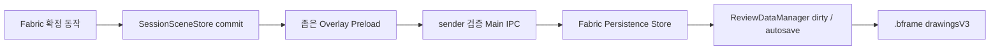

# Fabric 드로잉 저장 및 시험판 기본 실행 설계

작성일: 2026-07-23

## 1. 목표

공유 드라이브의 Fabric 시험판과 격리된 로컬 시험 실행에서 다음을 보장한다.

1. 별도 실행 스크립트를 통하지 않고 시험판 EXE를 직접 열어도 mpv + Fabric 드로잉이 기본 활성화된다.
2. Fabric으로 만든 그림이 현재 영상의 `.bframe`에 자동 저장된다.
3. 앱을 완전히 종료한 뒤 같은 영상 또는 `.bframe`을 다시 열면 프레임별 그림이 정확히 복원된다.
4. 기존 `drawings` 데이터, 기존 배프레임 인스턴스, Windows 파일 연결은 건드리지 않는다.
5. 저장 계층에 이상이 있으면 새 편집을 허용하지 않고, 해당 영상에서는 B 입력을 기존 엔진으로 안전하게 넘긴다.

## 2. 확인된 현재 상태

- 보이는 새 드로잉의 원본은 mpv 오버레이 창 안 `SessionSceneStore`다.
- Drawing V3 adapter는 비동기 검증용 shadow이며 보이는 화면이나 저장의 원본이 아니다.
- Fabric 런타임에는 전체 영상 export/hydrate API가 없고, 오버레이 창에서 메인 렌더러로 변경을 전달하는 통로도 없다.
- `ReviewDataManager`는 기존 `drawingManager.exportData()`만 `drawings`에 저장한다.
- `drawingsV3`는 현재 알 수 없는 최상위 필드로 보존되므로 구버전이 열고 다시 저장해도 사라지지 않는다.
- 일반 EXE는 Fabric pilot과 V3 shadow가 기본 OFF다. 현재 CMD 실행기에만 명시 플래그가 있다.

## 3. 저장 형식

기존 `drawings`는 그대로 둔다. 새 데이터는 최상위 `drawingsV3`에 저장한다.

```json
{
  "drawingsV3": {
    "storageSchema": "baeframe-fabric-scenes",
    "storageVersion": "1.0.0",
    "engine": "fabric-7",
    "documentId": "uuid",
    "revision": 12,
    "fps": 24,
    "totalFrames": 240,
    "keyframes": [
      {
        "id": "uuid",
        "frame": 42,
        "sourceWidth": 1920,
        "sourceHeight": 1080,
        "mutationSequence": 4,
        "objects": []
      }
    ]
  }
}
```

저장 대상은 확정된 획 데이터와 순서, 스타일, source point, transform이다. 다음은 저장하지 않는다.

- hover
- 현재 선택 상자
- 현재 도구
- 진행 중인 pointer gesture
- undo/redo 히스토리

따라서 재실행 뒤 그림은 그대로 돌아오지만, 이전 실행에서 만든 undo 목록은 비어 있는 것이 정상이다.

`drawingsV3`는 이번 단계에서 일반 known root field로 승격하지 않는다. 전용 writer만 관리하고, 구버전과 웹 뷰어에는 opaque 확장 필드로 남겨 미래 데이터가 유실되지 않게 한다.

## 4. 변경 전달 구조



### 4.1 확정 동작만 전달

일반 추가·이동·분할·삭제·clear는 `commitStagedMutation()`이 완전히 성공한 뒤 전달한다. Undo/Redo는 실제 scene과 history stack 이동이 모두 끝난 뒤 전달한다.

selection 변경, hover, preview, 거부된 명령, no-op은 저장 이벤트를 만들지 않는다.

### 4.2 효율적인 delta 전송

매 동작마다 전체 그림을 복제하지 않는다. 기존 transition event의 다음 delta만 보낸다.

- removals: 삭제 ID와 이전 위치
- insertions: 완전한 새 record와 최종 삽입 위치
- transforms: ID와 최종 transform
- scene metadata: frame, source size, mutation sequence
- stale fence: host generation, video generation, session ID, video identity

메인 렌더러의 persistence store가 이 delta를 순서대로 적용해 dirty/autosave를 빠르게 감지하고 저장 후보 cache를 유지한다. sequence gap이나 잘못된 payload가 발견되면 해당 이벤트를 적용하지 않고 오버레이 전체 snapshot을 한 번 다시 받아 resync한다.

delta는 최종 저장 정본이 아니다. 마지막 IPC 이벤트 하나가 통째로 유실되면 gap도 관찰할 수 없기 때문이다. 매 실제 save 직전에는 현재 host/video generation과 identity를 포함해 오버레이의 전체 video snapshot을 pull하고, 그 snapshot과 sequence를 이번 저장 정본으로 확정한다. 저장 성공 ack는 pull한 sequence와 현재 sequence가 같을 때만 dirty를 해제한다.

영상 전환 또는 앱 종료 시 snapshot pull이 실패하면 이전 cache를 성공 저장으로 처리하지 않는다. dirty를 유지하고 전환/종료를 중단하거나 사용자에게 명시적인 저장 실패를 알린다.

### 4.3 보안 경계

오버레이 BrowserWindow는 계속 `sandbox: true`, `contextIsolation: true`, `nodeIntegration: false`를 유지한다. 새 preload는 오직 commit event 전송만 노출한다.

Main IPC는 다음을 검증한다.

- sender가 현재 mpv overlay webContents와 정확히 같은지
- payload가 plain JSON인지
- 허용 키와 숫자 범위
- 전송 크기 한도

검증 실패는 renderer로 전달하지 않는다.

## 5. 불러오기 및 영상 전환

복원 순서는 다음으로 고정한다.

1. 기존 Fabric input 비활성화
2. 새 영상의 `.bframe` 읽기
3. `drawingsV3` 검증 및 persistence store 교체
4. 현재 host/video/load token으로 오버레이 hydrate
5. hydrate 성공 뒤에만 Fabric session 활성화
6. 해당 프레임 scene 렌더

늦게 끝난 이전 영상의 hydrate나 commit은 generation/token 불일치로 버린다.

디스크에서 hydrate한 scene은 V3 shadow에도 최초 한 번 전체 seed를 보낸다. 이후 같은 프레임에 B로 재진입할 때는 중복 seed를 보내지 않는다.

hydrate는 scene 전체를 한 번에 교체하며 commit observer와 dirty 이벤트를 만들지 않는다. 복원 뒤 undo/redo history는 빈 상태다.

## 6. ReviewDataManager 연결

`ReviewDataManager`는 persistence store를 provider로 받는다.

- load: opaque root의 `drawingsV3`를 provider에 전달
- collect: 지원되는 현재 snapshot만 `_opaqueRootFields.drawingsV3`에 원자적으로 반영한 뒤 known root와 병합
- changed: 기존 데이터와 같은 dirty/autosave 경로 사용
- save success: 저장 시작 revision과 현재 revision이 같을 때만 dirty 해제
- save 중 새 commit: dirty를 유지하고 trailing autosave 예약
- save failure: dirty 유지

미지원 future version이나 손상된 `drawingsV3`는 원문 그대로 opaque 보존한다. 해당 영상에서는 Fabric을 활성화하지 않고 기존 엔진으로 되돌아가며, 댓글과 기존 그림 저장은 계속 가능하다.

controller는 영상별 `legacyBypass` 상태를 가진다. 이 상태에서는 `isEnabled()`와 별개로 `shouldOwnDrawingShortcut()`가 false를 반환한다. 앱의 B routing과 legacy UI 억제 조건은 이 API를 사용한다. malformed/future/hydrate/pull 실패 뒤에도 B가 소비되지 않고 기존 드로잉 동작으로 이어져야 한다.

새 `.bframe`에서 Fabric 그림만 있는 경우도 substantive content로 판정한다. 첫 획 뒤 autosave가 실제 `.bframe` 파일을 생성해야 한다.

## 7. 시험판 기본 활성화

정식 빌드 전체의 기본값은 바꾸지 않는다. 시험판 패키지의 `resources`에만 엄격한 runtime marker를 넣는다.

```json
{
  "schemaVersion": 1,
  "channel": "fabric-v3-trial",
  "features": {
    "mpvPlaybackPilot": true,
    "fabricDrawingPilot": true,
    "fabricDrawingV3Shadow": true,
    "fabricDrawingPersistence": true
  },
  "isolateUserData": true,
  "skipShellRegistration": true
}
```

우선순위는 다음과 같다.

1. kill switch
2. 명시 CLI/env
3. 유효한 시험판 marker
4. 기본 OFF

marker가 없거나 깨졌거나 알 수 없는 schema면 default OFF다. `mpvPlaybackPilot`까지 유효해야 시험 profile 전체를 인정한다. 전역 환경변수를 덮어쓰지 않고 mpv manager에 해석된 상태를 주입하며, `BAEFRAME_DISABLE_MPV=1` kill switch는 marker보다 우선한다.

시험판은 pid별 userData에 격리되고 프로토콜 및 `.bframe` 파일 연결을 등록하지 않으므로 현재 사용 중인 배프레임을 흡수하거나 연결을 덮어쓰지 않는다.

패키징 hook은 실행할 때마다 기존 marker를 먼저 제거한다. trial 환경에서만 임시 파일에 정확한 JSON을 쓴 뒤 rename한다. 같은 `dist/win-unpacked`에 trial build 후 일반 build를 실행해도 marker가 남지 않아야 한다.

## 8. 실패 처리

- persistence API 누락/초기화 실패: Fabric pilot 비활성화, legacy 사용
- 지원하지 않는 저장 version: 원문 보존, 해당 영상 Fabric 비활성화
- hydrate 실패: Fabric input을 열지 않고 legacy 복귀
- commit bridge 일시 실패: full snapshot resync 시도
- save 직전 snapshot pull 실패: 저장 성공 처리 금지, dirty 유지, 영상 전환/종료 차단 또는 명시 경고
- autosave 실패: dirty 유지, 기존 저장 실패 알림 1회
- shadow 실패: 화면과 저장에는 영향 없이 shadow만 격리

오버레이 오류 때문에 이미 확정된 화면 동작을 rollback하지 않는다.

## 9. 테스트 게이트

### 단위

- codec/store round-trip
- 모든 Fabric record 필드, ID, 순서, frame 보존
- add/move/split/delete/clear/undo/redo delta 적용
- selection/no-op 이벤트 무시
- malformed/oversize/stale/gap 원자 거부
- future version opaque 보존
- save 중 mutation 시 trailing save
- save failure dirty 유지
- save 직전 full snapshot pull과 matching sequence ack
- 기존 파일이 없는 영상에서 Fabric 첫 획만으로 `.bframe` 생성

### 통합

- overlay sender 위조 거부
- review load → hydrate → enable 순서
- load/hydrate는 commit 0회, dirty 0회
- malformed/future/hydrate 실패 뒤 B가 legacy로 전달
- 비디오/load generation stale 차단
- disk hydrate 첫 activation에서 V3 full seed
- legacy `drawings` byte-equivalent 보존

### 실행

- mpv 영상 열기
- B → 그리기 → B 해제 → 재생 조작
- V 획 선택 이동
- 라쏘/사각/원 일부 선택 및 분할
- 앱 완전 종료
- 같은 `.bframe` 재열기
- 프레임, 획, 스타일, 위치 복원 확인
- 기존 BAEFRAME PID와 Windows 연결 상태 불변 확인
- trial build 뒤 같은 출력 폴더의 normal build에서 marker 잔여 0개 확인
- trial EXE를 mpv/Fabric 인자 없이 직접 실행해 mpv + Fabric 활성 확인

## 10. 이번 단계의 비목표

- 구형 `drawings`를 새 형식으로 자동 변환
- 이전 실행의 undo/redo history 복원
- Liveblocks로 Fabric 실시간 공동 편집
- 웹 뷰어에서 Fabric 편집
- 전체 `.bframe` 파일 저장기의 원자적 교체 방식 재작성

이 항목들은 저장/복원 MVP가 안정적으로 검증된 뒤 별도 단계로 진행한다.
