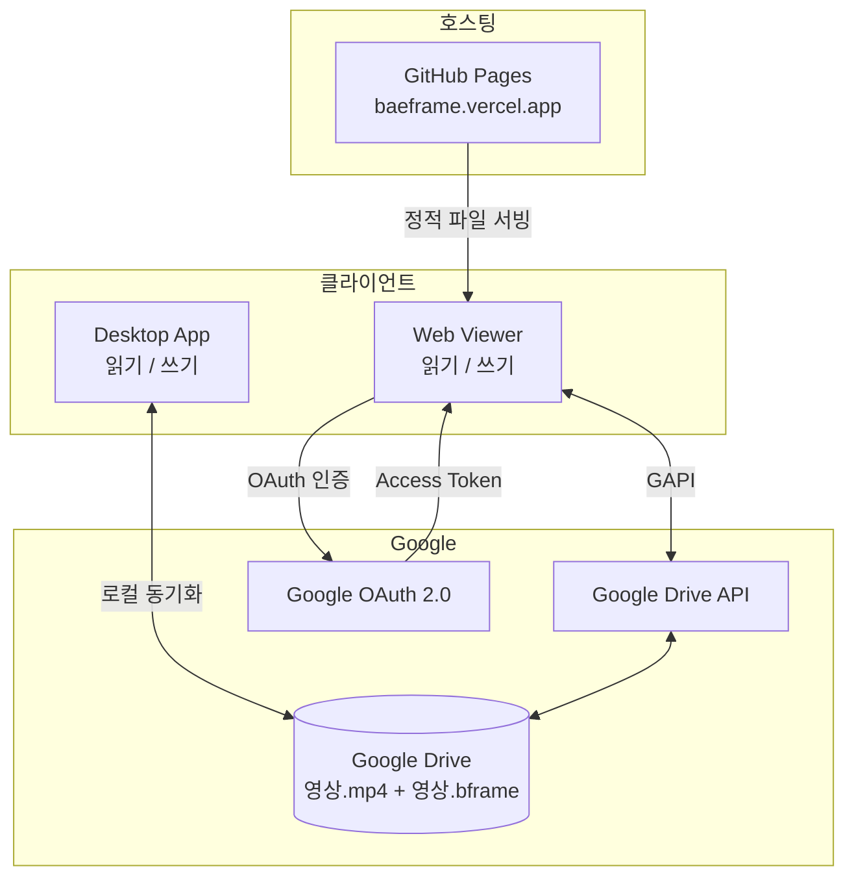
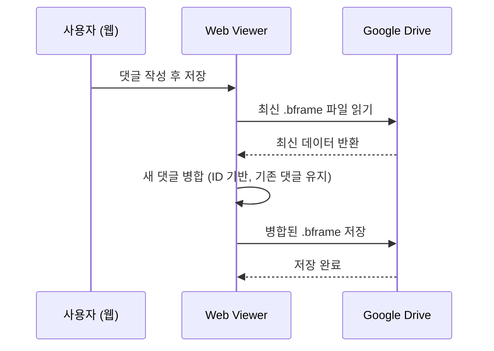

# BAEFRAME 웹 뷰어

> 앱 설치 없이 브라우저에서 영상 리뷰를 확인할 수 있는 웹 버전입니다.
> URL: https://baeframe.vercel.app

---

## 1. 개요

### 목적

BAEFRAME Desktop은 Electron 기반으로, 앱 설치 없이는 사용할 수 없습니다. 웹 뷰어는 다음 문제를 해결합니다:

- 리뷰어/감독이 앱 설치 없이 피드백과 그리기 레이어를 브라우저에서 바로 확인
- 모바일(스마트폰, 태블릿)에서 접근 가능
- Slack 링크 공유 → 브라우저에서 바로 열기

### Desktop vs Web 역할 분리

| 구분 | BAEFRAME Desktop | BAEFRAME 웹 뷰어 |
|------|-----------------|----------------|
| 대상 | 편집자, 애니메이터 | 리뷰어, 감독, 팀원 |
| 설치 | 필요 (Windows EXE) | 불필요 |
| 모바일 | 불가 | 지원 |
| 주요 역할 | 풀 에디팅 | 리뷰 및 피드백 확인/작성 |
| 오프라인 | 지원 | 미지원 |

---

## 2. 현재 구현 상태

### 구현된 기능

- HTML5 비디오 플레이어 (재생/일시정지, 1프레임 이동, 5초 이동)
- `.bframe` 파일 파싱 및 댓글 표시
- 타임라인 마커 (댓글 위치 시각화)
- 타임라인 썸네일 미리보기
- Canvas 기반 그리기 오버레이 표시
- 그리기 도구 패널 (펜, 화살표, 원, 색상 선택)
- 댓글 작성 모달 (타임스탬프 포함)
- 댓글 스레드 모달 (답글 입력)
- Google OAuth 2.0 로그인 (Drive 전체 접근 권한)
- Google Drive API를 통한 `.bframe` 파일 읽기/쓰기
- 공유 링크 복사 버튼 (URL 파라미터 기반)
- 최근 파일 목록 (localStorage)
- 모바일 자동 저장 (2초 debounce)
- 전체화면 지원 (플로팅 컨트롤 포함)
- 로딩 화면 명언 로테이션
- 데모 모드 (localhost / GitHub Pages / Vercel 환경에서 테스트 영상 자동 제공)
- 모바일 반응형 UI (메타 viewport, 터치 이벤트)

### 미구현 / 제한 사항

- 어니언 스킨 (Desktop에서도 BLOCKED 상태)
- 실시간 협업 (WebSocket 서버 필요, 3단계 계획)
- 키프레임 추가 편집 (3단계 계획)
- 로컬 파일 직접 열기 (Desktop 전용)
- 오프라인 지원

---

## 3. 아키텍처

### 서버리스 구조

별도의 백엔드 서버나 데이터베이스 없이, Google Drive를 "서버"로 활용합니다. 영상 파일과 `.bframe` 파일은 모두 Google Drive에 저장되며, 웹 뷰어는 Google Drive API를 통해 직접 읽고 씁니다.

### 데이터 흐름



### 댓글 저장 흐름 (충돌 방지)



---

## 4. 기술 스택

| 분류 | 기술 |
|------|------|
| UI | HTML5, CSS3, Vanilla JS (ES Modules) |
| 비디오 | HTML5 `<video>` 태그 (mp4) |
| 그리기 | Canvas API |
| 인증 | Google Identity Services (GIS) |
| 데이터 | Google Drive API v3 (`gapi.client.drive`) |
| 호스팅 | GitHub Pages (자동 배포) |
| 빌드 | 없음 (빌드 단계 없는 정적 파일) |

### Google API 설정 위치

`web-viewer/scripts/app.js` 상단 `CONFIG` 객체에 직접 설정되어 있습니다:

```javascript
const CONFIG = {
  CLIENT_ID: '...',
  API_KEY: '...',
  SCOPES: 'https://www.googleapis.com/auth/drive',
  DISCOVERY_DOC: 'https://www.googleapis.com/discovery/v1/apis/drive/v3/rest'
};
```

---

## 5. Desktop vs Web 기능 비교

| 기능 | Desktop | Web 현재 | Web 2단계 | Web 3단계 |
|------|:-------:|:--------:|:---------:|:---------:|
| 영상 재생 | O | O | O | O |
| 재생 속도 조절 | O | - | - | - |
| 타임라인 탐색 | O | O | O | O |
| 1프레임 이동 | O | O | O | O |
| 타임라인 썸네일 | O | O | O | O |
| 댓글 보기 | O | O | O | O |
| 댓글 작성 | O | O | O | O |
| 댓글 수정/삭제 | O | O | O | O |
| 댓글 스레드 | O | O | O | O |
| 그리기 보기 | O | O | O | O |
| 그리기 편집 | O | O (현재 구현됨) | O | O |
| 키프레임 보기 | O | - | - | O |
| 키프레임 편집 | O | - | - | O |
| 로컬 파일 열기 | O | - | - | - |
| Google Drive 연동 | - | READ/WRITE | READ/WRITE | READ/WRITE |
| 모바일 지원 | - | O | O | O |
| 오프라인 지원 | O | - | - | - |
| 실시간 협업 | - | - | - | 계획 |

---

## 6. URL 구조

공유 링크는 쿼리 파라미터 방식을 사용합니다.

```
https://baeframe.vercel.app/?video=GOOGLE_DRIVE_VIDEO_URL&bframe=GOOGLE_DRIVE_BFRAME_URL
```

| 파라미터 | 설명 | 예시 |
|----------|------|------|
| `video` | Google Drive 영상 파일 URL | `https://drive.google.com/file/d/FILE_ID/view` |
| `bframe` | Google Drive `.bframe` 파일 URL | `https://drive.google.com/file/d/FILE_ID/view` |

파라미터가 모두 있으면 앱 시작 시 자동으로 파일을 로드합니다. 파라미터가 없으면 파일 선택 화면을 표시합니다.

### 링크 생성 방법

현재는 Google Drive에서 파일 공유 링크를 각각 복사한 후, URL을 수동으로 조합해야 합니다. 뷰어 화면의 "공유 링크 복사" 버튼을 누르면 현재 열려 있는 파일의 공유 URL이 클립보드에 복사됩니다.

---

## 7. 배포

### 현재 배포 구조

GitHub Pages를 통해 자동 배포됩니다. Vercel 도메인(`baeframe.vercel.app`)은 GitHub Pages를 가리키거나, 별도 Vercel 프로젝트로 연결되어 있습니다.

### CI/CD (GitHub Actions)

파일: `.github/workflows/deploy-web-viewer.yml`

- 트리거: `main` 브랜치 또는 `claude/웹뷰어-*` 브랜치에 `web-viewer/**` 경로 변경이 push될 때
- 수동 실행: `workflow_dispatch`로 언제든지 수동 배포 가능
- 동작:
  1. 코드 체크아웃
  2. GitHub Pages 설정
  3. `web-viewer/` 폴더 전체를 아티팩트로 업로드
  4. GitHub Pages에 배포

### 도메인

| 환경 | URL |
|------|-----|
| 운영 | https://baeframe.vercel.app |
| GitHub Pages | `https://baehandoridori.github.io/BAEFRAME/` (배포 설정에 따라 다름) |

### Google Cloud 설정

OAuth 및 API 사용을 위해 Google Cloud Console에서 다음이 설정되어 있어야 합니다:

- Google Drive API 활성화
- OAuth 2.0 클라이언트 ID 생성
- 승인된 JavaScript 원본: `https://baeframe.vercel.app`
- 승인된 리디렉션 URI 설정

---

## 8. 로컬 개발

빌드 단계가 없으므로 정적 파일 서버만 있으면 됩니다.

```bash
# 방법 1: npx serve
cd web-viewer
npx serve .

# 방법 2: Python
cd web-viewer
python -m http.server 8080

# 브라우저에서 열기
# http://localhost:8080
```

### 데모 모드

`localhost`, `127.0.0.1`, `file://`, `.github.io`, `.vercel.app` 환경에서는 데모 모드(`IS_DEV_MODE`)가 활성화됩니다. 데모 모드에서는 Google 로그인 없이도 공개 테스트 영상(`BigBuckBunny.mp4`)으로 기능을 확인할 수 있습니다.

### 로컬 Google API 인증 주의

Google OAuth는 `localhost`를 기본 허용 원본으로 인식하지만, Google Cloud Console에서 `http://localhost:포트번호`를 승인된 JavaScript 원본에 추가해야 할 수 있습니다.

---

## 9. 향후 계획

### 2단계: Google Drive 연동 고도화

현재 댓글 쓰기가 이미 구현되어 있으나, 다음을 추가 고려할 수 있습니다:

- 댓글 충돌 방지 로직 안정화 (동시 편집 시나리오 테스트)
- Google 로그인 UX 개선 (토큰 만료 자동 갱신)
- Desktop 앱에서 "웹 링크 복사" 버튼 추가 (수동 URL 조합 불필요)

### 3단계: 고급 기능

- 키프레임 보기 및 추가
- 실시간 협업 (WebSocket 서버 필요 — 현재 서버리스 구조를 벗어남)

### 장기 과제

- Slack 봇 연동: `/baeframe share 파일명` 명령으로 자동 링크 생성 및 공유
- 재생 속도 조절 (현재 웹에서 미구현)
- PWA(Progressive Web App) 전환으로 모바일 홈 화면 추가 지원

---

## 관련 문서

| 문서 | 설명 |
|------|------|
| `BAEFRAME-WEB-VIEWER.md` | 웹 뷰어 초기 개발 계획 (원본 기획 문서) |
| `docs/architecture.md` | 전체 시스템 아키텍처 |
| `docs/modules.md` | Desktop 모듈 설명 |
| `TODO.md` | 전체 개발 TODO |
| `web-viewer/index.html` | 웹 뷰어 HTML 구조 |
| `web-viewer/scripts/app.js` | 웹 뷰어 메인 로직 |
| `.github/workflows/deploy-web-viewer.yml` | 자동 배포 워크플로우 |
