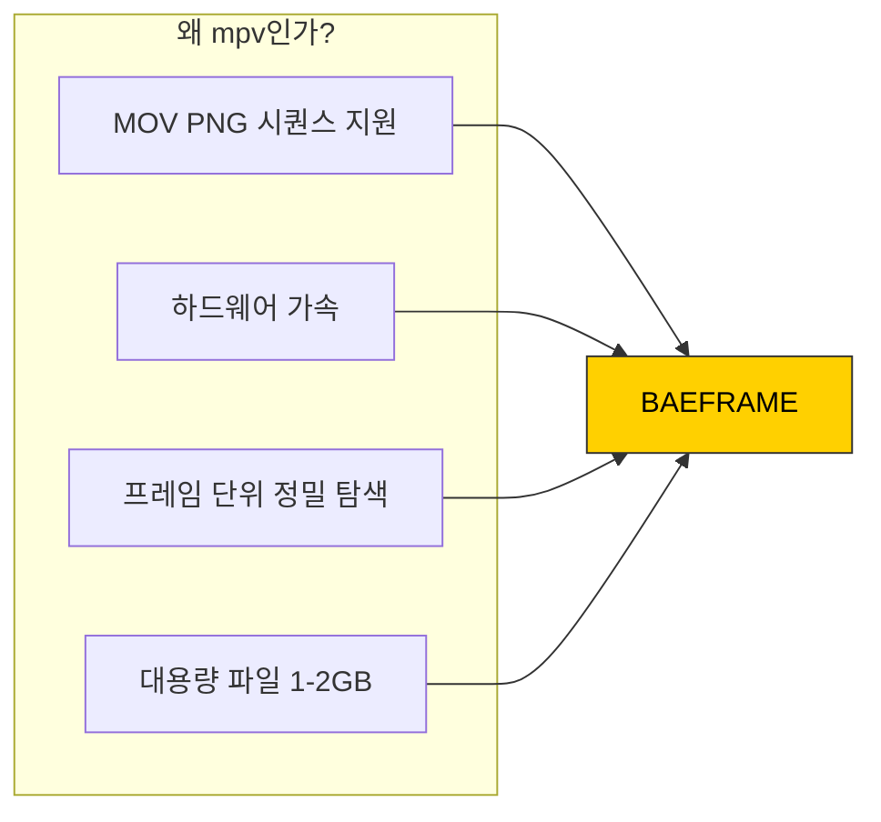

# mpv 설치 가이드

<div align="center">

**BAEFRAME 비디오 재생 엔진**

`mpv 0.36+` `하드웨어 가속` `MOV PNG 시퀀스 지원`

</div>

---

## 개요

BAEFRAME은 고성능 비디오 재생을 위해 **mpv 플레이어**를 사용합니다.



---

## 설치 방법

### Windows

**방법 1: 공식 사이트**

1. [mpv 공식 사이트](https://mpv.io/installation/)에서 Windows 빌드 다운로드
2. `mpv.exe`를 `mpv/win32/` 폴더에 복사

**방법 2: shinchiro builds (권장)**

1. [shinchiro builds](https://sourceforge.net/projects/mpv-player-windows/files/)에서 다운로드
2. 최신 버전의 `mpv-x86_64-YYYYMMDD.7z` 다운로드
3. 압축 해제 후 `mpv.exe`를 `mpv/win32/`에 복사

### macOS

```bash
brew install mpv
```

### Linux (Ubuntu/Debian)

```bash
sudo apt install mpv
```

---

## 필요한 파일 구조

```
mpv/
└── win32/
    ├── mpv.exe           # 필수
    └── mpv-2.dll         # 있는 경우 포함
```

---

## 설치 확인

터미널에서 다음 명령 실행:

```bash
mpv --version
```

정상 출력 예시:
```
mpv 0.36.0 Copyright © 2000-2023 mpv/MPlayer/mplayer2 projects
```

---

## 트러블슈팅

| 문제 | 원인 | 해결 |
|------|------|------|
| mpv 로드 실패 | 바이너리 경로 오류 | `mpv/win32/mpv.exe` 위치 확인 |
| MOV 재생 안 됨 | 코덱 미지원 | 최신 mpv 버전 사용 |
| 하드웨어 가속 안 됨 | GPU 드라이버 | 그래픽 드라이버 업데이트 |

---

## 참고 자료

**공식 문서:**
- [mpv 공식 문서](https://mpv.io/manual/stable/)
- [mpv GitHub](https://github.com/mpv-player/mpv)

**Electron 연동:**
- [mpv.js GitHub](https://github.com/aspect-ratio/mpv.js)
- [node-mpv GitHub](https://github.com/j-holub/Node-MPV)

---

<div align="center">

*BAEFRAME Video Engine*

</div>
