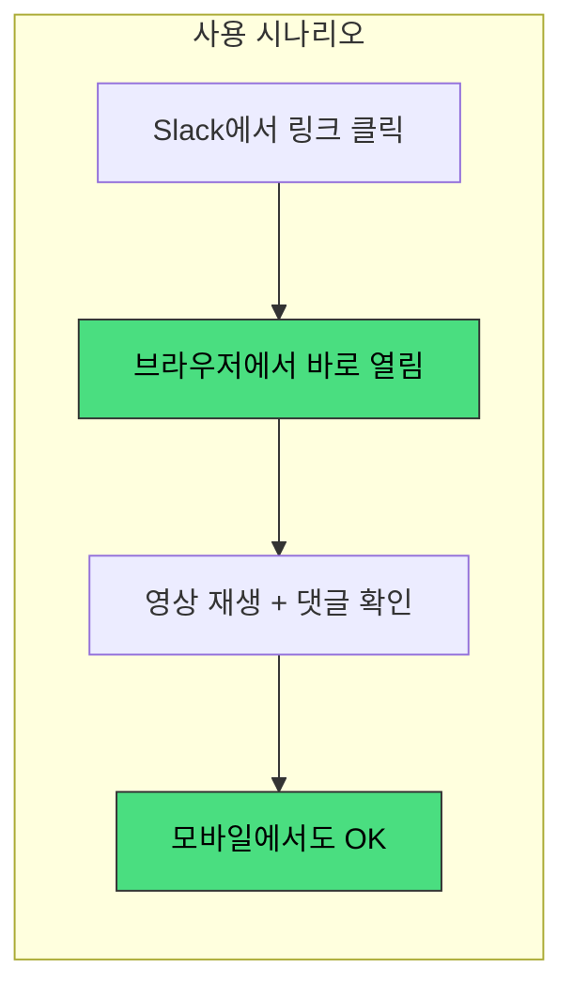
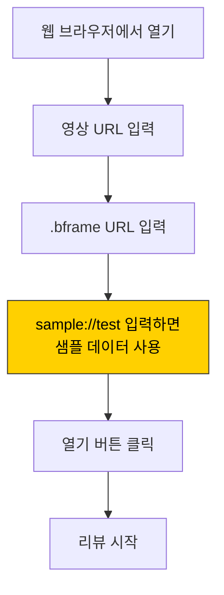
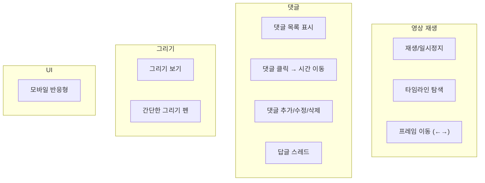

# BAEFRAME Web Viewer

<div align="center">

**브라우저에서 BAEFRAME 영상 리뷰**

`모바일 지원` `설치 불필요` `Slack 연동`

</div>

---

## 개요

BAEFRAME 웹 뷰어는 Desktop 앱 없이도 브라우저에서 영상 리뷰 기능을 사용할 수 있게 해줍니다.



---

## 로컬 테스트

### 방법 1: Python (간단)

```bash
cd web-viewer
python -m http.server 8080
```

브라우저에서 `http://localhost:8080` 접속

### 방법 2: Node.js

```bash
cd web-viewer
npx serve .
```

브라우저에서 `http://localhost:3000` 접속

### 방법 3: VS Code Live Server

VS Code에서 `index.html`을 열고 Live Server 확장 사용

---

## 테스트 방법



| 필드 | 입력값 |
|------|--------|
| 영상 URL | 테스트 영상 URL 또는 Google Drive 공유 링크 |
| .bframe URL | `sample://test` (샘플 데이터) |

---

## 개발 모드

`localhost`에서 실행 시 Google API 인증 없이 테스트 가능합니다.

| 환경 | 인증 | 데이터 |
|------|------|--------|
| localhost | 불필요 | 샘플 데이터 |
| 프로덕션 | Google 로그인 | 실제 데이터 |

---

## 파일 구조

```
web-viewer/
├── index.html          # 메인 HTML
├── styles/
│   └── main.css        # 스타일 (모바일 친화적)
├── scripts/
│   └── app.js          # 메인 애플리케이션 로직
└── README.md           # 이 문서
```

---

## 구현 현황

### 구현됨



- [x] 영상 재생/일시정지
- [x] 타임라인 탐색
- [x] 프레임 단위 이동 (←→ 키)
- [x] 댓글 목록 표시
- [x] 댓글 클릭 → 해당 시간 이동
- [x] 댓글 추가/수정/삭제
- [x] 답글 (스레드)
- [x] 그리기 보기
- [x] 간단한 그리기 (펜)
- [x] 모바일 반응형 UI

### 예정

- [ ] Google Drive 연동 (로그인)
- [ ] .bframe 파일 저장
- [ ] 충돌 방지 로직

---

## 단축키

| 키 | 기능 |
|:--:|------|
| `Space` | 재생/일시정지 |
| `←` | 1프레임 뒤로 |
| `→` | 1프레임 앞으로 |
| `Shift+←` | 10프레임 뒤로 |
| `Shift+→` | 10프레임 앞으로 |
| `C` | 댓글 추가 |
| `D` | 그리기 모드 |
| `Ctrl+S` | 저장 |

---

## 관련 문서

| 문서 | 설명 |
|------|------|
| [BAEFRAME-WEB-VIEWER.md](../BAEFRAME-WEB-VIEWER.md) | 개발 계획 상세 |
| [baeframe-dev-docs.md](../baeframe-dev-docs.md) | Desktop 앱 개발 문서 |

---

<div align="center">

*BAEFRAME Web Viewer*

</div>
